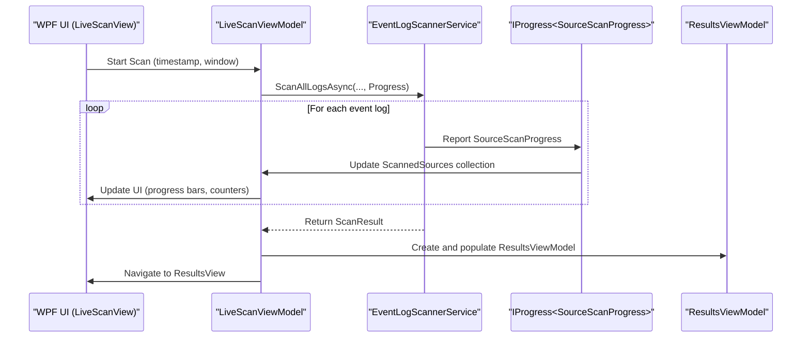
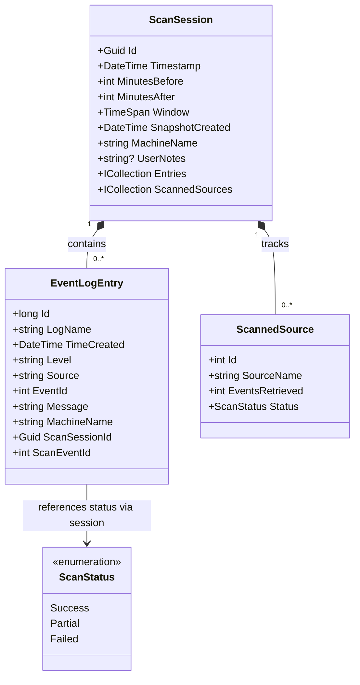
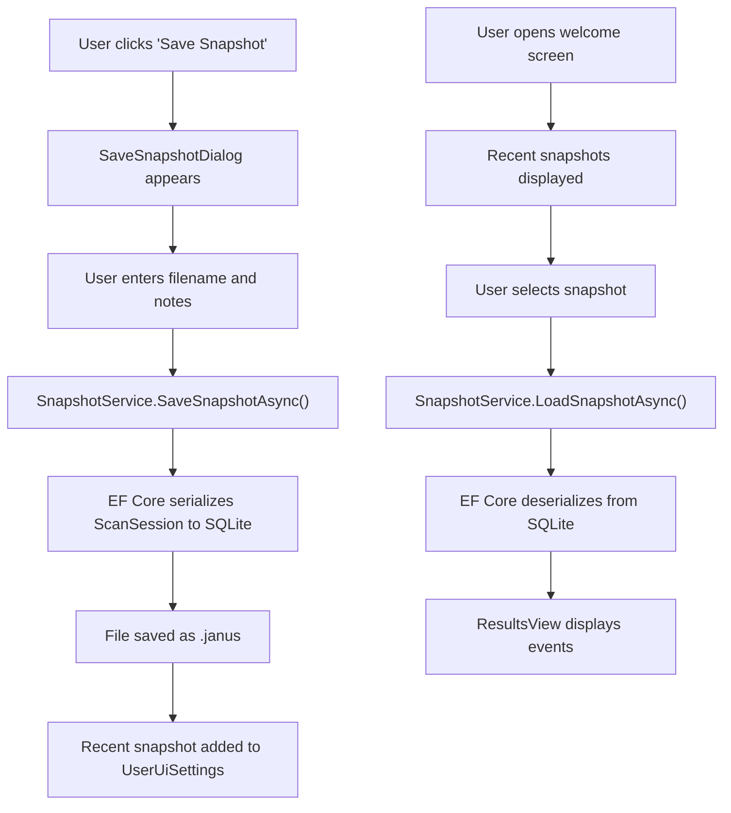

# Purpose and Vision

## Table of Contents
1. [Purpose and Vision](#purpose-and-vision)
2. [Core Functionality](#core-functionality)
3. [Architectural Foundations](#architectural-foundations)
4. [Use Cases and Real-World Scenarios](#use-cases-and-real-world-scenarios)
5. [Data Model and State Capture](#data-model-and-state-capture)
6. [Portable Snapshot System](#portable-snapshot-system)

## Purpose and Vision

Project Janus is a desktop forensic and diagnostic tool designed to simplify the investigation of Windows system events by unifying all event logs into a single, chronological timeline centered around a user-defined timestamp. Its core vision is to eliminate the complexity and inefficiency of manually correlating events across disparate logs, providing IT professionals and system administrators with a unified view of system activity during critical incidents.

By focusing analysis on a configurable time window—spanning minutes before and after a pivotal event—Janus enables rapid post-incident analysis, crash diagnostics, and service failure troubleshooting. The tool captures the complete state of relevant system logs at the time of investigation, preserving not only event data but also metadata about the scan session and sources. This captured state is encapsulated in a `ScanSession` object, which serves as the central data structure for analysis and reporting.

The long-term vision of Project Janus extends beyond real-time diagnostics to support offline collaboration and auditability through portable snapshot files (`.janus`). These files allow investigators to share findings, review historical system states, and conduct peer analysis without requiring access to the original machine. This capability is particularly valuable in security breach investigations, compliance audits, and distributed support scenarios.

**Section sources**
- [README.md](file://README.md#L1-L105)

## Core Functionality

Project Janus provides a streamlined workflow for event log analysis:
1. **Timestamp Selection**: Users define a central timestamp of interest, such as the moment a system crash occurred or a suspicious login was detected.
2. **Time Window Configuration**: Users specify how many minutes before and after the timestamp should be analyzed.
3. **Parallel Log Scanning**: The tool scans all available Windows event logs simultaneously using the modern Event Log API, maximizing efficiency and minimizing investigation time.
4. **Unified Timeline Display**: Retrieved events from all logs are merged into a single chronological timeline, sorted by occurrence time.
5. **Real-Time Progress Monitoring**: During scanning, users can monitor per-source progress, including event counts, status indicators, and error reporting.
6. **Interactive Filtering**: After scanning, users can filter results by log level, source, log name, or free-text search to isolate relevant events.
7. **Snapshot Preservation**: The entire analysis session, including all events and metadata, can be saved as a portable `.janus` file for future reference.

This functionality addresses the fundamental challenge in system diagnostics: information fragmentation. Instead of switching between Event Viewer panes or exporting multiple logs to correlate manually, users get an integrated view where related events from Application, System, Security, and other logs appear together in temporal context.

**Section sources**
- [README.md](file://README.md#L45-L105)
- [Janus.App/Services/EventLogScannerService.cs](file://Janus.App/Services/EventLogScannerService.cs#L9-L159)
- [Janus.App/ViewModels/LiveScanViewModel.cs](file://Janus.App/ViewModels/LiveScanViewModel.cs#L9-L259)

## Architectural Foundations

The architecture of Project Janus reflects deliberate design choices that support its forensic and diagnostic purpose. The application follows a clean separation of concerns, with distinct layers for data modeling, business logic, and user interface.

### Technology Stack
- **UI Framework**: WPF with MVVM pattern ensures a responsive, maintainable interface with no code-behind logic
- **Data Storage**: EF Core with SQLite provides structured, portable storage for snapshots
- **Language**: Modern C# features (primary constructors, `required` properties, top-level statements) enhance code clarity and safety

These choices are codified in the project's architectural rules, which mandate strict adherence to MVVM, use of modern C# syntax, and serverless database design for maximum portability.

### Component Interaction
The core workflow begins in the `LiveScanViewModel`, which coordinates user input and initiates scanning via the `EventLogScannerService`. This service retrieves events from all logs in parallel, reporting progress through `SourceScanProgress` objects. Upon completion, results are packaged into a `ScanSession` and passed to the `ResultsViewModel` for display. Snapshots are persisted using the `SnapshotService`, which leverages EF Core to serialize the entire session state into a single SQLite file.

**Diagram sources**
- [Janus.App/ViewModels/LiveScanViewModel.cs](file://Janus.App/ViewModels/LiveScanViewModel.cs#L9-L259)
- [Janus.App/Services/EventLogScannerService.cs](file://Janus.App/Services/EventLogScannerService.cs#L9-L159)
- [Janus.App/ViewModels/ResultsViewModel.cs](file://Janus.App/ViewModels/ResultsViewModel.cs#L75-L563)

**Section sources**
- [janus.ai.rules.yml](file://janus.ai.rules.yml#L27-L52)
- [README.md](file://README.md#L85-L105)

## Use Cases and Real-World Scenarios

### Post-Breach Analysis
When investigating a potential security breach, an analyst can set the central timestamp to the time of a suspicious login detected in the Security log. Janus will retrieve events from Security, System, Application, and PowerShell logs from the surrounding time window. This unified view might reveal that:
- A PowerShell script was executed immediately after the login
- Network connections were established to external IPs
- Antivirus software was disabled
- Files were accessed in sensitive directories

Without Janus, correlating these events across logs would require manual timestamp matching and log export, significantly slowing the investigation.

### System Crash Diagnostics
After a blue screen event, the exact time of failure can be used as the central timestamp. Janus can show:
- Driver loading/unloading events from the System log
- Application crashes from the Application log
- Disk or memory errors preceding the crash
- Service failures that may have contributed to instability

This holistic view helps identify whether the crash was caused by hardware failure, driver issues, or application conflicts.

### Service Failure Troubleshooting
When a critical service stops unexpectedly, setting the timestamp to the service stop time allows Janus to display:
- The service control manager's record of the stop event
- Related application errors that may have triggered shutdown
- Resource exhaustion warnings (memory, disk)
- Network connectivity issues that affected service operation

The ability to filter by the service name across all logs makes it easy to isolate the complete failure sequence.

**Section sources**
- [README.md](file://README.md#L1-L105)

## Data Model and State Capture

The data model of Project Janus is centered around the `ScanSession` class, which captures the complete state of an investigation. This class serves as the root entity for all forensic data and includes:

- **Temporal Context**: The central `Timestamp` and time window (`MinutesBefore`, `MinutesAfter`)
- **System Identification**: `MachineName` to identify the source system
- **Scan Metadata**: `SnapshotCreated` timestamp and optional `UserNotes`
- **Event Collection**: A collection of `EventLogEntry` objects containing the actual log data
- **Source Tracking**: A collection of `ScannedSource` objects that record the status and event count for each log source

Each `EventLogEntry` contains essential forensic information:
- `TimeCreated`: When the event occurred
- `Level`: Severity level (Critical, Error, Warning, etc.)
- `Source`: The provider or application that generated the event
- `EventId`: A numeric identifier for the event type
- `Message`: The human-readable description
- `LogName`: The name of the log (e.g., "Application", "Security")

The `ScannedSource` class tracks the outcome of scanning each individual log, with a `ScanStatus` enum that can be `Success`, `Partial`, or `Failed`. This allows users to quickly identify which logs were fully retrieved and which had access issues or other problems.

**Diagram sources**
- [Janus.Core/ScanSession.cs](file://Janus.Core/ScanSession.cs#L4-L34)
- [Janus.Core/EventLogEntry.cs](file://Janus.Core/EventLogEntry.cs#L5-L17)
- [Janus.Core/ScannedSource.cs](file://Janus.Core/ScannedSource.cs#L8-L13)
- [Janus.Core/ScannedSource.cs](file://Janus.Core/ScannedSource.cs#L2-L6)

**Section sources**
- [Janus.Core/ScanSession.cs](file://Janus.Core/ScanSession.cs#L4-L34)
- [Janus.Core/EventLogEntry.cs](file://Janus.Core/EventLogEntry.cs#L5-L17)
- [Janus.Core/ScannedSource.cs](file://Janus.Core/ScannedSource.cs#L8-L13)

## Portable Snapshot System

The portable snapshot system is a cornerstone of Project Janus's forensic capabilities. Snapshots are saved as `.janus` files, which are SQLite databases containing the complete `ScanSession` state. This design choice, mandated by the use of EF Core and SQLite, provides several critical advantages:

- **Self-Contained**: All data and metadata are stored in a single file
- **Portable**: Snapshots can be easily shared via email, cloud storage, or USB drives
- **Offline Access**: Analysis can continue without network access or connection to the original machine
- **Versionable**: Snapshots can be archived and compared over time
- **Queryable**: The structured format allows for programmatic analysis and reporting

The `SnapshotService` class handles both saving and loading operations. When saving, it uses EF Core to persist the `ScanSession` along with its related `EventLogEntry` and `ScannedSource` collections. When loading, it reconstructs the entire object graph from the database. The service also provides metadata-only loading for quick preview of snapshot contents without loading all events.

Snapshots are integrated into the user workflow through the welcome screen, which displays recently opened snapshots and allows one-click reopening. This recent files list is maintained by the `UserUiSettingsService`, which persists user preferences across sessions.

**Diagram sources**
- [Janus.App/Services/SnapshotService.cs](file://Janus.App/Services/SnapshotService.cs#L10-L78)
- [Janus.App/ViewModels/WelcomeViewModel.cs](file://Janus.App/ViewModels/WelcomeViewModel.cs#L26-L141)
- [Janus.App/Services/UserUiSettingsService.cs](file://Janus.App/Services/UserUiSettingsService.cs#L5-L63)

**Section sources**
- [Janus.App/Services/SnapshotService.cs](file://Janus.App/Services/SnapshotService.cs#L10-L78)
- [Janus.Core/EventSnapshotDbContext.cs](file://Janus.Core/EventSnapshotDbContext.cs#L7-L24)
- [Janus.App/ViewModels/WelcomeViewModel.cs](file://Janus.App/ViewModels/WelcomeViewModel.cs#L26-L141)

**Referenced Files in This Document**   
- [README.md](file://README.md)
- [Janus.Core/ScanSession.cs](file://Janus.Core/ScanSession.cs)
- [Janus.Core/EventSnapshotDbContext.cs](file://Janus.Core/EventSnapshotDbContext.cs)
- [Janus.Core/EventLogEntry.cs](file://Janus.Core/EventLogEntry.cs)
- [Janus.Core/ScannedSource.cs](file://Janus.Core/ScannedSource.cs)
- [Janus.App/Services/EventLogScannerService.cs](file://Janus.App/Services/EventLogScannerService.cs)
- [Janus.App/Services/SnapshotService.cs](file://Janus.App/Services/SnapshotService.cs)
- [Janus.App/ViewModels/LiveScanViewModel.cs](file://Janus.App/ViewModels/LiveScanViewModel.cs)
- [Janus.App/ViewModels/ResultsViewModel.cs](file://Janus.App/ViewModels/ResultsViewModel.cs)
- [janus.ai.rules.yml](file://janus.ai.rules.yml)