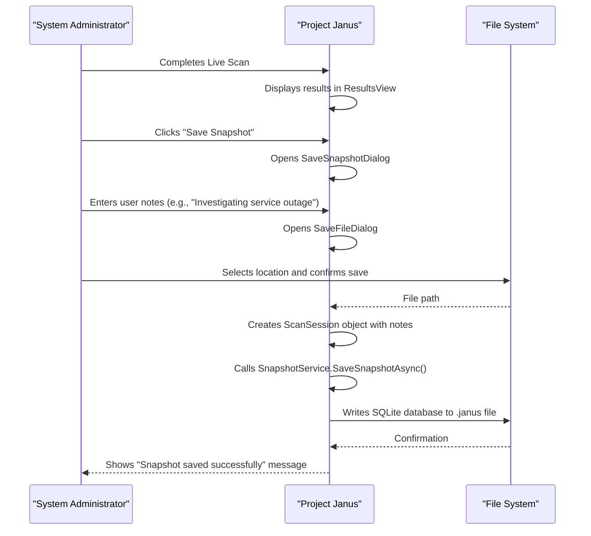

# Target Audience


## Table of Contents
1. [Primary Audience](#primary-audience)
2. [Secondary Audience](#secondary-audience)
3. [Prerequisites and Technical Background](#prerequisites-and-technical-background)
4. [UI Design for Expert Users](#ui-design-for-expert-users)
5. [Feature Utilization by Audience Type](#feature-utilization-by-audience-type)

## Primary Audience

The primary audience for Project Janus consists of technical professionals who require deep visibility into system behavior for diagnostic and investigative purposes. These users are expected to have a strong understanding of Windows system internals and event logging.

**System Administrators** are a core user group, responsible for maintaining the stability and performance of Windows servers and workstations. They use Project Janus to investigate service failures, security incidents, and hardware issues. For example, when a critical service fails overnight, an administrator can use the tool to scan event logs around the failure timestamp to identify preceding security events, hardware warnings, or application errors that may have contributed to the outage.

**Security Operations Personnel** leverage Project Janus to conduct forensic analysis following security alerts or suspected breaches. The tool's ability to consolidate events from all logs into a single chronological timeline allows them to reconstruct the sequence of actions taken on a system. They can quickly filter for high-severity events (Error, Critical) and specific sources to identify malicious activity or policy violations.

**Digital Forensic Analysts** benefit from the tool's snapshot functionality, which captures a complete, portable record of system events. This feature is critical for preserving evidence in a forensically sound manner. Analysts can save a snapshot of the event logs at a critical moment, ensuring that the data remains unchanged and can be analyzed offline without affecting the source system. The inclusion of formatted event messages within the snapshot (via `EventRecord.FormatDescription()`) ensures that the data is self-contained and does not rely on external provider DLLs.

These primary users are characterized by their need for a tool that provides immediate, comprehensive access to system event data. Project Janus is designed to meet this need by automating the tedious process of manually cross-referencing timestamps across multiple logs in the Windows Event Viewer, thereby drastically reducing the time required for root cause analysis.

**Section sources**
- [README.md](file://README.md#L1-L106)
- [docs/prd/ProjectJanus.md](file://docs/prd/ProjectJanus.md#L1-L123)
- [Janus.App/Services/EventLogScannerService.cs](file://Janus.App/Services/EventLogScannerService.cs#L1-L161)
- [Janus.Core/EventLogEntry.cs](file://Janus.Core/EventLogEntry.cs#L1-L19)

## Secondary Audience

The secondary audience for Project Janus includes IT support staff and other technical personnel who perform root cause analysis but may not have the same depth of system administration or security expertise as the primary users.

**IT Support Staff** often receive user reports of application crashes, system freezes, or performance degradation. Project Janus enables them to efficiently diagnose these issues by providing a clear picture of what was happening on a user's system at the exact moment of the reported problem. For instance, if a user reports that their machine froze while gaming, support staff can guide the user to run a scan with Project Janus centered on the time of the freeze. The resulting event timeline can reveal patterns of driver errors or application faults that point to a specific hardware or software issue.

This audience benefits from the tool's intuitive interface and clear visual indicators. The color-coding of event levels (red for Error, yellow for Warning) allows for at-a-glance identification of critical issues, even for users who are not experts in interpreting event log severity. The ability to save and share snapshots is particularly valuable for this group, as it allows them to capture diagnostic data from a user's machine and send it to a more senior administrator or developer for further analysis, without requiring remote access.

While these users may not use all of the tool's advanced features, the core functionality of scanning, filtering, and exporting event data provides a significant improvement over the standard Windows Event Viewer for troubleshooting common user issues.

**Section sources**
- [docs/prd/ProjectJanus.md](file://docs/prd/ProjectJanus.md#L1-L123)
- [Janus.App/ViewModels/ResultsViewModel.cs](file://Janus.App/ViewModels/ResultsViewModel.cs#L1-L565)

## Prerequisites and Technical Background

Project Janus is designed for technical users who are already familiar with the concepts and tools of Windows system diagnostics. The primary prerequisite for effective use of the tool is a solid understanding of **Windows Event Viewer** and the ability to interpret **Windows event logs**.

Users must be comfortable with the structure and content of event logs, including the meaning of key fields such as **Level** (Error, Warning, Information, Verbose, Critical), **Source** (the provider of the event), **Event ID**, and **Log Name** (e.g., System, Application, Security). The tool does not abstract away these concepts; instead, it presents them directly in its results grid, allowing users to leverage their existing knowledge.

A fundamental requirement is the ability to understand the **severity levels** of events. The tool uses color-coding to highlight events based on their level (e.g., red for Error/Critical, yellow for Warning), but the user must know what these levels signify. An "Error" event indicates a significant problem, such as a service failing to start, while a "Warning" might indicate a potential issue that could lead to a failure. An "Information" event is typically a routine operational message.

Furthermore, the application requires **administrative privileges** to access all system event logs, as mandated by the `requestedExecutionLevel="requireAdministrator"` in its manifest. Users must be prepared to provide consent via the Windows UAC prompt when launching the application. This requirement ensures that the tool can perform a comprehensive scan of all available logs, including those that are restricted to administrators.

**Section sources**
- [docs/prd/ProjectJanus.md](file://docs/prd/ProjectJanus.md#L1-L123)
- [Janus.App/ViewModels/ResultsViewModel.cs](file://Janus.App/ViewModels/ResultsViewModel.cs#L1-L565)
- [Janus.App/Helpers/ScanStatusToBrushConverter.cs](file://Janus.App/Helpers/ScanStatusToBrushConverter.cs#L1-L25)

## UI Design for Expert Users

The user interface of Project Janus is meticulously designed to cater to the needs of expert users, prioritizing efficiency, data density, and rapid information scanning. The design decisions are centered around the Model-View-ViewModel (MVVM) pattern, ensuring a clean separation of concerns and enabling a responsive, data-driven interface.

A key component of the UI is the **AdvancedMultiSelect** control, which is used for filtering events by log level, source, and log name. This control is designed for power users who need to quickly narrow down large datasets. It supports several features that enhance efficiency:
- **Search**: Users can type into a search box to filter the list of available options in real-time.
- **Virtualization**: The control efficiently handles large lists of sources or log names without performance degradation.
- **Cross-filtering**: The count displayed next to each filter option dynamically updates to reflect the number of events that would be shown if that filter were applied, taking into account the current state of all other filters. This is implemented in the `ResultsViewModel` using `Func<object, int>` delegates like `LogLevelCountProvider`.
- **Dynamic Counts**: The counts are calculated on-the-fly based on the current filter state, providing immediate feedback.
- **Accessibility**: The control supports keyboard navigation and mouse interactions, making it usable in various environments.


```mermaid
classDiagram
class AdvancedMultiSelect {
+ItemsSource IEnumerable
+SelectedItems IList
+SearchText string
+ShowOnlySelected bool
+ItemCountProvider Func<object, int>
+Header string
+PlaceholderText string
+SelectAllVisibleCommand ICommand
+ShowOnlySelectedCommand ICommand
+ItemToggleCommand ICommand
+FilteredItems ObservableCollection<ItemViewModel>
+UpdateFilteredItems() void
+SelectAllVisible() void
+ToggleItem(object) void
}
class ItemViewModel {
+Value object
+DisplayText string
+Count int
+IsSelected bool
}
class ResultsViewModel {
+SelectedLogLevels ObservableCollection<string>
+SelectedSources ObservableCollection<string>
+SelectedLogNames ObservableCollection<string>
+LogLevelCountProvider Func<object, int>
+SourceCountProvider Func<object, int>
+LogNameCountProvider Func<object, int>
}
AdvancedMultiSelect --> ItemViewModel : "contains"
ResultsViewModel --> AdvancedMultiSelect : "uses for filtering"
ResultsViewModel --> "Func<object, int>" : "provides count providers"
```


**Diagram sources**
- [Janus.App/Controls/AdvancedMultiSelect.xaml.cs](file://Janus.App/Controls/AdvancedMultiSelect.xaml.cs#L1-L177)
- [Janus.App/ViewModels/ResultsViewModel.cs](file://Janus.App/ViewModels/ResultsViewModel.cs#L1-L565)

The **LiveScanView** provides real-time feedback during a scan with a per-source progress UI. This includes status icons, event counts, and progress bars, allowing users to monitor the scan's progress and identify any logs that are failing to be accessed. The status is visually represented using a converter (`ScanStatusToBrushConverter`) that maps the `ScanStatus` enum (Success, Partial, Failed) to distinct colors (Green, Orange, Red), enabling users to quickly assess the health of the scan at a glance.

The **ResultsView** features a data grid with UI virtualization, which is essential for handling large result sets efficiently. The grid is sorted chronologically by default, and users can sort by any column. The visual highlighting of event levels (F-3.2) allows for rapid identification of severe issues within a large list of events.

**Section sources**
- [Janus.App/Controls/AdvancedMultiSelect.xaml.cs](file://Janus.App/Controls/AdvancedMultiSelect.xaml.cs#L1-L177)
- [Janus.App/ViewModels/ResultsViewModel.cs](file://Janus.App/ViewModels/ResultsViewModel.cs#L1-L565)
- [Janus.App/ViewModels/LiveScanViewModel.cs](file://Janus.App/ViewModels/LiveScanViewModel.cs#L1-L261)
- [Janus.App/Helpers/ScanStatusToBrushConverter.cs](file://Janus.App/Helpers/ScanStatusToBrushConverter.cs#L1-L25)

## Feature Utilization by Audience Type

Different audience types within the primary and secondary groups utilize Project Janus's features in distinct ways, tailored to their specific workflows and objectives.

**System Administrators and Security Personnel** heavily rely on the **snapshot sharing** feature. After conducting an investigation, they can save a snapshot file (`.janus`) that contains all the collected event data, scan parameters, and machine metadata. This file is self-contained and portable, making it ideal for sharing with colleagues, documenting incidents in outage reports, or sending to external support teams. The ability to add **user notes** when saving a snapshot allows them to include contextual information, hypotheses, or preliminary findings directly within the file.





**Diagram sources**
- [Janus.App/ViewModels/ResultsViewModel.cs](file://Janus.App/ViewModels/ResultsViewModel.cs#L483-L548)
- [Janus.App/ViewModels/SaveSnapshotDialogViewModel.cs](file://Janus.App/ViewModels/SaveSnapshotDialogViewModel.cs#L1-L28)
- [Janus.App/Services/SnapshotService.cs](file://Janus.App/Services/SnapshotService.cs#L1-L80)

**IT Support Staff and Developers** frequently use the **CSV export** functionality. When they need to analyze event data in external tools like Excel or a database, or when they need to include a list of specific events in a support ticket, they can export the filtered results to a CSV file. The context menu in the results grid provides options to export either the selected rows or all rows, offering flexibility based on the user's needs. This feature allows them to integrate Project Janus's findings into their existing reporting and analysis workflows.

All expert users benefit from the advanced filtering and search capabilities. They can use the multi-select controls to isolate events from a specific application or service, or to focus only on errors and warnings. The real-time search box allows them to find events containing specific keywords (e.g., a driver name or error code), which is invaluable for pinpointing the root cause of a complex issue. The combination of these features enables a highly efficient and targeted investigation process.

**Section sources**
- [Janus.App/ViewModels/ResultsViewModel.cs](file://Janus.App/ViewModels/ResultsViewModel.cs#L483-L548)
- [Janus.App/ViewModels/WelcomeViewModel.cs](file://Janus.App/ViewModels/WelcomeViewModel.cs#L1-L143)
- [Janus.App/Services/SnapshotService.cs](file://Janus.App/Services/SnapshotService.cs#L1-L80)

**Referenced Files in This Document**   
- [README.md](file://README.md)
- [docs/prd/ProjectJanus.md](file://docs/prd/ProjectJanus.md)
- [Janus.App/ViewModels/ResultsViewModel.cs](file://Janus.App/ViewModels/ResultsViewModel.cs)
- [Janus.App/Controls/AdvancedMultiSelect.xaml.cs](file://Janus.App/Controls/AdvancedMultiSelect.xaml.cs)
- [Janus.App/Services/EventLogScannerService.cs](file://Janus.App/Services/EventLogScannerService.cs)
- [Janus.App/ViewModels/LiveScanViewModel.cs](file://Janus.App/ViewModels/LiveScanViewModel.cs)
- [Janus.App/Services/SnapshotService.cs](file://Janus.App/Services/SnapshotService.cs)
- [Janus.App/ViewModels/WelcomeViewModel.cs](file://Janus.App/ViewModels/WelcomeViewModel.cs)
- [Janus.App/ViewModels/SaveSnapshotDialogViewModel.cs](file://Janus.App/ViewModels/SaveSnapshotDialogViewModel.cs)
- [Janus.App/Helpers/ScanStatusToBrushConverter.cs](file://Janus.App/Helpers/ScanStatusToBrushConverter.cs)
- [Janus.Core/EventLogEntry.cs](file://Janus.Core/EventLogEntry.cs)