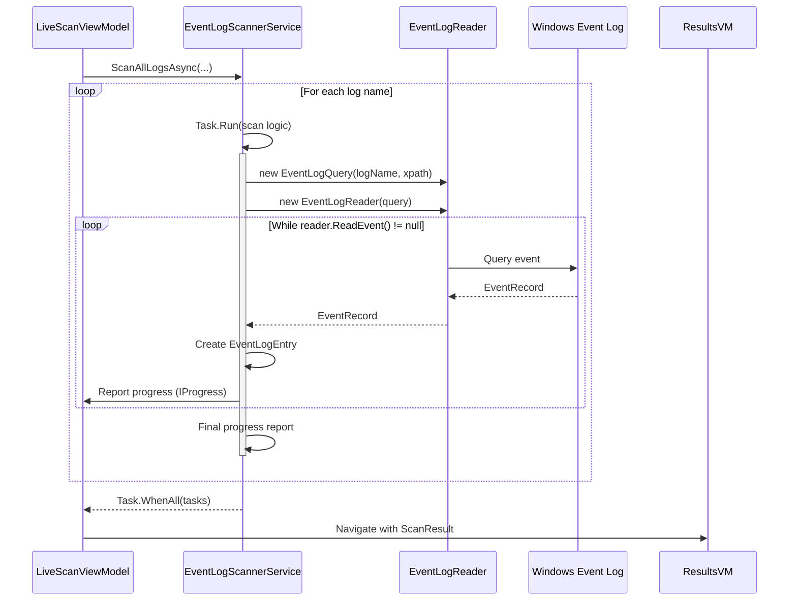
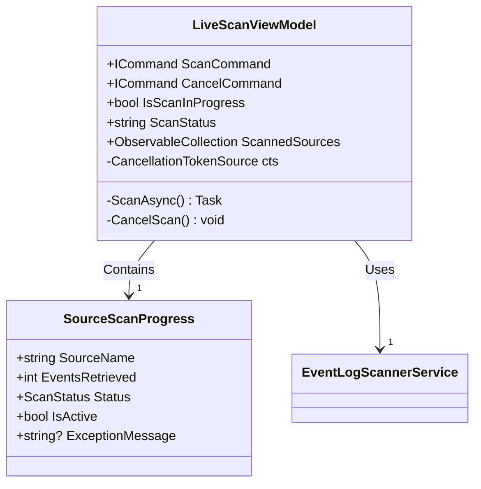
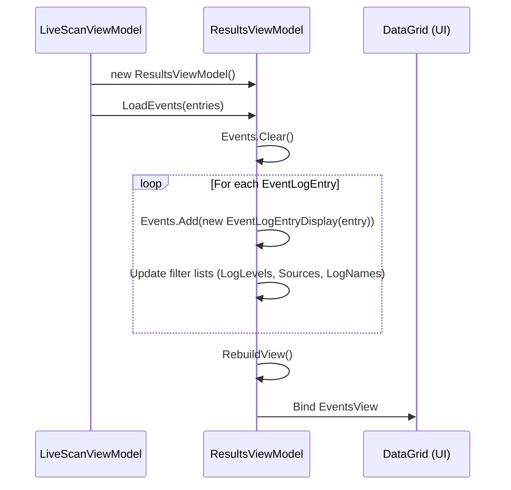

# Unified Event Log Scanning

## Table of Contents
1. [Introduction](#introduction)
2. [Core Components](#core-components)
3. [EventLogScannerService: Parallel Scanning Engine](#eventlogscannerservice-parallel-scanning-engine)
4. [LiveScanViewModel: Scan Orchestration and UI Binding](#livescanviewmodel-scan-orchestration-and-ui-binding)
5. [Real-Time Progress Reporting with SourceScanProgress](#real-time-progress-reporting-with-sourcescanprogress)
6. [Data Handoff and Display via ResultsViewModel](#data-handoff-and-display-via-resultsviewmodel)
7. [Forensic Investigation Use Case](#forensic-investigation-use-case)
8. [Performance and Thread Management](#performance-and-thread-management)

## Introduction
The Unified Event Log Scanning feature in Project Janus enables comprehensive forensic analysis by aggregating events from all Windows event logs into a single, chronologically ordered dataset. This document details the implementation of this feature, focusing on the `EventLogScannerService` for parallel scanning, the `LiveScanViewModel` for user interaction and scan control, and the `ResultsViewModel` for data presentation. The system is designed to be responsive, efficient, and resilient to errors, providing real-time feedback to the user throughout the scanning process.

## Core Components
The Unified Event Log Scanning feature is built upon a set of core components that work together to perform the scan, report progress, and display results. The primary components are:
- **EventLogScannerService**: A static service class responsible for the low-level interaction with Windows Event Logs using the `System.Diagnostics.Eventing.Reader` API. It orchestrates parallel scanning across all logs.
- **LiveScanViewModel**: A ViewModel that acts as the coordinator for the scanning process. It handles user input, manages the scan lifecycle (start, cancel), and receives real-time progress updates.
- **SourceScanProgress**: A data model that represents the scanning status of an individual event log source. It is used to report progress from the scanner to the UI.
- **ResultsViewModel**: A ViewModel responsible for receiving the final scan results, managing the display of events, and providing filtering and navigation capabilities.
- **EventLogEntry**: The fundamental data structure representing a single event retrieved from a Windows event log.
- **ScanResult**: A container class that holds the final output of a scan, including the list of `EventLogEntry` objects and metadata about the scanned sources.

**Section sources**
- [EventLogScannerService.cs](file://d:/devel/Project Janus/Janus.App/Services/EventLogScannerService.cs)
- [LiveScanViewModel.cs](file://d:/devel/Project Janus/Janus.App/ViewModels/LiveScanViewModel.cs)
- [SourceScanProgress.cs](file://d:/devel/Project Janus/Janus.App/ViewModels/SourceScanProgress.cs)
- [ResultsViewModel.cs](file://d:/devel/Project Janus/Janus.App/ViewModels/ResultsViewModel.cs)
- [EventLogEntry.cs](file://d:/devel/Project Janus/Janus.Core/EventLogEntry.cs)
- [ScanResult.cs](file://d:/devel/Project Janus/Janus.App/Services/ScanResult.cs)
- [ScannedSource.cs](file://d:/devel/Project Janus/Janus.Core/ScannedSource.cs)

## EventLogScannerService: Parallel Scanning Engine
The `EventLogScannerService` is the workhorse of the unified scanning feature. It leverages the `System.Diagnostics.Eventing.Reader` namespace to access Windows event logs and uses `Task.Run` to perform parallel scanning.

### ScanAllLogsAsync Implementation
The `ScanAllLogsAsync` method is the core of the scanning logic. It takes a central `timestamp`, a `before` and `after` `TimeSpan` to define a time window, a progress reporter, and a cancellation token.

**Diagram sources**
- [EventLogScannerService.cs](file://d:/devel/Project Janus/Janus.App/Services/EventLogScannerService.cs#L32-L158)
- [LiveScanViewModel.cs](file://d:/devel/Project Janus/Janus.App/ViewModels/LiveScanViewModel.cs#L158-L180)

**Section sources**
- [EventLogScannerService.cs](file://d:/devel/Project Janus/Janus.App/Services/EventLogScannerService.cs#L32-L158)

### Parallel Scanning with Task.Run
The method begins by retrieving all available log names using `EventLogSession.GlobalSession.GetLogNames()`. For each log name, it creates a new `Task` using `Task.Run`. This ensures that each log is scanned on a separate thread from the thread pool, enabling true parallelism. All tasks are collected in a list and awaited with `Task.WhenAll(tasks)`, which ensures the method only returns once all individual log scans are complete.

### Exception Handling per Log Source
A critical design aspect is the isolation of errors to individual log sources. The scanning logic for each log is wrapped in a `try-catch` block within its respective task. This means that if one log is inaccessible (e.g., due to `UnauthorizedAccessException`), the scan for that specific log fails, but the scans for all other logs continue unaffected. The method catches three specific exceptions:
- **EventLogException**: A general error from the event log API.
- **UnauthorizedAccessException**: The application lacks permission to read the log.
- **OperationCanceledException**: The scan was cancelled by the user.

In each case, the `ScanStatus` for that log is set to `Failed` or `Partial`, and a final progress update is sent before the task completes.

### Real-Time Progress Reporting
Progress is reported using the `IProgress<SourceScanProgress>` interface. The method throttles reporting based on either a number of events processed (`progressUpdateEventCount`, default 250) or a time interval (`progressUpdateInterval`, default 250ms). This prevents overwhelming the UI with updates. For each event, a new `EventLogEntry` is created from the `EventRecord` and added to a shared `List<EventLogEntry>`, which is protected by a `lock` statement to ensure thread safety. The `ScanEventId` is assigned using `Interlocked.Increment` to guarantee a unique, sequential ID across all threads.

## LiveScanViewModel: Scan Orchestration and UI Binding
The `LiveScanViewModel` serves as the bridge between the user interface and the `EventLogScannerService`. It manages the scan lifecycle and binds the scan's progress to the UI.

### Scan Initiation and Cancellation
The scan is initiated by the `ScanCommand`, which is an `AsyncRelayCommand` bound to a "Scan" button in the UI. When executed, it creates a new `CancellationTokenSource` (`cts`) and calls the `ScanAsync` method.

**Diagram sources**
- [LiveScanViewModel.cs](file://d:/devel/Project Janus/Janus.App/ViewModels/LiveScanViewModel.cs#L9-L259)
- [SourceScanProgress.cs](file://d:/devel/Project Janus/Janus.App/ViewModels/SourceScanProgress.cs#L6-L25)

The `CancelCommand` is enabled when `cts` is not null and calls `cts?.Cancel()`, which signals all running scan tasks to stop. The `IsScanInProgress` property controls the visibility and state of both the Scan and Cancel buttons.

### Coordinating the Scan
The `ScanAsync` method performs several key steps:
1.  **Setup**: It configures the scan parameters (timestamp, time window) and creates a `Progress<SourceScanProgress>` object.
2.  **Progress Handler**: The constructor of `Progress<SourceScanProgress>` takes an `Action<SourceScanProgress>`. This action is executed on the UI thread (using `Dispatcher.Invoke` if necessary) every time the scanner reports progress. The handler updates the `ScannedSources` collection, moving active sources to the top and updating global statistics (total sources, events, success/error counts).
3.  **Service Invocation**: It calls `EventLogScannerService.ScanAllLogsAsync`, passing the `IProgress` object and `cts.Token`.
4.  **Result Handling**: Upon completion, it navigates to the `ResultsView`, creating a new `ResultsViewModel` and passing the `ScanResult`.

**Section sources**
- [LiveScanViewModel.cs](file://d:/devel/Project Janus/Janus.App/ViewModels/LiveScanViewModel.cs#L9-L259)

## Real-Time Progress Reporting with SourceScanProgress
The `SourceScanProgress` class is a simple yet crucial data transfer object (DTO) that facilitates real-time progress reporting from the background scanning tasks to the UI.

### Structure and Properties
The class implements `INotifyPropertyChanged`, allowing the UI to automatically update when its properties change. Its key properties are:
- **SourceName**: The name of the event log being scanned (e.g., "Application", "Security").
- **EventsRetrieved**: The number of events successfully retrieved from this log so far.
- **Status**: The current `ScanStatus` (Success, Partial, Failed).
- **IsActive**: A boolean indicating if the scan for this source is still ongoing.
- **ExceptionMessage**: A string containing the error message if the scan failed.

### Role in the Scanning Process
During the scan, the `EventLogScannerService` creates a `SourceScanProgress` object and reports it via the `IProgress` interface whenever the throttling conditions are met. The `LiveScanViewModel`'s progress handler receives this object and either adds it to the `ScannedSources` collection (if it's the first update for that log) or updates the existing entry. This allows the UI to display a dynamic list of all logs being scanned, showing their individual progress, status, and any errors in real time.

**Section sources**
- [SourceScanProgress.cs](file://d:/devel/Project Janus/Janus.App/ViewModels/SourceScanProgress.cs#L6-L25)

## Data Handoff and Display via ResultsViewModel
After a successful scan, the `ResultsViewModel` takes over to display and manage the collected event data.

### Integration with EventLogScannerService
The handoff occurs in the `ScanAsync` method of `LiveScanViewModel`. After `ScanAllLogsAsync` returns a `ScanResult`, the `ResultsViewModel` is instantiated, and its `LoadEvents` method is called with `scanResult.Entries`.

**Diagram sources**
- [LiveScanViewModel.cs](file://d:/devel/Project Janus/Janus.App/ViewModels/LiveScanViewModel.cs#L180-L195)
- [ResultsViewModel.cs](file://d:/devel/Project Janus/Janus.App/ViewModels/ResultsViewModel.cs#L440-L475)

### Data Processing and Display
The `LoadEvents` method performs several important tasks:
1.  **Data Transformation**: It clears the existing `Events` collection and creates a new `EventLogEntryDisplay` object for each `EventLogEntry`. This wrapper class provides additional functionality for the UI, such as formatted timestamps and search term highlighting.
2.  **Filter Population**: It populates the `LogLevels`, `Sources`, and `LogNames` collections with unique values from the scanned events, enabling the UI's filtering controls.
3.  **View Rebuilding**: It calls `RebuildView()`, which creates a new `CollectionViewSource` with a filter and sort order (ascending by `TimeCreated`). This ensures the events are displayed in chronological order and can be filtered by the user.

The `ResultsViewModel` also manages the `ScanSession` metadata, which includes the scan parameters, timestamp, and a list of `ScannedSource` objects, providing a complete record of the scan operation.

**Section sources**
- [ResultsViewModel.cs](file://d:/devel/Project Janus/Janus.App/ViewModels/ResultsViewModel.cs#L440-L475)

## Forensic Investigation Use Case
The primary use case for Unified Event Log Scanning is forensic investigation. Consider a scenario where a security analyst needs to investigate a suspected intrusion that occurred at 14:30 on a specific day. The analyst can use the Live Scan feature to set the timestamp to 14:30 and define a time window (e.g., 10 minutes before and after). The scanner will then:
1.  Query all event logs (Application, Security, System, etc.) for events within the 14:20 to 14:40 window.
2.  Aggregate all matching events into a single, unified list.
3.  Present the events in chronological order, regardless of their original log source.

This allows the analyst to see a complete timeline of system activity. For example, they might see a failed login attempt in the Security log at 14:25:10, followed by a service start in the System log at 14:25:15, and an application error in the Application log at 14:25:20—all presented as a single, coherent sequence. This holistic view is essential for understanding the full context of an event and identifying potential attack chains.

## Performance and Thread Management
The design of the scanning feature incorporates several performance and resource management considerations.

### Memory Usage
The primary memory concern is the accumulation of `EventLogEntry` objects in the `entries` list within `ScanAllLogsAsync`. For very large scans, this list can grow significantly. The current implementation uses a single `List<EventLogEntry>` protected by a `lock`, which is simple but can become a bottleneck under high contention. A potential optimization could be to use a `ConcurrentBag<EventLogEntry>` to reduce lock contention, although the final aggregation step would remain the same.

### Thread Management
The use of `Task.Run` for each log source provides excellent parallelism but can lead to a large number of concurrent threads if there are many logs. The .NET thread pool manages this, but it could still lead to resource exhaustion on systems with a very high number of event logs. An alternative approach could be to use `Parallel.ForEach` with a limited degree of parallelism to cap the number of concurrent tasks.

### Performance Summary
The current implementation prioritizes speed by scanning all logs in parallel. The use of throttled progress reporting prevents UI freezing. The main performance bottleneck is likely the I/O operations of reading the event logs themselves, which the parallel design helps to mitigate. The memory usage is linear with the number of events found, which is an inherent cost of the feature but is managed by loading the data into the UI in a paged or virtualized manner via the `ICollectionView`.

**Section sources**
- [EventLogScannerService.cs](file://d:/devel/Project Janus/Janus.App/Services/EventLogScannerService.cs)
- [LiveScanViewModel.cs](file://d:/devel/Project Janus/Janus.App/ViewModels/LiveScanViewModel.cs)
- [ResultsViewModel.cs](file://d:/devel/Project Janus/Janus.App/ViewModels/ResultsViewModel.cs)

**Referenced Files in This Document**   
- [EventLogScannerService.cs](file://d:/devel/Project Janus/Janus.App/Services/EventLogScannerService.cs)
- [LiveScanViewModel.cs](file://d:/devel/Project Janus/Janus.App/ViewModels/LiveScanViewModel.cs)
- [SourceScanProgress.cs](file://d:/devel/Project Janus/Janus.App/ViewModels/SourceScanProgress.cs)
- [ResultsViewModel.cs](file://d:/devel/Project Janus/Janus.App/ViewModels/ResultsViewModel.cs)
- [EventLogEntry.cs](file://d:/devel/Project Janus/Janus.Core/EventLogEntry.cs)
- [ScanResult.cs](file://d:/devel/Project Janus/Janus.App/Services/ScanResult.cs)
- [ScannedSource.cs](file://d:/devel/Project Janus/Janus.Core/ScannedSource.cs)