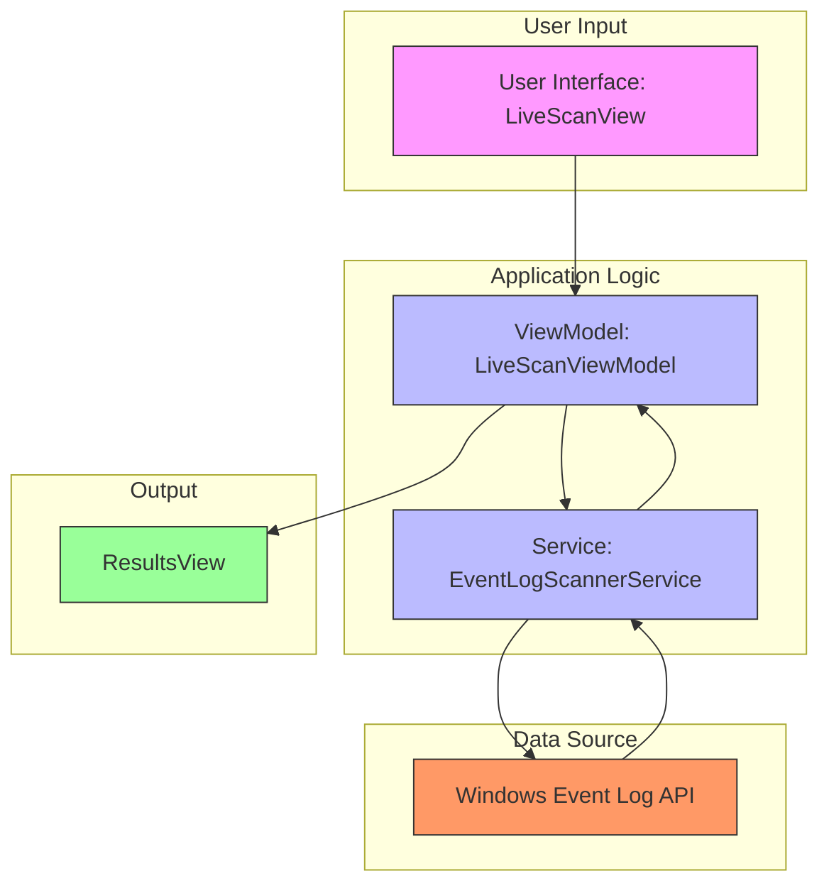
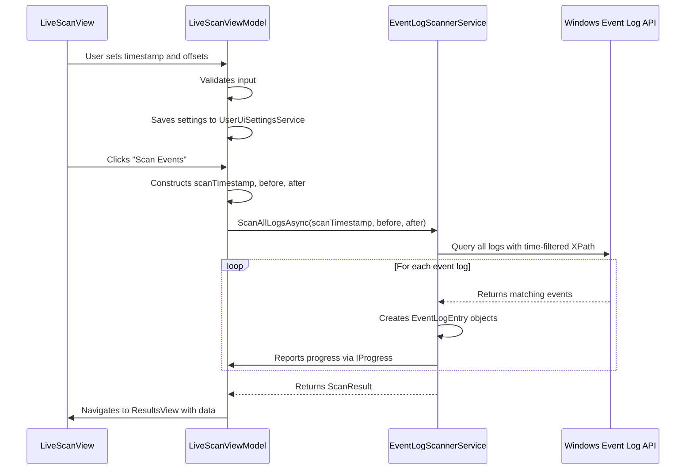

# Configurable Time Window


## Table of Contents
1. [Introduction](#introduction)
2. [Core Components and Data Flow](#core-components-and-data-flow)
3. [LiveScanViewModel: Time Window Configuration and Validation](#livescanviewmodel-time-window-configuration-and-validation)
4. [EventLogScannerService: API-Level Time Range Filtering](#eventlogscannerservice-api-level-time-range-filtering)
5. [Event Query Construction and Execution](#event-query-construction-and-execution)
6. [Performance Optimization and Edge Cases](#performance-optimization-and-edge-cases)
7. [Incident Response Use Case](#incident-response-use-case)
8. [Conclusion](#conclusion)

## Introduction
The Configurable Time Window feature in Project Janus enables users to focus event log analysis around a specific moment of interest by defining a central timestamp and a surrounding time window. This allows for targeted investigation of system behavior before and after critical events, such as suspected security breaches or system failures. The feature balances comprehensive data collection with performance efficiency by filtering events at the API level using precise time ranges. This document details the implementation, from user interface configuration through backend query execution, highlighting the integration between components and the overall architecture.

## Core Components and Data Flow
The Configurable Time Window feature involves a coordinated workflow between the user interface, view model, and backend service. The user sets a central timestamp and offset values (minutes before and after) in the UI. The `LiveScanViewModel` validates and persists these settings, then orchestrates the scan process. When initiated, it passes the time window parameters to `EventLogScannerService`, which constructs time-bounded queries to retrieve only relevant events. The results are aggregated and presented in a unified timeline for analysis.





**Diagram sources**
- [LiveScanViewModel.cs](file://Janus.App/ViewModels/LiveScanViewModel.cs#L1-L260)
- [EventLogScannerService.cs](file://Janus.App/Services/EventLogScannerService.cs#L1-L160)

**Section sources**
- [LiveScanViewModel.cs](file://Janus.App/ViewModels/LiveScanViewModel.cs#L1-L260)
- [EventLogScannerService.cs](file://Janus.App/Services/EventLogScannerService.cs#L1-L160)

## LiveScanViewModel: Time Window Configuration and Validation
The `LiveScanViewModel` class manages the state and logic for the time window configuration in the user interface. It exposes properties for the central timestamp (`Timestamp`), the time of day (`TimeOfDay`), and the configurable offsets (`MinutesBefore` and `MinutesAfter`). These properties implement `INotifyPropertyChanged` to enable data binding with the WPF view.

The default time window is set to ±5 minutes, which is both the initial value and the default in the user settings. The `MinutesBefore` and `MinutesAfter` properties are bound to UI controls (text boxes) and include logic to automatically save the values to persistent storage whenever they are modified. This is handled by the `SaveUiSettingsAsync` method, which updates the `UserUiSettingsService`.


```csharp
public int MinutesBefore {
    get => minutesBefore;
    set {
        if (minutesBefore != value) {
            minutesBefore = value;
            OnPropertyChanged();
            _ = SaveUiSettingsAsync();
        }
    }
}
```


When the scan is initiated via `ScanCommand`, the `ScanAsync` method constructs a `DateTime` object from the `Timestamp` and `TimeOfDay` properties, converts it to UTC, and creates `TimeSpan` objects from the `MinutesBefore` and `MinutesAfter` values. These are then passed directly to the `EventLogScannerService.ScanAllLogsAsync` method.

**Section sources**
- [LiveScanViewModel.cs](file://Janus.App/ViewModels/LiveScanViewModel.cs#L1-L260)
- [UserUiSettingsService.cs](file://Janus.App/Services/UserUiSettingsService.cs#L1-L64)

## EventLogScannerService: API-Level Time Range Filtering
The `EventLogScannerService` is responsible for translating the time window configuration into efficient queries against the Windows Event Log API. The core method, `ScanAllLogsAsync`, takes the central `timestamp`, `before`, and `after` `TimeSpan` parameters and calculates the absolute start and end times for the query window.


```csharp
DateTime from = (timestamp - before).ToUniversalTime();
DateTime to = (timestamp + after).ToUniversalTime();
```


These `from` and `to` timestamps are used to construct an XPath query string that filters events at the source. This is critical for performance, as it ensures only events within the specified time range are retrieved from the system, minimizing memory usage and network overhead (in remote scenarios).


```csharp
string xpath = $"*[System[TimeCreated[@SystemTime>='{from:O}' and @SystemTime<='{to:O}']]]";
using var reader = new EventLogReader(new EventLogQuery(logName, PathType.LogName, xpath));
```


The `:O` format specifier ensures the `DateTime` is rendered in ISO 8601 format, which is required by the Event Log API. The service iterates over all available event logs and processes each one in a separate task, enabling parallel scanning for improved performance. Events are collected into a shared list, with thread safety ensured by a `lock` statement.

**Section sources**
- [EventLogScannerService.cs](file://Janus.App/Services/EventLogScannerService.cs#L32-L158)

## Event Query Construction and Execution
The construction of the event query is a key optimization in the Configurable Time Window feature. By embedding the time range directly into the XPath query, the filtering occurs at the lowest possible level, within the Windows Event Log subsystem itself. This prevents the application from loading potentially millions of irrelevant events into memory.

For example, if a user sets a timestamp of `2025-08-05 09:57:00` with a ±5 minute window, the service calculates:
- **From**: `2025-08-05T09:52:00.0000000Z`
- **To**: `2025-08-05T10:02:00.0000000Z`

The resulting XPath query is:

```xpath
*[System[TimeCreated[@SystemTime>='2025-08-05T09:52:00.0000000Z' and @SystemTime<='2025-08-05T10:02:00.0000000Z']]]
```


This query is passed to the `EventLogQuery` constructor and executed by the `EventLogReader`. Each event that matches the time criteria is then transformed into an `EventLogEntry` object, which includes key metadata such as `Id`, `LogName`, `TimeCreated`, `Level`, `Source`, `EventId`, and `Message`. The `TimeCreated` property of each `EventLogEntry` is used to sort the final results chronologically in the `ResultsView`.





**Diagram sources**
- [EventLogScannerService.cs](file://Janus.App/Services/EventLogScannerService.cs#L32-L158)
- [EventLogEntry.cs](file://Janus.Core/EventLogEntry.cs#L1-L19)
- [ScanResult.cs](file://Janus.App/Services/ScanResult.cs#L1-L7)

**Section sources**
- [EventLogScannerService.cs](file://Janus.App/Services/EventLogScannerService.cs#L32-L158)
- [EventLogEntry.cs](file://Janus.Core/EventLogEntry.cs#L1-L19)

## Performance Optimization and Edge Cases
The Configurable Time Window feature is designed with performance as a primary concern. The use of API-level filtering via XPath queries is the most significant optimization, drastically reducing the amount of data transferred and processed. However, edge cases must be considered:

1. **Large Time Windows**: Setting very large values for `MinutesBefore` or `MinutesAfter` (e.g., several hours or days) can lead to long scan durations and high memory usage. The application mitigates this by processing logs in parallel and reporting progress incrementally. However, users should be aware that excessively large windows can degrade performance and potentially cause timeouts or out-of-memory conditions.

2. **Progress Reporting**: The service uses a throttling mechanism to avoid overwhelming the UI with progress updates. It reports progress either after a certain number of events (default 250) or after a time interval (default 250ms), whichever comes first. This ensures the UI remains responsive without being flooded with updates.

3. **Error Handling**: The service gracefully handles errors such as `EventLogException` or `UnauthorizedAccessException` on a per-log basis. If one log cannot be read, the scan continues for other logs, and the error is recorded in the `ScannedSource` list. This ensures partial results are still available even if some data sources are inaccessible.

4. **Cancellation**: The entire scan process is cancellable via a `CancellationToken`. This allows users to stop a long-running scan if needed, with all running tasks being terminated promptly.


```csharp
catch (OperationCanceledException) {
    status = ScanStatus.Partial;
    // Report partial progress and continue cleanup
}
```


**Section sources**
- [EventLogScannerService.cs](file://Janus.App/Services/EventLogScannerService.cs#L32-L158)
- [SourceScanProgress.cs](file://Janus.App/ViewModels/SourceScanProgress.cs#L1-L25)
- [ScannedSource.cs](file://Janus.Core/ScannedSource.cs#L1-L13)

## Incident Response Use Case
The Configurable Time Window feature is particularly valuable for incident response. Security analysts can use a known compromise timestamp (e.g., from an alert or report) as the central point and configure a window to investigate the events leading up to and following the incident.

For example, if malware execution is detected at `10:00:00`, an analyst can set the timestamp to that moment and configure a window of 15 minutes before and 30 minutes after. This allows them to:
- Identify the initial access vector (e.g., a phishing email or exploit)
- Trace the lateral movement and privilege escalation steps
- Observe the data exfiltration activities
- Understand the full scope of the attack

The resulting `ScanSession` object stores the `Timestamp`, `MinutesBefore`, and `MinutesAfter` values as part of its metadata, ensuring that the context of the investigation is preserved when the snapshot is saved or shared. This enables reproducible and auditable forensic analysis.


```csharp
var session = new ScanSession {
    Id = Guid.NewGuid(),
    Timestamp = scanTimestamp, // e.g., 2025-08-05 10:00:00 UTC
    MinutesBefore = 15,
    MinutesAfter = 30,
    // ... other metadata
};
```


**Section sources**
- [ScanSession.cs](file://Janus.Core/ScanSession.cs#L4-L34)
- [LiveScanViewModel.cs](file://Janus.App/ViewModels/LiveScanViewModel.cs#L233-L234)

## Conclusion
The Configurable Time Window feature in Project Janus provides a powerful and efficient mechanism for focused event log analysis. By allowing users to specify a central timestamp with configurable before and after offsets, it enables targeted investigation of critical system events. The implementation leverages the `LiveScanViewModel` for UI state management and validation, and the `EventLogScannerService` for efficient, API-level filtering of events using time-bounded XPath queries. This architecture ensures optimal performance by minimizing data retrieval and processing overhead. The feature is particularly effective for incident response, where understanding the context around a known event is crucial for effective analysis and remediation.

**Referenced Files in This Document**   
- [LiveScanViewModel.cs](file://Janus.App/ViewModels/LiveScanViewModel.cs)
- [EventLogScannerService.cs](file://Janus.App/Services/EventLogScannerService.cs)
- [EventLogEntry.cs](file://Janus.Core/EventLogEntry.cs)
- [UserUiSettingsService.cs](file://Janus.App/Services/UserUiSettingsService.cs)
- [ScanSession.cs](file://Janus.Core/ScanSession.cs)
- [ScanResult.cs](file://Janus.App/Services/ScanResult.cs)
- [SourceScanProgress.cs](file://Janus.App/ViewModels/SourceScanProgress.cs)
- [ScannedSource.cs](file://Janus.Core/ScannedSource.cs)