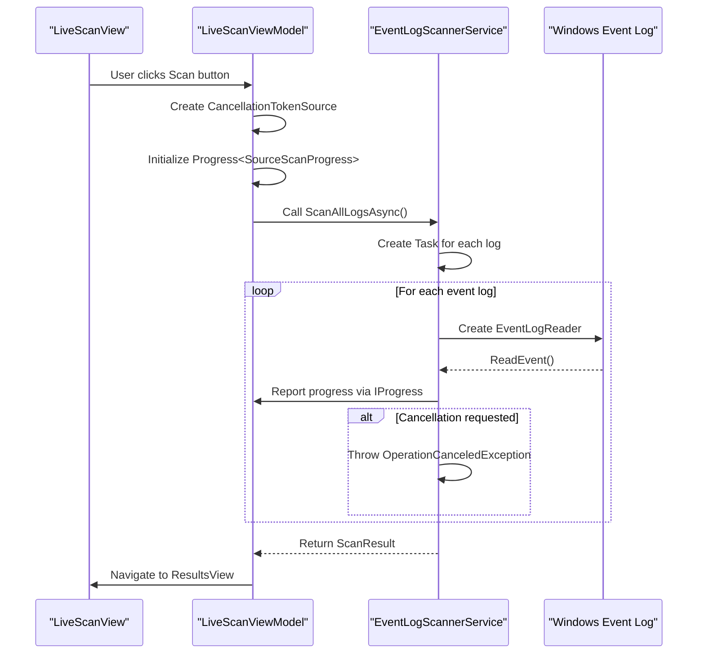

# Real-Time Scan Progress and Cancellation


## Table of Contents
1. [Introduction](#introduction)
2. [Core Data Structure: SourceScanProgress](#core-data-structure-sourcescanprogress)
3. [Aggregation and UI Binding: LiveScanViewModel](#aggregation-and-ui-binding-livescanviewmodel)
4. [Background Scanning Implementation](#background-scanning-implementation)
5. [Thread-Safe Progress Reporting with IProgress<T>](#thread-safe-progress-reporting-with-iprogresst)
6. [Cancellation Mechanism](#cancellation-mechanism)
7. [Resource Management and EventLogReader Disposal](#resource-management-and-eventlogreader-disposal)
8. [Handling Partial Results on Cancellation](#handling-partial-results-on-cancellation)
9. [User Interaction and Monitoring](#user-interaction-and-monitoring)
10. [Best Practices Summary](#best-practices-summary)

## Introduction
This document provides a comprehensive analysis of the real-time scan progress tracking and cancellation system in Project Janus, a Windows event log analysis application. The system enables users to monitor ongoing scans of multiple event logs simultaneously, view progress metrics for individual log sources, and safely cancel long-running operations. The implementation follows a robust pattern of separating concerns between background processing, progress reporting, and UI presentation, using established .NET patterns for asynchronous operations and thread-safe updates. This documentation explains how scan progress is tracked at the individual source level, aggregated for display, and updated in real-time on the user interface, along with the mechanisms for graceful cancellation and resource cleanup.

## Core Data Structure: SourceScanProgress
The `SourceScanProgress` class serves as the fundamental data carrier for real-time progress information from individual event log sources during a scan operation. It implements the `INotifyPropertyChanged` interface to enable data binding in the WPF user interface, allowing UI elements to automatically update when progress values change.


```csharp
public class SourceScanProgress : INotifyPropertyChanged {
  public string SourceName { get; set; } = string.Empty;
  public int EventsRetrieved { get; set; }
  public ScanStatus Status { get; set; } = ScanStatus.Success;
  public bool IsTotalKnown { get; set; }
  public int? TotalEvents { get; set; }
  public bool IsActive { get; set; }
  public string? ExceptionMessage { get; set; }

  public event PropertyChangedEventHandler? PropertyChanged;

  public void OnPropertyChanged(string propertyName)
      => PropertyChanged?.Invoke(this, new PropertyChangedEventArgs(propertyName));

  public SourceScanProgress() {
    Status = ScanStatus.Success;
    SourceName = string.Empty;
  }
}
```


Each instance of `SourceScanProgress` represents the scanning status of a single Windows event log (e.g., "Application", "System", "Security"). The key properties include:
- **SourceName**: Identifies the specific event log being scanned
- **EventsRetrieved**: Tracks the number of events successfully read from the log
- **Status**: Indicates the current state of the scan (Success, Partial, Failed) using the `ScanStatus` enum
- **IsTotalKnown** and **TotalEvents**: Provide information about whether the total number of events in the log is known and what that total is (currently not implemented)
- **IsActive**: A boolean flag indicating whether the scan for this source is currently in progress
- **ExceptionMessage**: Stores any error message if the scan fails

The `OnPropertyChanged` method is crucial for WPF data binding, as it notifies the UI framework when any property value changes, triggering automatic updates in bound controls.

**Section sources**
- [SourceScanProgress.cs](file://d:/devel/Project Janus/Janus.App/ViewModels/SourceScanProgress.cs#L1-L25)

## Aggregation and UI Binding: LiveScanViewModel
The `LiveScanViewModel` class acts as the central coordinator for the scanning process, aggregating progress from multiple `SourceScanProgress` instances and exposing aggregated statistics to the user interface through data-bound properties. It maintains a collection of `SourceScanProgress` objects and calculates summary metrics such as total sources, sources completed successfully, sources with errors, sources currently in progress, and total events retrieved.


```csharp
private int totalSources;
private int sourcesCompletedSuccess;
private int sourcesCompletedError;
private int sourcesInProgress;
private int totalEvents;

private System.Collections.ObjectModel.ObservableCollection<SourceScanProgress> scannedSources = [];
public System.Collections.ObjectModel.ObservableCollection<SourceScanProgress> ScannedSources {
  get => scannedSources;
  set {
    if (scannedSources != value) {
      scannedSources = value;
      OnPropertyChanged();
      OnPropertyChanged(nameof(TotalSources));
      OnPropertyChanged(nameof(SourcesCompletedSuccess));
      OnPropertyChanged(nameof(SourcesCompletedError));
      OnPropertyChanged(nameof(SourcesInProgress));
      OnPropertyChanged(nameof(TotalEvents));
    }
  }
}

public int TotalSources {
  get => totalSources;
  private set { totalSources = value; OnPropertyChanged(); }
}
// Similar properties for SourcesCompletedSuccess, SourcesCompletedError, SourcesInProgress, TotalEvents
```


The view model exposes these aggregated values as individual properties that can be directly bound to UI elements like labels and progress bars. When a `SourceScanProgress` instance is updated, the view model detects changes and updates the corresponding counter, then raises property change notifications to update the UI.

**Section sources**
- [LiveScanViewModel.cs](file://d:/devel/Project Janus/Janus.App/ViewModels/LiveScanViewModel.cs#L1-L260)

## Background Scanning Implementation
The `EventLogScannerService` class implements the core scanning functionality, running in background threads to avoid blocking the user interface. It uses the Windows Event Log API (`System.Diagnostics.Eventing.Reader`) to query event logs asynchronously. The service scans all available event logs on the system, searching for entries within a specified time window around a critical timestamp.





**Diagram sources**
- [EventLogScannerService.cs](file://d:/devel/Project Janus/Janus.App/Services/EventLogScannerService.cs#L31-L160)
- [LiveScanViewModel.cs](file://d:/devel/Project Janus/Janus.App/ViewModels/LiveScanViewModel.cs#L150-L250)

## Thread-Safe Progress Reporting with IProgress<T>
The system uses the `IProgress<SourceScanProgress>` interface to enable thread-safe communication of progress updates from background scanning tasks to the UI thread. This pattern decouples the background worker from the UI framework, allowing progress reporting without requiring the worker to have direct knowledge of the UI components.

In the `LiveScanViewModel`, a `Progress<SourceScanProgress>` instance is created and passed to the scanning service:


```csharp
var progress = new Progress<SourceScanProgress>(progressUpdate => {
  void update() {
    // Update UI-bound properties
    SourceScanProgress? existing = ScannedSources.FirstOrDefault(s => s.SourceName == progressUpdate.SourceName);
    // ... update logic
  }
  if (dispatcher != null && !dispatcher.CheckAccess()) {
    dispatcher.Invoke(update);
  } else {
    update();
  }
});
```


The lambda function provided to the `Progress<T>` constructor contains the logic to update the UI-bound `ScannedSources` collection. Before performing the update, it checks whether it's running on the UI thread using `Dispatcher.CheckAccess()`. If not, it uses `Dispatcher.Invoke()` to marshal the update operation to the UI thread, ensuring thread safety. This approach prevents cross-thread exceptions that would occur if background threads tried to modify UI-bound collections directly.

**Section sources**
- [LiveScanViewModel.cs](file://d:/devel/Project Janus/Janus.App/ViewModels/LiveScanViewModel.cs#L175-L210)

## Cancellation Mechanism
The cancellation system is implemented using .NET's `CancellationTokenSource` and `CancellationToken` pattern, providing a cooperative cancellation mechanism that allows long-running scan operations to be terminated gracefully. The `LiveScanViewModel` maintains a `CancellationTokenSource` field (`cts`) that is instantiated when a scan begins and disposed when it completes or is cancelled.


```csharp
private CancellationTokenSource? cts;

private async Task ScanAsync() {
  cts = new CancellationTokenSource();
  // ... scan logic
}

private void CancelScan() => cts?.Cancel();
```


The `ScanCommand` and `CancelCommand` are implemented as `AsyncRelayCommand` and `RelayCommand` respectively, with their `CanExecute` methods bound to the state of the `CancellationTokenSource`. This enables automatic UI button state management - the Scan button is disabled while a scan is in progress, and the Cancel button is only enabled during an active scan.

When `CancelScan()` is called, it invokes `Cancel()` on the `CancellationTokenSource`, which sets the cancellation token to the cancelled state. The background scanning tasks periodically check this state using `cancellationToken.ThrowIfCancellationRequested()`, which throws an `OperationCanceledException` when cancellation has been requested. This allows each scanning task to clean up and exit gracefully.

**Section sources**
- [LiveScanViewModel.cs](file://d:/devel/Project Janus/Janus.App/ViewModels/LiveScanViewModel.cs#L15-L20)
- [LiveScanViewModel.cs](file://d:/devel/Project Janus/Janus.App/ViewModels/LiveScanViewModel.cs#L150-L155)
- [LiveScanViewModel.cs](file://d:/devel/Project Janus/Janus.App/ViewModels/LiveScanViewModel.cs#L255-L257)

## Resource Management and EventLogReader Disposal
Proper resource management is critical when working with system-level components like the Windows Event Log API. The `EventLogScannerService` correctly implements resource cleanup through the use of the `using` statement and proper exception handling.


```csharp
using var reader = new EventLogReader(new EventLogQuery(logName, PathType.LogName, xpath));
for (EventRecord? record = reader.ReadEvent(); record is not null; record = reader.ReadEvent()) {
  cancellationToken.ThrowIfCancellationRequested();
  // ... process record
}
```


The `using` statement ensures that the `EventLogReader` instance is properly disposed of when the scope is exited, whether through normal completion or due to an exception or cancellation. This is essential for preventing resource leaks, as `EventLogReader` holds unmanaged resources that must be released. Even when an `OperationCanceledException` is thrown due to cancellation, the `using` block guarantees that the `EventLogReader` is disposed before the exception propagates up the call stack. This pattern ensures that system resources are always cleaned up, regardless of how the scanning operation terminates.

**Section sources**
- [EventLogScannerService.cs](file://d:/devel/Project Janus/Janus.App/Services/EventLogScannerService.cs#L61-L62)

## Handling Partial Results on Cancellation
When a scan is cancelled, the system handles partial results appropriately, preserving the data that has already been collected. The `ScanStatus.Partial` enum value is used to indicate that a scan was terminated before completion, providing transparency to the user about the state of the results.

In the `EventLogScannerService`, when an `OperationCanceledException` is caught, the scan status for that particular log source is set to `Partial`:


```csharp
catch (OperationCanceledException) {
  status = ScanStatus.Partial;
  perSourceProgress?.Report(new Janus.App.SourceScanProgress {
    SourceName = logName,
    EventsRetrieved = sourceEventCount,
    Status = status,
    IsTotalKnown = isTotalKnown,
    TotalEvents = totalEvents,
    IsActive = false,
    ExceptionMessage = null
  });
}
```


The partially collected events are still included in the final `ScanResult` returned to the `LiveScanViewModel`. This allows users to access and analyze the data that was successfully retrieved before cancellation, rather than losing all progress. The UI can then display this information appropriately, showing which sources were fully scanned, which failed, and which were partially completed.

**Section sources**
- [EventLogScannerService.cs](file://d:/devel/Project Janus/Janus.App/Services/EventLogScannerService.cs#L105-L112)
- [ScannedSource.cs](file://d:/devel/Project Janus/Janus.Core/ScannedSource.cs#L2-L6)

## User Interaction and Monitoring
Users can monitor scan progress and control the scanning process through a dedicated UI interface. The system provides real-time feedback through multiple channels:

1. **Individual Source Progress**: A list displays each event log source with its current status, number of events retrieved, and visual indicators for success, error, or active scanning.
2. **Aggregated Statistics**: Summary counters show the total number of sources, sources completed successfully, sources with errors, sources in progress, and total events retrieved.
3. **Status Bar**: A dynamic status message displays the current scan state and aggregated statistics.
4. **Control Buttons**: The Scan button initiates a new scan, while the Cancel button becomes available during scanning and allows users to terminate the operation.

The UI updates are smooth and responsive due to the efficient progress reporting mechanism, which throttles updates to every 250ms or 250 events (whichever comes first) to prevent overwhelming the UI with too many rapid updates. Users can safely cancel long-running scans at any time, with the system guaranteeing proper cleanup of resources and preservation of partially collected data.

**Section sources**
- [LiveScanViewModel.cs](file://d:/devel/Project Janus/Janus.App/ViewModels/LiveScanViewModel.cs#L175-L210)
- [LiveScanViewModel.cs](file://d:/devel/Project Janus/Janus.App/ViewModels/LiveScanViewModel.cs#L255-L257)

## Best Practices Summary
The real-time scan progress and cancellation system in Project Janus demonstrates several best practices in asynchronous programming and UI design:

1. **Separation of Concerns**: Clear separation between the scanning service (business logic), view model (state management), and view (presentation).
2. **Thread-Safe Updates**: Proper use of `Dispatcher` to marshal UI updates from background threads, preventing cross-thread exceptions.
3. **Cooperative Cancellation**: Implementation of the `CancellationToken` pattern for graceful termination of long-running operations.
4. **Resource Management**: Use of `using` statements to ensure proper disposal of unmanaged resources like `EventLogReader`.
5. **Progress Reporting**: Implementation of `IProgress<T>` for decoupled, type-safe progress reporting from background tasks.
6. **Data Binding**: Effective use of `INotifyPropertyChanged` and `ObservableCollection<T>` for automatic UI updates.
7. **Partial Result Handling**: Preservation of collected data when scans are cancelled, with appropriate status indication.
8. **Throttled Updates**: Optimization of progress reporting frequency to balance responsiveness with performance.
9. **Exception Handling**: Comprehensive error handling for various failure modes (access denied, log errors, cancellation).
10. **Responsive UI**: Use of asynchronous commands to keep the interface responsive during long operations.

These practices ensure a robust, user-friendly experience for monitoring and controlling the scanning of Windows event logs, even when dealing with large volumes of data or problematic log sources.

**Section sources**
- [SourceScanProgress.cs](file://d:/devel/Project Janus/Janus.App/ViewModels/SourceScanProgress.cs#L1-L25)
- [LiveScanViewModel.cs](file://d:/devel/Project Janus/Janus.App/ViewModels/LiveScanViewModel.cs#L1-L260)
- [EventLogScannerService.cs](file://d:/devel/Project Janus/Janus.App/Services/EventLogScannerService.cs#L31-L160)

**Referenced Files in This Document**   
- [SourceScanProgress.cs](file://d:/devel/Project Janus/Janus.App/ViewModels/SourceScanProgress.cs)
- [LiveScanViewModel.cs](file://d:/devel/Project Janus/Janus.App/ViewModels/LiveScanViewModel.cs)
- [EventLogScannerService.cs](file://d:/devel/Project Janus/Janus.App/Services/EventLogScannerService.cs)
- [ScanResult.cs](file://d:/devel/Project Janus/Janus.App/Services/ScanResult.cs)
- [ScannedSource.cs](file://d:/devel/Project Janus/Janus.Core/ScannedSource.cs)