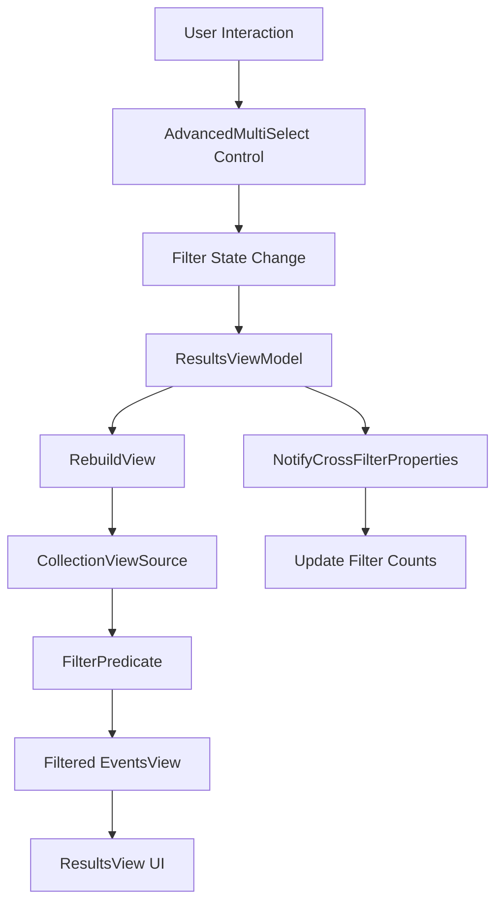
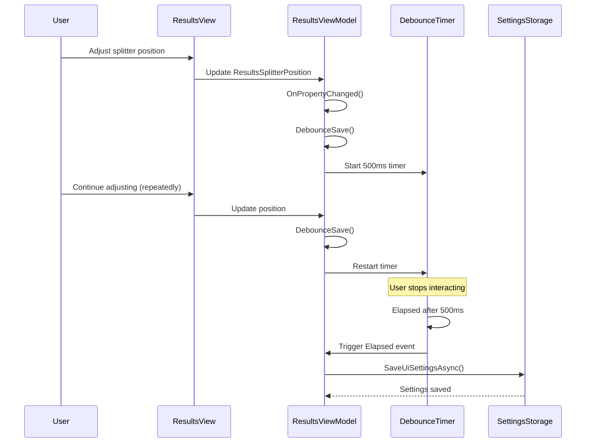
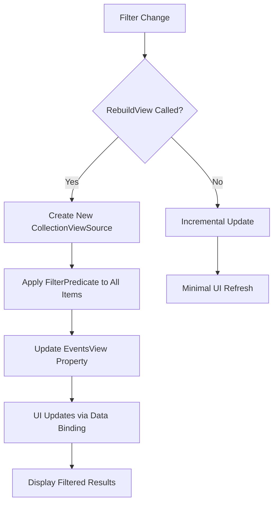

# Advanced Results Filtering


## Table of Contents
1. [Introduction](#introduction)
2. [Core Filtering Architecture](#core-filtering-architecture)
3. [ResultsViewModel: Central Filtering Logic](#resultsviewmodel-central-filtering-logic)
4. [AdvancedMultiSelect: Multi-Selection UI Control](#advancedmultiselect-multi-selection-ui-control)
5. [Data Binding and Change Notification](#data-binding-and-change-notification)
6. [Efficient Filtering on Large Datasets](#efficient-filtering-on-large-datasets)
7. [Case-Insensitive Text Search with Highlighting](#case-insensitive-text-search-with-highlighting)
8. [Complex Filter Combinations and Performance](#complex-filter-combinations-and-performance)
9. [Visual Feedback and UI Converters](#visual-feedback-and-ui-converters)
10. [Filtering Strategies for Investigation Scenarios](#filtering-strategies-for-investigation-scenarios)

## Introduction
The Advanced Results Filtering system in Project Janus enables users to efficiently analyze large volumes of event log data through a comprehensive filtering interface. This system allows filtering by log level, source, log name, and free-text search across event properties. The implementation leverages WPF's data binding, collection views, and reactive patterns to provide a responsive user experience even with large datasets. The filtering architecture is designed to support complex combinations of criteria while maintaining performance and providing visual feedback on filter states and result counts.

## Core Filtering Architecture
The filtering system follows a Model-View-ViewModel (MVVM) pattern with clear separation between data, logic, and presentation. The core components include:
- **ResultsViewModel**: Central coordinator that manages filter state and applies filtering logic
- **AdvancedMultiSelect**: Reusable UI control for multi-selection filtering with search capabilities
- **ICollectionView**: WPF's collection view interface used for filtering, sorting, and grouping
- **EventLogEntryDisplay**: Wrapper class that enhances raw event data with UI-specific properties

The architecture uses a push-based notification system where changes in filter state trigger immediate UI updates through INotifyPropertyChanged. Filtering is applied at the view level using CollectionViewSource, allowing the original data collection to remain unmodified while presenting filtered results to the user.





**Diagram sources**
- [ResultsViewModel.cs](file://d:/devel/Project Janus/Janus.App/ViewModels/ResultsViewModel.cs)
- [AdvancedMultiSelect.xaml.cs](file://d:/devel/Project Janus/Janus.App/Controls/AdvancedMultiSelect.xaml.cs)

## ResultsViewModel: Central Filtering Logic
The ResultsViewModel class serves as the central hub for filtering logic, managing multiple filter dimensions and their interactions.

### Filter Properties
The view model exposes several observable collections for different filter types:

**Log Level Filtering**
- `LogLevels`: ObservableCollection containing ["Critical", "Error", "Warning", "Information", "Verbose"]
- `SelectedLogLevels`: ObservableCollection tracking currently selected log levels
- `SelectedLogLevelsDisplay`: Computed property showing selected levels as comma-separated string

**Source and Log Name Filtering**
- `Sources`: ObservableCollection of unique source names from loaded events
- `SelectedSources`: ObservableCollection of currently selected sources
- `LogNames`: ObservableCollection of unique log names from loaded events
- `SelectedLogNames`: ObservableCollection of currently selected log names

**Section sources**
- [ResultsViewModel.cs](file://d:/devel/Project Janus/Janus.App/ViewModels/ResultsViewModel.cs#L150-L185)

### Cross-Filtering Count Providers
A key feature of the filtering system is dynamic count updates that reflect the impact of other filters. This is achieved through three count provider functions:


```csharp
public Func<object, int> LogLevelCountProvider => item =>
  Events.Count(e =>
    (SelectedSources.Count == 0 || SelectedSources.Contains(e.Source)) &&
    (SelectedLogNames.Count == 0 || SelectedLogNames.Contains(e.LogName)) &&
    e.Level == (item as string));

public Func<object, int> SourceCountProvider => item =>
  Events.Count(e =>
    (SelectedLogLevels.Count == 0 || SelectedLogLevels.Contains(e.Level)) &&
    (SelectedLogNames.Count == 0 || SelectedLogNames.Contains(e.LogName)) &&
    e.Source == (item as string));

public Func<object, int> LogNameCountProvider => item =>
  Events.Count(e =>
    (SelectedLogLevels.Count == 0 || SelectedLogLevels.Contains(e.Level)) &&
    (SelectedSources.Count == 0 || SelectedSources.Contains(e.Source)) &&
    e.LogName == (item as string));
```


These functions calculate how many events would match each filter option given the current state of other filters, providing users with immediate feedback on filter effectiveness.

**Section sources**
- [ResultsViewModel.cs](file://d:/devel/Project Janus/Janus.App/ViewModels/ResultsViewModel.cs#L185-L215)

## AdvancedMultiSelect: Multi-Selection UI Control
The AdvancedMultiSelect control provides a reusable component for multi-selection filtering with enhanced usability features.

### Key Features
- **Checkable List**: Each item in the list has a checkbox for selection
- **Search-as-You-Type**: Real-time filtering of the selection list based on user input
- **Show Only Selected**: Toggle to display only currently selected items
- **Select All Visible**: Command to select all items currently visible in the filtered list
- **Dynamic Counts**: Display of item counts that update based on other filters

### Implementation Details
The control uses dependency properties to bind to external data sources:


```csharp
public IEnumerable ItemsSource { get; set; }
public IList SelectedItems { get; set; }
public string SearchText { get; set; }
public bool ShowOnlySelected { get; set; }
public Func<object, int> ItemCountProvider { get; set; }
```


When any of these properties change, the `UpdateFilteredItems` method rebuilds the `FilteredItems` collection, which is bound to the UI list. The filtering logic applies both the search text and the "Show Only Selected" state:


```csharp
private void UpdateFilteredItems() {
    FilteredItems.Clear();
    if (ItemsSource == null) return;

    IEnumerable<object> items = ItemsSource.Cast<object>();
    
    // Apply search filter
    if (!string.IsNullOrWhiteSpace(SearchText)) {
        items = items.Where(i => i?.ToString()?.IndexOf(SearchText, StringComparison.OrdinalIgnoreCase) >= 0);
    }

    // Apply "Show Only Selected" filter
    if (ShowOnlySelected && SelectedItems != null) {
        items = items.Where(i => SelectedItems.Contains(i));
    }

    // Create view models for each item
    foreach (object? item in items) {
        FilteredItems.Add(new ItemViewModel(this) {
            Value = item,
            DisplayText = item?.ToString() ?? "",
            IsSelected = SelectedItems?.Contains(item) ?? false,
            Count = ItemCountProvider?.Invoke(item) ?? 0
        });
    }
    OnPropertyChanged(nameof(FilteredItems));
}
```


**Section sources**
- [AdvancedMultiSelect.xaml.cs](file://d:/devel/Project Janus/Janus.App/Controls/AdvancedMultiSelect.xaml.cs#L50-L145)

## Data Binding and Change Notification
The filtering system relies heavily on WPF's data binding infrastructure and the INotifyPropertyChanged pattern to maintain synchronization between the UI and view model.

### INotifyPropertyChanged Implementation
Both ResultsViewModel and the nested ItemViewModel class implement INotifyPropertyChanged to notify the UI of property changes:


```csharp
public event PropertyChangedEventHandler? PropertyChanged;
private void OnPropertyChanged([CallerMemberName] string? name = null)
    => PropertyChanged?.Invoke(this, new PropertyChangedEventArgs(name));
```


This pattern ensures that when a property value changes, any UI elements bound to that property are automatically updated.

### ObservableCollection for Collection Changes
ObservableCollection is used extensively for filter collections, providing automatic notifications when items are added or removed:


```csharp
public ObservableCollection<string> SelectedLogLevels { get; set; } = [];
public ObservableCollection<string> SelectedSources { get; set; } = [];
public ObservableCollection<string> SelectedLogNames { get; set; } = [];
```


The view model subscribes to the CollectionChanged event of these collections to trigger filter updates:


```csharp
SelectedLogLevels.CollectionChanged += (_, __) => { RebuildView(); NotifyCrossFilterProperties(); };
SelectedSources.CollectionChanged += (_, __) => { RebuildView(); NotifyCrossFilterProperties(); };
SelectedLogNames.CollectionChanged += (_, __) => { RebuildView(); NotifyCrossFilterProperties(); };
```


**Section sources**
- [ResultsViewModel.cs](file://d:/devel/Project Janus/Janus.App/ViewModels/ResultsViewModel.cs#L10-L564)
- [AdvancedMultiSelect.xaml.cs](file://d:/devel/Project Janus/Janus.App/Controls/AdvancedMultiSelect.xaml.cs#L0-L176)

## Efficient Filtering on Large Datasets
The system employs several strategies to maintain performance when filtering large datasets.

### CollectionViewSource for Efficient Filtering
Instead of modifying the original data collection, the system uses CollectionViewSource to create a filtered view:


```csharp
private void RebuildView() {
    var cvs = new CollectionViewSource { Source = Events };
    cvs.Filter += (s, e) => {
        e.Accepted = FilterPredicate(e.Item as EventLogEntryDisplay);
    };
    EventsView = cvs.View;
    // ... additional view configuration
}
```


This approach ensures that filtering operations do not affect the underlying data and leverages WPF's optimized collection view infrastructure.

### Debounced UI Settings Persistence
To avoid excessive disk I/O during rapid UI interactions, the system uses a debouncer pattern:


```csharp
private readonly System.Timers.Timer debounceTimer;
private bool pendingSave;

private void DebounceSave() {
    pendingSave = true;
    debounceTimer.Stop();
    debounceTimer.Start();
}

// Timer configured with 500ms interval
debounceTimer = new System.Timers.Timer(500) { AutoReset = false };
debounceTimer.Elapsed += async (_, __) => {
    if (pendingSave) {
        await SaveUiSettingsAsync();
        pendingSave = false;
    }
};
```


This ensures that UI settings (like splitter positions) are saved only after the user has stopped interacting with the interface for 500ms.





**Diagram sources**
- [ResultsViewModel.cs](file://d:/devel/Project Janus/Janus.App/ViewModels/ResultsViewModel.cs#L70-L100)
- [Debouncer.cs](file://d:/devel/Project Janus/Janus.App/Services/Debouncer.cs#L7-L32)

## Case-Insensitive Text Search with Highlighting
The system provides robust text search capabilities with visual highlighting of matches.

### Search Implementation
The free-text search is implemented through the SearchText property in ResultsViewModel:


```csharp
private string searchText = string.Empty;
public string SearchText {
    get => searchText;
    set {
        searchText = value;
        OnPropertyChanged();
        RebuildView();
    }
}
```


The actual filtering is performed in the FilterPredicate method using case-insensitive comparison:


```csharp
if (!string.IsNullOrWhiteSpace(SearchText) && 
    !(e.Message?.Contains(SearchText, StringComparison.OrdinalIgnoreCase) ?? false)) {
    return false;
}
```


### Message Highlighting
When displaying search results, matching text is highlighted using inline formatting:


```csharp
public IEnumerable<Inline> MessageInlines {
    get {
        string message = entry.Message ?? string.Empty;
        string search = getSearchText();
        if (string.IsNullOrEmpty(search)) {
            return [new Run(message)];
        }

        var inlines = new List<Inline>();
        int idx = 0;
        int searchLen = search.Length;
        StringComparison comparison = StringComparison.OrdinalIgnoreCase;
        while (idx < message.Length) {
            int matchIdx = message.IndexOf(search, idx, comparison);
            if (matchIdx < 0) {
                inlines.Add(new Run(message[idx..]));
                break;
            }
            if (matchIdx > idx) {
                inlines.Add(new Run(message[idx..matchIdx]));
            }

            var highlight = new Run(message.Substring(matchIdx, searchLen)) {
                Background = Brushes.Yellow,
                Foreground = Brushes.Black
            };
            inlines.Add(highlight);
            idx = matchIdx + searchLen;
        }
        return inlines;
    }
}
```


This implementation searches for all occurrences of the search term and wraps them in Run elements with yellow background and black text, making matches highly visible.

**Section sources**
- [ResultsViewModel.cs](file://d:/devel/Project Janus/Janus.App/ViewModels/ResultsViewModel.cs#L429-L455)
- [ResultsViewModel.cs](file://d:/devel/Project Janus/Janus.App/ViewModels/ResultsViewModel.cs#L25-L60)

## Complex Filter Combinations and Performance
The filtering system supports complex combinations of criteria while maintaining reasonable performance.

### Filter Combination Examples
**Example 1: Security Investigation**
- Log Levels: Error, Critical
- Sources: Microsoft-Windows-Security-Auditing
- Log Names: Security
- Search Text: "failed login"

This combination would identify failed login attempts in the Security log with high severity.

**Example 2: Application Debugging**
- Log Levels: Verbose, Information
- Sources: MyApp.Service
- Log Names: Application
- Search Text: "database connection"

This would help diagnose database connectivity issues in a specific application.

### Performance Characteristics
The system's performance is primarily affected by:
- **Dataset Size**: Larger datasets require more time for filtering operations
- **Filter Complexity**: More filter criteria require more evaluation per item
- **UI Virtualization**: The DataGrid uses virtualization to limit rendering to visible items

The RebuildView method creates a new CollectionViewSource for each filter change, which provides a clean separation but does require re-evaluating all items against the filter predicate. For very large datasets, this could become a bottleneck, though the use of ObservableCollection and efficient filtering helps mitigate this.





**Diagram sources**
- [ResultsViewModel.cs](file://d:/devel/Project Janus/Janus.App/ViewModels/ResultsViewModel.cs#L330-L370)

## Visual Feedback and UI Converters
The system uses value converters to provide visual feedback and enhance the user experience.

### LogLevelSelectedConverter
This converter determines whether a log level is selected for styling purposes:


```csharp
public class LogLevelSelectedConverter : IValueConverter {
    public object Convert(object value, Type targetType, object parameter, CultureInfo culture) 
        => value is ObservableCollection<string> selectedLevels && 
           parameter is string level && 
           selectedLevels.Contains(level);

    public object ConvertBack(object value, Type targetType, object parameter, CultureInfo culture) {
        // Not implemented - handled in ViewModel
        return Binding.DoNothing;
    }
}
```


This converter is used in the UI to highlight selected log levels, providing immediate visual feedback.

### Other Key Converters
**ScanIdCheckedMultiConverter**: Determines checkbox state in the results grid based on the checkedScanEventIds collection:


```csharp
public object Convert(object[] values, Type targetType, object parameter, CultureInfo culture) {
    if (values.Length >= 2 && values[0] is IReadOnlyCollection<int> checkedIds) {
        if (values[1] is int scanId) {
            return checkedIds.Contains(scanId);
        }
        // ... string parsing fallback
    }
    return false;
}
```


**InverseBooleanConverter**: Enables mutually exclusive grouping options by inverting boolean values:


```csharp
public object Convert(object value, Type targetType, object parameter, CultureInfo culture) {
    if (value is bool b) {
        return !b;
    }
    return true;
}
```


This allows the "Group by Log" and "Group by Level" checkboxes to disable each other when one is selected.

**FirstLineConverter**: Displays only the first line of multi-line messages in the grid:


```csharp
public object Convert(object value, Type targetType, object parameter, CultureInfo culture) {
    if (value is string s) {
        int idx = s.IndexOf('\n');
        if (idx >= 0) {
            return s[..idx];
        }
        // ... handle carriage return
        return s;
    }
    return value;
}
```


**Section sources**
- [LogLevelSelectedConverter.cs](file://d:/devel/Project Janus/Janus.App/ViewModels/LogLevelSelectedConverter.cs#L5-L17)
- [ScanIdCheckedMultiConverter.cs](file://d:/devel/Project Janus/Janus.App/Helpers/ScanIdCheckedMultiConverter.cs#L5-L22)
- [InverseBooleanConverter.cs](file://d:/devel/Project Janus/Janus.App/Helpers/InverseBooleanConverter.cs#L5-L20)
- [FirstLineConverter.cs](file://d:/devel/Project Janus/Janus.App/Helpers/FirstLineConverter.cs#L5-L24)

## Filtering Strategies for Investigation Scenarios
Effective use of the filtering system requires strategic approaches based on investigation goals.

### Broad to Narrow Approach
1. **Start Broad**: Begin with minimal filters to understand the dataset scope
2. **Identify Patterns**: Use the dynamic counts to identify high-frequency sources, log levels, or log names
3. **Narrow Focus**: Apply filters to isolate the most relevant categories
4. **Refine with Text Search**: Use free-text search to find specific events within the narrowed set

### Time-Based Investigation
For time-sensitive investigations:
1. Use the "Show Only Checked" feature to mark key events
2. Apply temporal filters (when available) to focus on specific time windows
3. Sort by TimeCreated to analyze event sequences
4. Use grouping by Level or Log to identify patterns over time

### Performance Optimization Tips
- **Limit Simultaneous Filters**: Applying too many filters can slow down the interface
- **Use Show Only Checked**: When investigating a subset of events, use the checkbox selection to isolate them
- **Clear Filters Incrementally**: Remove filters one at a time to understand their impact
- **Avoid Overly Broad Text Searches**: Specific search terms perform better than generic ones

The Advanced Results Filtering system provides a powerful toolkit for analyzing event logs, combining intuitive UI controls with efficient backend processing to support effective investigation workflows.

**Referenced Files in This Document**   
- [ResultsViewModel.cs](file://d:/devel/Project Janus/Janus.App/ViewModels/ResultsViewModel.cs)
- [AdvancedMultiSelect.xaml](file://d:/devel/Project Janus/Janus.App/Controls/AdvancedMultiSelect.xaml)
- [AdvancedMultiSelect.xaml.cs](file://d:/devel/Project Janus/Janus.App/Controls/AdvancedMultiSelect.xaml.cs)
- [LogLevelSelectedConverter.cs](file://d:/devel/Project Janus/Janus.App/ViewModels/LogLevelSelectedConverter.cs)
- [EventLogEntry.cs](file://d:/devel/Project Janus/Janus.Core/EventLogEntry.cs)
- [ResultsView.xaml](file://d:/devel/Project Janus/Janus.App/Views/ResultsView.xaml)
- [Debouncer.cs](file://d:/devel/Project Janus/Janus.App/Services/Debouncer.cs)
- [ScanIdCheckedMultiConverter.cs](file://d:/devel/Project Janus/Janus.App/Helpers/ScanIdCheckedMultiConverter.cs)
- [FirstLineConverter.cs](file://d:/devel/Project Janus/Janus.App/Helpers/FirstLineConverter.cs)
- [InverseBooleanConverter.cs](file://d:/devel/Project Janus/Janus.App/Helpers/InverseBooleanConverter.cs)