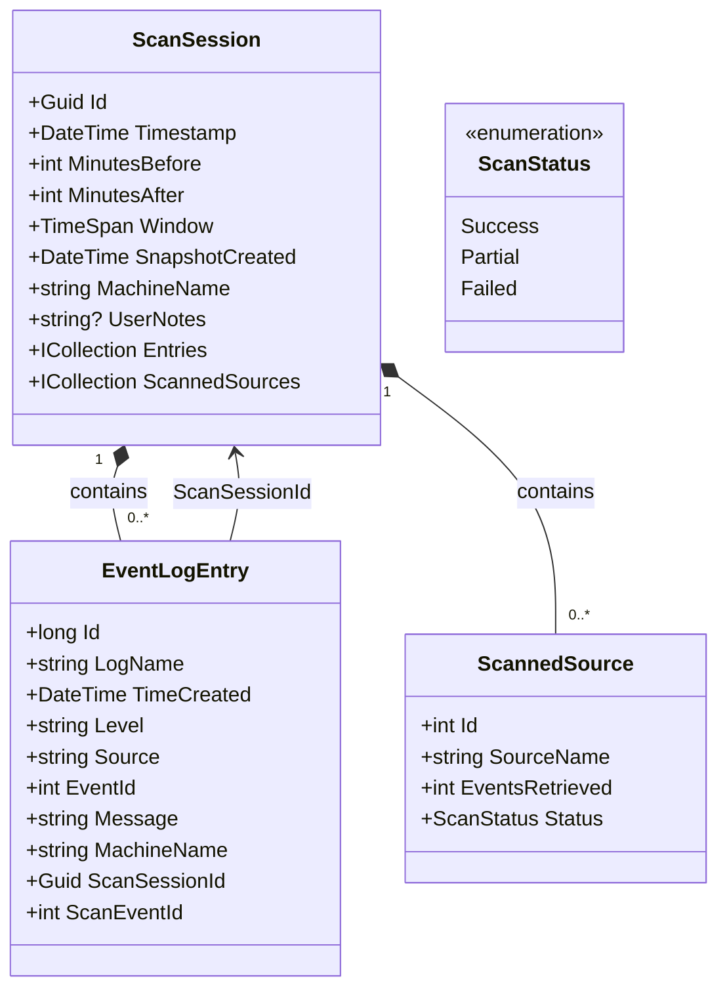
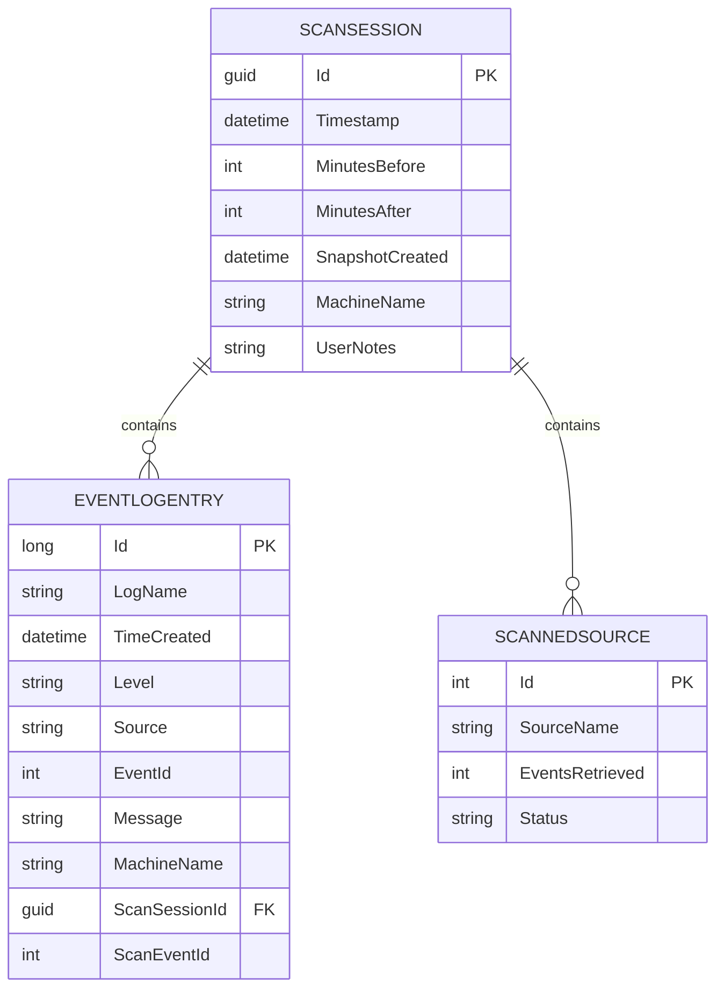
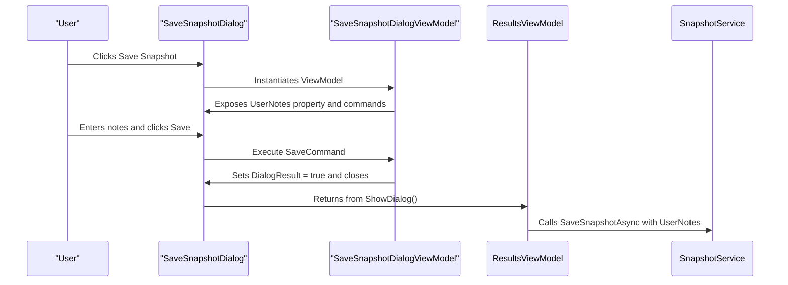
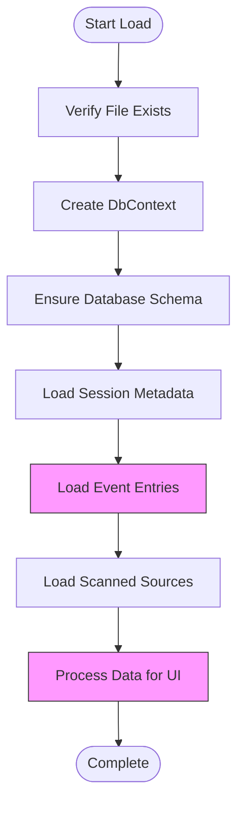

# Portable Snapshot Creation and Management


## Table of Contents
1. [Introduction](#introduction)
2. [Core Data Structures](#core-data-structures)
3. [SnapshotService Implementation](#snapshotservice-implementation)
4. [EF Core Context and Schema Design](#ef-core-context-and-schema-design)
5. [ResultsViewModel Integration](#resultsviewmodel-integration)
6. [SaveSnapshotDialogViewModel and User Input](#savesnapshotdialogviewmodel-and-user-input)
7. [File Format and Portability](#file-format-and-portability)
8. [Error Handling and Data Integrity](#error-handling-and-data-integrity)
9. [Performance Characteristics](#performance-characteristics)
10. [Conclusion](#conclusion)

## Introduction
Portable Snapshot Creation and Management is a core feature of Project Janus, enabling users to save and load event log analysis sessions for later review or collaborative investigation. The system uses Entity Framework Core with SQLite to serialize scan session data into self-contained `.janus` files. This document details the architecture, implementation, and usage patterns of this functionality, focusing on the `SnapshotService`, its integration with view models, and the underlying data model.

**Section sources**
- [SnapshotService.cs](file://Janus.App/Services/SnapshotService.cs#L1-L80)
- [EventSnapshotDbContext.cs](file://Janus.Core/EventSnapshotDbContext.cs#L1-L26)

## Core Data Structures

The snapshot system is built around several core data structures defined in the `Janus.Core` project. These classes represent the domain model for event log analysis sessions and are directly mapped to database tables by EF Core.

### ScanSession
The `ScanSession` class is the root entity that represents a complete scan operation. It contains metadata about the scan and collections of related data.





**Diagram sources**
- [ScanSession.cs](file://Janus.Core/ScanSession.cs#L1-L36)
- [EventLogEntry.cs](file://Janus.Core/EventLogEntry.cs#L1-L19)
- [ScannedSource.cs](file://Janus.Core/ScannedSource.cs#L1-L14)

**Section sources**
- [ScanSession.cs](file://Janus.Core/ScanSession.cs#L1-L36)
- [EventLogEntry.cs](file://Janus.Core/EventLogEntry.cs#L1-L19)
- [ScannedSource.cs](file://Janus.Core/ScannedSource.cs#L1-L14)

## SnapshotService Implementation

The `SnapshotService` class provides static methods for saving and loading snapshot files. It acts as an abstraction layer between the application logic and the EF Core persistence mechanism.

### SaveSnapshotAsync Method
The `SaveSnapshotAsync` method serializes a `ScanSession` object to a `.janus` file using SQLite as the storage engine.


```csharp
public static async Task SaveSnapshotAsync(string filePath, ScanSession session) {
    try {
        DbContextOptions<EventSnapshotDbContext> options = CreateOptions(filePath);
        await using var db = new EventSnapshotDbContext(options);
        await db.Database.EnsureCreatedAsync();
        db.ScanSessions.Add(new ScanSession {
            Id = session.Id,
            Timestamp = session.Timestamp,
            MinutesBefore = session.MinutesBefore,
            MinutesAfter = session.MinutesAfter,
            SnapshotCreated = session.SnapshotCreated,
            MachineName = session.MachineName,
            UserNotes = session.UserNotes,
            Entries = session.Entries,
            ScannedSources = session.ScannedSources
        });
        await db.SaveChangesAsync();
    } catch (SqliteException ex) {
        throw new InvalidOperationException("Failed to save snapshot.", ex);
    }
}
```


The method follows these steps:
1. Creates a database context with the specified file path
2. Ensures the database schema exists (creates it if necessary)
3. Adds the scan session and its related entities to the context
4. Saves all changes to the database file

### LoadSnapshotAsync Method
The `LoadSnapshotAsync` method deserializes a `ScanSession` from a `.janus` file.


```csharp
public static async Task<ScanSession?> LoadSnapshotAsync(string filePath) {
    try {
        DbContextOptions<EventSnapshotDbContext> options = CreateOptions(filePath);
        await using var db = new EventSnapshotDbContext(options);
        await db.Database.EnsureCreatedAsync();
        ScanSession? res = await db.ScanSessions
            .AsSplitQuery()
            .Include(s => s.Entries)
            .Include(s => s.ScannedSources)
            .FirstOrDefaultAsync();
        return res;
    } catch (SqliteException ex) {
        throw new InvalidOperationException("Failed to load snapshot.", ex);
    }
}
```


Key aspects of the loading process:
- Uses `Include` to eagerly load related `Entries` and `ScannedSources`
- Uses `AsSplitQuery()` to improve performance when loading large datasets
- Returns `null` if no session is found in the file

### LoadSnapshotMetadataAsync Method
This method provides a lightweight way to read snapshot metadata without loading all event entries.


```csharp
public static async Task<(ScanSession?, int?)> LoadSnapshotMetadataAsync(string filePath) {
    try {
        DbContextOptions<EventSnapshotDbContext> options = CreateOptions(filePath);
        await using var db = new EventSnapshotDbContext(options);
        await db.Database.EnsureCreatedAsync();
        var res = await db.ScanSessions
            .Include(s => s.ScannedSources)
            .Select(s => new {
                Session = s,
                s.Entries.Count
            }).FirstOrDefaultAsync();

        return (res?.Session, res?.Count);
    } catch (SqliteException ex) {
        throw new InvalidOperationException("Failed to load snapshot metadata.", ex);
    }
}
```


This method is used by the `WelcomeViewModel` to display recent snapshots with their metadata and event counts without loading the full dataset.

**Section sources**
- [SnapshotService.cs](file://Janus.App/Services/SnapshotService.cs#L1-L80)

## EF Core Context and Schema Design

The `EventSnapshotDbContext` class defines the database context and schema configuration for snapshot files.





**Diagram sources**
- [EventSnapshotDbContext.cs](file://Janus.Core/EventSnapshotDbContext.cs#L1-L26)
- [ScanSession.cs](file://Janus.Core/ScanSession.cs#L1-L36)
- [EventLogEntry.cs](file://Janus.Core/EventLogEntry.cs#L1-L19)
- [ScannedSource.cs](file://Janus.Core/ScannedSource.cs#L1-L14)

**Section sources**
- [EventSnapshotDbContext.cs](file://Janus.Core/EventSnapshotDbContext.cs#L1-L26)

### Schema Configuration
The context configures two key relationships:
- **Cascade Delete**: When a `ScanSession` is deleted, all related `ScannedSource` entries are automatically removed
- **Enum Conversion**: The `ScanStatus` enum is stored as a string in the database for better readability

The project follows a "No Migrations" rule as specified in `GEMINI.md`, meaning schema changes are handled by `EnsureCreatedAsync()` rather than EF Core migrations. This treats snapshot files as immutable documents.

## ResultsViewModel Integration

The `ResultsViewModel` class integrates snapshot functionality into the application's user interface, providing commands for saving and loading snapshots.

### SaveSnapshotAsync Implementation
The `SaveSnapshotAsync` method in `ResultsViewModel` orchestrates the snapshot saving process:


```csharp
private async Task SaveSnapshotAsync() {
    var dialog = new SaveSnapshotDialog();
    if (dialog.ShowDialog() == true) {
        var vm = (SaveSnapshotDialogViewModel)dialog.DataContext;
        string? defaultFileName = null;
        if (Metadata != null) {
            string iso = Metadata.Timestamp.ToUniversalTime().ToString("yyyy-MM-ddTHH-mm-ssZ");
            defaultFileName = $"JanusSnapshot_{iso}.janus";
        }
        var saveFileDialog = new SaveFileDialog {
            Filter = "Janus Snapshot (*.janus)|*.janus",
            DefaultExt = "janus",
            FileName = defaultFileName
        };
        if (saveFileDialog.ShowDialog() == true && Metadata is not null) {
            string? filePath = saveFileDialog.FileName;
            if (File.Exists(filePath)) {
                try {
                    File.Delete(filePath);
                } catch (Exception ex) {
                    MessageBox.Show($"Failed to delete existing file: {ex.Message}", "Error", MessageBoxButton.OK, MessageBoxImage.Error);
                    return;
                }
            }
            var updatedSession = new ScanSession {
                Id = Metadata.Id,
                Timestamp = Metadata.Timestamp,
                MinutesBefore = Metadata.MinutesBefore,
                MinutesAfter = Metadata.MinutesAfter,
                SnapshotCreated = DateTime.UtcNow,
                MachineName = Metadata.MachineName,
                UserNotes = vm.UserNotes,
                Entries = Metadata.Entries,
                ScannedSources = Metadata.ScannedSources
            };
            await SnapshotService.SaveSnapshotAsync(filePath, updatedSession);
            await UserUiSettingsService.AddRecentSnapshotAsync(filePath);
            MessageBox.Show($"Snapshot saved successfully at: {filePath}.",
                "Success", MessageBoxButton.OK, MessageBoxImage.Information);

            SetMetadata(updatedSession, filePath);
            SnapshotFilePath = filePath;
            CanSaveSnapshot = false;
        }
    }
}
```


The process involves:
1. Showing the `SaveSnapshotDialog` to collect user notes
2. Presenting a file save dialog with a timestamp-based default filename
3. Deleting any existing file at the target path
4. Creating an updated `ScanSession` with current timestamp and user notes
5. Saving the snapshot using `SnapshotService`
6. Adding the file to recent snapshots list
7. Updating the UI state

### Loading Snapshots
The `WelcomeViewModel` handles loading snapshots through the `OpenSnapshotFileAsync` method, which uses `SnapshotService.LoadSnapshotAsync` to retrieve the full session data and populate a new `ResultsViewModel`.

**Section sources**
- [ResultsViewModel.cs](file://Janus.App/ViewModels/ResultsViewModel.cs#L1-L565)
- [WelcomeViewModel.cs](file://Janus.App/ViewModels/WelcomeViewModel.cs#L1-L150)

## SaveSnapshotDialogViewModel and User Input

The `SaveSnapshotDialogViewModel` manages the user interface for collecting metadata when saving a snapshot.





**Diagram sources**
- [SaveSnapshotDialogViewModel.cs](file://Janus.App/ViewModels/SaveSnapshotDialogViewModel.cs#L1-L28)
- [SaveSnapshotDialog.xaml.cs](file://Janus.App/Resources/SaveSnapshotDialog.xaml.cs#L1-L10)
- [ResultsViewModel.cs](file://Janus.App/ViewModels/ResultsViewModel.cs#L483-L548)

**Section sources**
- [SaveSnapshotDialogViewModel.cs](file://Janus.App/ViewModels/SaveSnapshotDialogViewModel.cs#L1-L28)

The view model is simple, containing:
- **UserNotes**: A string property for user-entered comments
- **SaveCommand**: Executes when the user clicks Save, closing the dialog with `DialogResult = true`
- **CancelCommand**: Executes when the user clicks Cancel, closing the dialog with `DialogResult = false`

The `SaveSnapshotDialog` view sets its `DataContext` to a new instance of `SaveSnapshotDialogViewModel`, establishing the MVVM pattern.

## File Format and Portability

### .janus File Structure
The `.janus` file is a SQLite database with the following structure:


```
janus_file.sqlite
├── ScanSessions (table)
│   ├── Id (GUID)
│   ├── Timestamp (DATETIME)
│   ├── MinutesBefore (INTEGER)
│   ├── MinutesAfter (INTEGER)
│   ├── SnapshotCreated (DATETIME)
│   ├── MachineName (TEXT)
│   └── UserNotes (TEXT)
├── EventLogEntries (table)
│   ├── Id (INTEGER)
│   ├── LogName (TEXT)
│   ├── TimeCreated (DATETIME)
│   ├── Level (TEXT)
│   ├── Source (TEXT)
│   ├── EventId (INTEGER)
│   ├── Message (TEXT)
│   ├── MachineName (TEXT)
│   ├── ScanSessionId (GUID)
│   └── ScanEventId (INTEGER)
└── ScannedSources (table)
    ├── Id (INTEGER)
    ├── SourceName (TEXT)
    ├── EventsRetrieved (INTEGER)
    └── Status (TEXT)
```


### Portability Benefits
The self-contained nature of `.janus` files provides several advantages:
- **Easy Sharing**: Files can be emailed or transferred via cloud storage for collaborative investigations
- **Version Independence**: As long as the schema is compatible, snapshots can be opened on different versions of Project Janus
- **Data Integrity**: SQLite provides ACID transactions, ensuring data consistency
- **Cross-Platform**: SQLite files can be read on any platform with SQLite support

### Encryption Considerations
The current implementation does not include encryption for `.janus` files. This means:
- **No Built-in Security**: Sensitive event log data is stored in plain text within the SQLite database
- **External Protection**: Users must rely on filesystem permissions or external encryption tools (like BitLocker or encrypted ZIP files) to protect sensitive snapshots
- **Future Enhancement**: Encryption could be added by using SQLite cipher extensions or encrypting the entire file stream

**Section sources**
- [SnapshotService.cs](file://Janus.App/Services/SnapshotService.cs#L1-L80)
- [EventSnapshotDbContext.cs](file://Janus.Core/EventSnapshotDbContext.cs#L1-L26)

## Error Handling and Data Integrity

The snapshot system implements robust error handling to maintain data integrity.

### Exception Handling
Both save and load operations wrap database access in `try-catch` blocks that handle `SqliteException`:


```csharp
catch (SqliteException ex) {
    throw new InvalidOperationException("Failed to save snapshot.", ex);
}
```


This approach:
- **Detects Schema Mismatches**: If a snapshot was created with a different schema version, SQLite will throw an exception
- **Handles File Corruption**: Corrupted database files will generate SQLite errors
- **Provides User-Friendly Messages**: The generic `InvalidOperationException` with a clear message is presented to users

### Data Integrity Checks
The system ensures data integrity through several mechanisms:
- **EF Core Validation**: Required properties are enforced by the `required` keyword
- **Database Constraints**: SQLite enforces referential integrity
- **File Replacement**: Existing files are deleted before saving to prevent partial writes
- **Atomic Operations**: EF Core transactions ensure that either all data is saved or none is

### Versioning Considerations
The system handles versioning implicitly:
- **Forward Compatibility**: Newer versions can read snapshots from older versions if the schema is backward compatible
- **Backward Compatibility**: Older versions cannot read snapshots from newer versions due to potential schema changes
- **Schema Evolution**: When the data model changes, the `EnsureCreatedAsync()` method will create the new schema, but existing snapshots with the old schema will fail to load

**Section sources**
- [SnapshotService.cs](file://Janus.App/Services/SnapshotService.cs#L1-L80)
- [GEMINI.md](file://GEMINI.md#L1-L54)

## Performance Characteristics

### Loading Large Snapshots
The performance of loading snapshots depends on several factors:





**Diagram sources**
- [SnapshotService.cs](file://Janus.App/Services/SnapshotService.cs#L32-L78)
- [ResultsViewModel.cs](file://Janus.App/ViewModels/ResultsViewModel.cs#L1-L565)

**Section sources**
- [SnapshotService.cs](file://Janus.App/Services/SnapshotService.cs#L1-L80)
- [ResultsViewModel.cs](file://Janus.App/ViewModels/ResultsViewModel.cs#L1-L565)

Key performance characteristics:
- **Memory Usage**: Entire snapshot is loaded into memory, so large snapshots require significant RAM
- **Loading Time**: Scales linearly with the number of event entries
- **Optimization**: Use of `AsSplitQuery()` prevents Cartesian explosion when loading related data
- **UI Responsiveness**: The operation is asynchronous, preventing UI blocking

### Optimization Recommendations
For optimal performance with large datasets:
- **Use Metadata Loading**: Use `LoadSnapshotMetadataAsync` when only session information is needed
- **Implement Pagination**: Consider adding pagination for very large event sets
- **Indexing**: SQLite automatically indexes primary keys, but additional indexes could be added if query patterns change
- **Compression**: Future versions could implement compression for the SQLite file

## Conclusion
The Portable Snapshot system in Project Janus provides a robust mechanism for saving and sharing event log analysis sessions. By leveraging EF Core with SQLite, it creates self-contained `.janus` files that encapsulate all scan data and metadata. The implementation follows a clean separation of concerns, with the `SnapshotService` handling persistence, view models managing UI integration, and well-defined data models representing the domain. While the current implementation prioritizes simplicity and portability over security (lacking encryption), it provides a solid foundation for collaborative investigations and offline analysis. The error handling strategy and use of modern C# features demonstrate a well-architected approach to data persistence in a desktop application context.

**Section sources**
- [SnapshotService.cs](file://Janus.App/Services/SnapshotService.cs#L1-L80)
- [EventSnapshotDbContext.cs](file://Janus.Core/EventSnapshotDbContext.cs#L1-L26)
- [ScanSession.cs](file://Janus.Core/ScanSession.cs#L1-L36)
- [ResultsViewModel.cs](file://Janus.App/ViewModels/ResultsViewModel.cs#L1-L565)
- [SaveSnapshotDialogViewModel.cs](file://Janus.App/ViewModels/SaveSnapshotDialogViewModel.cs#L1-L28)

**Referenced Files in This Document**   
- [SnapshotService.cs](file://Janus.App/Services/SnapshotService.cs)
- [EventSnapshotDbContext.cs](file://Janus.Core/EventSnapshotDbContext.cs)
- [ScanSession.cs](file://Janus.Core/ScanSession.cs)
- [ResultsViewModel.cs](file://Janus.App/ViewModels/ResultsViewModel.cs)
- [SaveSnapshotDialogViewModel.cs](file://Janus.App/ViewModels/SaveSnapshotDialogViewModel.cs)
- [EventLogEntry.cs](file://Janus.Core/EventLogEntry.cs)
- [ScannedSource.cs](file://Janus.Core/ScannedSource.cs)