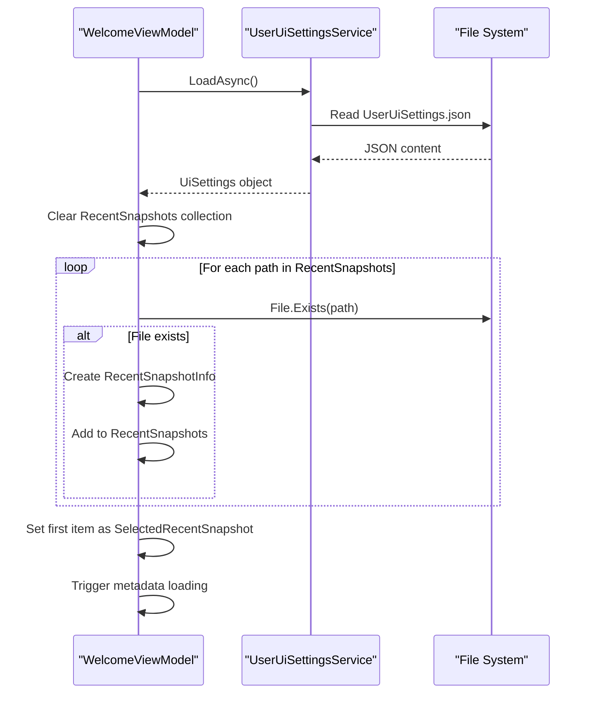
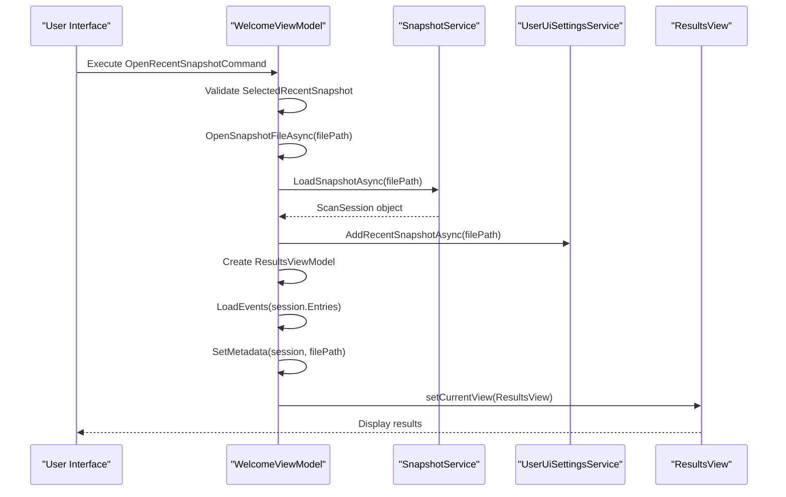

# Recent Snapshots Management


## Table of Contents
1. [Introduction](#introduction)
2. [Recent Snapshots Persistence Mechanism](#recent-snapshots-persistence-mechanism)
3. [Loading and Displaying Recent Snapshots](#loading-and-displaying-recent-snapshots)
4. [Opening Recent Snapshots](#opening-recent-snapshots)
5. [Integration with ResultsViewModel](#integration-with-resultsviewmodel)
6. [Recent Items Limit and Cleanup](#recent-items-limit-and-cleanup)
7. [Workflow Efficiency Benefits](#workflow-efficiency-benefits)
8. [Snapshot Storage and Backup Guidance](#snapshot-storage-and-backup-guidance)

## Introduction
The Recent Snapshots Management feature in Project Janus enables analysts to quickly access previously analyzed investigation data through a persistent list of recently opened snapshot files. This functionality enhances workflow continuity by eliminating the need to manually locate snapshot files each time the application starts. The system automatically tracks snapshot usage, maintains metadata, and provides immediate access to prior investigations directly from the welcome screen.

**Section sources**
- [WelcomeViewModel.cs](file://d:/devel/Project Janus/Janus.App/ViewModels/WelcomeViewModel.cs#L1-L20)
- [UserUiSettingsService.cs](file://d:/devel/Project Janus/Janus.App/Services/UserUiSettingsService.cs#L1-L15)

## Recent Snapshots Persistence Mechanism

The persistence of recent snapshot paths and associated metadata is managed by the `UserUiSettingsService` class, which handles reading and writing user interface settings to a JSON configuration file named `UserUiSettings.json`. This file is stored in the application's base directory, ensuring settings persist across application restarts.

The `UiSettings` class within `UserUiSettingsService` contains a `RecentSnapshots` property, which is implemented as a `List<string>` storing file paths of recently opened snapshots. When a new snapshot is accessed, its path is added to this list through the `AddRecentSnapshotAsync` method.


```mermaid
classDiagram
class UserUiSettingsService {
+static string SettingsFileName
+static string SettingsFilePath
+static SemaphoreSlim fileLock
+static UserUiSettingsService Instance
+static Task<UiSettings> LoadAsync()
+static Task SaveAsync(UiSettings settings)
+static Task AddRecentSnapshotAsync(string filePath)
}
class UserUiSettingsService$UiSettings {
+int MinutesBefore
+int MinutesAfter
+double MainWindowWidth
+double MainWindowHeight
+double ResultsSplitterPosition
+double DetailsSplitterPosition
+List<string> RecentSnapshots
}
UserUiSettingsService --> UserUiSettingsService$UiSettings : "contains"
```


**Diagram sources**
- [UserUiSettingsService.cs](file://d:/devel/Project Janus/Janus.App/Services/UserUiSettingsService.cs#L1-L65)

The `AddRecentSnapshotAsync` method implements the following logic:
- Loads current settings from `UserUiSettings.json`
- Removes any existing instance of the provided file path (deduplication)
- Inserts the new path at the beginning of the list (MRU order)
- Trims the list to a maximum of 10 entries
- Saves the updated settings back to disk

A `SemaphoreSlim` ensures thread-safe file access during read/write operations, preventing race conditions when multiple operations might occur simultaneously.

**Section sources**
- [UserUiSettingsService.cs](file://d:/devel/Project Janus/Janus.App/Services/UserUiSettingsService.cs#L20-L65)

## Loading and Displaying Recent Snapshots

The `WelcomeViewModel` is responsible for loading and displaying the list of recent snapshots when the application starts. During initialization, it calls `LoadRecentSnapshotsAsync` to populate the UI with valid recent snapshot entries.





**Diagram sources**
- [WelcomeViewModel.cs](file://d:/devel/Project Janus/Janus.App/ViewModels/WelcomeViewModel.cs#L90-L107)

The `LoadRecentSnapshotsAsync` method performs the following steps:
- Retrieves the current `UiSettings` from `UserUiSettingsService`
- Clears the existing `RecentSnapshots` observable collection
- Iterates through the stored snapshot paths, filtering out non-existent files
- Creates `RecentSnapshotInfo` objects for valid paths and adds them to the collection
- Sets the first valid snapshot as the default selection

The `RecentSnapshotInfo` class extends `INotifyPropertyChanged` and provides additional properties for data binding, including:
- `FilePath`: Full path to the snapshot file
- `FileName`: Extracted file name for display
- `MetadataSession`: Loaded scan session metadata
- `MetadataEventCount`: Number of events in the snapshot
- `Error`: Any loading error message

**Section sources**
- [WelcomeViewModel.cs](file://d:/devel/Project Janus/Janus.App/ViewModels/WelcomeViewModel.cs#L14-L24)
- [WelcomeViewModel.cs](file://d:/devel/Project Janus/Janus.App/ViewModels/WelcomeViewModel.cs#L90-L107)

## Opening Recent Snapshots

Users can open recent snapshots through the welcome screen interface by selecting an entry from the recent snapshots list and clicking the "Open" button. The `OpenRecentSnapshotCommand` is bound to the `OpenRecentSnapshotAsync` method, which handles the opening process.





**Diagram sources**
- [WelcomeViewModel.cs](file://d:/devel/Project Janus/Janus.App/ViewModels/WelcomeViewModel.cs#L64-L89)

The opening process includes:
- Validating that a snapshot is selected
- Loading the snapshot data via `SnapshotService.LoadSnapshotAsync`
- Adding the opened snapshot back to the recent list (updating its position)
- Creating a new `ResultsViewModel` with the loaded data
- Navigating to the results view to display the snapshot contents

Automatic metadata loading occurs when a snapshot is selected in the list, providing immediate information about the snapshot's contents without requiring the user to open it.

**Section sources**
- [WelcomeViewModel.cs](file://d:/devel/Project Janus/Janus.App/ViewModels/WelcomeViewModel.cs#L64-L89)
- [WelcomeViewModel.cs](file://d:/devel/Project Janus/Janus.App/ViewModels/WelcomeViewModel.cs#L115-L142)

## Integration with ResultsViewModel

The `ResultsViewModel` integrates with the recent snapshots system in two key ways: when saving new snapshots and when persisting UI state.

When a user saves a snapshot through the `SaveSnapshotAsync` method in `ResultsViewModel`, the newly saved file path is automatically added to the recent snapshots list via `UserUiSettingsService.AddRecentSnapshotAsync`. This ensures that newly created snapshots immediately appear in the recent list upon the next application launch.


```csharp
await UserUiSettingsService.AddRecentSnapshotAsync(filePath);
```


This call occurs after successful snapshot serialization, guaranteeing that only successfully saved snapshots are added to the history.

Additionally, `ResultsViewModel` interacts with `UserUiSettingsService` to persist UI layout preferences such as splitter positions, which are stored alongside the recent snapshots in the same configuration file. This creates a cohesive user experience where both navigation history and interface layout are preserved between sessions.

**Section sources**
- [ResultsViewModel.cs](file://d:/devel/Project Janus/Janus.App/ViewModels/ResultsViewModel.cs#L530-L531)
- [ResultsViewModel.cs](file://d:/devel/Project Janus/Janus.App/ViewModels/ResultsViewModel.cs#L542-L549)

## Recent Items Limit and Cleanup

The recent snapshots system implements automatic management of the history list through two mechanisms: size limiting and invalid entry cleanup.

The maximum number of recent snapshots is hardcoded to 10 entries. This limit is enforced in the `AddRecentSnapshotAsync` method:


```csharp
while (settings.RecentSnapshots.Count > 10) {
    settings.RecentSnapshots.RemoveAt(settings.RecentSnapshots.Count - 1);
}
```


This ensures the list never exceeds 10 items by removing the oldest entry (least recently used) when necessary.

Automatic cleanup of invalid entries occurs during the loading process in `WelcomeViewModel.LoadRecentSnapshotsAsync`. Before displaying any snapshot in the UI, the system verifies file existence:


```csharp
if (!File.Exists(path)) {
    continue;
}
```


This prevents broken links or missing files from appearing in the recent snapshots list. Only snapshots that currently exist on disk are loaded into the `RecentSnapshots` collection.

The combination of these mechanisms ensures the recent snapshots list remains:
- **Current**: Only existing files are shown
- **Manageable**: Limited to a reasonable number of entries
- **Accurate**: Reflects actual available data
- **Efficient**: Minimal performance impact from validation

**Section sources**
- [UserUiSettingsService.cs](file://d:/devel/Project Janus/Janus.App/Services/UserUiSettingsService.cs#L58-L60)
- [WelcomeViewModel.cs](file://d:/devel/Project Janus/Janus.App/ViewModels/WelcomeViewModel.cs#L95-L97)

## Workflow Efficiency Benefits

The Recent Snapshots Management feature significantly improves workflow efficiency for analysts conducting multiple related investigations. Consider the following scenarios:

**Scenario 1: Multi-Phase Investigation**
An analyst investigating a security incident opens a snapshot from the initial detection phase, analyzes the data, then needs to compare it with a follow-up collection. Instead of navigating through file dialogs, they can:
1. Return to the welcome screen
2. Select the second snapshot from the recent list
3. Begin analysis immediately

This reduces context switching time from minutes to seconds.

**Scenario 2: Daily Monitoring Routine**
A security operations analyst reviews system logs daily. Each day they:
- Open today's snapshot
- Compare findings with yesterday's data
- Reference a baseline from last week

With recent snapshots, all three files are accessible within two clicks from startup, creating a consistent and efficient workflow pattern.

**Scenario 3: Collaborative Analysis**
When multiple analysts work on the same case, they often share snapshot files. The recent list allows each analyst to:
- Quickly access newly received snapshots
- Maintain a personal history of their analysis path
- Switch between different team members' snapshots effortlessly

The metadata display (event count, timestamps) enables quick assessment of snapshot relevance without opening the file, further optimizing the selection process.

**Section sources**
- [WelcomeViewModel.cs](file://d:/devel/Project Janus/Janus.App/ViewModels/WelcomeViewModel.cs#L115-L142)
- [UserUiSettingsService.cs](file://d:/devel/Project Janus/Janus.App/Services/UserUiSettingsService.cs#L53-L60)

## Snapshot Storage and Backup Guidance

To maximize the effectiveness of the recent snapshots feature, analysts should follow recommended storage and backup practices.

**Storage Location Recommendations:**
- Use a dedicated directory for all Janus snapshots
- Avoid temporary or system directories
- Ensure adequate disk space for long-term retention
- Consider using network-attached storage for team access

**Backup Strategies:**
- Implement regular backups of the snapshot directory
- Include `UserUiSettings.json` in backups to preserve recent history
- Use versioning to maintain historical snapshots
- Consider cloud storage with version control for critical investigations

**File Management Best Practices:**
- Use descriptive naming conventions when saving snapshots
- Organize snapshots in dated subdirectories
- Regularly archive completed investigations
- Maintain a separate backup of `UserUiSettings.json` before major system changes

The `UserUiSettings.json` file should be treated as part of the user's profile data. When migrating to a new machine or reinstalling the application, copying this file preserves the recent snapshots history along with other UI preferences.

Example `UserUiSettings.json` structure:

```json
{
  "MinutesBefore": 5,
  "MinutesAfter": 5,
  "MainWindowWidth": 900,
  "MainWindowHeight": 400,
  "ResultsSplitterPosition": 0.5,
  "DetailsSplitterPosition": 0.33,
  "RecentSnapshots": [
    "C:\\Investigations\\Incident2025\\Phase1.janus",
    "C:\\Investigations\\Incident2025\\Baseline.janus"
  ]
}
```


**Section sources**
- [UserUiSettings.json](file://d:/devel/Project Janus/Janus.App/bin/Debug/net9.0-windows/UserUiSettings.json#L1-L1)
- [UserUiSettingsService.cs](file://d:/devel/Project Janus/Janus.App/Services/UserUiSettingsService.cs#L2-L5)

**Referenced Files in This Document**   
- [UserUiSettingsService.cs](file://d:/devel/Project Janus/Janus.App/Services/UserUiSettingsService.cs)
- [WelcomeViewModel.cs](file://d:/devel/Project Janus/Janus.App/ViewModels/WelcomeViewModel.cs)
- [ResultsViewModel.cs](file://d:/devel/Project Janus/Janus.App/ViewModels/ResultsViewModel.cs)
- [UserUiSettings.json](file://d:/devel/Project Janus/Janus.App/bin/Debug/net9.0-windows/UserUiSettings.json)