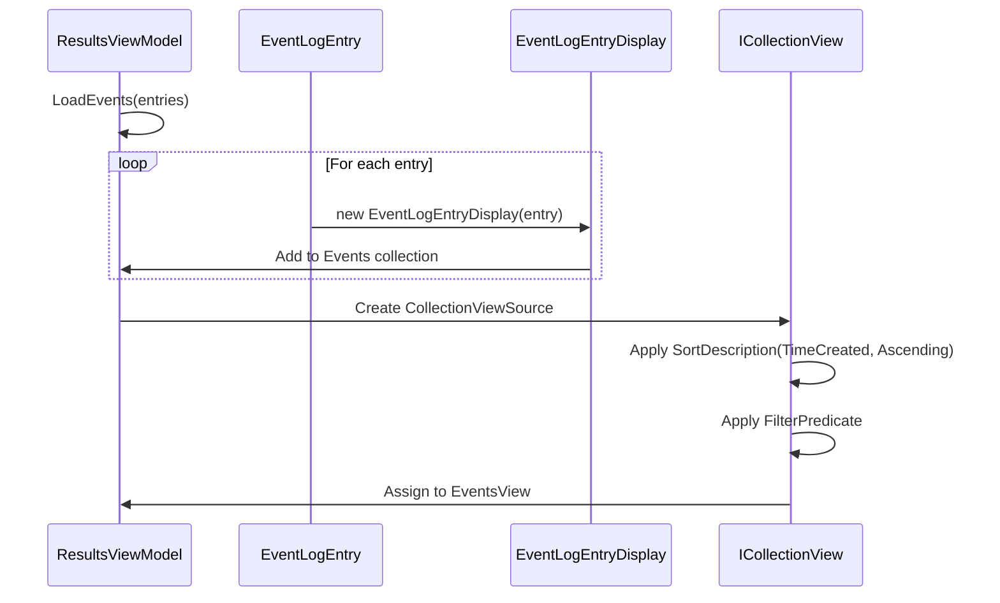
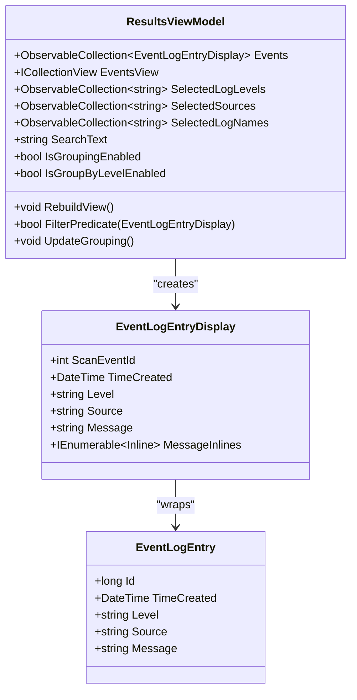
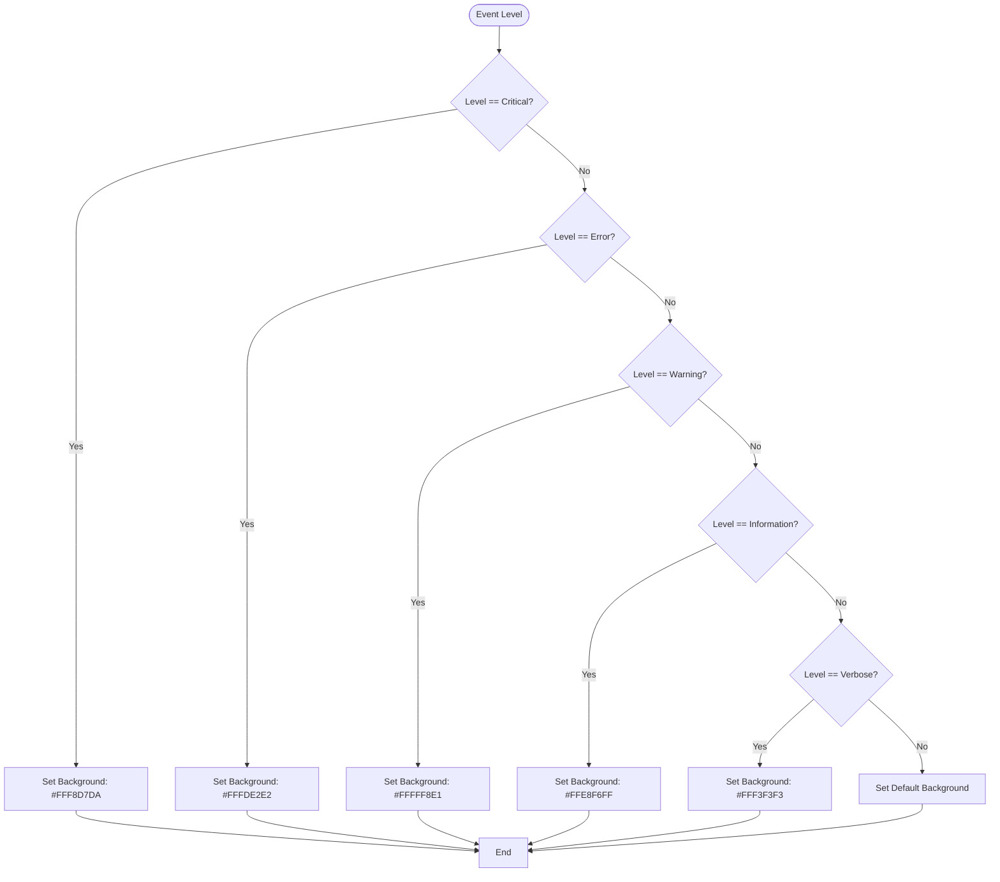
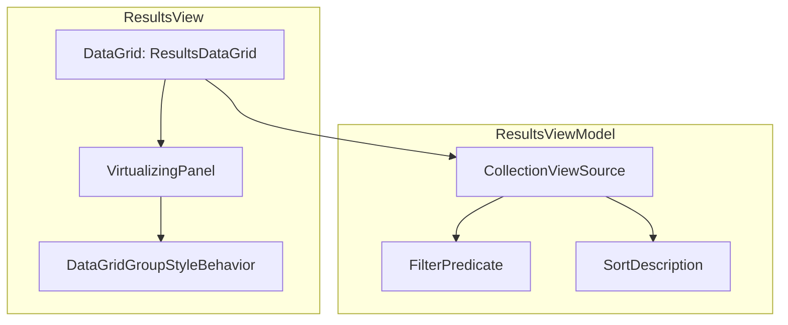
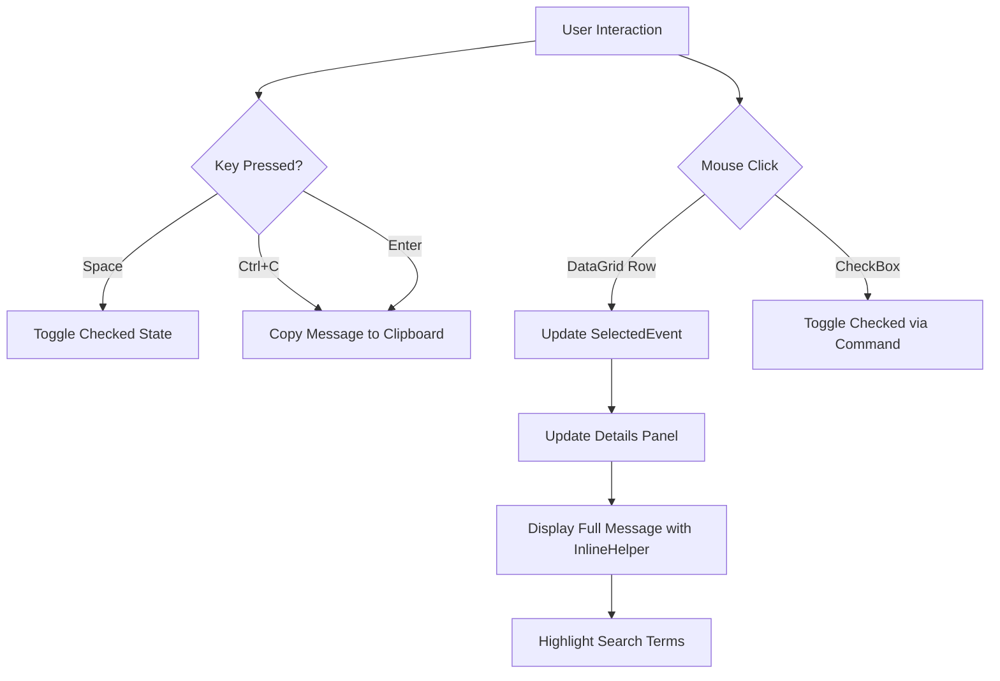

# Chronological Results Display

## Table of Contents
1. [Chronological Results Display](#chronological-results-display)
2. [Event Aggregation and Sorting](#event-aggregation-and-sorting)
3. [Grouping and Filtering Mechanisms](#grouping-and-filtering-mechanisms)
4. [Severity-Based Color Coding](#severity-based-color-coding)
5. [DataGrid Presentation and Virtualization](#datagrid-presentation-and-virtualization)
6. [User Interaction and Analysis Features](#user-interaction-and-analysis-features)
7. [Performance Optimizations](#performance-optimizations)

## Event Aggregation and Sorting

The **ResultsViewModel** class is responsible for aggregating and sorting all scanned **EventLogEntry** instances into a unified chronological timeline. It maintains a collection of **EventLogEntryDisplay** objects, which wrap the core **EventLogEntry** model and enhance it with UI-specific properties and behaviors.

When log entries are loaded via the **LoadEvents** method, the view model clears its internal **Events** collection and populates it with new **EventLogEntryDisplay** instances. Each **EventLogEntryDisplay** retains a reference to the original **EventLogEntry** and provides computed properties such as **TimeCreatedIso**, which formats the timestamp in ISO 8601 with microsecond precision for consistent display.

The chronological sorting is implemented using WPF's **ICollectionView** interface. The **EventsView** property, of type **ICollectionView**, is bound to the DataGrid in the UI. After loading events or applying filters, the **RebuildView** method creates a new **CollectionViewSource** and applies a **SortDescription** that sorts entries by **TimeCreated** in ascending order (oldest first). This ensures that events are displayed in strict chronological sequence.

**Diagram sources**
- [ResultsViewModel.cs](file://Janus.App/ViewModels/ResultsViewModel.cs#L300-L350)
- [EventLogEntry.cs](file://Janus.Core/EventLogEntry.cs#L10-L18)

**Section sources**
- [ResultsViewModel.cs](file://Janus.App/ViewModels/ResultsViewModel.cs#L250-L350)

## Grouping and Filtering Mechanisms

The ResultsViewModel provides robust filtering and grouping capabilities to help analysts navigate large datasets. Filtering is applied through three primary dimensions: **Log Level**, **Source**, and **Log Name**. Users can select multiple values in each category, and the view model dynamically updates the event count for each filter option using **Func<object, int>** delegates like **LogLevelCountProvider**.

The **FilterPredicate** method evaluates each **EventLogEntryDisplay** against the current filter state, including:
- Selected log levels
- Selected sources
- Selected log names
- Text search in the message field
- Optional visibility of only checked items

A key optimization is the **RebuildView** method, which creates a completely new **CollectionViewSource** when filters change. This forces the DataGrid to reset its visual container pool, ensuring accurate rendering after significant data changes.

For grouping, users can choose between "Group by Log" and "Group by Level". The **UpdateGrouping** method clears existing **GroupDescriptions** and adds a new **PropertyGroupDescription** based on the active grouping mode. The **IsAnyGroupingEnabled** property combines both grouping states and drives the visibility of group headers in the UI.

**Diagram sources**
- [ResultsViewModel.cs](file://Janus.App/ViewModels/ResultsViewModel.cs#L79-L150)
- [ResultsViewModel.cs](file://Janus.App/ViewModels/ResultsViewModel.cs#L17-L73)

**Section sources**
- [ResultsViewModel.cs](file://Janus.App/ViewModels/ResultsViewModel.cs#L150-L250)

## Severity-Based Color Coding

Events are color-coded by severity level using a combination of **DataGrid.RowStyle** triggers and the **ScanStatusToBrushConverter**. Although the converter is primarily used for scan status indicators, the core principle of value-to-brush conversion is mirrored in the DataGrid's styling.

The **DataGrid.RowStyle** in **ResultsView.xaml** defines background colors for each severity level through **DataTrigger** rules:
- **Critical**: Light red (`#FFF8D7DA`)
- **Error**: Pale red (`#FFFDE2E2`)
- **Warning**: Light yellow (`#FFFFF8E1`)
- **Information**: Light blue (`#FFE8F6FF`)
- **Verbose**: Light gray (`#FFF3F3F3`)

This visual hierarchy allows analysts to quickly identify high-severity events in the timeline. The **ScanStatusToBrushConverter** itself converts **ScanStatus** enum values (Success, Partial, Failed) to SolidColorBrush instances (Green, Orange, Red), demonstrating the same pattern used for status indicators in the scanned sources list.

**Diagram sources**
- [ResultsView.xaml](file://Janus.App/Views/ResultsView.xaml#L200-L240)
- [ScanStatusToBrushConverter.cs](file://Janus.App/Helpers/ScanStatusToBrushConverter.cs#L5-L20)

**Section sources**
- [ResultsView.xaml](file://Janus.App/Views/ResultsView.xaml#L200-L240)

## DataGrid Presentation and Virtualization

The **ResultsView** presents events using a WPF **DataGrid** with extensive virtualization for performance on large datasets. The **ResultsDataGrid** is configured with the following performance-critical settings:

- **EnableRowVirtualization="True"**: Only renders visible rows
- **EnableColumnVirtualization="True"**: Only renders visible columns
- **VirtualizingPanel.IsVirtualizing="True"**: Enables UI virtualization
- **VirtualizingPanel.VirtualizationMode="Recycling"**: Reuses row containers for maximum efficiency

The DataGrid is bound to the **EventsView** property of the **ResultsViewModel**, which provides filtered and sorted access to the underlying data. Columns include:
- A checkbox column for item selection (using **ScanIdCheckedMultiConverter**)
- Sequential **ScanEventId**
- ISO-formatted **TimeCreatedIso**
- Log, Level, Source, and EventId
- A **Message** column that displays only the first line (using **FirstLineConverter**)

The **DataGridGroupStyleBehavior** is attached via XAML behaviors to dynamically apply grouping visuals when enabled. This custom behavior listens to the **IsEnabled** property and adds or removes the **GroupStyle** from the DataGrid's **GroupStyle** collection.

**Diagram sources**
- [ResultsView.xaml](file://Janus.App/Views/ResultsView.xaml#L240-L300)
- [DataGridGroupStyleBehaviour.cs](file://Janus.App/Helpers/DataGridGroupStyleBehaviour.cs#L10-L50)

**Section sources**
- [ResultsView.xaml](file://Janus.App/Views/ResultsView.xaml#L240-L300)
- [ResultsView.xaml.cs](file://Janus.App/Views/ResultsView.xaml.cs#L10-L20)

## User Interaction and Analysis Features

The ResultsView provides several features to support event pattern analysis and data export:

- **Double-click to view details**: Selecting an event in the DataGrid displays its full details in the lower panel, including the complete multi-line message with search term highlighting.
- **Search term highlighting**: The **MessageInlines** property in **EventLogEntryDisplay** splits the message into **Run** elements, highlighting any text matching the current **SearchText** in yellow.
- **Copy-to-clipboard**: The **CopyMessageCommand** copies the full message of the selected event to the clipboard (Ctrl+C).
- **CSV export**: Although not detailed in the provided code, the **SaveSnapshotCommand** saves the entire session in a proprietary format, which could be extended to support CSV export.
- **Keyboard navigation**: The grid supports Space to toggle row selection, Enter to copy, and standard navigation.

Analysts can identify patterns by:
1. Using the **SearchText** field to find events containing specific keywords
2. Filtering by **Source** or **Log Name** to isolate events from specific systems
3. Grouping by **Level** to assess overall system health
4. Reviewing the chronological sequence to trace event chains

**Diagram sources**
- [ResultsView.xaml.cs](file://Janus.App/Views/ResultsView.xaml.cs#L25-L50)
- [ResultsViewModel.cs](file://Janus.App/ViewModels/ResultsViewModel.cs#L500-L520)
- [ResultsViewModel.cs](file://Janus.App/ViewModels/ResultsViewModel.cs#L17-L73)

**Section sources**
- [ResultsView.xaml.cs](file://Janus.App/Views/ResultsView.xaml.cs#L25-L50)
- [ResultsViewModel.cs](file://Janus.App/ViewModels/ResultsViewModel.cs#L500-L520)

## Performance Optimizations

The implementation includes several performance optimizations:

- **Virtualization**: Row and column virtualization with recycling mode minimizes memory usage and rendering overhead.
- **Debounced UI updates**: The **debounceTimer** in **ResultsViewModel** delays saving UI settings (splitter positions) until 500ms after the last change, preventing excessive disk I/O.
- **Efficient data binding**: The **RebuildView** method creates a new **ICollectionView** instance, which forces the DataGrid to refresh completely but ensures consistency after complex filter changes.
- **Lazy property evaluation**: Properties like **MessageInlines** are computed only when accessed, and only re-evaluated when the **SearchText** changes.
- **HashSet for checked items**: The **checkedScanEventIds** is a **HashSet<int>**, enabling O(1) lookup performance for the **ShowOnlyChecked** filter.

The **FirstLineConverter** ensures that only the first line of each message is displayed in the grid, reducing text measurement and layout costs. Full message details are loaded only when an event is selected, implementing a lazy loading pattern for detailed content.

**Section sources**
- [ResultsViewModel.cs](file://Janus.App/ViewModels/ResultsViewModel.cs#L79-L122)
- [ResultsViewModel.cs](file://Janus.App/ViewModels/ResultsViewModel.cs#L300-L350)
- [FirstLineConverter.cs](file://Janus.App/Helpers/FirstLineConverter.cs#L5-L20)

**Referenced Files in This Document**   
- [ResultsViewModel.cs](file://Janus.App/ViewModels/ResultsViewModel.cs)
- [ResultsView.xaml](file://Janus.App/Views/ResultsView.xaml)
- [ResultsView.xaml.cs](file://Janus.App/Views/ResultsView.xaml.cs)
- [EventLogEntry.cs](file://Janus.Core/EventLogEntry.cs)
- [ScanStatusToBrushConverter.cs](file://Janus.App/Helpers/ScanStatusToBrushConverter.cs)
- [DataGridGroupStyleBehaviour.cs](file://Janus.App/Helpers/DataGridGroupStyleBehaviour.cs)
- [ScanIdCheckedMultiConverter.cs](file://Janus.App/Helpers/ScanIdCheckedMultiConverter.cs)
- [FirstLineConverter.cs](file://Janus.App/Helpers/FirstLineConverter.cs)