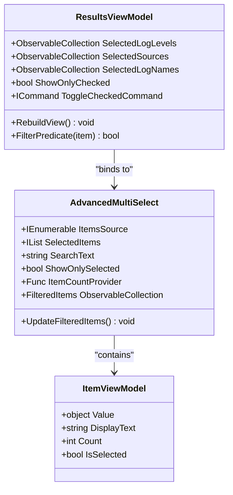
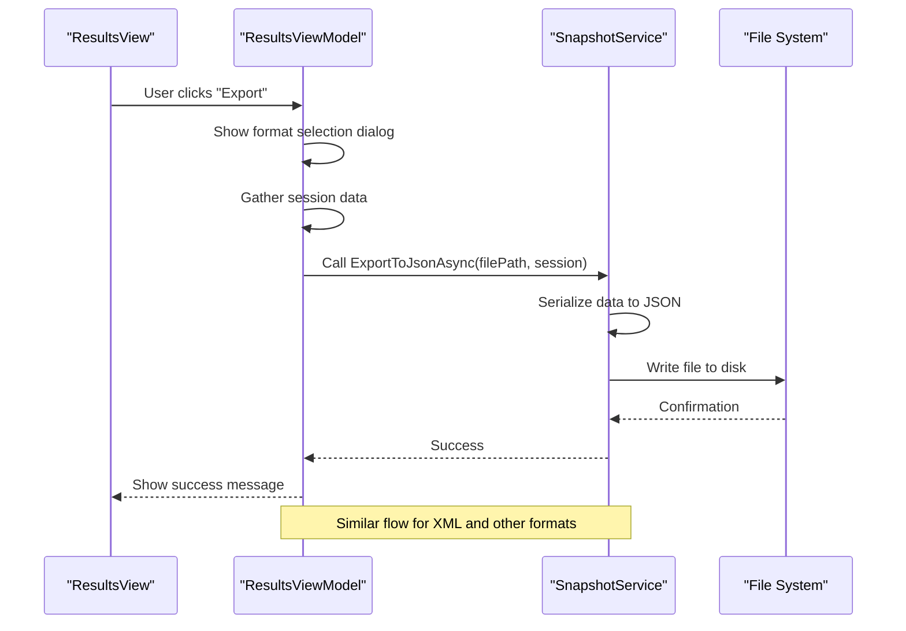
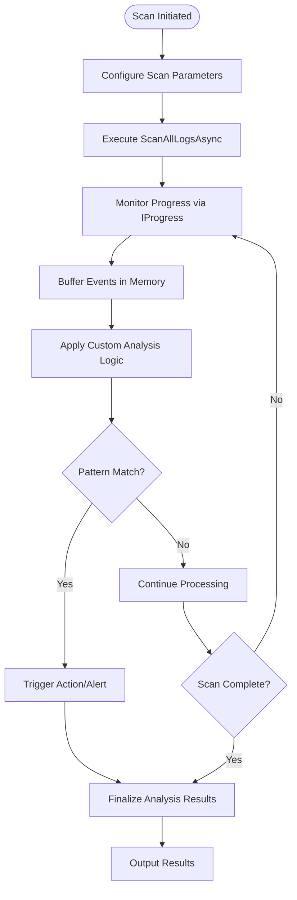
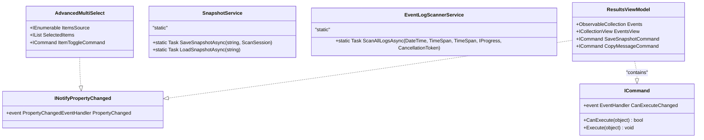

# Extensibility


## Table of Contents
1. [Introduction](#introduction)
2. [Extending Filtering Logic](#extending-filtering-logic)
3. [Adding New Export Formats](#adding-new-export-formats)
4. [Creating Plugin-Style Custom Analyzers](#creating-plugin-style-custom-analyzers)
5. [Injecting Custom Analysis Logic](#injecting-custom-analysis-logic)
6. [Interface Contracts and Extension Points](#interface-contracts-and-extension-points)
7. [Versioning and Backward Compatibility](#versioning-and-backward-compatibility)

## Introduction
Project Janus is designed with extensibility in mind, allowing developers to enhance its core functionality through well-defined extension points. This document provides comprehensive guidance on extending the application's filtering, export, and analysis capabilities while adhering to the project's MVVM architecture and modern C# practices. The system leverages configuration-driven rules, service-oriented design, and reactive view models to enable flexible customization without compromising stability.

## Extending Filtering Logic

Project Janus implements a robust filtering system centered around the `ResultsViewModel` class, which manages event log data presentation and user interaction. The filtering architecture is built on WPF's `ICollectionView` interface, enabling dynamic filtering, sorting, and grouping of event data.

The `ResultsViewModel` exposes three primary filter collections:
- **SelectedLogLevels**: Filters events by severity level (Critical, Error, Warning, etc.)
- **SelectedSources**: Filters by event source (e.g., "Kernel-PnP", "MyApp.exe")
- **SelectedLogNames**: Filters by Windows Event Log name (e.g., "System", "Application")

These collections are bound to `AdvancedMultiSelect` controls in the UI, which provide a rich filtering interface with search, selection toggling, and item counting capabilities.

To implement a new filter type, developers must extend the filtering logic in `ResultsViewModel` and integrate with the `AdvancedMultiSelect` control. The process involves:

1. Adding a new filter property to `ResultsViewModel`
2. Implementing the corresponding filter collection
3. Updating the `FilterPredicate` method to include the new filter condition
4. Creating a count provider for cross-filtering statistics
5. Exposing the filter through data binding in the view

The `RebuildView` method serves as the central mechanism for applying all filters. It creates a new `CollectionViewSource`, applies the composite filter predicate, and refreshes the UI-bound `EventsView`. This approach ensures that all filters are applied atomically and efficiently.





**Diagram sources**
- [ResultsViewModel.cs](file://Janus.App/ViewModels/ResultsViewModel.cs#L100-L400)
- [AdvancedMultiSelect.xaml.cs](file://Janus.App/Controls/AdvancedMultiSelect.xaml.cs#L0-L177)

**Section sources**
- [ResultsViewModel.cs](file://Janus.App/ViewModels/ResultsViewModel.cs#L100-L400)
- [AdvancedMultiSelect.xaml.cs](file://Janus.App/Controls/AdvancedMultiSelect.xaml.cs#L0-L177)

## Adding New Export Formats

The export functionality in Project Janus is primarily managed by the `SnapshotService` class, which handles saving and loading event log snapshots in the proprietary `.janus` format. The current implementation uses SQLite as the underlying storage engine with Entity Framework Core for data persistence.

To extend the export capabilities with new formats such as JSON or XML, developers should enhance both the `ResultsViewModel` and `SnapshotService` classes. The `ResultsViewModel` contains the `SaveSnapshotAsync` method, which orchestrates the export process, while `SnapshotService` provides the core serialization logic.

The recommended approach for adding new export formats involves:

1. Extending the `SnapshotService` with format-specific static methods
2. Modifying the `SaveSnapshotAsync` command in `ResultsViewModel` to support multiple format options
3. Updating the file dialog filter to include new format extensions
4. Implementing format-specific serialization logic

For JSON export, the implementation would leverage .NET's built-in JSON serialization capabilities:


```csharp
public static async Task ExportToJsonAsync(string filePath, ScanSession session)
{
    var jsonOptions = new JsonSerializerOptions 
    { 
        WriteIndented = true,
        PropertyNamingPolicy = JsonNamingPolicy.CamelCase
    };
    
    var exportModel = new {
        session.Id,
        session.Timestamp,
        session.MinutesBefore,
        session.MinutesAfter,
        session.SnapshotCreated,
        session.MachineName,
        session.UserNotes,
        Entries = session.Entries.Select(e => new {
            e.Id,
            e.LogName,
            e.TimeCreated,
            e.Level,
            e.Source,
            e.EventId,
            e.Message,
            e.MachineName,
            e.ScanEventId
        }),
        ScannedSources = session.ScannedSources
    };
    
    string json = JsonSerializer.Serialize(exportModel, jsonOptions);
    await File.WriteAllTextAsync(filePath, json);
}
```


Similarly, for XML export, the implementation would use `XmlSerializer`:


```csharp
public static async Task ExportToXmlAsync(string filePath, ScanSession session)
{
    var serializer = new XmlSerializer(typeof(ScanSession));
    using var writer = new StreamWriter(filePath);
    await Task.Run(() => serializer.Serialize(writer, session));
}
```


The `ResultsViewModel` would then be updated to present format options to the user and route the export request accordingly.





**Diagram sources**
- [ResultsViewModel.cs](file://Janus.App/ViewModels/ResultsViewModel.cs#L483-L516)
- [SnapshotService.cs](file://Janus.App/Services/SnapshotService.cs#L0-L80)

**Section sources**
- [ResultsViewModel.cs](file://Janus.App/ViewModels/ResultsViewModel.cs#L483-L516)
- [SnapshotService.cs](file://Janus.App/Services/SnapshotService.cs#L0-L80)

## Creating Plugin-Style Custom Analyzers

Project Janus supports plugin-style custom analyzers through the `janus.ai.rules.yml` configuration file, which defines the project's architectural rules and extension points. This YAML-based configuration schema enables declarative definition of analysis rules, pattern matching, and action triggers without requiring code modifications.

The configuration file structure includes several key sections for defining custom analyzers:

- **project**: Basic project metadata
- **documentation**: References to documentation files
- **stack**: Technology stack specifications
- **architecture_rules**: Non-negotiable architectural constraints
- **database_rules**: Persistence layer rules
- **ux_philosophy**: User experience guidelines

To create a custom analyzer, developers define rules within the appropriate section of the configuration file. Each rule consists of:
- **rule**: A descriptive name for the rule
- **description**: Detailed explanation of the rule's purpose and implementation requirements

For example, to implement a custom security analyzer that flags specific event patterns:


```yaml
custom_analyzers:
  - rule: "Security Event Correlation"
    description: >
      Identifies potential security incidents by correlating multiple event types.
      Triggers alerts when specific patterns are detected across different log sources.
    pattern: 
      sequence: 
        - logName: "Security"
          eventId: 4624
          level: "Information"
        - logName: "System"
          eventId: 7045
          level: "Information"
          timeWindow: "5 minutes"
    action: "generate_security_alert"
    severity: "High"
```


The system would then process this configuration at runtime, creating analyzer instances that monitor the event stream for the specified patterns. When a match is detected, the defined action is triggered, which could include generating alerts, creating reports, or invoking external services.

The configuration-driven approach provides several advantages:
- **No recompilation required**: Rules can be modified without rebuilding the application
- **Version control friendly**: Configuration files can be tracked in source control
- **Environment specific**: Different rule sets can be deployed to different environments
- **User modifiable**: Power users can customize analysis rules without developer assistance

## Injecting Custom Analysis Logic

The `EventLogScannerService` class provides the foundation for injecting custom analysis logic post-scan. This service is responsible for retrieving event logs from the Windows Event Log system and processing them around a specified timestamp.

The primary entry point for custom analysis is the `ScanAllLogsAsync` method, which accepts several parameters that enable extension:

- **progress**: An `IProgress<SourceScanProgress>` for reporting scan status
- **cancellationToken**: A `CancellationToken` for supporting operation cancellation
- **perSourceProgress**: Progress reporting for individual log sources

To inject custom analysis logic, developers can implement the `IProgress<T>` interface to receive notifications during and after the scanning process. This allows for real-time analysis as events are retrieved, rather than waiting for the complete scan to finish.

A custom analysis provider might be implemented as follows:


```csharp
public class CustomAnalysisProvider : IProgress<SourceScanProgress>
{
    private readonly Action<IEnumerable<EventLogEntry>> analysisCallback;
    private readonly List<EventLogEntry> buffer = [];
    private readonly TimeSpan flushInterval = TimeSpan.FromSeconds(10);
    private DateTime lastFlush = DateTime.UtcNow;

    public CustomAnalysisProvider(Action<IEnumerable<EventLogEntry>> callback)
    {
        analysisCallback = callback;
    }

    public void Report(SourceScanProgress value)
    {
        // Process completed sources
        if (!value.IsActive && value.Status == ScanStatus.Success)
        {
            PerformAnalysisOnSource(value.SourceName);
        }
        
        // Periodic buffer flush
        if (DateTime.UtcNow - lastFlush > flushInterval)
        {
            FlushBuffer();
        }
    }
    
    private void PerformAnalysisOnSource(string sourceName)
    {
        // Custom analysis logic here
        var suspiciousEvents = buffer.Where(e => 
            e.LogName == sourceName && 
            IsSuspiciousPattern(e));
            
        if (suspiciousEvents.Any())
        {
            analysisCallback(suspiciousEvents);
        }
    }
    
    private void FlushBuffer()
    {
        if (buffer.Count > 0)
        {
            analysisCallback(buffer.ToList());
            buffer.Clear();
            lastFlush = DateTime.UtcNow;
        }
    }
    
    private bool IsSuspiciousPattern(EventLogEntry entry)
    {
        // Custom pattern matching logic
        return entry.Message.Contains("failed", StringComparison.OrdinalIgnoreCase) &&
               entry.Message.Contains("login", StringComparison.OrdinalIgnoreCase);
    }
}
```


This approach enables developers to implement sophisticated analysis pipelines that can:
- Correlate events across multiple log sources
- Apply machine learning models to event data
- Generate real-time alerts and notifications
- Create summary statistics and reports
- Integrate with external monitoring systems

The use of `IProgress<T>` ensures that custom analysis logic is properly integrated into the existing asynchronous workflow without blocking the UI thread.





**Diagram sources**
- [EventLogScannerService.cs](file://Janus.App/Services/EventLogScannerService.cs#L0-L161)

**Section sources**
- [EventLogScannerService.cs](file://Janus.App/Services/EventLogScannerService.cs#L0-L161)

## Interface Contracts and Extension Points

Project Janus follows a strict MVVM architecture with well-defined interface contracts and extension points. The system's extensibility is built on several key architectural principles outlined in the `janus.ai.rules.yml` configuration file.

The primary extension points within the MVVM architecture are:

### ViewModels as Extension Hubs
The `ResultsViewModel` serves as the central extension point for both filtering and export functionality. It implements `INotifyPropertyChanged` and exposes commands through `ICommand` interfaces, providing a consistent pattern for extending behavior.

Key extension contracts in `ResultsViewModel`:
- **Commands**: `ICommand` properties for user actions
- **ObservableCollections**: For dynamic data binding
- **INotifyPropertyChanged**: For reactive UI updates
- **Func delegates**: For cross-filtering count providers

### Services as Pluggable Components
The service layer provides several pluggable components:
- **SnapshotService**: Static methods for data persistence
- **EventLogScannerService**: Async methods for data acquisition
- **UserUiSettingsService**: For user preference management

These services follow the dependency injection pattern, allowing for easy replacement or extension of functionality.

### Controls as Reusable Components
The `AdvancedMultiSelect` control demonstrates a reusable UI component with well-defined dependency properties:
- **ItemsSource**: Input data collection
- **SelectedItems**: Two-way bound selection
- **ItemCountProvider**: Delegate for dynamic counts
- **Commands**: For user interactions

This component-based architecture enables consistent UI patterns across the application while allowing for customization through data binding and delegates.

The architectural rules enforce several critical contracts:
- **Strict MVVM Pattern**: Views contain only binding and layout
- **Async Everywhere**: All I/O operations are asynchronous
- **Separation of Concerns**: Clear boundaries between Core and App projects
- **Modern C#**: Aggressive use of modern language features

These contracts ensure that extensions maintain code quality and consistency with the existing codebase.





**Diagram sources**
- [ResultsViewModel.cs](file://Janus.App/ViewModels/ResultsViewModel.cs#L0-L565)
- [SnapshotService.cs](file://Janus.App/Services/SnapshotService.cs#L0-L80)
- [EventLogScannerService.cs](file://Janus.App/Services/EventLogScannerService.cs#L0-L161)
- [AdvancedMultiSelect.xaml.cs](file://Janus.App/Controls/AdvancedMultiSelect.xaml.cs#L0-L177)

**Section sources**
- [janus.ai.rules.yml](file://janus.ai.rules.yml#L0-L119)
- [ResultsViewModel.cs](file://Janus.App/ViewModels/ResultsViewModel.cs#L0-L565)

## Versioning and Backward Compatibility

When extending Project Janus' core services, versioning and backward compatibility are critical considerations. The system employs several strategies to maintain compatibility across updates:

### Database Schema Management
The `janus.ai.rules.yml` configuration explicitly prohibits the use of EF Core Migrations, instead relying on `EnsureCreatedAsync()` for schema creation. This approach has significant implications for versioning:

- **Snapshot files are immutable**: Once created, the schema is fixed
- **Forward compatibility only**: Newer versions can read older snapshots
- **Schema mismatch handling**: Graceful error handling when reading incompatible files

When extending the data model with new export formats, developers must ensure that:
- JSON and XML exports include version information
- Schema evolution is handled through optional properties
- Deserialization is resilient to missing fields

### API Evolution
The service layer uses static methods with clear parameter contracts, enabling safe evolution:


```csharp
// Original method
public static async Task SaveSnapshotAsync(string filePath, ScanSession session)

// Extended with optional parameters
public static async Task SaveSnapshotAsync(string filePath, ScanSession session, ExportOptions? options = null)
```


This pattern allows for backward-compatible additions without breaking existing callers.

### Configuration Versioning
The `janus.ai.rules.yml` file should include a version field to track schema changes:


```yaml
version: "1.0"
project:
  name: "Project Janus"
  # ... other configuration
```


When introducing breaking changes to the configuration schema, the version number should be incremented, and the application should provide clear error messages when loading incompatible configurations.

### Assembly Versioning
The project uses `ThisAssembly.AssemblyInformationalVersion` for display purposes, which should follow semantic versioning principles:
- **Major version**: Breaking changes to extension points
- **Minor version**: New extension capabilities
- **Patch version**: Bug fixes and non-breaking improvements

Developers extending the system should verify compatibility with the target version range and provide appropriate fallbacks when necessary.

**Section sources**
- [janus.ai.rules.yml](file://janus.ai.rules.yml#L0-L119)
- [SnapshotService.cs](file://Janus.App/Services/SnapshotService.cs#L0-L80)

**Referenced Files in This Document**   
- [janus.ai.rules.yml](file://janus.ai.rules.yml)
- [ResultsViewModel.cs](file://Janus.App/ViewModels/ResultsViewModel.cs)
- [SnapshotService.cs](file://Janus.App/Services/SnapshotService.cs)
- [EventLogScannerService.cs](file://Janus.App/Services/EventLogScannerService.cs)
- [AdvancedMultiSelect.xaml.cs](file://Janus.App/Controls/AdvancedMultiSelect.xaml.cs)