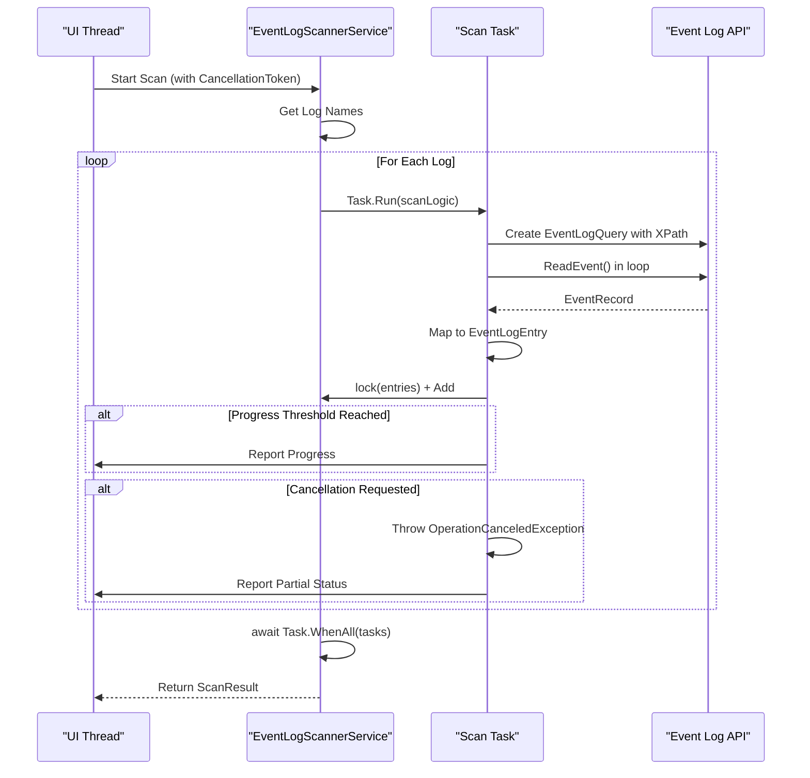
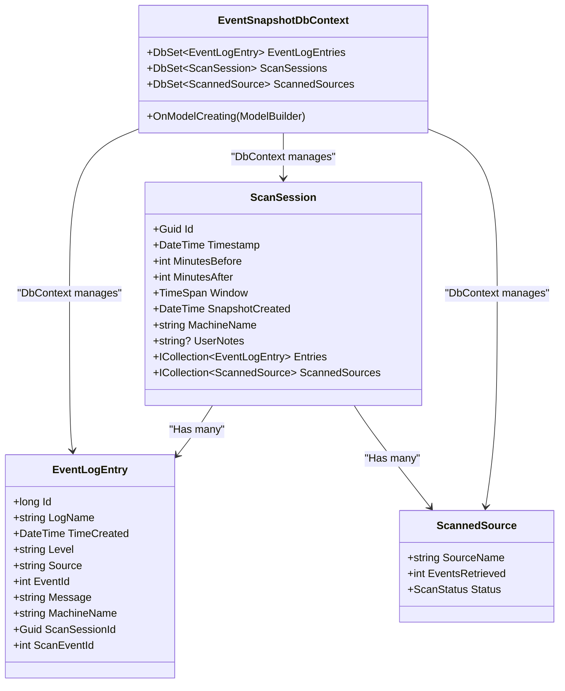
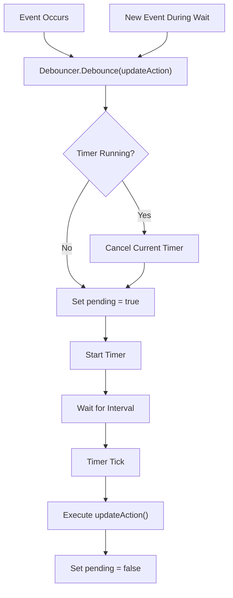

# Performance Optimization


## Table of Contents
1. [Introduction](#introduction)
2. [Parallel Scanning with Task.Run and Cancellation](#parallel-scanning-with-taskrun-and-cancellation)
3. [Memory Management During Snapshot Operations](#memory-management-during-snapshot-operations)
4. [Database Performance Considerations](#database-performance-considerations)
5. [Real-Time Progress Updates and Debouncing](#real-time-progress-updates-and-debouncing)
6. [Benchmarking and Profiling Guidance](#benchmarking-and-profiling-guidance)
7. [Best Practices for Large-Scale Event Data Handling](#best-practices-for-large-scale-event-data-handling)

## Introduction
This document provides a comprehensive analysis of performance optimization techniques in Project Janus, focusing on efficient handling of large-scale Windows event log data. The system is designed to scan, analyze, and persist event logs around critical timestamps, requiring careful resource management to maintain responsiveness and scalability. Key components include parallel scanning, memory-efficient snapshot operations, database performance tuning, and UI responsiveness strategies. This guide details the implementation patterns used across the codebase and offers best practices for optimizing performance when dealing with multi-gigabyte datasets.

## Parallel Scanning with Task.Run and Cancellation

Project Janus employs a parallel scanning strategy in the `EventLogScannerService` to efficiently retrieve event logs from multiple sources simultaneously. The `ScanAllLogsAsync` method orchestrates this process by launching a separate `Task.Run` for each event log, enabling concurrent execution across available CPU cores.

The scanning process begins by retrieving all available log names via `EventLogSession.GlobalSession.GetLogNames()`. For each log, a new task is created using `Task.Run`, which executes the scanning logic independently. This design maximizes I/O throughput by allowing multiple event logs to be read in parallel, significantly reducing total scan time compared to sequential processing.

Each scanning task uses an `EventLogQuery` with an XPath filter to retrieve events within a specified time window:

```csharp
string xpath = $"*[System[TimeCreated[@SystemTime>='{from:O}' and @SystemTime<='{to:O}']]]";
```

This filter is applied directly at the Windows Event Log API level, minimizing data transfer and processing overhead.

To ensure efficient resource utilization and responsiveness, the implementation respects `CancellationToken`. The token is checked at two critical points:
1. Before initiating a scan for each log
2. Within the event reading loop via `cancellationToken.ThrowIfCancellationRequested()`

When cancellation is requested, the operation throws an `OperationCanceledException`, which is caught and handled gracefully by setting the scan status to `Partial` and reporting final progress. This allows users to stop long-running scans without crashing the application.

Thread safety is maintained using `lock` statements when accessing shared collections (`entries` and `scannedSources`). The `ScanEventId` counter uses `Interlocked.Increment` to ensure atomic updates across threads.





**Diagram sources**
- [EventLogScannerService.cs](file://Janus.App/Services/EventLogScannerService.cs#L31-L159)

**Section sources**
- [EventLogScannerService.cs](file://Janus.App/Services/EventLogScannerService.cs#L31-L159)

## Memory Management During Snapshot Operations

The `SnapshotService` class implements memory-conscious strategies for handling large event datasets during save and load operations. Given that event snapshots can reach multi-gigabyte sizes, the service avoids loading entire datasets into memory unnecessarily.

When saving snapshots, the service uses EF Core's change tracking and batched writes through `SaveChangesAsync()`. The `ScanSession` object passed to `SaveSnapshotAsync` contains collections of `EventLogEntry` and `ScannedSource` objects, which are persisted as related entities in SQLite.

For loading operations, the service provides multiple methods with different memory profiles:
- `LoadSnapshotAsync`: Loads the complete session with all entries using `.Include(s => s.Entries)`
- `LoadSnapshotMetadataAsync`: Loads only metadata and entry count, avoiding full event data retrieval

The metadata loading method uses a projection to minimize data transfer:

```csharp
.Select(s => new {
  Session = s,
  s.Entries.Count
})
```

This approach allows the UI to display snapshot information without loading potentially massive event collections into memory.

The service also implements proper disposal patterns using `await using var db = new EventSnapshotDbContext(options)`, ensuring database connections are released promptly. This is critical for preventing memory leaks during repeated snapshot operations.

While the current implementation loads all entries into memory when opening a snapshot, a streaming or pagination approach could be implemented for extremely large datasets by modifying the `ResultsViewModel` to load events incrementally.

**Section sources**
- [SnapshotService.cs](file://Janus.App/Services/SnapshotService.cs#L0-L79)

## Database Performance Considerations

### Indexing Strategies
The current implementation in `EventSnapshotDbContext.cs` does not explicitly define database indexes on `EventLogEntry` fields such as `Timestamp`, `Level`, or `Source`. However, these fields are natural candidates for indexing to optimize query performance:

- **Timestamp**: Critical for time-range queries around incident timestamps
- **Level**: Useful for filtering by severity (Error, Warning, etc.)
- **Source**: Important for filtering by event source/origin
- **LogName**: Essential for filtering by specific event logs

Although no explicit indexes are defined in `OnModelCreating`, EF Core will create primary key indexes automatically on `Id` fields. For optimal performance with large datasets, explicit index definitions should be added:


```csharp
modelBuilder.Entity<EventLogEntry>()
    .HasIndex(e => e.TimeCreated);
modelBuilder.Entity<EventLogEntry>()
    .HasIndex(e => e.Level);
modelBuilder.Entity<EventLogEntry>()
    .HasIndex(e => e.Source);
```


### Query Optimization in EF Core
The `SnapshotService` employs several EF Core optimization techniques:

1. **Split Queries**: The `LoadSnapshotAsync` method uses `.AsSplitQuery()` when including related data. This prevents the "cartesian explosion" problem by executing separate queries for the main entity and its collections, reducing memory usage and network overhead.

2. **Projection**: The `LoadSnapshotMetadataAsync` method uses `.Select()` to project only needed data, avoiding unnecessary data transfer.

3. **Eager Loading**: The use of `.Include()` ensures related data is loaded in a single operation, preventing N+1 query problems.

### Connection Pooling with SQLite
The application configures SQLite with connection pooling disabled:

```csharp
.UseSqlite($"Data Source={filePath};Pooling=false")
```

This configuration is appropriate for Project Janus because:
- Each snapshot is stored in a separate `.janus` file
- The application typically accesses one snapshot file at a time
- Connection pooling provides minimal benefit for single-file, single-user scenarios

Disabling pooling reduces complexity and potential file locking issues. For applications accessing a single shared database, enabling pooling would improve performance by reusing connections.





**Diagram sources**
- [EventSnapshotDbContext.cs](file://Janus.Core/EventSnapshotDbContext.cs#L0-L24)
- [EventLogEntry.cs](file://Janus.Core/EventLogEntry.cs#L0-L17)

**Section sources**
- [EventSnapshotDbContext.cs](file://Janus.Core/EventSnapshotDbContext.cs#L0-L24)
- [SnapshotService.cs](file://Janus.App/Services/SnapshotService.cs#L0-L79)

## Real-Time Progress Updates and Debouncing

Project Janus implements a sophisticated progress reporting system to keep the UI responsive during long-running scans. The `EventLogScannerService` reports progress for each individual log source through the `IProgress<SourceScanProgress>` parameter.

To prevent overwhelming the UI with too many updates, the service implements throttling based on two criteria:
1. **Event count threshold**: Updates reported every 250 events by default
2. **Time interval**: Updates reported every 250ms by default

This dual-threshold approach ensures users receive timely feedback without excessive UI updates that could degrade performance.

The `Debouncer` class provides an additional layer of optimization for UI updates. This service uses a `DispatcherTimer` to coalesce rapid-fire updates into a single execution:


```csharp
public sealed class Debouncer {
    private readonly DispatcherTimer timer;
    private Func<Task>? action;
    private bool pending;

    public Debouncer(TimeSpan interval) {
        timer = new DispatcherTimer { Interval = interval };
        timer.Tick += async (_, __) => {
            timer.Stop();
            if (pending && action is not null) {
                await action();
                pending = false;
            }
        };
    }

    public void Debounce(Func<Task> action) {
        this.action = action;
        pending = true;
        timer.Stop();
        timer.Start();
    }
}
```


When the UI needs to update (e.g., refreshing a progress bar), it calls `Debounce()` with the update action. If multiple calls occur within the timer interval, only the last one is executed. This prevents the UI thread from being flooded with update requests during high-frequency events like rapid event scanning.

The debouncing mechanism is particularly important for maintaining 60 FPS UI responsiveness, as excessive layout and rendering operations can easily overwhelm the dispatcher thread.





**Diagram sources**
- [Debouncer.cs](file://Janus.App/Services/Debouncer.cs#L0-L32)

**Section sources**
- [Debouncer.cs](file://Janus.App/Services/Debouncer.cs#L0-L32)
- [EventLogScannerService.cs](file://Janus.App/Services/EventLogScannerService.cs#L85-L119)

## Benchmarking and Profiling Guidance

To optimize performance for large-scale usage of Project Janus, follow these benchmarking and profiling best practices:

### Visual Studio Profiling Tools
1. **CPU Usage Tool**: Identify hot paths in the scanning process, particularly in `EventLogScannerService.ScanAllLogsAsync`
2. **Memory Usage Tool**: Monitor object allocation during snapshot operations, focusing on `EventLogEntry` instantiation
3. **Concurrency Visualizer**: Analyze thread utilization to ensure effective parallel scanning

### Performance Benchmarking Tips
- **Test with Real-World Data**: Use actual system event logs rather than synthetic data
- **Measure Cold vs. Warm Performance**: Include file system cache effects in measurements
- **Vary Time Window Sizes**: Test performance with different `before`/`after` durations
- **Monitor Memory Pressure**: Track working set size during large snapshot loads

### Code Examples for Optimization

**Batch Processing Pattern:**

```csharp
// Process events in batches to reduce UI update frequency
const int BATCH_SIZE = 1000;
var batch = new List<EventLogEntry>(BATCH_SIZE);

foreach (var record in reader) {
    var entry = MapEventRecord(record);
    batch.Add(entry);
    
    if (batch.Count >= BATCH_SIZE) {
        await ProcessBatchAsync(batch);
        batch.Clear();
    }
}

// Process remaining events
if (batch.Count > 0) {
    await ProcessBatchAsync(batch);
}
```


**Lazy Loading Pattern:**

```csharp
public class LazyEventLoader : IDisposable {
    private readonly string _snapshotPath;
    private EventSnapshotDbContext? _db;
    
    public async IAsyncEnumerable<EventLogEntry> LoadEventsAsync(
        DateTime? startTime = null, 
        DateTime? endTime = null,
        [EnumeratorCancellation] CancellationToken ct = default) {
        
        _db = new EventSnapshotDbContext(CreateOptions(_snapshotPath));
        var query = _db.EventLogEntries.AsAsyncEnumerable();
        
        if (startTime.HasValue) {
            query = query.Where(e => e.TimeCreated >= startTime.Value);
        }
        if (endTime.HasValue) {
            query = query.Where(e => e.TimeCreated <= endTime.Value);
        }
        
        await foreach (var entry in query.WithCancellation(ct)) {
            yield return entry;
        }
    }
    
    public void Dispose() => _db?.Dispose();
}
```


## Best Practices for Large-Scale Event Data Handling

1. **Use Appropriate Time Windows**: Limit scan duration to minimize data volume
2. **Implement Client-Side Filtering**: Allow users to filter results by level, source, or event ID
3. **Consider Data Archiving**: For historical analysis, archive old events to separate files
4. **Monitor System Resources**: Implement memory and CPU usage monitoring during scans
5. **Provide Progress Feedback**: Always inform users of operation status and estimated time
6. **Support Cancellation**: Ensure all long-running operations can be cancelled gracefully
7. **Optimize for SSDs**: Structure I/O patterns to leverage fast random access when available

By following these optimization techniques and best practices, Project Janus can efficiently handle multi-gigabyte event datasets while maintaining a responsive user interface and optimal resource utilization.

**Referenced Files in This Document**   
- [EventLogScannerService.cs](file://Janus.App/Services/EventLogScannerService.cs)
- [EventSnapshotDbContext.cs](file://Janus.Core/EventSnapshotDbContext.cs)
- [Debouncer.cs](file://Janus.App/Services/Debouncer.cs)
- [SnapshotService.cs](file://Janus.App/Services/SnapshotService.cs)
- [EventLogEntry.cs](file://Janus.Core/EventLogEntry.cs)