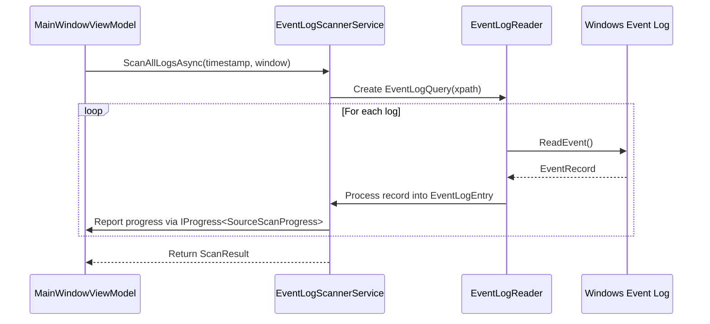
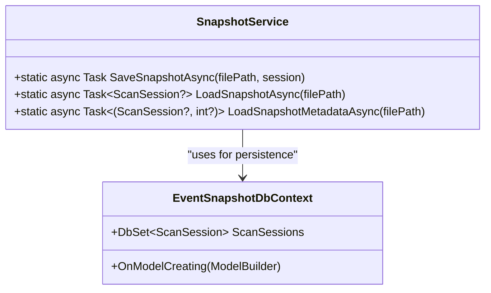
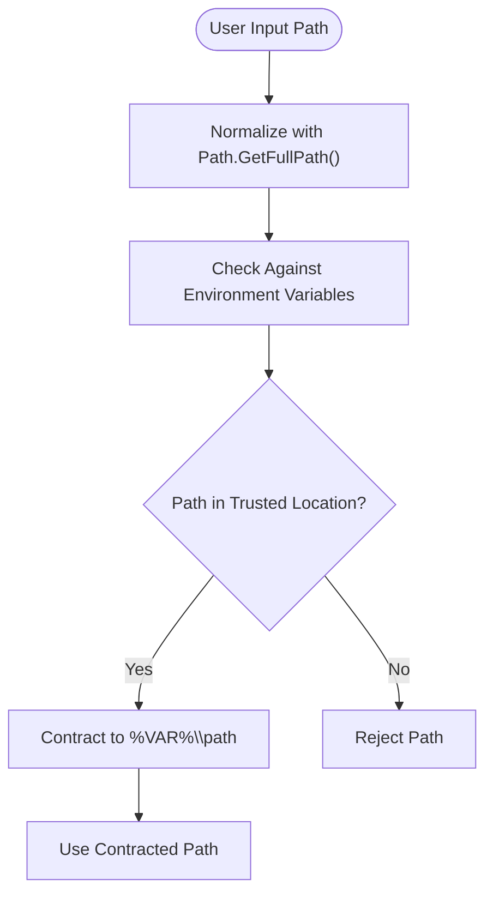
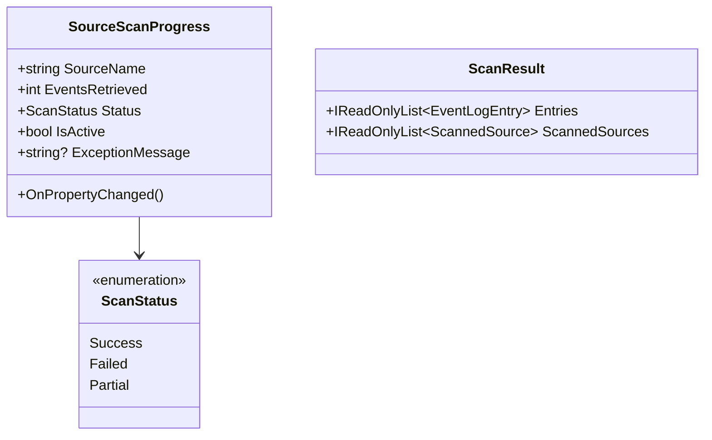

# Security Considerations


## Table of Contents
1. [Introduction](#introduction)
2. [Access to Sensitive Windows Event Logs](#access-to-sensitive-windows-event-logs)
3. [Security of Snapshot Files (.janus)](#security-of-snapshot-files-janus)
4. [Rule Engine Security (janus.ai.rules.yml)](#rule-engine-security-janusairulesyml)
5. [Secure Coding Practices](#secure-coding-practices)
6. [Audit Logging and Temporary Data Handling](#audit-logging-and-temporary-data-handling)
7. [Network Attack Surface and Social Engineering Risks](#network-attack-surface-and-social-engineering-risks)

## Introduction
Project Janus is a diagnostic tool designed to correlate Windows event logs around a specific timestamp, enabling system administrators and developers to analyze critical moments in system behavior. The application saves collected data into portable `.janus` snapshot files for offline analysis. Given its access to sensitive system logs and storage of potentially confidential information, robust security practices are essential. This document details the security architecture, identifies risks, and provides recommendations for secure usage and development.

## Access to Sensitive Windows Event Logs

Project Janus accesses Windows event logs using the modern `System.Diagnostics.Eventing.Reader` API via the `EventLogScannerService`. This service queries all available logs using `EventLogQuery` and `EventLogReader`, which require elevated privileges due to the sensitivity of the data.

The application enforces least-privilege execution by requiring administrator rights declaratively through the `app.manifest` file with `requestedExecutionLevel="requireAdministrator"`. This ensures the application runs with the minimum necessary privileges to access all event logs, avoiding the need for complex runtime elevation logic.

During scanning, the service handles access exceptions such as `UnauthorizedAccessException`, indicating that certain logs could not be read. This graceful degradation allows partial results while clearly reporting which sources failed, maintaining transparency without exposing sensitive error details.





**Diagram sources**
- [EventLogScannerService.cs](file://Janus.App/Services/EventLogScannerService.cs#L31-L160)

**Section sources**
- [EventLogScannerService.cs](file://Janus.App/Services/EventLogScannerService.cs#L1-L160)

## Security of Snapshot Files (.janus)

Snapshot files are SQLite databases created and managed using Entity Framework Core. The `SnapshotService` class provides methods to save and load these files securely.

Currently, the application does not implement encryption-at-rest for `.janus` files. This means that any user with file system access can potentially read the contents of a snapshot, which may include sensitive system events, messages, and machine information. To mitigate this risk, it is strongly recommended to apply strict file system permissions using NTFS ACLs to limit access to authorized users only.

The `EnsureCreatedAsync()` method is used to initialize the database schema, aligning with the project's "No Migrations" rule, as snapshots are treated as immutable documents. While this simplifies schema management, it also means schema changes in future versions may cause compatibility issues unless properly handled.





**Diagram sources**
- [SnapshotService.cs](file://Janus.App/Services/SnapshotService.cs#L1-L80)
- [Janus.Core/EventSnapshotDbContext.cs](file://Janus.Core/EventSnapshotDbContext.cs)

**Section sources**
- [SnapshotService.cs](file://Janus.App/Services/SnapshotService.cs#L1-L80)

## Rule Engine Security (janus.ai.rules.yml)

The `janus.ai.rules.yml` file serves as a configuration directive for AI assistants contributing to the codebase, not as a runtime rule engine. Therefore, it does not pose a direct runtime security risk such as arbitrary code execution or information disclosure through untrusted rule files.

However, if such a rule file were to be used dynamically at runtime in the future, it could introduce significant risks. Untrusted or malicious rule files could potentially:
- Expose sensitive system data through crafted queries
- Trigger resource exhaustion via inefficient or infinite operations
- Lead to privilege escalation if rules execute with elevated permissions

To mitigate such risks in a hypothetical runtime rule engine, the following approaches should be considered:
- **Rule Signing**: Digitally sign rule files to ensure they originate from trusted sources.
- **Sandboxing**: Execute rule logic in a restricted environment with limited access to system resources.
- **Input Validation**: Strictly validate rule syntax and semantics before loading.
- **Least Privilege**: Run rule evaluation under a restricted security context.

Currently, the file is used only as a static development guide and does not require these mitigations.

**Section sources**
- [janus.ai.rules.yml](file://janus.ai.rules.yml#L1-L118)

## Secure Coding Practices

### Input Validation
The application implements input validation for user-provided values. For example, in `LiveScanView.xaml.cs`, numeric input fields for "Minutes Before" and "Minutes After" are validated using `PreviewTextInput` and paste event handlers to ensure only numeric input is accepted:


```csharp
private void NumericOnly_PreviewTextInput(object sender, TextCompositionEventArgs e) 
    => e.Handled = !IsTextNumeric(e.Text);
```


This prevents malformed input from disrupting the scan logic.

### Search Query Handling
In `ResultsViewModel.cs`, search queries are used to highlight text in event messages. The implementation uses `IndexOf` with `StringComparison.OrdinalIgnoreCase`, which performs safe string operations without executing the input as code, mitigating injection risks.

### Path Traversal Protection
The `EnvVarContractor.ContractPath` utility normalizes file paths using `Path.GetFullPath()` and compares them against environment variables. While not directly used in file I/O, this method helps prevent path traversal by ensuring paths are resolved to their canonical form before use. However, explicit validation of snapshot file paths in `SnapshotService` would further strengthen security.





**Diagram sources**
- [EnvVarContractor.cs](file://Janus.App/Utils/EnvVarContractor.cs#L1-L35)

**Section sources**
- [LiveScanView.xaml.cs](file://Janus.App/Views/LiveScanView.xaml.cs#L1-L34)
- [ResultsViewModel.cs](file://Janus.App/ViewModels/ResultsViewModel.cs#L38-L81)
- [EnvVarContractor.cs](file://Janus.App/Utils/EnvVarContractor.cs#L1-L35)

## Audit Logging and Temporary Data Handling

### Audit Logging
While the application does not maintain a dedicated audit log, it provides detailed progress reporting through the `SourceScanProgress` class. This includes:
- Source name being scanned
- Number of events retrieved
- Status (Success, Failed, Partial)
- Exception messages (without stack traces)

Additionally, the `SnapshotService` configures EF Core to log database operations at the Information level using `LogTo(s => System.Diagnostics.Trace.WriteLine(s))`. This enables diagnostic tracing of database interactions, which can be captured by system monitoring tools for auditing purposes.





**Diagram sources**
- [SourceScanProgress.cs](file://Janus.App/ViewModels/SourceScanProgress.cs#L1-L25)
- [ScanResult.cs](file://Janus.App/Services/ScanResult.cs#L1-L8)

**Section sources**
- [SourceScanProgress.cs](file://Janus.App/ViewModels/SourceScanProgress.cs#L1-L25)
- [SnapshotService.cs](file://Janus.App/Services/SnapshotService.cs#L14)

### Secure Disposal of Temporary Data
The codebase uses `using` declarations (e.g., `using var reader = new EventLogReader(...)`) to ensure deterministic disposal of unmanaged resources. This prevents resource leaks and ensures that handles to event logs are closed promptly.

However, there is no explicit mechanism for secure wiping of sensitive data from memory. .NET's garbage collector does not guarantee immediate memory zeroing, which could leave sensitive event data in memory longer than necessary. For highly sensitive environments, consider using `SecureString` or manual memory clearing for critical data.

## Network Attack Surface and Social Engineering Risks

Project Janus is a desktop-only application with no network communication capabilities, resulting in a minimal network attack surface. It does not expose ports, accept remote connections, or communicate with external services, significantly reducing the risk of remote exploitation.

However, the portable `.janus` snapshot files introduce a social engineering risk. A malicious actor could distribute a compromised snapshot file containing misleading or forged event data. When opened, this file could manipulate an analyst's understanding of system behavior, leading to incorrect conclusions or actions.

To mitigate this risk:
- Verify the provenance of snapshot files before analysis.
- Use digital signatures to authenticate snapshot integrity if supported in future versions.
- Educate users about the risks of opening untrusted snapshot files.
- Implement file reputation checks or sandboxed preview modes in future releases.

**Referenced Files in This Document**   
- [EventLogScannerService.cs](file://Janus.App/Services/EventLogScannerService.cs#L1-L160)
- [SnapshotService.cs](file://Janus.App/Services/SnapshotService.cs#L1-L80)
- [janus.ai.rules.yml](file://janus.ai.rules.yml#L1-L118)
- [MainWindow.xaml.cs](file://Janus.App/Resources/MainWindow.xaml.cs#L1-L45)
- [ResultsViewModel.cs](file://Janus.App/ViewModels/ResultsViewModel.cs#L38-L81)
- [LiveScanView.xaml.cs](file://Janus.App/Views/LiveScanView.xaml.cs#L1-L34)
- [EnvVarContractor.cs](file://Janus.App/Utils/EnvVarContractor.cs#L1-L35)
- [ScanResult.cs](file://Janus.App/Services/ScanResult.cs#L1-L8)
- [SourceScanProgress.cs](file://Janus.App/ViewModels/SourceScanProgress.cs#L1-L25)