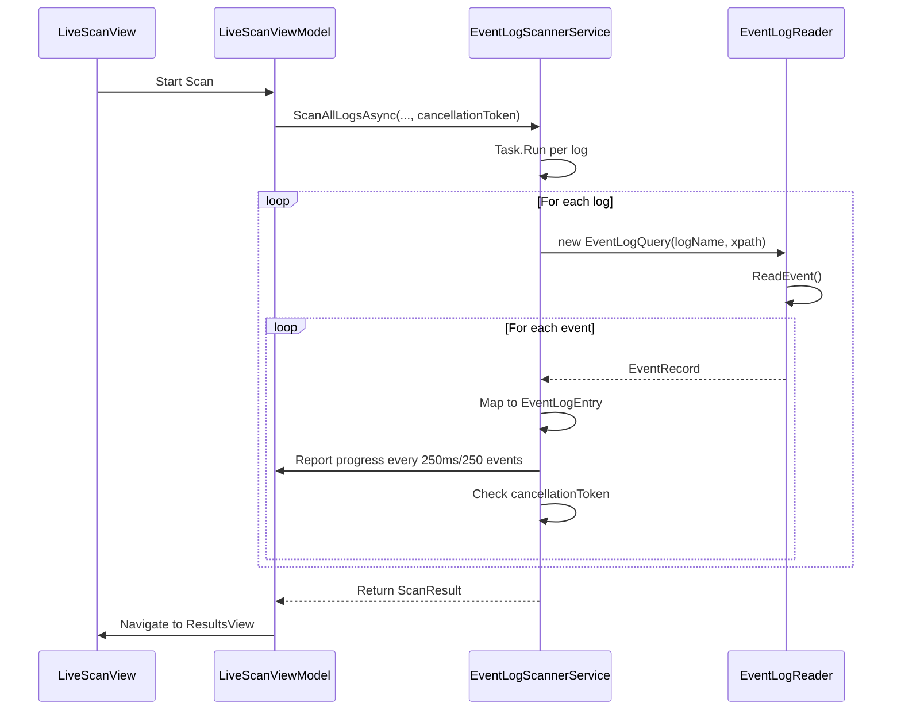
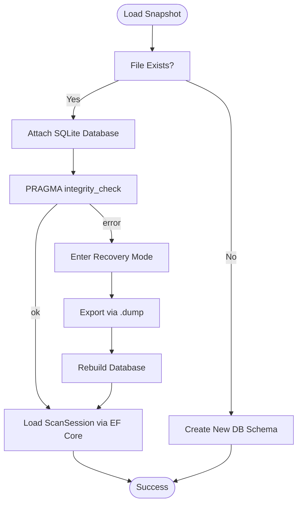
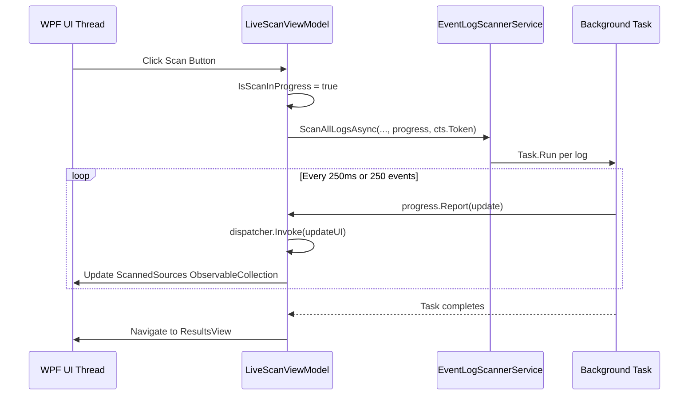
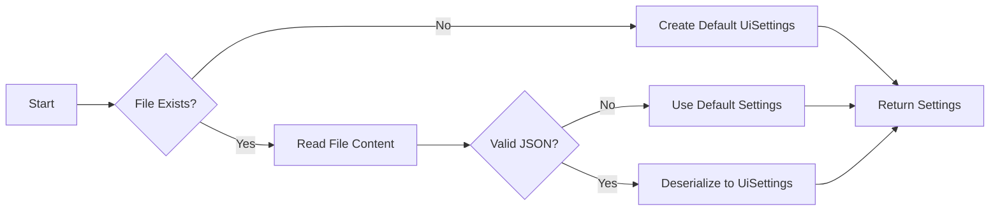

# Troubleshooting Advanced Issues


## Table of Contents
1. [Troubleshooting Scanner Timeouts During Large Log Reads](#troubleshooting-scanner-timeouts-during-large-log-reads)
2. [Recovery Procedures for Corrupted SQLite Snapshot Files](#recovery-procedures-for-corrupted-sqlite-snapshot-files)
3. [Diagnosing UI Freezing Issues and Ensuring Async/Await Usage](#diagnosing-ui-freezing-issues-and-ensuring-asyncawait-usage)
4. [Common Configuration Problems with UserUiSettings.json](#common-configuration-problems-with-useruisettingsjson)
5. [File Permission Errors and Security Context](#file-permission-errors-and-security-context)
6. [Diagnostic Techniques and Monitoring Tools](#diagnostic-techniques-and-monitoring-tools)

## Troubleshooting Scanner Timeouts During Large Log Reads

When scanning large volumes of Windows event logs, users may encounter scanner timeouts or unresponsive behavior. The `EventLogScannerService` performs parallel scanning across all available logs using `Task.Run` and `EventLogReader`. However, certain logs (e.g., Application, Security) can contain millions of entries, leading to long-running operations.

### Root Causes
- **No explicit timeout configuration**: The `EventLogReader` does not have a configurable timeout; it relies on cancellation via `CancellationToken`.
- **Progress throttling defaults**: Progress updates are throttled to every 250ms or 250 events, which may delay feedback during high-volume scans.
- **Cancellation propagation delay**: Cancellation is checked only at event-read boundaries, potentially delaying response.

### Example Error Message

```
OperationCanceledException: The operation was canceled.
```


This occurs when the user cancels the scan via the UI, but may also indicate an external cancellation source.

### Step-by-Step Resolution Guide
1. **Adjust progress update frequency**:
   - Modify `progressUpdateInterval` and `progressUpdateEventCount` in `ScanAllLogsAsync` calls.
   - Example: Reduce interval to `TimeSpan.FromMilliseconds(100)` and count to `100`.

2. **Ensure proper cancellation handling**:
   - Confirm that `CancellationToken` is properly passed from `LiveScanViewModel` to `EventLogScannerService`.
   - Verify that `cts?.Cancel()` is called on UI cancel action.

3. **Optimize XPath query**:
   - The current XPath `*[System[TimeCreated[@SystemTime>='...' and @SystemTime<='...']]]` is correct.
   - Avoid overly broad time windows (e.g., >60 minutes).

4. **Monitor resource usage**:
   - Use Performance Monitor to track memory and CPU during scans.
   - Large scans may require >1GB RAM depending on event volume.





**Diagram sources**
- [EventLogScannerService.cs](file://Janus.App/Services/EventLogScannerService.cs#L15-L159)
- [LiveScanViewModel.cs](file://Janus.App/ViewModels/LiveScanViewModel.cs#L150-L250)

**Section sources**
- [EventLogScannerService.cs](file://Janus.App/Services/EventLogScannerService.cs#L15-L159)
- [LiveScanViewModel.cs](file://Janus.App/ViewModels/LiveScanViewModel.cs#L150-L250)

## Recovery Procedures for Corrupted SQLite Snapshot Files

SQLite snapshot files (`.sqlite`) used by `SnapshotService` can become corrupted due to improper shutdowns, disk errors, or version incompatibilities.

### Root Causes
- **Abrupt application termination**: EF Core may not complete transaction commits.
- **File system issues**: Disk corruption or write failures.
- **Schema version mismatch**: Changes in `EventSnapshotDbContext` not handled via migrations.

### Example Error Message

```
SqliteException: SQLite Error 11: 'database disk image is malformed'.
```


### Step-by-Step Recovery Guide
1. **Verify file integrity**:
   
```bash
   sqlite3 corrupt_snapshot.sqlite "PRAGMA integrity_check;"
   ```

   Returns "ok" if valid, or error details if corrupted.

2. **Attempt recovery using SQLite tools**:
   - Export data using:
     
```bash
     sqlite3 corrupt_snapshot.sqlite .dump > recovery.sql
     ```

   - Create new database:
     
```bash
     sqlite3 recovered_snapshot.sqlite < recovery.sql
     ```


3. **Use EF Core database recreation**:
   - The `EnsureCreatedAsync()` call in `SnapshotService` will recreate the schema if missing.
   - However, it does **not** handle schema evolution—only creation.

4. **Implement migration strategy**:
   - Add EF Core migrations:
     
```csharp
     dotnet ef migrations add InitialCreate --project Janus.Core
     dotnet ef database update --project Janus.App
     ```

   - Replace `EnsureCreatedAsync()` with `MigrateAsync()` in production.

5. **Enable database integrity checks**:
   - Add `PRAGMA foreign_keys = ON; PRAGMA journal_mode = WAL;` to connection string:
     
```csharp
     .UseSqlite($"Data Source={filePath};Pooling=false;Foreign Keys=True;Journal Mode=WAL")
     ```





**Diagram sources**
- [SnapshotService.cs](file://Janus.App/Services/SnapshotService.cs#L10-L78)
- [EventSnapshotDbContext.cs](file://Janus.Core/EventSnapshotDbContext.cs#L7-L24)

**Section sources**
- [SnapshotService.cs](file://Janus.App/Services/SnapshotService.cs#L10-L78)
- [EventSnapshotDbContext.cs](file://Janus.Core/EventSnapshotDbContext.cs#L7-L24)

## Diagnosing UI Freezing Issues and Ensuring Async/Await Usage

UI freezing typically occurs when long-running operations block the WPF dispatcher thread.

### Root Causes
- **Improper async/await usage**: Synchronous blocking calls on `Result` or `Wait()`.
- **Excessive UI updates**: Too many `INotifyPropertyChanged` events in tight loops.
- **Missing dispatcher marshaling**: Background thread updates to UI-bound collections.

### Example Code Pattern (Correct)

```csharp
var progress = new Progress<SourceScanProgress>(progressUpdate => {
    void update() { /* Update ScannedSources */ }
    if (dispatcher != null && !dispatcher.CheckAccess()) {
        dispatcher.Invoke(update);
    } else {
        update();
    }
});
```


### Step-by-Step Diagnosis
1. **Check for synchronous waits**:
   - Search codebase for `.Result`, `.Wait()`, or `.GetAwaiter().GetResult()`.
   - These block the UI thread and cause freezing.

2. **Verify async call chain**:
   - `ScanCommand` uses `AsyncRelayCommand` → `ScanAsync()` → `await EventLogScannerService.ScanAllLogsAsync()`
   - All are properly `async/await` — no sync-over-async.

3. **Monitor UI thread activity**:
   - Use Visual Studio Diagnostic Tools or JetBrains dotTrace.
   - Look for long-running methods on the main thread.

4. **Optimize ObservableCollection updates**:
   - The `ScannedSources` collection is updated per event batch.
   - Consider batch updates or using `ICollectionView` for virtualization.

5. **Throttle progress reporting**:
   - Current throttling (250ms/250 events) is reasonable.
   - Reduce frequency if UI remains sluggish.





**Diagram sources**
- [LiveScanViewModel.cs](file://Janus.App/ViewModels/LiveScanViewModel.cs#L150-L250)
- [EventLogScannerService.cs](file://Janus.App/Services/EventLogScannerService.cs#L15-L159)

**Section sources**
- [LiveScanViewModel.cs](file://Janus.App/ViewModels/LiveScanViewModel.cs#L150-L250)

## Common Configuration Problems with UserUiSettings.json

The `UserUiSettings.json` file stores UI preferences and recent snapshot paths. Issues arise from file access, format errors, or permission problems.

### Root Causes
- **File not found**: Settings file missing from `AppContext.BaseDirectory`.
- **JSON deserialization errors**: Malformed JSON due to manual edits.
- **Permission denied**: Write access blocked by antivirus or group policy.

### Example Configuration File

```json
{
  "MinutesBefore": 5,
  "MinutesAfter": 5,
  "MainWindowWidth": 900,
  "MainWindowHeight": 400,
  "ResultsSplitterPosition": 0.5,
  "DetailsSplitterPosition": 0.33,
  "RecentSnapshots": [
    "C:\\Snapshots\\incident1.sqlite"
  ]
}
```


### Step-by-Step Resolution Guide
1. **Locate settings file**:
   - Path: `{AppContext.BaseDirectory}/UserUiSettings.json`
   - Default: `bin/Debug/net9.0-windows/UserUiSettings.json`

2. **Verify file permissions**:
   - Ensure user has `Read/Write` access.
   - Exclude directory from real-time antivirus scanning.

3. **Validate JSON format**:
   - Use online JSON validator or `jq`:
     
```bash
     jq . UserUiSettings.json
     ```


4. **Reset corrupted settings**:
   - Delete `UserUiSettings.json` — it will be recreated with defaults.

5. **Check file locking**:
   - `SemaphoreSlim` ensures thread-safe access.
   - No known deadlocks, but ensure `fileLock.Release()` is always called in `finally`.





**Diagram sources**
- [UserUiSettingsService.cs](file://Janus.App/Services/UserUiSettingsService.cs#L5-L63)

**Section sources**
- [UserUiSettingsService.cs](file://Janus.App/Services/UserUiSettingsService.cs#L5-L63)
- [UserUiSettings.json](file://Janus.App/bin/Debug/net9.0-windows/UserUiSettings.json)

## File Permission Errors and Security Context

File operations for snapshots and settings require appropriate permissions.

### Common Scenarios
- **Snapshot save fails**: "Access to the path is denied."
- **Settings not saved**: Silent failure due to catch-all in `SaveAsync`.

### Resolution Steps
1. **Run as administrator**:
   - Required for reading certain event logs (e.g., Security).
   - Not required for file operations if user has write access.

2. **Check directory permissions**:
   - Ensure write access to:
     - Application directory (for `UserUiSettings.json`)
     - Snapshot save location

3. **Use user-local storage**:
   - Consider migrating settings to `%APPDATA%\ProjectJanus\`:
     
```csharp
     private static readonly string SettingsFilePath = 
         Path.Combine(Environment.GetFolderPath(Environment.SpecialFolder.ApplicationData), 
                     "ProjectJanus", "UserUiSettings.json");
     ```


4. **Handle UnauthorizedAccessException**:
   - Currently caught at scanner level, but not for file operations.

**Section sources**
- [UserUiSettingsService.cs](file://Janus.App/Services/UserUiSettingsService.cs#L5-L63)
- [SnapshotService.cs](file://Janus.App/Services/SnapshotService.cs#L10-L78)

## Diagnostic Techniques and Monitoring Tools

### Enable EF Core Logging
Add console or file logging in `CreateOptions`:

```csharp
.LogTo(Console.WriteLine, LogLevel.Information)
```


### Analyze Memory Dumps
- Use **Visual Studio Debugger** or **WinDbg**.
- Focus on:
  - `EventLogEntry` instances (large object heap)
  - `List<EventLogEntry>` during scan
  - `DbContext` instances

### Interpret Scanner Cancellation Exceptions
- `OperationCanceledException`: Expected on user cancel.
- `TaskCanceledException`: May indicate token source disposed.
- Always check `cancellationToken.IsCancellationRequested`.

### Recommended Monitoring Tools
- **PerfView**: CPU and memory profiling.
- **Process Monitor**: File and registry access tracing.
- **SQLite Browser**: Inspect snapshot file contents.
- **Event Viewer**: Monitor application event logs.

**Section sources**
- [EventLogScannerService.cs](file://Janus.App/Services/EventLogScannerService.cs#L15-L159)
- [SnapshotService.cs](file://Janus.App/Services/SnapshotService.cs#L10-L78)
- [LiveScanViewModel.cs](file://Janus.App/ViewModels/LiveScanViewModel.cs#L150-L250)

**Referenced Files in This Document**   
- [EventLogScannerService.cs](file://Janus.App/Services/EventLogScannerService.cs)
- [SnapshotService.cs](file://Janus.App/Services/SnapshotService.cs)
- [UserUiSettingsService.cs](file://Janus.App/Services/UserUiSettingsService.cs)
- [LiveScanViewModel.cs](file://Janus.App/ViewModels/LiveScanViewModel.cs)
- [EventSnapshotDbContext.cs](file://Janus.Core/EventSnapshotDbContext.cs)
- [ScanSession.cs](file://Janus.Core/ScanSession.cs)
- [ScannedSource.cs](file://Janus.Core/ScannedSource.cs)
- [EventLogEntry.cs](file://Janus.Core/EventLogEntry.cs)
- [SourceScanProgress.cs](file://Janus.App/ViewModels/SourceScanProgress.cs)
- [ScanResult.cs](file://Janus.App/Services/ScanResult.cs)
- [UserUiSettings.json](file://Janus.App/bin/Debug/net9.0-windows/UserUiSettings.json)