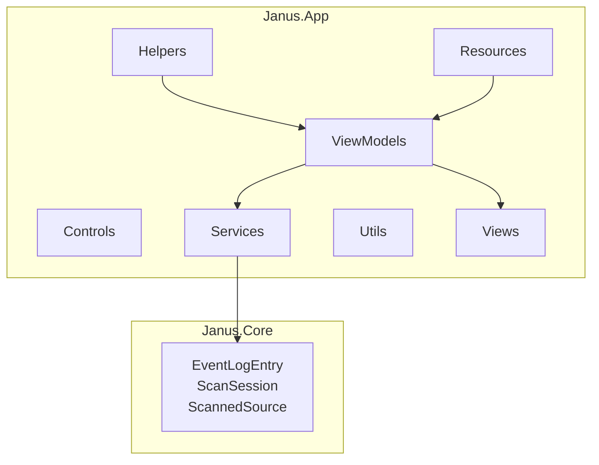
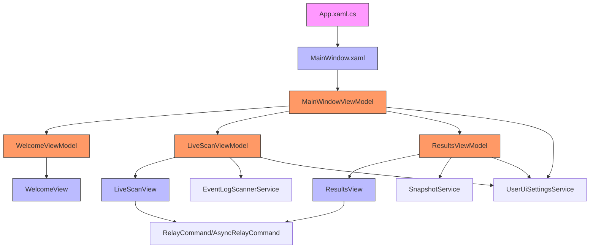
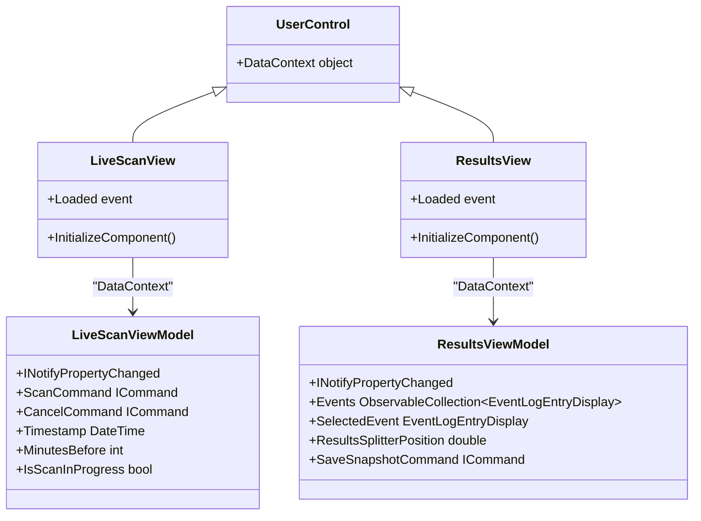
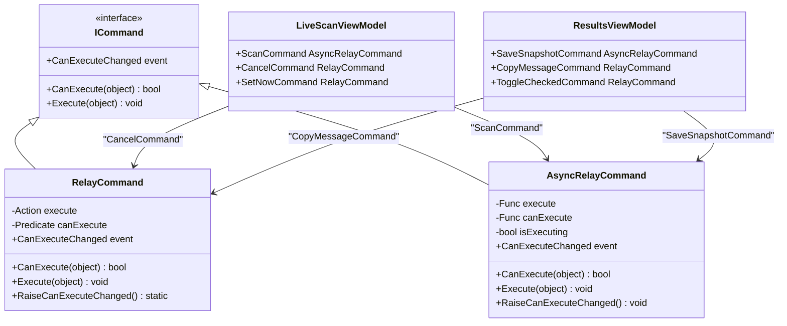
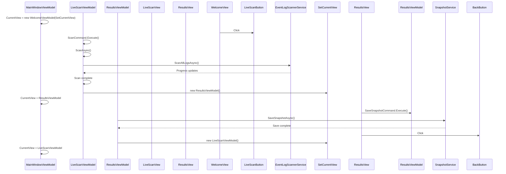
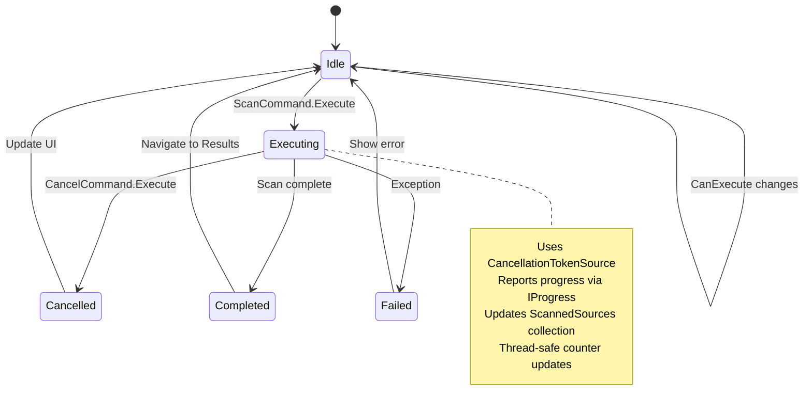
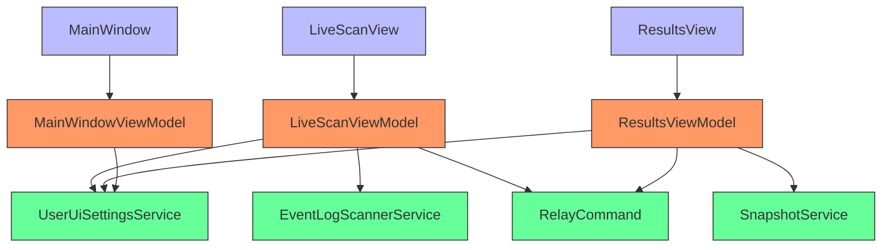

# MVVM Pattern Implementation


## Table of Contents
1. [Introduction](#introduction)
2. [Project Structure](#project-structure)
3. [Core Components](#core-components)
4. [Architecture Overview](#architecture-overview)
5. [Detailed Component Analysis](#detailed-component-analysis)
6. [Dependency Analysis](#dependency-analysis)
7. [Performance Considerations](#performance-considerations)
8. [Troubleshooting Guide](#troubleshooting-guide)
9. [Conclusion](#conclusion)

## Introduction
This document provides a comprehensive analysis of the Model-View-ViewModel (MVVM) pattern implementation in Project Janus, a WPF application for system event log analysis. The architecture strictly separates concerns between UI components (Views), UI logic (ViewModels), and business logic (Services). The implementation leverages data binding, command patterns, and event-driven communication to create a maintainable and testable application structure. This documentation details how the MVVM pattern is applied across the codebase, focusing on data flow, navigation, state management, and asynchronous operations.

## Project Structure
The Project Janus solution follows a layered architecture with clear separation of concerns. The primary components are organized into distinct directories within the Janus.App project, with core domain models and services in Janus.Core and Janus.App/Services respectively.





**Diagram sources**
- [Project Structure](file://README.md)

**Section sources**
- [Project Structure](file://README.md)

## Core Components
The MVVM implementation in Project Janus revolves around three core component types: Views (XAML-based UI), ViewModels (INotifyPropertyChanged classes), and Services (business logic providers). The App.xaml.cs serves as the application entry point, while MainWindow.xaml.cs and MainWindowViewModel.cs coordinate navigation between views. Key helper classes like RelayCommand and AsyncRelayCommand enable command binding, and UserUiSettingsService provides persistent state management across sessions.

**Section sources**
- [App.xaml.cs](file://Janus.App/Resources/App.xaml.cs#L7-L34)
- [MainWindow.xaml.cs](file://Janus.App/Resources/MainWindow.xaml.cs#L9-L44)
- [MainWindowViewModel.cs](file://Janus.App/ViewModels/MainWindowViewModel.cs#L5-L23)

## Architecture Overview
Project Janus implements a clean MVVM architecture where Views bind to ViewModels through data binding and command properties, while ViewModels interact with Services to perform business operations. The MainWindow hosts a CurrentView property that dynamically loads different View/UserControl instances, enabling navigation between application states (Welcome, LiveScan, Results). Services like EventLogScannerService and SnapshotService handle data retrieval and persistence, communicating results back to ViewModels through async methods and progress reporting.





**Diagram sources**
- [App.xaml.cs](file://Janus.App/Resources/App.xaml.cs#L7-L34)
- [MainWindow.xaml.cs](file://Janus.App/Resources/MainWindow.xaml.cs#L9-L44)
- [MainWindowViewModel.cs](file://Janus.App/ViewModels/MainWindowViewModel.cs#L5-L23)

## Detailed Component Analysis

### View-ViewModel Binding Mechanism
The application uses standard WPF data binding to connect Views with their corresponding ViewModels. Each View (UserControl) sets its DataContext to an instance of its ViewModel, enabling property binding and command execution. The binding is established in the code-behind constructor, maintaining separation while allowing initialization logic.





**Diagram sources**
- [LiveScanView.xaml.cs](file://Janus.App/Views/LiveScanView.xaml.cs#L6-L53)
- [ResultsView.xaml.cs](file://Janus.App/Views/ResultsView.xaml.cs#L9-L54)
- [LiveScanViewModel.cs](file://Janus.App/ViewModels/LiveScanViewModel.cs#L9-L259)
- [ResultsViewModel.cs](file://Janus.App/ViewModels/ResultsViewModel.cs#L75-L563)

**Section sources**
- [LiveScanView.xaml.cs](file://Janus.App/Views/LiveScanView.xaml.cs#L6-L53)
- [ResultsView.xaml.cs](file://Janus.App/Views/ResultsView.xaml.cs#L9-L54)

### Command Binding Implementation
The application implements command binding using RelayCommand and AsyncRelayCommand classes that implement the ICommand interface. These classes enable UI elements to execute methods on ViewModels while respecting enable/disable states through the CanExecute predicate. The AsyncRelayCommand handles asynchronous operations safely, managing the IsExecuting state and preventing re-entry.





**Diagram sources**
- [RelayCommand.cs](file://Janus.App/Helpers/RelayCommand.cs#L4-L42)
- [LiveScanViewModel.cs](file://Janus.App/ViewModels/LiveScanViewModel.cs#L9-L259)
- [ResultsViewModel.cs](file://Janus.App/ViewModels/ResultsViewModel.cs#L75-L563)

**Section sources**
- [RelayCommand.cs](file://Janus.App/Helpers/RelayCommand.cs#L4-L42)

### Navigation and View Management
Navigation between views is managed by MainWindowViewModel, which exposes a CurrentView property bound to a ContentControl in MainWindow.xaml. The CurrentView property holds ViewModel instances, and views are associated with their ViewModels through data templates or direct instantiation. The LiveScanViewModel and ResultsViewModel receive a SetCurrentView callback during construction, enabling them to navigate to other views.





**Diagram sources**
- [MainWindowViewModel.cs](file://Janus.App/ViewModels/MainWindowViewModel.cs#L5-L23)
- [LiveScanViewModel.cs](file://Janus.App/ViewModels/LiveScanViewModel.cs#L9-L259)
- [ResultsViewModel.cs](file://Janus.App/ViewModels/ResultsViewModel.cs#L75-L563)
- [MainWindow.xaml.cs](file://Janus.App/Resources/MainWindow.xaml.cs#L9-L44)

**Section sources**
- [MainWindowViewModel.cs](file://Janus.App/ViewModels/MainWindowViewModel.cs#L5-L23)
- [LiveScanViewModel.cs](file://Janus.App/ViewModels/LiveScanViewModel.cs#L9-L259)
- [ResultsViewModel.cs](file://Janus.App/ViewModels/ResultsViewModel.cs#L75-L563)

### Data Binding in LiveScanView
The LiveScanView binds to LiveScanViewModel properties for both display and user input. Key bindings include the Timestamp and TimeOfDay for scan time selection, MinutesBefore/MinutesAfter for time window configuration, and ScannedSources for real-time progress display. Command bindings connect UI buttons to ViewModel commands like ScanCommand and CancelCommand.


```mermaid
flowchart TD
A[LiveScanView.xaml] --> B[Binding Path=Timestamp]
A --> C[Binding Path=TimeOfDay]
A --> D[Binding Path=MinutesBefore]
A --> E[Binding Path=MinutesAfter]
A --> F[Binding Path=ScanStatus]
A --> G[Binding Path=IsScanInProgress]
A --> H[Binding Path=ScannedSources]
A --> I[Command={Binding ScanCommand}]
A --> J[Command={Binding CancelCommand}]
A --> K[Command={Binding SetNowCommand}]
B & C & D & E & F & G & H & I & J & K --> L[LiveScanViewModel]
L --> M[INotifyPropertyChanged]
M --> N[UI Updates]
I --> O[ScanAsync Task]
O --> P[EventLogScannerService]
P --> Q[Progress Reporting]
Q --> R[SourceScanProgress Updates]
R --> S[ScannedSources Collection]
S --> T[UI DataGrid]
```


**Diagram sources**
- [LiveScanView.xaml.cs](file://Janus.App/Views/LiveScanView.xaml.cs#L6-L53)
- [LiveScanViewModel.cs](file://Janus.App/ViewModels/LiveScanViewModel.cs#L9-L259)

**Section sources**
- [LiveScanView.xaml.cs](file://Janus.App/Views/LiveScanView.xaml.cs#L6-L53)
- [LiveScanViewModel.cs](file://Janus.App/ViewModels/LiveScanViewModel.cs#L9-L259)

### Data Binding in ResultsView
The ResultsView implements complex data binding for event log display, filtering, and grouping. It binds to the ResultsViewModel's Events collection through an ICollectionView for sorting and filtering. Multiple filter collections (SelectedLogLevels, SelectedSources, SelectedLogNames) enable multi-dimensional filtering with real-time updates. Splitter positions and UI state are persisted through UserUiSettingsService.


```mermaid
flowchart TD
A[ResultsView.xaml] --> B[ItemsSource={Binding EventsView}]
A --> C[SelectedValue={Binding SelectedEvent}]
A --> D[Value={Binding ResultsSplitterPosition}]
A --> E[Value={Binding DetailsSplitterPosition}]
A --> F[ItemsSource={Binding LogLevels}]
A --> G[ItemsSource={Binding SelectedLogLevels}]
A --> H[ItemsSource={Binding Sources}]
A --> I[ItemsSource={Binding SelectedSources}]
A --> J[Command={Binding SaveSnapshotCommand}]
A --> K[Command={Binding CopyMessageCommand}]
A --> L[Command={Binding ToggleCheckedCommand}]
B --> M[ICollectionView]
M --> N[FilterPredicate]
N --> O[SearchText]
N --> P[SelectedLogLevels]
N --> Q[SelectedSources]
N --> R[SelectedLogNames]
N --> S[ShowOnlyChecked]
O & P & Q & R & S --> T[RebuildView]
T --> U[New CollectionViewSource]
U --> V[EventsView]
V --> W[DataGrid Update]
D & E --> X[DebounceSave]
X --> Y[UserUiSettingsService]
```


**Diagram sources**
- [ResultsView.xaml.cs](file://Janus.App/Views/ResultsView.xaml.cs#L9-L54)
- [ResultsViewModel.cs](file://Janus.App/ViewModels/ResultsViewModel.cs#L75-L563)

**Section sources**
- [ResultsView.xaml.cs](file://Janus.App/Views/ResultsView.xaml.cs#L9-L54)
- [ResultsViewModel.cs](file://Janus.App/ViewModels/ResultsViewModel.cs#L75-L563)

### Asynchronous Command Handling
The application handles asynchronous operations through AsyncRelayCommand, which manages execution state and prevents command re-entry during long-running tasks. The ScanAsync method in LiveScanViewModel demonstrates this pattern, using a CancellationTokenSource for cancellation and progress reporting to update the UI during the scan operation. The IsExecuting state automatically disables the command during execution.





**Diagram sources**
- [RelayCommand.cs](file://Janus.App/Helpers/RelayCommand.cs#L18-L42)
- [LiveScanViewModel.cs](file://Janus.App/ViewModels/LiveScanViewModel.cs#L9-L259)

**Section sources**
- [RelayCommand.cs](file://Janus.App/Helpers/RelayCommand.cs#L18-L42)
- [LiveScanViewModel.cs](file://Janus.App/ViewModels/LiveScanViewModel.cs#L9-L259)

### UI State Persistence
User interface state is persisted across application sessions using the UserUiSettingsService, which serializes UI settings to a JSON file. The service uses a singleton pattern with thread-safe file access to store and retrieve settings such as window dimensions, splitter positions, and recent snapshot paths. ViewModels load settings in their constructors and debounce save operations to avoid excessive file I/O.


```mermaid
classDiagram
class UserUiSettingsService {
+Instance UserUiSettingsService
+LoadAsync() Task~UiSettings~
+SaveAsync(UiSettings) Task
+AddRecentSnapshotAsync(string) Task
}
class UserUiSettingsService.UiSettings {
+MinutesBefore int
+MinutesAfter int
+MainWindowWidth double
+MainWindowHeight double
+ResultsSplitterPosition double
+DetailsSplitterPosition double
+RecentSnapshots string[]
}
class LiveScanViewModel {
+MinutesBefore int
+MinutesAfter int
}
class ResultsViewModel {
+ResultsSplitterPosition double
+DetailsSplitterPosition double
}
class MainWindow {
+Width double
+Height double
}
UserUiSettingsService --> UserUiSettingsService.UiSettings : "Contains"
LiveScanViewModel --> UserUiSettingsService : "Load/Save"
ResultsViewModel --> UserUiSettingsService : "Load/Save"
MainWindow --> UserUiSettingsService : "Load/Save"
note right of UserUiSettingsService
Thread-safe with SemaphoreSlim
Settings stored in UserUiSettings.json
Recent snapshots limited to 10 items
end note
```


**Diagram sources**
- [UserUiSettingsService.cs](file://Janus.App/Services/UserUiSettingsService.cs#L5-L63)
- [LiveScanViewModel.cs](file://Janus.App/ViewModels/LiveScanViewModel.cs#L9-L259)
- [ResultsViewModel.cs](file://Janus.App/ViewModels/ResultsViewModel.cs#L75-L563)
- [MainWindow.xaml.cs](file://Janus.App/Resources/MainWindow.xaml.cs#L9-L44)

**Section sources**
- [UserUiSettingsService.cs](file://Janus.App/Services/UserUiSettingsService.cs#L5-L63)

## Dependency Analysis
The MVVM components in Project Janus exhibit a clear dependency hierarchy with minimal coupling. ViewModels depend on Services for business logic but contain no direct UI references, while Views depend only on their corresponding ViewModels through data binding. The RelayCommand and UserUiSettingsService classes are shared utilities used across multiple components, promoting code reuse without creating circular dependencies.





**Diagram sources**
- [LiveScanViewModel.cs](file://Janus.App/ViewModels/LiveScanViewModel.cs#L9-L259)
- [ResultsViewModel.cs](file://Janus.App/ViewModels/ResultsViewModel.cs#L75-L563)
- [MainWindowViewModel.cs](file://Janus.App/ViewModels/MainWindowViewModel.cs#L5-L23)
- [EventLogScannerService.cs](file://Janus.App/Services/EventLogScannerService.cs#L9-L159)
- [SnapshotService.cs](file://Janus.App/Services/SnapshotService.cs#L10-L78)
- [UserUiSettingsService.cs](file://Janus.App/Services/UserUiSettingsService.cs#L5-L63)
- [RelayCommand.cs](file://Janus.App/Helpers/RelayCommand.cs#L4-L42)

**Section sources**
- [LiveScanViewModel.cs](file://Janus.App/ViewModels/LiveScanViewModel.cs#L9-L259)
- [ResultsViewModel.cs](file://Janus.App/ViewModels/ResultsViewModel.cs#L75-L563)
- [MainWindowViewModel.cs](file://Janus.App/ViewModels/MainWindowViewModel.cs#L5-L23)

## Performance Considerations
The application implements several performance optimizations to handle large event log datasets efficiently. The EventLogScannerService uses parallel task execution with CancellationToken support for responsive cancellation. Progress reporting is throttled to prevent UI thread overload, and the ResultsView uses debounced settings saves and collection view rebuilding to minimize UI updates. The SourceScanProgress class implements thread-safe property updates through dispatcher invocation when necessary.

Key performance features:
- **Parallel scanning**: EventLogScannerService runs log scans in parallel tasks
- **Progress throttling**: Limits progress updates to 250ms intervals or 250 events
- **Debounced operations**: UI settings saves are debounced to prevent excessive file I/O
- **Efficient filtering**: ResultsView rebuilds CollectionViewSource only when necessary
- **Thread-safe collections**: ObservableCollection usage with proper synchronization
- **Memory management**: Proper disposal of EventLogReader resources

**Section sources**
- [EventLogScannerService.cs](file://Janus.App/Services/EventLogScannerService.cs#L9-L159)
- [LiveScanViewModel.cs](file://Janus.App/ViewModels/LiveScanViewModel.cs#L9-L259)
- [ResultsViewModel.cs](file://Janus.App/ViewModels/ResultsViewModel.cs#L75-L563)

## Troubleshooting Guide
Common MVVM implementation issues in Project Janus and their solutions:

**Issue: UI not updating when ViewModel properties change**
- **Cause**: Missing INotifyPropertyChanged implementation or incorrect property name
- **Solution**: Ensure all bound properties raise PropertyChanged with correct name
- **Example**: LiveScanViewModel.OnPropertyChanged() uses [CallerMemberName] attribute

**Issue: Command not executing or always disabled**
- **Cause**: CanExecute predicate returning false or command not properly bound
- **Solution**: Verify CanExecute logic and ensure command is not null in DataContext
- **Example**: LiveScanViewModel.ScanCommand can execute only when no scan is in progress

**Issue: Memory leaks in event handlers**
- **Cause**: Event handlers not properly unsubscribed
- **Solution**: Use weak event patterns or ensure cleanup in appropriate lifecycle methods
- **Note**: Project Janus uses simple subscription patterns suitable for short-lived ViewModels

**Issue: Cross-thread exceptions in progress reporting**
- **Cause**: Updating UI-bound collections from background threads
- **Solution**: Use Dispatcher.Invoke for UI updates from background threads
- **Example**: LiveScanViewModel uses dispatcher.Invoke in progress callback

**Issue: Settings not persisting between sessions**
- **Cause**: File access issues or serialization errors
- **Solution**: Verify file permissions and check UserUiSettings.json format
- **Location**: Settings stored in executable directory as UserUiSettings.json

**Section sources**
- [LiveScanViewModel.cs](file://Janus.App/ViewModels/LiveScanViewModel.cs#L9-L259)
- [ResultsViewModel.cs](file://Janus.App/ViewModels/ResultsViewModel.cs#L75-L563)
- [UserUiSettingsService.cs](file://Janus.App/Services/UserUiSettingsService.cs#L5-L63)

## Conclusion
Project Janus demonstrates a robust MVVM pattern implementation with clear separation of concerns between Views, ViewModels, and Services. The architecture enables maintainable code through data binding, command patterns, and dependency injection. Key strengths include responsive UI with asynchronous operations, persistent state management, and efficient handling of large datasets. The navigation system using a CurrentView property in MainWindowViewModel provides a flexible way to manage application flow while maintaining testability. To extend the pattern for new features, follow the established conventions: create a new View-ViewModel pair, use RelayCommand for commands, leverage existing Services for business logic, and persist UI state through UserUiSettingsService. This consistent approach ensures new features integrate seamlessly with the existing architecture.

**Referenced Files in This Document**   
- [App.xaml.cs](file://Janus.App/Resources/App.xaml.cs#L7-L34)
- [MainWindow.xaml.cs](file://Janus.App/Resources/MainWindow.xaml.cs#L9-L44)
- [MainWindowViewModel.cs](file://Janus.App/ViewModels/MainWindowViewModel.cs#L5-L23)
- [LiveScanViewModel.cs](file://Janus.App/ViewModels/LiveScanViewModel.cs#L9-L259)
- [ResultsViewModel.cs](file://Janus.App/ViewModels/ResultsViewModel.cs#L75-L563)
- [LiveScanView.xaml.cs](file://Janus.App/Views/LiveScanView.xaml.cs#L6-L53)
- [ResultsView.xaml.cs](file://Janus.App/Views/ResultsView.xaml.cs#L9-L54)
- [RelayCommand.cs](file://Janus.App/Helpers/RelayCommand.cs#L4-L42)
- [UserUiSettingsService.cs](file://Janus.App/Services/UserUiSettingsService.cs#L5-L63)
- [EventLogScannerService.cs](file://Janus.App/Services/EventLogScannerService.cs#L9-L159)
- [SnapshotService.cs](file://Janus.App/Services/SnapshotService.cs#L10-L78)