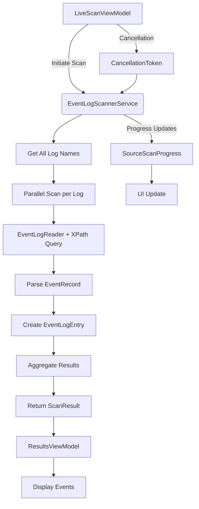
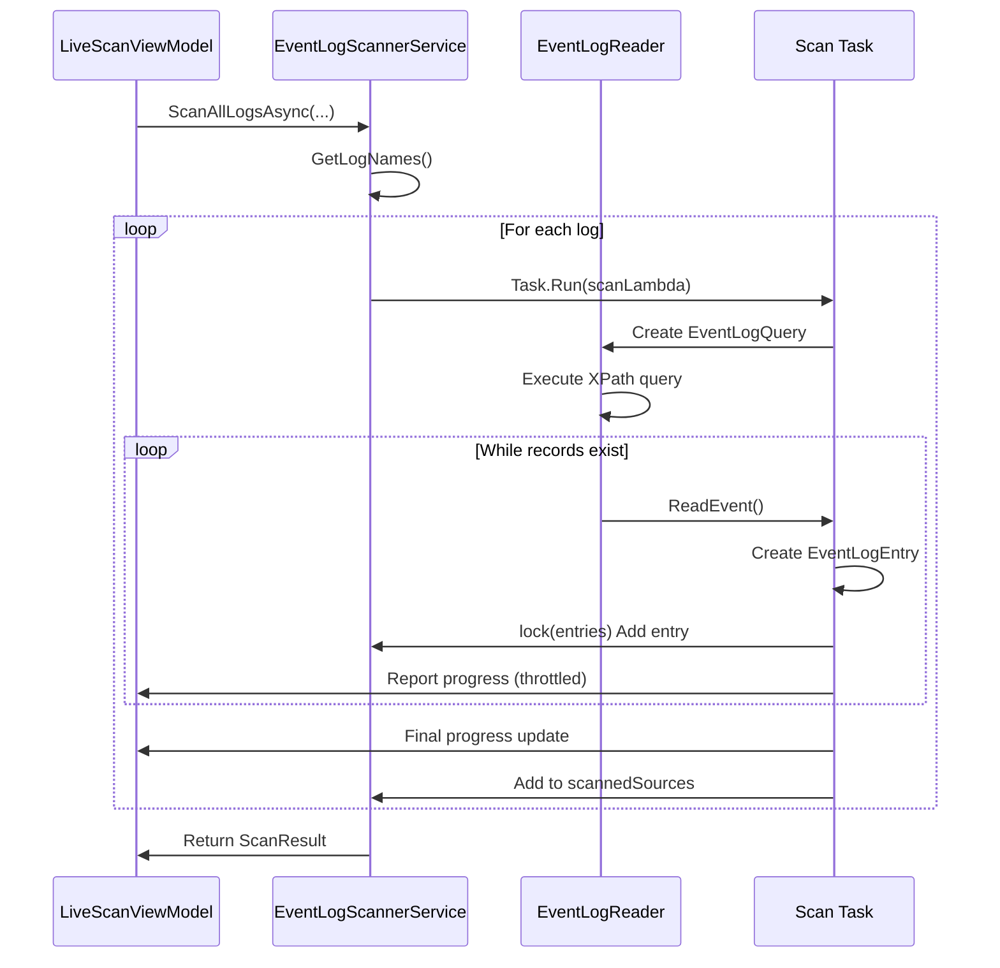
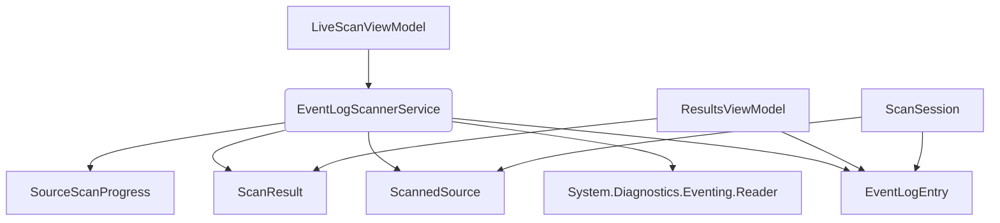

# EventLogScannerService


## Table of Contents
1. [Introduction](#introduction)
2. [Core Components](#core-components)
3. [Architecture Overview](#architecture-overview)
4. [Detailed Component Analysis](#detailed-component-analysis)
5. [Dependency Analysis](#dependency-analysis)
6. [Performance Considerations](#performance-considerations)
7. [Troubleshooting Guide](#troubleshooting-guide)
8. [Conclusion](#conclusion)

## Introduction
The **EventLogScannerService** is a critical component of Project Janus, responsible for orchestrating the parallel scanning of Windows event logs using the `System.Diagnostics.Eventing.Reader` API. It enables forensic analysis by retrieving events around a specified timestamp within a configurable time window. The service supports real-time progress reporting, cancellation via `CancellationToken`, and robust error handling for inaccessible logs. This document provides a comprehensive analysis of its implementation, integration points, and performance characteristics, making it accessible to both technical and non-technical users.

## Core Components
The EventLogScannerService operates in conjunction with several key models and services:
- **EventLogEntry**: Represents individual event log records with metadata such as timestamp, level, source, and message.
- **ScanResult**: Aggregates scanned entries and source statuses for return to the caller.
- **ScannedSource**: Tracks per-log statistics including event count and scan status.
- **SourceScanProgress**: Enables real-time UI updates during scanning.
- **LiveScanViewModel**: Orchestrates scan execution and handles progress updates.

These components work together to enable efficient, user-responsive event log analysis.

**Section sources**
- [EventLogScannerService.cs](file://Janus.App/Services/EventLogScannerService.cs#L1-L160)
- [EventLogEntry.cs](file://Janus.Core/EventLogEntry.cs#L1-L18)
- [ScanResult.cs](file://Janus.App/Services/ScanResult.cs#L1-L7)
- [ScannedSource.cs](file://Janus.Core/ScannedSource.cs#L1-L13)
- [SourceScanProgress.cs](file://Janus.App/ViewModels/SourceScanProgress.cs#L1-L25)

## Architecture Overview
The EventLogScannerService follows a parallel processing architecture where each event log is scanned concurrently using `Task.Run`. It leverages the `EventLogReader` API to query logs via XPath filters based on time ranges. Progress is reported through `IProgress<SourceScanProgress>`, enabling real-time UI feedback. The main application flow begins in `LiveScanViewModel`, which invokes the scanner and processes results in `ResultsViewModel`.





**Diagram sources**
- [EventLogScannerService.cs](file://Janus.App/Services/EventLogScannerService.cs#L32-L158)
- [LiveScanViewModel.cs](file://Janus.App/ViewModels/LiveScanViewModel.cs#L211-L242)

## Detailed Component Analysis

### EventLogScannerService Analysis
The `EventLogScannerService` class provides two primary static methods: `GetAllLogNames` and `ScanAllLogsAsync`.

#### GetAllLogNames Implementation
This method retrieves all available event log channels from the system using `EventLogSession.GlobalSession.GetLogNames()`.


```csharp
public static IReadOnlyList<string> GetAllLogNames() {
    EventLogSession session = EventLogSession.GlobalSession;
    var logNames = new List<string>();
    foreach (string? log in session.GetLogNames()) {
        logNames.Add(log);
    }
    return logNames;
}
```


It handles no exceptions internally, allowing callers to manage access issues. The method returns a snapshot of log names at call time.

**Section sources**
- [EventLogScannerService.cs](file://Janus.App/Services/EventLogScannerService.cs#L13-L20)

#### ScanAllLogsAsync Implementation
This method performs parallel scanning of all event logs within a time window around a central timestamp.

##### Key Parameters:
- **timestamp**: Central point for time-based filtering
- **before/after**: Time window extents
- **perSourceProgress**: Progress reporting mechanism
- **cancellationToken**: Supports graceful cancellation
- **progressUpdateInterval**: Throttles UI updates (default: 250ms)
- **progressUpdateEventCount**: Triggers update after N events

##### Processing Flow:
1. Initializes shared collections (`entries`, `scannedSources`)
2. Enumerates all log names via `EventLogSession`
3. Spawns a `Task` for each log using `Task.Run`
4. Each task:
   - Constructs an XPath query for time filtering
   - Uses `EventLogReader` to stream events
   - Creates `EventLogEntry` objects from `EventRecord`
   - Thread-safely adds entries using `lock`
   - Reports progress periodically
5. Waits for all tasks with `Task.WhenAll`
6. Returns aggregated `ScanResult`

##### Error Handling:
- **EventLogException**: Log inaccessible (e.g., corrupted)
- **UnauthorizedAccessException**: Insufficient permissions
- **OperationCanceledException**: Scan cancelled by user

Each exception updates the `ScanStatus` and reports via `perSourceProgress`.

##### Progress Reporting:
Progress is throttled by time (default 250ms) or event count (default 250). The service sends `SourceScanProgress` updates containing:
- **SourceName**: Log name being scanned
- **EventsRetrieved**: Running count
- **Status**: Success, Partial, or Failed
- **IsActive**: Whether scanning is ongoing
- **ExceptionMessage**: Error details if applicable

A final update is always sent to mark completion.





**Diagram sources**
- [EventLogScannerService.cs](file://Janus.App/Services/EventLogScannerService.cs#L32-L158)

**Section sources**
- [EventLogScannerService.cs](file://Janus.App/Services/EventLogScannerService.cs#L32-L158)

### SourceScanProgress Model
This class implements `INotifyPropertyChanged` to support data binding in WPF. It represents the real-time status of scanning a single event log.


```csharp
public class SourceScanProgress : INotifyPropertyChanged {
    public string SourceName { get; set; } = string.Empty;
    public int EventsRetrieved { get; set; }
    public ScanStatus Status { get; set; } = ScanStatus.Success;
    public bool IsTotalKnown { get; set; }
    public int? TotalEvents { get; set; }
    public bool IsActive { get; set; }
    public string? ExceptionMessage { get; set; }
}
```


Note: `IsTotalKnown` and `TotalEvents` are currently unused but reserved for future enhancements like progress percentage.

**Section sources**
- [SourceScanProgress.cs](file://Janus.App/ViewModels/SourceScanProgress.cs#L1-L25)

### ScanResult and ScannedSource Models
The `ScanResult` class aggregates the final output:


```csharp
public class ScanResult {
    public required IReadOnlyList<EventLogEntry> Entries { get; init; }
    public required IReadOnlyList<ScannedSource> ScannedSources { get; init; }
}
```


`ScannedSource` captures per-log metadata:


```csharp
public class ScannedSource {
    public required string SourceName { get; init; }
    public required int EventsRetrieved { get; init; }
    public required ScanStatus Status { get; init; }
}
```


These models enable post-scan analysis and reporting in `ResultsViewModel`.

**Section sources**
- [ScanResult.cs](file://Janus.App/Services/ScanResult.cs#L1-L7)
- [ScannedSource.cs](file://Janus.Core/ScannedSource.cs#L1-L13)

### LiveScanViewModel Integration
The `LiveScanViewModel` invokes `EventLogScannerService` and processes progress updates:


```csharp
var progress = new Progress<SourceScanProgress>(progressUpdate => {
    // Update UI thread safely
    dispatcher.Invoke(() => {
        // Insert new sources or update existing ones
        // Update counters: TotalSources, SourcesCompletedSuccess, etc.
        // Move active sources to top
        // Update ScanStatus string with statistics
    });
});
ScanResult scanResult = await EventLogScannerService.ScanAllLogsAsync(...);
```


Key features:
- Uses `Progress<T>` to handle updates on the UI thread
- Maintains thread-safe counters for scan statistics
- Orders sources with active scans at the top
- Updates a composite status string in real time

Upon completion, it navigates to `ResultsViewModel` with the scan data.

**Section sources**
- [LiveScanViewModel.cs](file://Janus.App/ViewModels/LiveScanViewModel.cs#L211-L242)

### ResultsViewModel Processing
The `ResultsViewModel` receives and displays the scan results:


```csharp
public void LoadEvents(IEnumerable<EventLogEntry> events) {
    Events.Clear();
    foreach (EventLogEntry e in events) {
        Events.Add(new EventLogEntryDisplay(e, () => SearchText));
        // Populate filter lists: LogLevels, Sources, LogNames
    }
    EventsView.Refresh();
    UpdateGrouping();
}
```


It creates `EventLogEntryDisplay` wrappers for enhanced UI rendering, including search term highlighting.

**Section sources**
- [ResultsViewModel.cs](file://Janus.App/ViewModels/ResultsViewModel.cs#L396-L445)

## Dependency Analysis
The EventLogScannerService has a clear dependency hierarchy:





**Diagram sources**
- [EventLogScannerService.cs](file://Janus.App/Services/EventLogScannerService.cs#L1-L160)
- [LiveScanViewModel.cs](file://Janus.App/ViewModels/LiveScanViewModel.cs#L1-L260)
- [ResultsViewModel.cs](file://Janus.App/ViewModels/ResultsViewModel.cs#L1-L565)

## Performance Considerations
### Concurrency Model
The service uses one `Task` per event log, enabling true parallelism. However, the number of concurrent tasks equals the number of logs, which can be high on enterprise systems (100+ logs). This could lead to thread pool exhaustion.

### Synchronization Overhead
Shared collections (`entries`, `scannedSources`) use `lock` for thread safety. While necessary, frequent locking during high-volume event ingestion may create contention. The `Interlocked.Increment` for `scanEventIdCounter` is optimal.

### Memory Usage
All events are held in memory (`List<EventLogEntry>`) before return. For large scans, this could cause high memory pressure. Streaming results would reduce memory footprint.

### I/O Performance
The `EventLogReader` streams events efficiently, but disk I/O may become a bottleneck on systems with fragmented logs.

### Scalability Limits
- **High Log Count**: Many logs → many tasks → potential thread pool saturation
- **Large Event Volume**: Memory usage scales with event count
- **Slow Disks**: Sequential log reading may be I/O bound

### Potential Optimizations
1. **Task Throttling**: Use `SemaphoreSlim` to limit concurrent log scans
2. **Batched Progress Reporting**: Reduce UI update frequency
3. **Streaming Results**: Return `IAsyncEnumerable<EventLogEntry>` instead of `List`
4. **Log Prioritization**: Scan critical logs (Security, System) first
5. **Caching**: Cache log name enumeration when possible

## Troubleshooting Guide
### Common Issues
- **Access Denied**: Run application with elevated privileges
- **Missing Logs**: Some logs require special permissions (e.g., Security log)
- **Slow Performance**: Disable progress reporting or reduce log count
- **Memory Errors**: Reduce time window or implement streaming

### Debugging Tips
1. Check `ExceptionMessage` in `SourceScanProgress` for specific log failures
2. Monitor `ScanStatus` string for real-time statistics
3. Verify timestamp conversion to UTC is correct
4. Use small time windows (1-5 minutes) for testing

### Error Codes
- **EventLogException**: Log corruption or system error
- **UnauthorizedAccessException**: Insufficient permissions
- **OperationCanceledException**: User cancelled scan

**Section sources**
- [EventLogScannerService.cs](file://Janus.App/Services/EventLogScannerService.cs#L85-L119)
- [LiveScanViewModel.cs](file://Janus.App/ViewModels/LiveScanViewModel.cs#L243-L260)

## Conclusion
The EventLogScannerService is a robust, parallel-capable component for Windows event log analysis. Its design emphasizes real-time feedback, cancellation support, and fault tolerance. Integration with WPF's data binding through `SourceScanProgress` enables responsive UIs. While highly effective, potential optimizations around task throttling and memory usage could enhance scalability. The service forms the backbone of Project Janus's live scanning capability, enabling forensic investigation of system events around critical timestamps.

**Referenced Files in This Document**   
- [EventLogScannerService.cs](file://Janus.App/Services/EventLogScannerService.cs)
- [SourceScanProgress.cs](file://Janus.App/ViewModels/SourceScanProgress.cs)
- [ScanResult.cs](file://Janus.App/Services/ScanResult.cs)
- [ScannedSource.cs](file://Janus.Core/ScannedSource.cs)
- [EventLogEntry.cs](file://Janus.Core/EventLogEntry.cs)
- [LiveScanViewModel.cs](file://Janus.App/ViewModels/LiveScanViewModel.cs)
- [ResultsViewModel.cs](file://Janus.App/ViewModels/ResultsViewModel.cs)