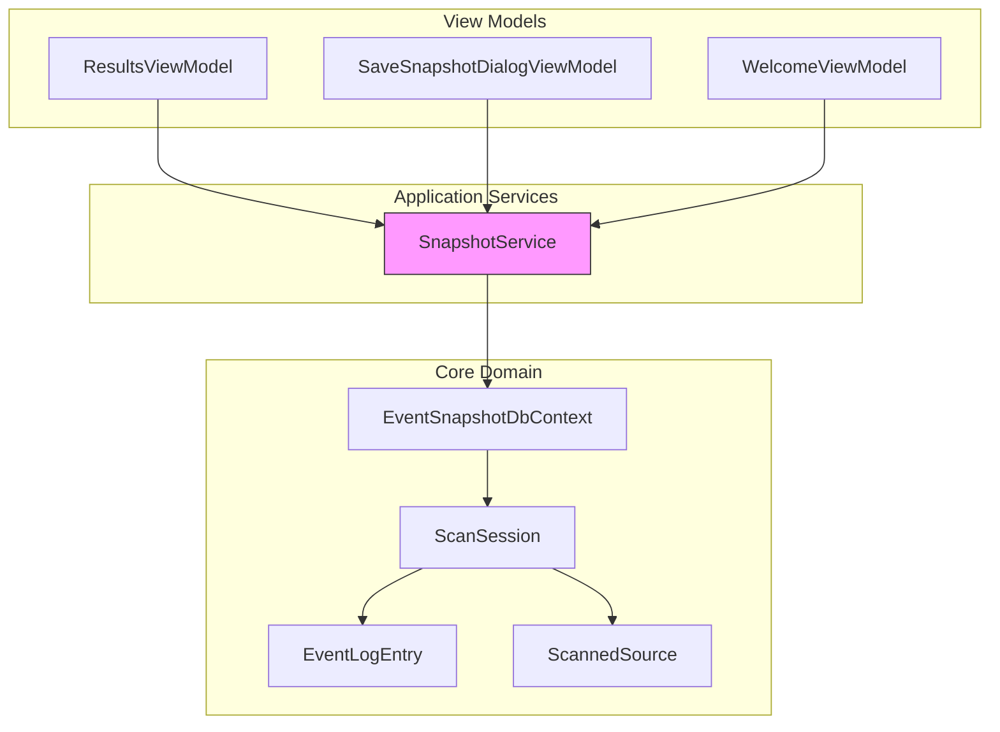
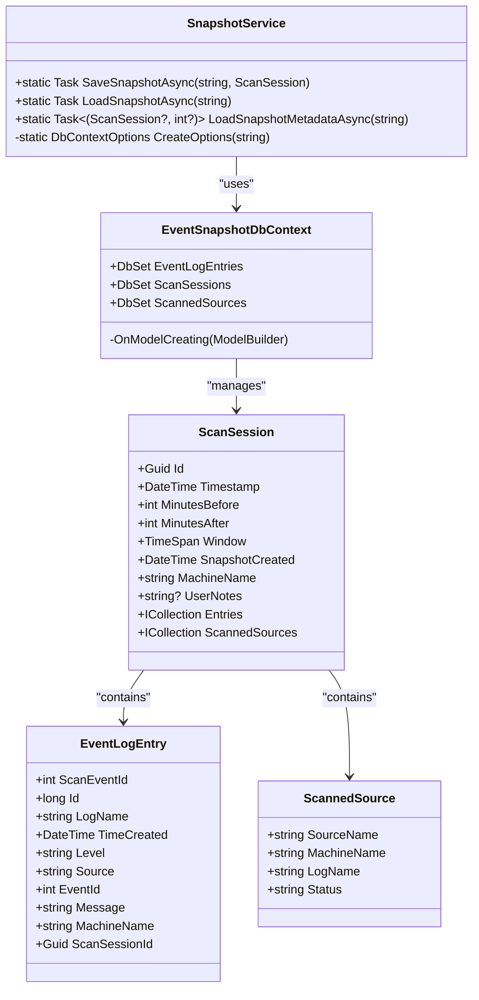
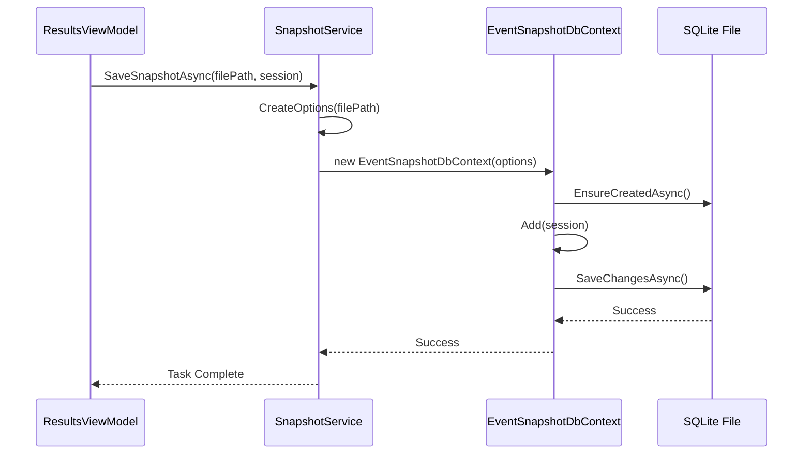
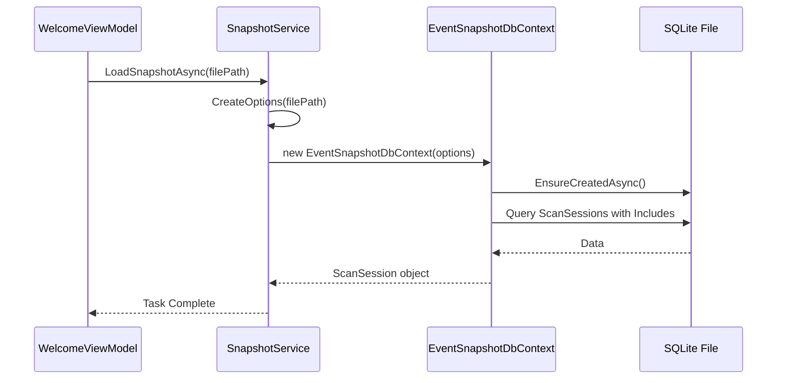
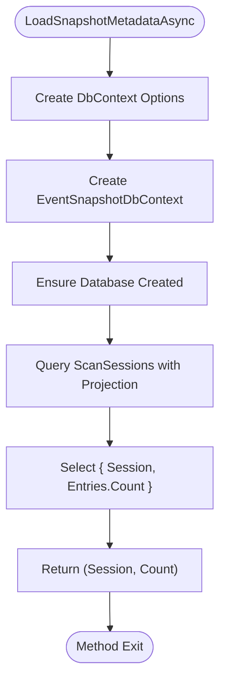
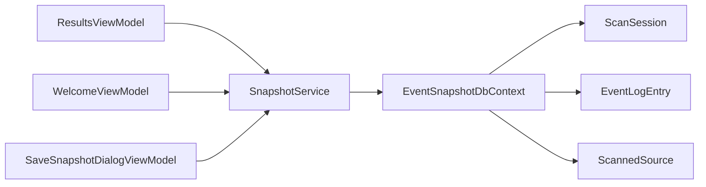

# SnapshotService

## Table of Contents
1. [Introduction](#introduction)
2. [Project Structure](#project-structure)
3. [Core Components](#core-components)
4. [Architecture Overview](#architecture-overview)
5. [Detailed Component Analysis](#detailed-component-analysis)
6. [Dependency Analysis](#dependency-analysis)
7. [Performance Considerations](#performance-considerations)
8. [Troubleshooting Guide](#troubleshooting-guide)
9. [Conclusion](#conclusion)

## Introduction
The SnapshotService in Project Janus provides a robust mechanism for persisting and retrieving event log scan sessions. It implements the repository pattern using Entity Framework Core with SQLite as a portable, file-based storage format. This service enables users to save complete scan results, including metadata, event entries, and source information, into a single `.janus` file, which can be later reloaded for analysis. The design emphasizes data integrity, schema consistency, and efficient metadata access, making it suitable for forensic and diagnostic workflows.

## Project Structure
The project follows a layered architecture with clear separation between core domain models, application services, and UI components. The SnapshotService resides in the `Janus.App\Services` namespace and depends on data models defined in `Janus.Core`. The service interacts with EF Core via `EventSnapshotDbContext` to persist `ScanSession` objects, which contain collections of `EventLogEntry` and `ScannedSource` entities. View models such as `ResultsViewModel` and `WelcomeViewModel` consume the service to enable user-facing snapshot functionality.

**Diagram sources**
- [SnapshotService.cs](file://Janus.App/Services/SnapshotService.cs)
- [EventSnapshotDbContext.cs](file://Janus.Core/EventSnapshotDbContext.cs)
- [ScanSession.cs](file://Janus.Core/ScanSession.cs)
- [ResultsViewModel.cs](file://Janus.App/ViewModels/ResultsViewModel.cs)
- [SaveSnapshotDialogViewModel.cs](file://Janus.App/ViewModels/SaveSnapshotDialogViewModel.cs)
- [WelcomeViewModel.cs](file://Janus.App/ViewModels/WelcomeViewModel.cs)

**Section sources**
- [SnapshotService.cs](file://Janus.App/Services/SnapshotService.cs)
- [EventSnapshotDbContext.cs](file://Janus.Core/EventSnapshotDbContext.cs)
- [ScanSession.cs](file://Janus.Core/ScanSession.cs)

## Core Components
The core components of the snapshot system include the `SnapshotService`, `EventSnapshotDbContext`, and `ScanSession` model. The `SnapshotService` provides static methods for saving, loading, and reading metadata from snapshot files. It uses EF Core with SQLite to serialize the entire scan session into a portable database file. The `EventSnapshotDbContext` configures the database schema and relationships, while the `ScanSession` class defines the structure of the data being persisted, including timestamps, filtering parameters, event entries, and scanned sources.

**Section sources**
- [SnapshotService.cs](file://Janus.App/Services/SnapshotService.cs#L10-L78)
- [EventSnapshotDbContext.cs](file://Janus.Core/EventSnapshotDbContext.cs#L7-L24)
- [ScanSession.cs](file://Janus.Core/ScanSession.cs#L4-L34)

## Architecture Overview
The architecture follows a clean separation between data access, business logic, and presentation layers. The `SnapshotService` acts as a facade to the EF Core persistence layer, abstracting database operations from the view models. When saving a snapshot, the service creates a SQLite database file and persists the `ScanSession` object graph. When loading, it reconstructs the object from the database. The use of `DbContext` ensures proper handling of relationships and lazy/eager loading. The `.janus` file extension indicates a SQLite database containing structured scan data.

**Diagram sources**
- [SnapshotService.cs](file://Janus.App/Services/SnapshotService.cs#L10-L78)
- [EventSnapshotDbContext.cs](file://Janus.Core/EventSnapshotDbContext.cs#L7-L24)
- [ScanSession.cs](file://Janus.Core/ScanSession.cs#L4-L34)

## Detailed Component Analysis

### SnapshotService Implementation
The `SnapshotService` provides three primary static methods for snapshot management: `SaveSnapshotAsync`, `LoadSnapshotAsync`, and `LoadSnapshotMetadataAsync`. Each method configures a SQLite database connection using a file path and performs EF Core operations within a scoped context.

#### SaveSnapshotAsync Method
This method persists a `ScanSession` object to a SQLite database file. It creates a new `DbContext` with connection pooling disabled to ensure exclusive file access. The method adds the session to the `ScanSessions` set and saves changes asynchronously. If the file already exists, it is deleted before saving to prevent conflicts.

**Diagram sources**
- [SnapshotService.cs](file://Janus.App/Services/SnapshotService.cs#L19-L37)

**Section sources**
- [SnapshotService.cs](file://Janus.App/Services/SnapshotService.cs#L19-L37)
- [ResultsViewModel.cs](file://Janus.App/ViewModels/ResultsViewModel.cs#L380-L435)

#### LoadSnapshotAsync Method
This method loads a complete `ScanSession` from a snapshot file, including all related `EventLogEntry` and `ScannedSource` entities. It uses `AsSplitQuery()` and `Include()` to ensure proper loading of navigation properties. The method wraps database operations in a try-catch block to handle `SqliteException`, converting them into meaningful `InvalidOperationException` instances for better error reporting.

**Diagram sources**
- [SnapshotService.cs](file://Janus.App/Services/SnapshotService.cs#L41-L57)

**Section sources**
- [SnapshotService.cs](file://Janus.App/Services/SnapshotService.cs#L41-L57)
- [WelcomeViewModel.cs](file://Janus.App/ViewModels/WelcomeViewModel.cs#L90-L105)

#### LoadSnapshotMetadataAsync Method
This method efficiently retrieves only the `ScanSession` metadata and event count without loading all event entries. It uses a projection (`Select`) to fetch only the session and the count of entries, significantly improving performance for preview operations. This is used in the welcome screen to display recent snapshots with minimal overhead.

**Diagram sources**
- [SnapshotService.cs](file://Janus.App/Services/SnapshotService.cs#L59-L76)

**Section sources**
- [SnapshotService.cs](file://Janus.App/Services/SnapshotService.cs#L59-L76)
- [WelcomeViewModel.cs](file://Janus.App/ViewModels/WelcomeViewModel.cs#L128-L138)

### ScanSession Data Model
The `ScanSession` class represents the core data structure for a scan operation. It contains metadata such as the central timestamp, time window (defined by minutes before and after), machine name, and user notes. The `Window` property computes the total time range. The session aggregates collections of `EventLogEntry` and `ScannedSource` objects, forming a complete snapshot of the scan state.

**Section sources**
- [ScanSession.cs](file://Janus.Core/ScanSession.cs#L4-L34)

### EventSnapshotDbContext Configuration
The `EventSnapshotDbContext` configures the EF Core model, defining `DbSet` properties for each entity. In `OnModelCreating`, it specifies that `ScannedSource` entities are owned by `ScanSession` with cascade delete behavior. It also configures the `Status` property of `ScannedSource` to be stored as a string in the database, enabling enum persistence.

**Section sources**
- [EventSnapshotDbContext.cs](file://Janus.Core/EventSnapshotDbContext.cs#L7-L24)

## Dependency Analysis
The SnapshotService has a direct dependency on EF Core and SQLite for data persistence. It depends on the `ScanSession` model and related entities from the core library. The service is consumed by view models such as `ResultsViewModel` and `WelcomeViewModel`, which integrate it into the UI workflow. There are no circular dependencies, and the service maintains loose coupling through static method interfaces.

**Diagram sources**
- [SnapshotService.cs](file://Janus.App/Services/SnapshotService.cs)
- [EventSnapshotDbContext.cs](file://Janus.Core/EventSnapshotDbContext.cs)
- [ResultsViewModel.cs](file://Janus.App/ViewModels/ResultsViewModel.cs)
- [WelcomeViewModel.cs](file://Janus.App/ViewModels/WelcomeViewModel.cs)
- [SaveSnapshotDialogViewModel.cs](file://Janus.App/ViewModels/SaveSnapshotDialogViewModel.cs)

## Performance Considerations
The SnapshotService is optimized for both full and partial data access. For large snapshots, `LoadSnapshotMetadataAsync` provides fast preview loading by avoiding full deserialization of event entries. The use of `AsSplitQuery()` in `LoadSnapshotAsync` helps prevent Cartesian explosion when loading related data. However, very large event collections may impact memory usage and load times. The service does not currently implement compression or incremental loading, which could be considered for extremely large datasets. File I/O performance depends on disk speed, and exclusive file access (via `Pooling=false`) ensures data integrity at the cost of concurrency.

## Troubleshooting Guide
Common issues with the SnapshotService include:
- **File Access Errors**: Ensure the target file is not open in another process. The service deletes existing files before saving, so permission issues may arise.
- **Schema Incompatibility**: If the database schema changes, old snapshot files may fail to load. The service throws `InvalidOperationException` with inner `SqliteException` in such cases.
- **Corrupted Files**: Damaged `.janus` files will cause `SqliteException`. Users should verify file integrity.
- **Missing Dependencies**: Ensure EF Core SQLite provider is properly installed.
- **Large Snapshots**: Extremely large snapshots may cause memory pressure or long load times. Consider using metadata preview for initial inspection.

**Section sources**
- [SnapshotService.cs](file://Janus.App/Services/SnapshotService.cs#L28-L36)
- [SnapshotService.cs](file://Janus.App/Services/SnapshotService.cs#L50-L56)
- [SnapshotService.cs](file://Janus.App/Services/SnapshotService.cs#L70-L76)

## Conclusion
The SnapshotService in Project Janus provides a reliable and efficient mechanism for persisting scan sessions using EF Core and SQLite. Its design supports full serialization of complex object graphs while offering optimized metadata access for UI previews. The service integrates seamlessly with the application's view models, enabling users to save and load snapshots with rich metadata. Future enhancements could include support for cloud storage, encryption, or alternative formats like JSON for interoperability.

**Referenced Files in This Document**   
- [SnapshotService.cs](file://Janus.App/Services/SnapshotService.cs)
- [EventSnapshotDbContext.cs](file://Janus.Core/EventSnapshotDbContext.cs)
- [ScanSession.cs](file://Janus.Core/ScanSession.cs)
- [ResultsViewModel.cs](file://Janus.App/ViewModels/ResultsViewModel.cs)
- [SaveSnapshotDialogViewModel.cs](file://Janus.App/ViewModels/SaveSnapshotDialogViewModel.cs)
- [WelcomeViewModel.cs](file://Janus.App/ViewModels/WelcomeViewModel.cs)