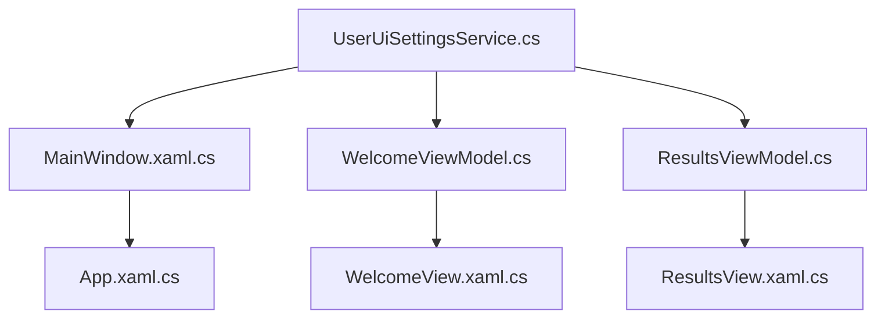
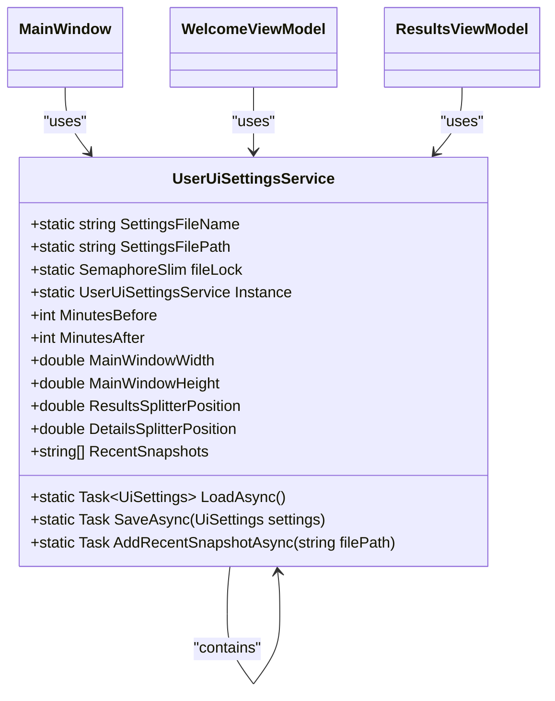
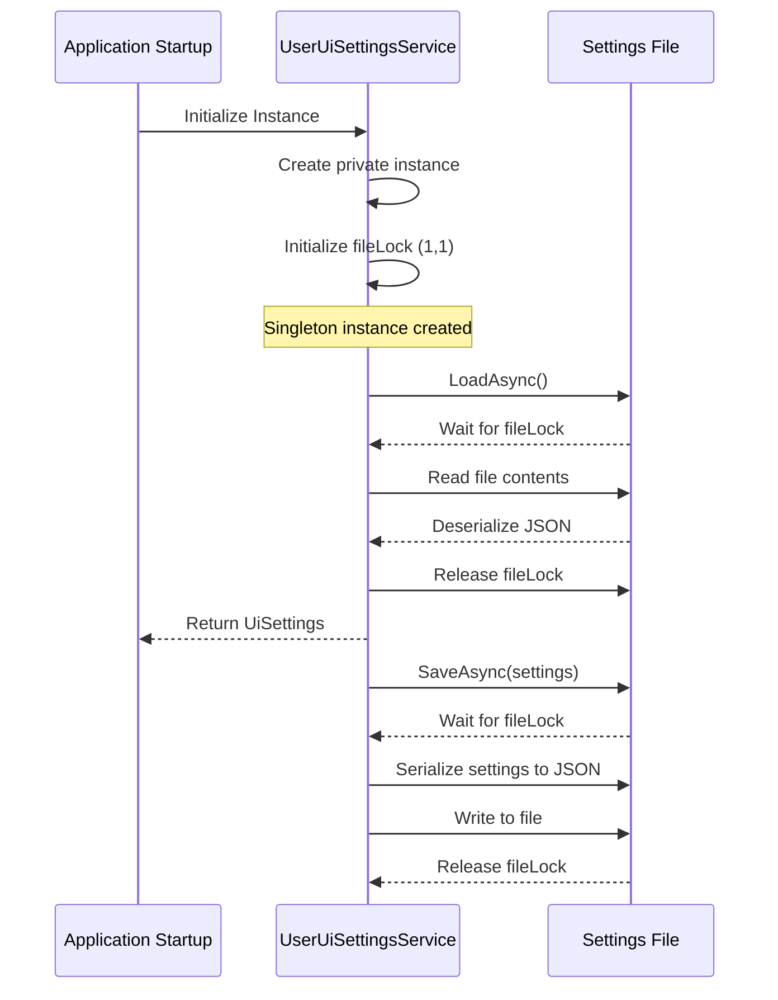
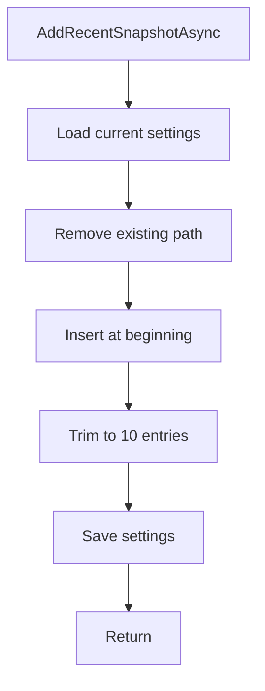
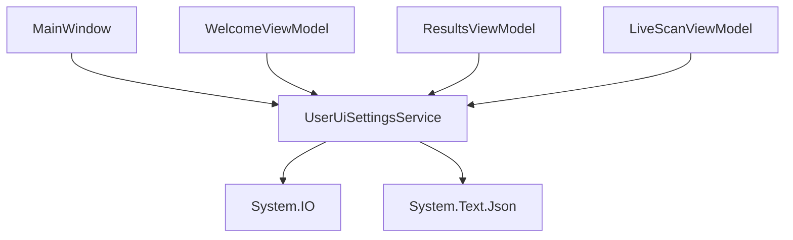

# UserUiSettingsService


## Table of Contents
1. [Introduction](#introduction)
2. [Project Structure](#project-structure)
3. [Core Components](#core-components)
4. [Architecture Overview](#architecture-overview)
5. [Detailed Component Analysis](#detailed-component-analysis)
6. [Dependency Analysis](#dependency-analysis)
7. [Performance Considerations](#performance-considerations)
8. [Troubleshooting Guide](#troubleshooting-guide)
9. [Conclusion](#conclusion)

## Introduction
The `UserUiSettingsService` is a singleton service in Project Janus responsible for managing persistent user interface state. It handles the serialization and deserialization of user preferences such as window dimensions, splitter positions, and recent snapshot paths using JSON. The service ensures thread-safe access to settings via file locking and implements a lazy-loaded singleton pattern. This document provides a comprehensive analysis of its implementation, integration with ViewModels, and strategies for extensibility and schema migration.

## Project Structure
The `UserUiSettingsService` resides within the `Janus.App\Services` directory, indicating its role as a core application service. It interacts with ViewModels in the `ViewModels` folder and UI components in `Resources`. The service uses JSON serialization to persist settings to `UserUiSettings.json` in the application's base directory.





**Diagram sources**
- [UserUiSettingsService.cs](file://Janus.App/Services/UserUiSettingsService.cs)
- [MainWindow.xaml.cs](file://Janus.App/Resources/MainWindow.xaml.cs)
- [WelcomeViewModel.cs](file://Janus.App/ViewModels/WelcomeViewModel.cs)
- [ResultsViewModel.cs](file://Janus.App/ViewModels/ResultsViewModel.cs)

**Section sources**
- [UserUiSettingsService.cs](file://Janus.App/Services/UserUiSettingsService.cs)
- [MainWindow.xaml.cs](file://Janus.App/Resources/MainWindow.xaml.cs)

## Core Components
The core functionality of `UserUiSettingsService` revolves around the `UiSettings` class, which defines the structure of persisted user preferences. Key properties include:
- **MainWindowWidth**: Default width of the main application window
- **MainWindowHeight**: Default height of the main application window
- **ResultsSplitterPosition**: Relative position (0-1) of the results view splitter
- **DetailsSplitterPosition**: Relative position (0-1) of the details view splitter
- **RecentSnapshots**: List of file paths to recently opened snapshot files

The service provides static methods for loading, saving, and updating settings asynchronously, ensuring non-blocking operations on the UI thread.

**Section sources**
- [UserUiSettingsService.cs](file://Janus.App/Services/UserUiSettingsService.cs#L15-L30)

## Architecture Overview
The `UserUiSettingsService` follows a singleton pattern with thread-safe file access. It integrates with the MVVM architecture by providing settings data to ViewModels, which bind to UI elements. The service is consumed by multiple components across the application lifecycle.





**Diagram sources**
- [UserUiSettingsService.cs](file://Janus.App/Services/UserUiSettingsService.cs)

## Detailed Component Analysis

### UserUiSettingsService Implementation
The `UserUiSettingsService` implements a thread-safe singleton pattern using a private constructor and a static `Instance` property. It ensures exclusive access to the settings file using a `SemaphoreSlim` lock, preventing race conditions during concurrent read/write operations.

#### Singleton Pattern and Thread Safety




**Diagram sources**
- [UserUiSettingsService.cs](file://Janus.App/Services/UserUiSettingsService.cs#L1-L65)

**Section sources**
- [UserUiSettingsService.cs](file://Janus.App/Services/UserUiSettingsService.cs#L1-L65)

#### JSON Serialization and File Management
The service uses `System.Text.Json` for serialization, writing settings to `UserUiSettings.json` in the application's base directory (`AppContext.BaseDirectory`). This location ensures settings are stored alongside the executable, making them easily accessible but potentially vulnerable to permission issues in restricted environments.


```csharp
private const string SettingsFileName = "UserUiSettings.json";
private static readonly string SettingsFilePath = Path.Combine(AppContext.BaseDirectory, SettingsFileName);
```


Error handling is implemented to return default settings if the file is missing or corrupted, ensuring application stability.

**Section sources**
- [UserUiSettingsService.cs](file://Janus.App/Services/UserUiSettingsService.cs#L3-L10)

### RecentSnapshots Management
The `RecentSnapshots` collection is managed through the `AddRecentSnapshotAsync` method, which implements a Most Recently Used (MRU) list with the following logic:
1. Remove any existing instance of the file path
2. Insert the path at the beginning of the list
3. Trim the list to a maximum of 10 entries
4. Persist the updated settings

Path validation occurs in consuming ViewModels, where non-existent files are filtered out during display.





**Diagram sources**
- [UserUiSettingsService.cs](file://Janus.App/Services/UserUiSettingsService.cs#L58-L65)

**Section sources**
- [UserUiSettingsService.cs](file://Janus.App/Services/UserUiSettingsService.cs#L58-L65)
- [WelcomeViewModel.cs](file://Janus.App/ViewModels/WelcomeViewModel.cs#L91-L98)

### ViewModel Integration
#### WelcomeViewModel
The `WelcomeViewModel` consumes `UserUiSettingsService` to display and manage recent snapshots. During initialization, it loads recent snapshot paths and validates their existence before populating the UI.


```csharp
private async Task LoadRecentSnapshotsAsync() {
    UserUiSettingsService.UiSettings settings = await UserUiSettingsService.LoadAsync();
    RecentSnapshots.Clear();
    foreach (string? path in settings.RecentSnapshots.Distinct().Take(10)) {
        if (!File.Exists(path)) {
            continue;
        }
        RecentSnapshots.Add(new RecentSnapshotInfo { FilePath = path });
    }
}
```


When a user opens a snapshot, it is added to the recent list via `AddRecentSnapshotAsync`.

**Section sources**
- [WelcomeViewModel.cs](file://Janus.App/ViewModels/WelcomeViewModel.cs#L91-L98)

#### MainWindowViewModel
The `MainWindow` directly interacts with `UserUiSettingsService` to initialize window size from settings and save changes when the window is resized.


```csharp
Initialized += async (s, e) => {
    UserUiSettingsService.UiSettings settings = await UserUiSettingsService.LoadAsync();
    Width = settings.MainWindowWidth;
    Height = settings.MainWindowHeight;
};

private async Task SaveWindowSizeAsync() {
    UserUiSettingsService.UiSettings settings = await UserUiSettingsService.LoadAsync();
    settings.MainWindowWidth = Width;
    settings.MainWindowHeight = Height;
    await UserUiSettingsService.SaveAsync(settings);
}
```


A `Debouncer` is used to throttle save operations during rapid resizing.

**Section sources**
- [MainWindow.xaml.cs](file://Janus.App/Resources/MainWindow.xaml.cs#L15-L40)

#### ResultsViewModel
The `ResultsViewModel` manages splitter positions using `UserUiSettingsService`, loading initial values and saving changes with debounced updates to prevent excessive file I/O.


```csharp
private async Task LoadUiSettingsAsync() {
    UserUiSettingsService.UiSettings settings = await UserUiSettingsService.LoadAsync();
    ResultsSplitterPosition = settings.ResultsSplitterPosition;
    DetailsSplitterPosition = settings.DetailsSplitterPosition;
}

private async Task SaveUiSettingsAsync() {
    UserUiSettingsService.UiSettings settings = await UserUiSettingsService.LoadAsync();
    settings.ResultsSplitterPosition = ResultsSplitterPosition;
    settings.DetailsSplitterPosition = DetailsSplitterPosition;
    await UserUiSettingsService.SaveAsync(settings);
}
```


**Section sources**
- [ResultsViewModel.cs](file://Janus.App/ViewModels/ResultsViewModel.cs#L535-L563)

## Dependency Analysis
The `UserUiSettingsService` has minimal external dependencies, relying only on .NET's `System.IO` and `System.Text.Json` namespaces. It is referenced by multiple ViewModels and UI components, establishing it as a central configuration hub.





**Diagram sources**
- [UserUiSettingsService.cs](file://Janus.App/Services/UserUiSettingsService.cs)
- [MainWindow.xaml.cs](file://Janus.App/Resources/MainWindow.xaml.cs)
- [WelcomeViewModel.cs](file://Janus.App/ViewModels/WelcomeViewModel.cs)
- [ResultsViewModel.cs](file://Janus.App/ViewModels/ResultsViewModel.cs)

## Performance Considerations
The service employs several performance optimizations:
- **Asynchronous operations**: All file I/O is performed asynchronously to prevent UI blocking
- **Debounced writes**: Window size and splitter position updates are throttled to reduce disk writes
- **File locking**: `SemaphoreSlim` ensures thread-safe access without expensive synchronization primitives

Potential bottlenecks include frequent settings updates, though the debouncing mechanism in `ResultsViewModel` mitigates this risk.

## Troubleshooting Guide
Common issues and their solutions:

### Settings Not Persisting
**Symptom**: Window size or splitter positions reset on restart  
**Cause**: Write permissions denied in application directory  
**Solution**: Run application with elevated privileges or modify installation directory permissions

### Corrupted Settings File
**Symptom**: Application resets to default settings unexpectedly  
**Cause**: `UserUiSettings.json` contains invalid JSON  
**Solution**: Manually delete the file to force recreation with defaults

### Missing Recent Snapshots
**Symptom**: Recent snapshot list appears empty  
**Cause**: Referenced snapshot files have been moved or deleted  
**Solution**: The service automatically filters out invalid paths; users should reopen desired snapshots to repopulate the list

**Section sources**
- [UserUiSettingsService.cs](file://Janus.App/Services/UserUiSettingsService.cs#L30-L55)
- [WelcomeViewModel.cs](file://Janus.App/ViewModels/WelcomeViewModel.cs#L91-L98)

## Conclusion
The `UserUiSettingsService` provides a robust solution for persistent UI state management in Project Janus. Its thread-safe singleton pattern, JSON-based persistence, and seamless ViewModel integration make it a reliable component for maintaining user preferences. The service's design allows for easy extensibility—new UI properties can be added to the `UiSettings` class without modifying the core service logic. For future schema migrations, versioning could be implemented by adding a version field to `UiSettings` and including migration logic in the `LoadAsync` method, leveraging the project's existing Nerdbank.GitVersioning setup for version tracking.

**Referenced Files in This Document**   
- [UserUiSettingsService.cs](file://Janus.App/Services/UserUiSettingsService.cs)
- [MainWindow.xaml.cs](file://Janus.App/Resources/MainWindow.xaml.cs)
- [WelcomeViewModel.cs](file://Janus.App/ViewModels/WelcomeViewModel.cs)
- [ResultsViewModel.cs](file://Janus.App/ViewModels/ResultsViewModel.cs)
- [App.xaml.cs](file://Janus.App/Resources/App.xaml.cs)
- [Janus.App.csproj](file://Janus.App/Janus.App.csproj)
- [version.json](file://version.json)