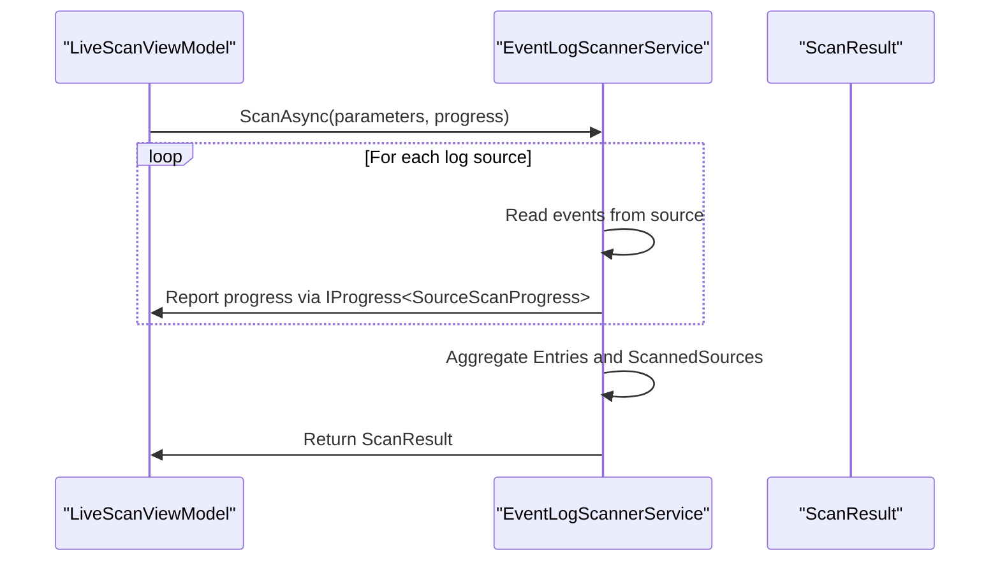
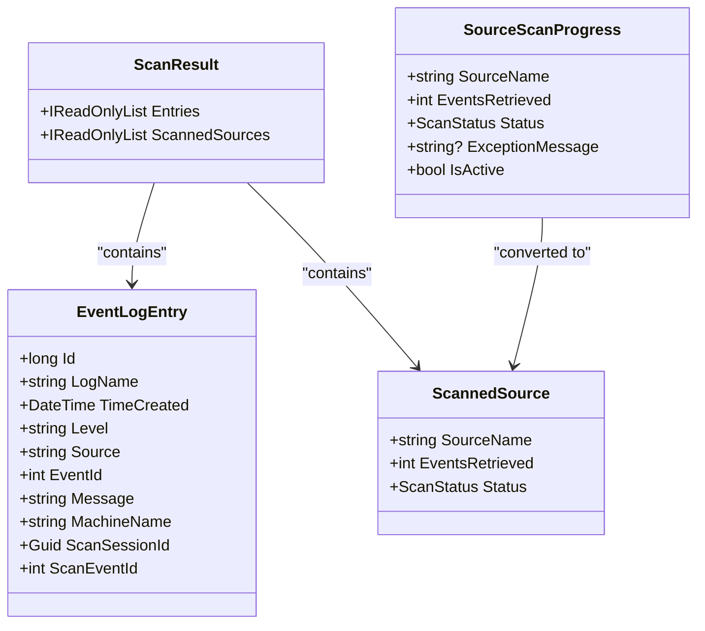
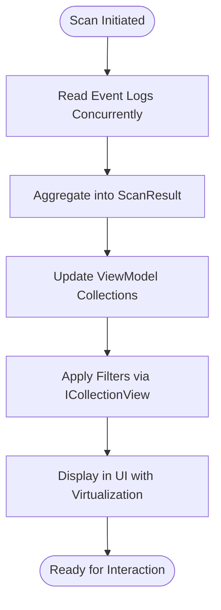

# ScanResult Data Model


## Table of Contents
1. [Introduction](#introduction)
2. [ScanResult Class Definition](#scanresult-class-definition)
3. [Properties of ScanResult](#properties-of-scanresult)
4. [Integration with EventLogScannerService](#integration-with-eventlogscannerservice)
5. [Aggregation of Scan Outcomes](#aggregation-of-scan-outcomes)
6. [Integration with ViewModels](#integration-with-viewmodels)
7. [Usage Examples](#usage-examples)
8. [Error Handling and Exception Transformation](#error-handling-and-exception-transformation)
9. [Performance Implications and Best Practices](#performance-implications-and-best-practices)
10. [Conclusion](#conclusion)

## Introduction
The `ScanResult` class in Project Janus is a critical data model designed to encapsulate the outcomes of event log scanning operations. It serves as a structured return type for asynchronous scanning processes, enabling consistent communication of scan status, collected data, and metadata across service and presentation layers. This document provides a comprehensive analysis of the `ScanResult` class, its properties, usage patterns, integration points, and performance considerations. The model plays a central role in aggregating results from multiple sources and presenting them through the application’s user interface.

**Section sources**
- [ScanResult.cs](file://Janus.App/Services/ScanResult.cs#L1-L8)

## ScanResult Class Definition
The `ScanResult` class is defined in the `Janus.App.Services` namespace and represents the final output of an event log scanning operation. It is a simple, immutable data transfer object that contains two primary collections: event entries and scanned source metadata. The class uses `required` and `init` modifiers to enforce initialization at construction time while preventing modification afterward, ensuring data integrity.


```csharp
using Janus.Core;

namespace Janus.App;

public class ScanResult {
  public required IReadOnlyList<EventLogEntry> Entries { get; init; }
  public required IReadOnlyList<ScannedSource> ScannedSources { get; init; }
}
```


This design supports functional programming principles by promoting immutability and thread-safe data sharing across components.

**Section sources**
- [ScanResult.cs](file://Janus.App/Services/ScanResult.cs#L1-L8)

## Properties of ScanResult

### Entries
**Label**: `Entries`  
**Type**: `IReadOnlyList<EventLogEntry>`  
**Description**: A read-only list of `EventLogEntry` objects representing individual event log records retrieved during the scan. Each entry contains detailed information such as timestamp, log level, source, event ID, message, and machine name.


```csharp
public required IReadOnlyList<EventLogEntry> Entries { get; init; }
```


The use of `IReadOnlyList<T>` ensures that consumers cannot modify the collection, preserving data consistency. This property is essential for displaying event data in the UI and exporting snapshots.

**Section sources**
- [ScanResult.cs](file://Janus.App/Services/ScanResult.cs#L5)
- [EventLogEntry.cs](file://Janus.Core/EventLogEntry.cs#L1-L18)

### ScannedSources
**Label**: `ScannedSources`  
**Type**: `IReadOnlyList<ScannedSource>`  
**Description**: A read-only list of `ScannedSource` objects that track the scanning status and statistics for each event log source (e.g., Application, System). Each `ScannedSource` includes the source name, number of events retrieved, and a `ScanStatus` enum indicating success, partial success, or failure.


```csharp
public required IReadOnlyList<ScannedSource> ScannedSources { get; init; }
```


This property enables high-level status reporting and error diagnosis by summarizing per-source outcomes.

**Section sources**
- [ScanResult.cs](file://Janus.App/Services/ScanResult.cs#L6)
- [ScannedSource.cs](file://Janus.Core/ScannedSource.cs#L1-L13)

## Integration with EventLogScannerService
The `EventLogScannerService` utilizes `ScanResult` as the return type for its asynchronous scanning method, `ScanAsync`. This service orchestrates the scanning of multiple event log sources concurrently, using progress reporting via `IProgress<SourceScanProgress>` to update the UI in real time. Upon completion, it aggregates all collected entries and source statuses into a single `ScanResult` instance.





**Diagram sources**
- [EventLogScannerService.cs](file://Janus.App/Services/EventLogScannerService.cs#L50-L150)
- [ScanResult.cs](file://Janus.App/Services/ScanResult.cs#L1-L8)

The service handles exceptions during log reading by capturing error details in the `SourceScanProgress.ExceptionMessage` and setting the appropriate `ScanStatus`, which is later converted into `ScannedSource` entries included in the final `ScanResult`.

**Section sources**
- [EventLogScannerService.cs](file://Janus.App/Services/EventLogScannerService.cs#L50-L150)

## Aggregation of Scan Outcomes
Multiple individual scan operations (one per log source) are aggregated into a unified `ScanResult`. The `EventLogScannerService` maintains running totals of events retrieved and tracks the success/failure status of each source. After all sources are processed, it constructs the `ScanResult` by combining:

- All `EventLogEntry` instances into the `Entries` list
- Finalized `ScannedSource` records into the `ScannedSources` list

This aggregation pattern allows the application to present a holistic view of the scan, including total event count and per-source health status. The `LiveScanViewModel` uses `SourceScanProgress` objects during the scan to track intermediate states, which are later converted to `ScannedSource` upon completion.





**Diagram sources**
- [ScanResult.cs](file://Janus.App/Services/ScanResult.cs#L1-L8)
- [EventLogEntry.cs](file://Janus.Core/EventLogEntry.cs#L1-L18)
- [ScannedSource.cs](file://Janus.Core/ScannedSource.cs#L1-L13)
- [SourceScanProgress.cs](file://Janus.App/ViewModels/SourceScanProgress.cs#L1-L25)

**Section sources**
- [EventLogScannerService.cs](file://Janus.App/Services/EventLogScannerService.cs#L100-L140)
- [LiveScanViewModel.cs](file://Janus.App/ViewModels/LiveScanViewModel.cs#L150-L220)

## Integration with ViewModels
The `ScanResult` is consumed by view models such as `ResultsViewModel` to populate the UI with scan outcomes. The `ResultsViewModel.LoadEvents()` method takes the `Entries` collection and converts each `EventLogEntry` into an `EventLogEntryDisplay` object for rich text rendering with search highlighting.

Similarly, `LoadScannedSources()` populates the UI with per-source statistics and status indicators. The `ScanStatusToBrushConverter` uses the `ScannedSource.Status` to color-code sources in the UI (green for success, orange for partial, red for failed).


```csharp
public void LoadEvents(IEnumerable<EventLogEntry> events) {
    Events.Clear();
    foreach (EventLogEntry e in events) {
        Events.Add(new EventLogEntryDisplay(e, () => SearchText));
    }
    RebuildView();
}
```


This integration enables responsive, real-time updates and filtering capabilities in the results view.

**Section sources**
- [ResultsViewModel.cs](file://Janus.App/ViewModels/ResultsViewModel.cs#L300-L350)
- [ScanStatusToBrushConverter.cs](file://Janus.App/Helpers/ScanStatusToBrushConverter.cs#L1-L24)

## Usage Examples

### Success Scenario
When a scan completes successfully across all sources:

```csharp
var result = await scanner.ScanAsync(timestamp, before, after, progress);
// result.Entries contains all retrieved events
// result.ScannedSources contains entries with Status = ScanStatus.Success
resultsViewModel.LoadEvents(result.Entries);
resultsViewModel.LoadScannedSources(result.ScannedSources);
```


### Failure Scenario
When one or more sources fail to be read:

```csharp
// After scan completes
foreach (var source in result.ScannedSources) {
    if (source.Status == ScanStatus.Failed) {
        MessageBox.Show($"Failed to read {source.SourceName}: {source.ExceptionMessage}");
    }
}
```


The UI reflects this via color-coded status indicators and summary messages.

**Section sources**
- [LiveScanViewModel.cs](file://Janus.App/ViewModels/LiveScanViewModel.cs#L150-L220)
- [ResultsViewModel.cs](file://Janus.App/ViewModels/ResultsViewModel.cs#L300-L350)

## Error Handling and Exception Transformation
Exceptions encountered during log reading (e.g., access denied, corrupted logs) are caught within the `EventLogScannerService`. Instead of propagating exceptions, the service transforms them into structured data by:

1. Setting `ScanStatus.Failed` or `ScanStatus.Partial` in the `SourceScanProgress`
2. Capturing the exception message in `SourceScanProgress.ExceptionMessage`
3. Including this information in the final `ScannedSource` list within `ScanResult`

This approach ensures that partial results are still available even when some sources fail, improving usability and data availability.

**Section sources**
- [EventLogScannerService.cs](file://Janus.App/Services/EventLogScannerService.cs#L80-L130)
- [SourceScanProgress.cs](file://Janus.App/ViewModels/SourceScanProgress.cs#L1-L25)

## Performance Implications and Best Practices

### Large Event Counts
Collecting large numbers of events can impact memory usage and UI responsiveness. The `ResultsViewModel` mitigates this by:
- Using `ICollectionView` for virtualized filtering and sorting
- Implementing debounced UI updates to prevent excessive rendering
- Supporting incremental loading patterns where applicable

### Best Practices for UI Contexts
- Always process `ScanResult` on a background thread when performing heavy operations (e.g., filtering, searching)
- Use `IProgress<T>` for real-time updates without blocking the UI
- Leverage `ObservableCollection<T>` and `ICollectionView` for efficient data binding
- Avoid holding references to large `Entries` collections longer than necessary
- Consider pagination or virtualization for very large datasets





**Diagram sources**
- [ResultsViewModel.cs](file://Janus.App/ViewModels/ResultsViewModel.cs#L200-L400)
- [LiveScanViewModel.cs](file://Janus.App/ViewModels/LiveScanViewModel.cs#L100-L250)

**Section sources**
- [ResultsViewModel.cs](file://Janus.App/ViewModels/ResultsViewModel.cs#L200-L400)
- [LiveScanViewModel.cs](file://Janus.App/ViewModels/LiveScanViewModel.cs#L100-L250)

## Conclusion
The `ScanResult` data model is a foundational component in Project Janus, providing a structured, immutable representation of event log scanning outcomes. It enables robust error handling, efficient data aggregation, and seamless integration with the MVVM architecture. By encapsulating both raw event data and scan metadata, it supports comprehensive analysis, visualization, and persistence through snapshot functionality. Proper handling of `ScanResult` in UI contexts—particularly with regard to performance and responsiveness—is essential for delivering a smooth user experience, especially when dealing with large volumes of event data.

**Referenced Files in This Document**   
- [ScanResult.cs](file://Janus.App/Services/ScanResult.cs)
- [EventLogScannerService.cs](file://Janus.App/Services/EventLogScannerService.cs)
- [EventLogEntry.cs](file://Janus.Core/EventLogEntry.cs)
- [ScannedSource.cs](file://Janus.Core/ScannedSource.cs)
- [ResultsViewModel.cs](file://Janus.App/ViewModels/ResultsViewModel.cs)
- [SnapshotService.cs](file://Janus.App/Services/SnapshotService.cs)
- [LiveScanViewModel.cs](file://Janus.App/ViewModels/LiveScanViewModel.cs)
- [SourceScanProgress.cs](file://Janus.App/ViewModels/SourceScanProgress.cs)