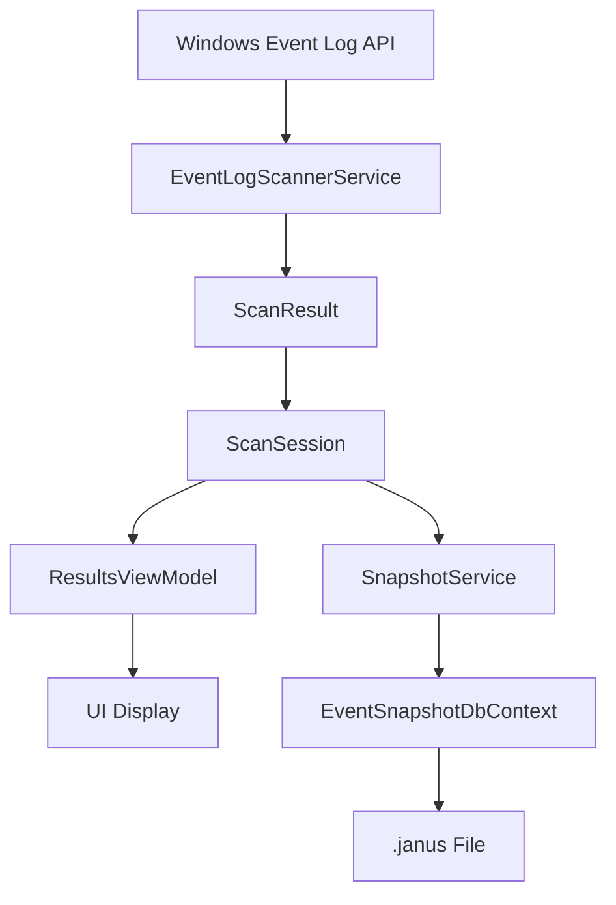
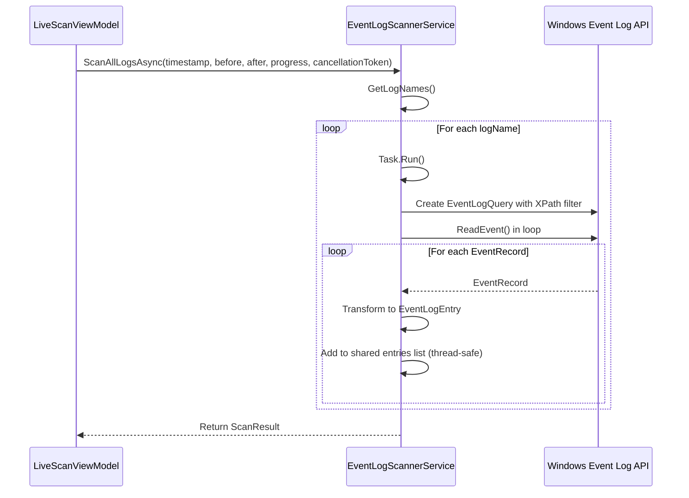
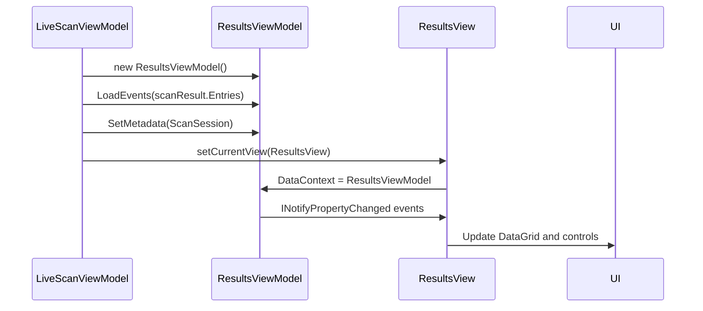
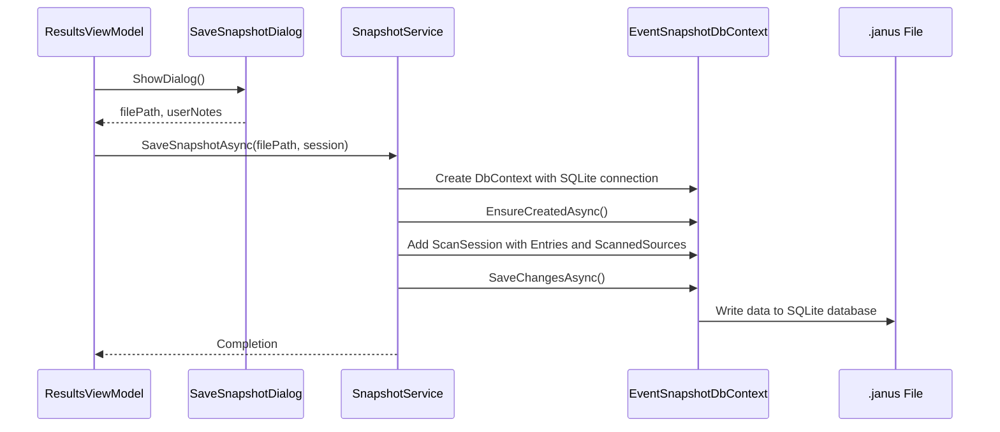
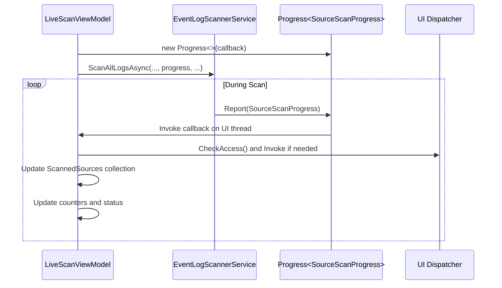
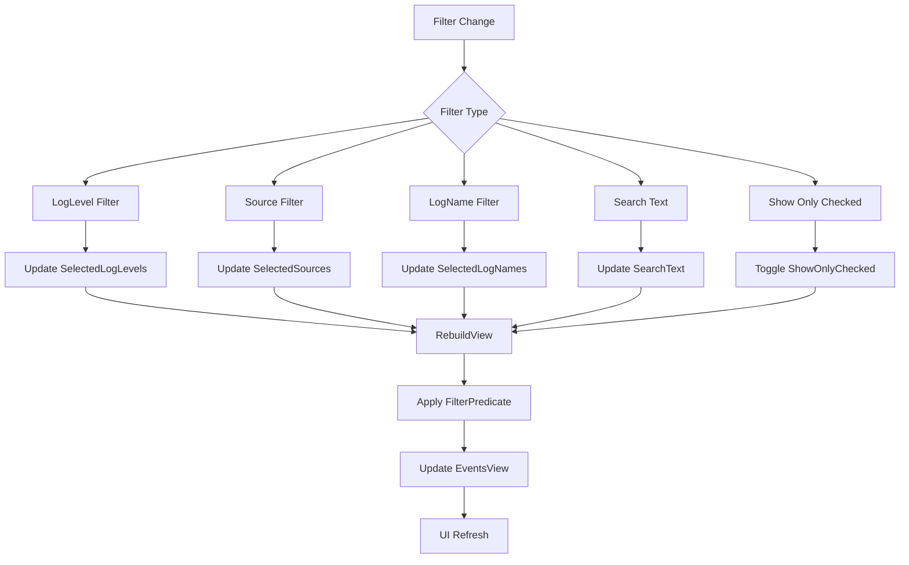
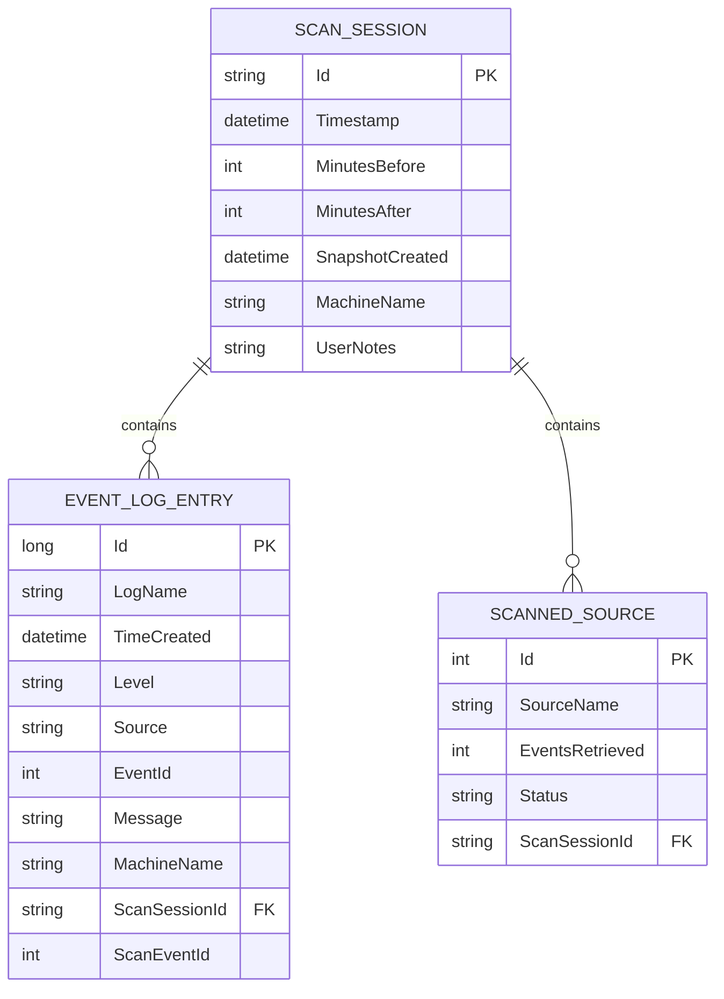

# Data Flow and Integration

## Table of Contents
1. [Data Flow Architecture Overview](#data-flow-architecture-overview)
2. [Event Log Scanning Pipeline](#event-log-scanning-pipeline)
3. [Scan Result Processing and UI Display](#scan-result-processing-and-ui-display)
4. [Snapshot Workflow and Storage](#snapshot-workflow-and-storage)
5. [Real-Time Progress Updates](#real-time-progress-updates)
6. [Filtering Mechanism in ResultsViewModel](#filtering-mechanism-in-resultsviewmodel)
7. [Structure of .janus Files](#structure-of-janus-files)
8. [Memory Management and Streaming Considerations](#memory-management-and-streaming-considerations)
9. [Data Consistency Guarantees](#data-consistency-guarantees)
10. [Troubleshooting Common Data Flow Issues](#troubleshooting-common-data-flow-issues)

## Data Flow Architecture Overview

Project Janus implements a comprehensive data flow architecture for Windows event log analysis, following a clean separation of concerns between core data models and application services. The system processes event logs through a multi-stage pipeline from data acquisition to persistent storage and user interface presentation.

The architecture follows a layered approach with distinct components:
- **Data Acquisition Layer**: EventLogScannerService interfaces with Windows Event Log API
- **Core Domain Layer**: Janus.Core contains EF Core models and DbContext
- **Application Services Layer**: Handles business logic, scanning, and snapshot operations
- **Presentation Layer**: MVVM pattern with ViewModels and Views for user interaction

This separation ensures that data models remain independent of UI concerns while enabling efficient data transformation throughout the processing pipeline.

**Diagram sources**
- [EventLogScannerService.cs](file://Janus.App/Services/EventLogScannerService.cs#L31-L160)
- [ScanSession.cs](file://Janus.Core/ScanSession.cs#L1-L35)
- [SnapshotService.cs](file://Janus.App/Services/SnapshotService.cs#L1-L79)

## Event Log Scanning Pipeline

The event log scanning pipeline begins with the EventLogScannerService, which serves as the primary interface to the Windows Event Log API through the System.Diagnostics.Eventing.Reader namespace. This service implements parallel scanning of multiple event logs using Task.Run for concurrent execution.

### Data Acquisition Process

The scanning process follows these steps:
1. Retrieve all available event log names via EventLogSession.GlobalSession.GetLogNames()
2. For each log, create a time-based XPath query to filter events within the specified window
3. Process events asynchronously using EventLogReader with cancellation support
4. Transform raw EventRecord objects into EventLogEntry domain models

**Diagram sources**
- [EventLogScannerService.cs](file://Janus.App/Services/EventLogScannerService.cs#L31-L160)
- [LiveScanViewModel.cs](file://Janus.App/ViewModels/LiveScanViewModel.cs#L156-L242)

### Data Transformation

During scanning, raw EventRecord objects are transformed into EventLogEntry instances with the following mapping:

**EventLogEntry Structure**
- Id: record.RecordId ?? 0
- LogName: logName from query
- TimeCreated: record.TimeCreated ?? DateTime.MinValue
- Level: record.LevelDisplayName ?? "Unknown"
- Source: record.ProviderName ?? "Unknown"
- EventId: record.Id
- Message: record.FormatDescription() ?? string.Empty
- MachineName: record.MachineName ?? Environment.MachineName
- ScanSessionId: Guid.Empty (set later)
- ScanEventId: Sequential counter using Interlocked.Increment

The transformation occurs within a Task.Run delegate to enable parallel processing of multiple event logs. Thread safety is maintained using lock statements when adding entries to the shared collection and updating counters.

**Section sources**
- [EventLogScannerService.cs](file://Janus.App/Services/EventLogScannerService.cs#L61-L86)

## Scan Result Processing and UI Display

After scanning completes, the results are processed and displayed through the MVVM pattern, with data flowing from ScanResult objects to the ResultsViewModel and ultimately to the UI.

### Data Flow to UI

The journey from scan results to UI display follows this path:
1. LiveScanViewModel receives ScanResult from EventLogScannerService
2. Creates new ResultsViewModel with PreviousView.LiveScan
3. Loads events into ResultsViewModel via LoadEvents() method
4. Sets metadata including ScanSession object
5. Navigates to ResultsView with ResultsViewModel as DataContext

**Diagram sources**
- [LiveScanViewModel.cs](file://Janus.App/ViewModels/LiveScanViewModel.cs#L211-L242)
- [ResultsViewModel.cs](file://Janus.App/ViewModels/ResultsViewModel.cs#L396-L445)

### ResultsViewModel Implementation

The ResultsViewModel manages the presentation of scan results with the following key components:

**Data Collections**
- Events: ObservableCollection<EventLogEntryDisplay> - main event list
- EventsView: ICollectionView - filtered/sorted view of events
- LogLevels: Available severity levels for filtering
- Sources: Unique event sources encountered
- LogNames: Unique log names encountered

The LoadEvents method processes raw EventLogEntry objects, creating EventLogEntryDisplay wrappers that support message highlighting and other UI-specific features. It also populates filter options by extracting unique values from the event data.

**Section sources**
- [ResultsViewModel.cs](file://Janus.App/ViewModels/ResultsViewModel.cs#L396-L445)

## Snapshot Workflow and Storage

The snapshot workflow enables persistent storage of scan results in portable .janus files, allowing offline analysis without access to the original system.

### Snapshot Creation Process

The snapshot workflow follows these steps:
1. User initiates save operation via SaveSnapshotCommand
2. SaveSnapshotDialog displays for file selection and notes
3. SnapshotService.SaveSnapshotAsync() is called with filePath and ScanSession
4. EventSnapshotDbContext is configured with SQLite connection string
5. ScanSession and related entities are saved to SQLite database
6. .janus file is created on disk

**Diagram sources**
- [SnapshotService.cs](file://Janus.App/Services/SnapshotService.cs#L1-L79)
- [ResultsViewModel.cs](file://Janus.App/ViewModels/ResultsViewModel.cs#L330-L363)

### Snapshot Loading Process

Loading snapshots follows a similar but reversed process:
1. User selects .janus file via file dialog
2. SnapshotService.LoadSnapshotAsync() is called with filePath
3. EventSnapshotDbContext is configured with SQLite connection string
4. ScanSession is retrieved with related Entries and ScannedSources
5. ResultsViewModel is created and populated with loaded data
6. UI navigates to ResultsView with loaded data

The loading process uses EF Core's Include() method to eagerly load related data and AsSplitQuery() to optimize performance with complex object graphs.

**Section sources**
- [SnapshotService.cs](file://Janus.App/Services/SnapshotService.cs#L32-L78)

## Real-Time Progress Updates

Project Janus provides real-time progress updates during scanning operations through the IProgress<T> pattern and SourceScanProgress class.

### Progress Reporting Mechanism

The progress update system works as follows:
1. LiveScanViewModel creates a Progress<SourceScanProgress> instance
2. This progress reporter is passed to EventLogScannerService.ScanAllLogsAsync()
3. As each log is scanned, periodic updates are reported via progress.Report()
4. Updates are throttled by event count (default 250) or time interval (default 250ms)
5. UI updates occur on the dispatcher thread to ensure thread safety

**Diagram sources**
- [EventLogScannerService.cs](file://Janus.App/Services/EventLogScannerService.cs#L85-L119)
- [LiveScanViewModel.cs](file://Janus.App/ViewModels/LiveScanViewModel.cs#L156-L187)

### SourceScanProgress Class

The SourceScanProgress class provides detailed information about the scanning progress of individual event logs:

**Progress Properties**
- SourceName: Name of the event log being scanned
- EventsRetrieved: Number of events retrieved so far
- Status: Current ScanStatus (Success, Partial, Failed)
- IsTotalKnown: Whether total event count is known
- TotalEvents: Total number of events (if known)
- IsActive: Whether scanning is still in progress
- ExceptionMessage: Error message if scan failed

The class implements INotifyPropertyChanged to enable data binding in the UI, allowing real-time updates to progress indicators.

**Section sources**
- [SourceScanProgress.cs](file://Janus.App/ViewModels/SourceScanProgress.cs#L1-L25)

## Filtering Mechanism in ResultsViewModel

The ResultsViewModel implements a comprehensive filtering system that allows users to narrow down event results based on multiple criteria.

### Filter Implementation

The filtering mechanism uses WPF's ICollectionView with a custom FilterPredicate to determine which events are visible:

**Diagram sources**
- [ResultsViewModel.cs](file://Janus.App/ViewModels/ResultsViewModel.cs#L396-L445)

### Filter Predicate Logic

The FilterPredicate method evaluates each event against all active filters:

**Filter Conditions (all must pass)**
- ShowOnlyChecked: If enabled, only events with checkedScanEventIds are shown
- SelectedLogLevels: Event level must be in the selected levels collection
- SelectedSources: Event source must be in the selected sources collection
- SelectedLogNames: Event log name must be in the selected log names collection
- SearchText: Event message must contain the search text (case-insensitive)

The filtering is implemented efficiently by creating a new CollectionViewSource on each filter change, which triggers a complete refresh of the displayed data.

**Section sources**
- [ResultsViewModel.cs](file://Janus.App/ViewModels/ResultsViewModel.cs#L420-L445)

## Structure of .janus Files

.janus files are SQLite database files that store complete scan sessions in a structured format, enabling portable and self-contained event log analysis.

### Database Schema

The .janus file structure is defined by the EventSnapshotDbContext and consists of three main tables:

**Diagram sources**
- [EventSnapshotDbContext.cs](file://Janus.Core/EventSnapshotDbContext.cs#L1-L25)
- [ScanSession.cs](file://Janus.Core/ScanSession.cs#L1-L35)

### Metadata Separation

The schema separates metadata from event data through the following design:

**Metadata Tables**
- ScanSession: Contains scan parameters, timestamps, and session metadata
- ScannedSource: Contains per-log statistics and scan status

**Event Data Table**
- EventLogEntry: Contains the actual event records with all their properties

This separation allows for efficient querying of metadata without loading all event data, and enables features like fast loading of snapshot metadata for the file open dialog.

The ScanSession entity acts as the root aggregate, with EF Core configured to cascade deletes to related ScannedSource and EventLogEntry entities.

**Section sources**
- [EventSnapshotDbContext.cs](file://Janus.Core/EventSnapshotDbContext.cs#L1-L25)

## Memory Management and Streaming Considerations

Project Janus employs several strategies to manage memory efficiently during large scans and handle streaming data considerations.

### Memory Management Strategies

The application addresses memory concerns through the following approaches:

**Concurrent Processing with Memory Control**
- Parallel scanning of event logs using Task.Run
- Throttled progress reporting to prevent UI thread overload
- Use of lock statements for thread-safe collection access
- Interlocked operations for atomic counter updates

**Collection Management**
- ObservableCollection for UI-bound collections with change notifications
- ICollectionView for filtered/sorted views without duplicating data
- HashSet for efficient tracking of checked items
- IReadOnlyList for immutable result collections

The system avoids loading all event data into memory at once by processing events incrementally and only creating UI objects when needed.

### Streaming Considerations

While the current implementation loads all events into memory, the architecture supports potential streaming enhancements:

**Current Limitations**
- All EventLogEntry objects are stored in memory during scanning
- Complete scan results are held in memory before UI display
- No true streaming from event source to UI

**Potential Improvements**
- Implement IAsyncEnumerable for incremental event processing
- Use virtualized data sources for large result sets
- Add pagination for extremely large scans
- Implement incremental UI updates during scanning

The use of async/await throughout the pipeline provides a foundation for future streaming capabilities, though the current implementation prioritizes simplicity and completeness over streaming efficiency.

**Section sources**
- [EventLogScannerService.cs](file://Janus.App/Services/EventLogScannerService.cs#L31-L160)
- [ResultsViewModel.cs](file://Janus.App/ViewModels/ResultsViewModel.cs#L396-L445)

## Data Consistency Guarantees

Project Janus provides several data consistency guarantees through its architecture and implementation choices.

### Transactional Integrity

The snapshot storage system ensures data consistency through:

**Atomic Operations**
- Single SaveChangesAsync() call for complete session save
- SQLite transaction wrapping all insert operations
- Cascade delete configuration for related entities

**Error Handling**
- Try-catch blocks around database operations
- SqliteException handling for schema mismatches
- InvalidOperationException wrapping for user-friendly error messages

### Data Validation

The system maintains data consistency through:

**Model Validation**
- Required properties using 'required' keyword
- Init-only setters for immutable properties
- Proper data types and constraints
- Enum conversion for ScanStatus (stored as string)

**Runtime Validation**
- CancellationToken support for graceful cancellation
- Null checks and default values for optional fields
- Proper time zone handling (UTC conversion)
- Thread-safe collection modifications

The use of EF Core ensures referential integrity between ScanSession, EventLogEntry, and ScannedSource entities, with proper foreign key relationships enforced at the database level.

**Section sources**
- [SnapshotService.cs](file://Janus.App/Services/SnapshotService.cs#L1-L79)
- [EventSnapshotDbContext.cs](file://Janus.Core/EventSnapshotDbContext.cs#L1-L25)

## Troubleshooting Common Data Flow Issues

This section provides guidance for diagnosing and resolving common data flow issues in Project Janus.

### Missing Events

**Symptoms**: Fewer events than expected in results.

**Potential Causes and Solutions**:
- **Insufficient permissions**: Run as administrator (required for accessing all event logs)
- **Time window too narrow**: Adjust MinutesBefore/MinutesAfter values
- **Event log filtering**: Verify XPath query is correct and not excluding events
- **Cancellation during scan**: Check if scan was cancelled before completion
- **Exception during reading**: Review ExceptionMessage in SourceScanProgress

**Diagnostic Steps**:
1. Check ScannedSources list for any logs with Status = Failed
2. Verify the time window covers the expected event period
3. Confirm application is running with administrator privileges
4. Review the XPath query in EventLogScannerService for correctness

### Corrupted Snapshots

**Symptoms**: Unable to open .janus files or load errors.

**Potential Causes and Solutions**:
- **Schema version mismatch**: Application model changed since snapshot was saved
- **File corruption**: Incomplete write or disk errors
- **SQLite database locked**: File in use by another process
- **Invalid file format**: File not a valid .janus snapshot

**Diagnostic Steps**:
1. Check for SqliteException when loading snapshot
2. Verify file extension and MIME type
3. Test with a newly created snapshot
4. Examine file size (corrupted files may be very small)
5. Use SQLite browser to inspect database structure

### Performance Issues

**Symptoms**: Slow scanning or unresponsive UI.

**Potential Causes and Solutions**:
- **Large event logs**: Some logs may contain millions of events
- **Antivirus interference**: Real-time scanning of SQLite files
- **Disk I/O bottlenecks**: Slow storage system
- **Memory pressure**: Large result sets consuming RAM

**Optimization Strategies**:
- Narrow the time window to reduce scanned events
- Exclude rarely used event logs from scanning
- Ensure sufficient RAM for large result sets
- Use SSD storage for better I/O performance
- Monitor progress updates to identify slow logs

### Progress Update Problems

**Symptoms**: Stalled or inaccurate progress reporting.

**Potential Causes and Solutions**:
- **Throttling settings**: Default 250ms/250 events may be too aggressive
- **UI thread blocking**: Long-running operations on dispatcher thread
- **Collection updates**: Frequent ObservableCollection modifications

**Diagnostic Steps**:
1. Verify Progress<SourceScanProgress> is properly instantiated
2. Check that dispatcher.Invoke is used correctly
3. Monitor the frequency of progress updates
4. Review lock usage in scanning threads

**Section sources**
- [EventLogScannerService.cs](file://Janus.App/Services/EventLogScannerService.cs#L31-L160)
- [SnapshotService.cs](file://Janus.App/Services/SnapshotService.cs#L1-L79)
- [LiveScanViewModel.cs](file://Janus.App/ViewModels/LiveScanViewModel.cs#L156-L242)

**Referenced Files in This Document**   
- [EventLogScannerService.cs](file://Janus.App/Services/EventLogScannerService.cs#L31-L160)
- [ScanResult.cs](file://Janus.App/Services/ScanResult.cs#L1-L7)
- [EventLogEntry.cs](file://Janus.Core/EventLogEntry.cs#L1-L18)
- [ScanSession.cs](file://Janus.Core/ScanSession.cs#L1-L35)
- [ScannedSource.cs](file://Janus.Core/ScannedSource.cs#L1-L13)
- [LiveScanViewModel.cs](file://Janus.App/ViewModels/LiveScanViewModel.cs#L156-L242)
- [ResultsViewModel.cs](file://Janus.App/ViewModels/ResultsViewModel.cs#L396-L445)
- [SourceScanProgress.cs](file://Janus.App/ViewModels/SourceScanProgress.cs#L1-L25)
- [SnapshotService.cs](file://Janus.App/Services/SnapshotService.cs#L1-L79)
- [EventSnapshotDbContext.cs](file://Janus.Core/EventSnapshotDbContext.cs#L1-L25)