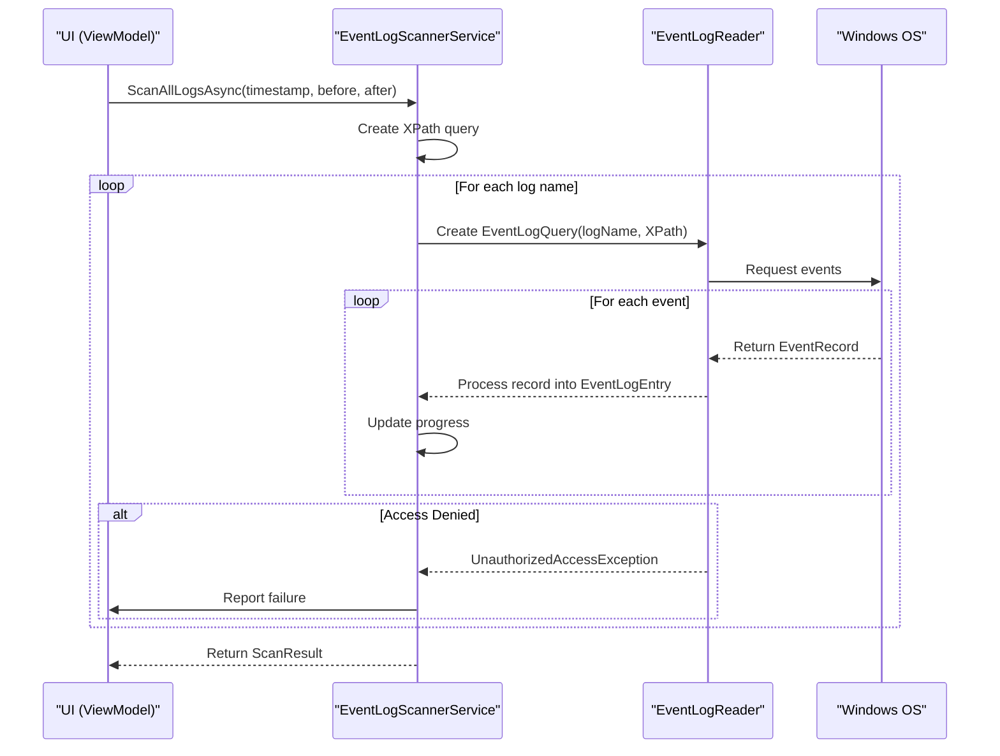
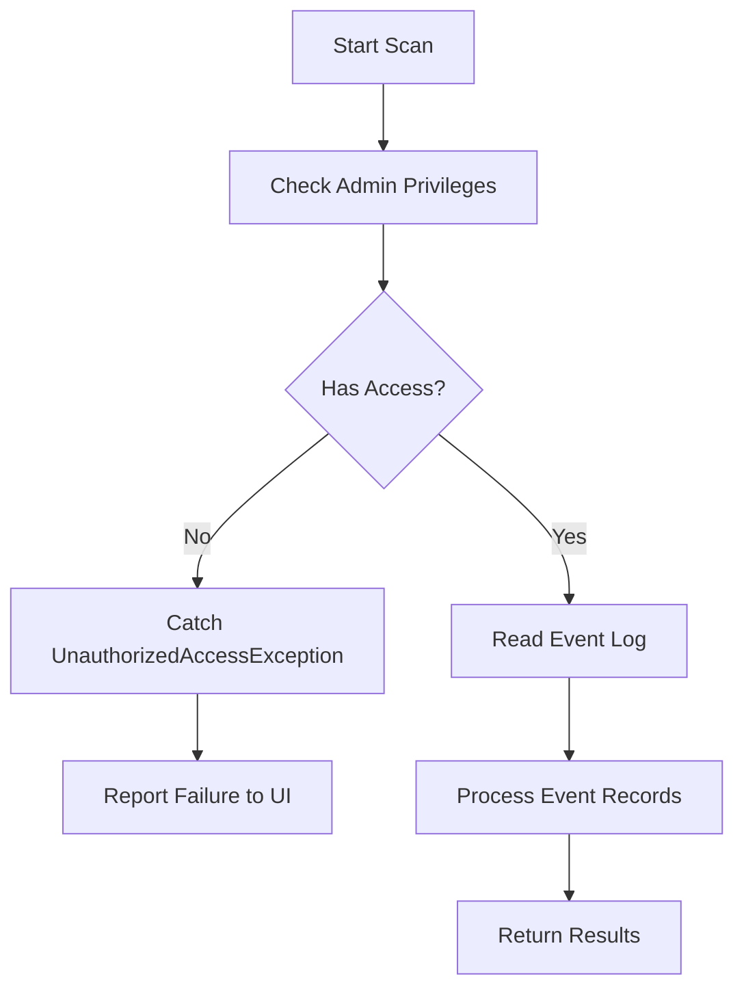
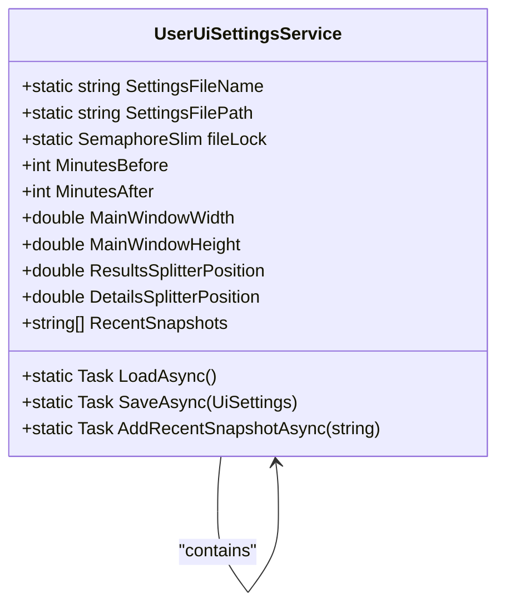
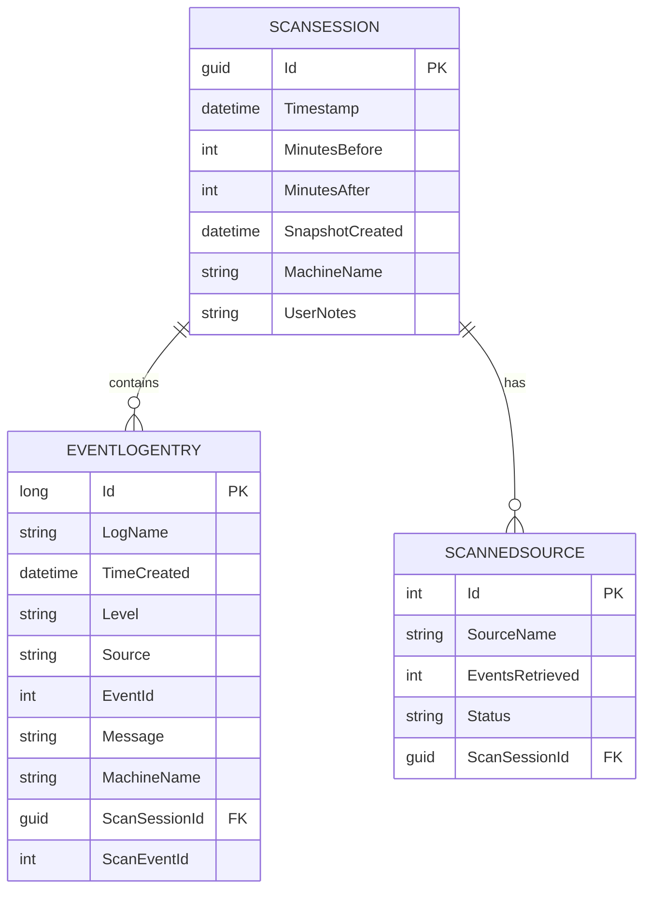
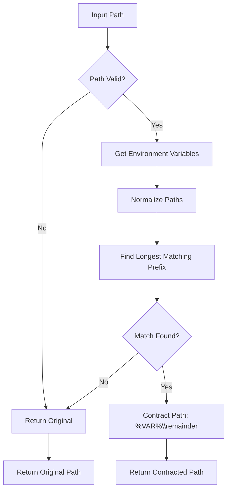

# System Boundaries and External Integrations


## Table of Contents
1. [System Context and Integration Overview](#system-context-and-integration-overview)
2. [Windows Event Log API Integration](#windows-event-log-api-integration)
3. [File System Operations and Snapshot I/O](#file-system-operations-and-snapshot-i-o)
4. [SQLite Database Engine Integration](#sqlite-database-engine-integration)
5. [.janus File Format and Portability](#janus-file-format-and-portability)
6. [Environment Variable Handling via EnvVarContractor](#environment-variable-handling-via-envvarcontractor)
7. [Security Implications and User Permissions](#security-implications-and-user-permissions)
8. [System Context Diagram](#system-context-diagram)
9. [Deployment Constraints and Platform-Specific Behavior](#deployment-constraints-and-platform-specific-behavior)

## System Context and Integration Overview

Project Janus is a Windows desktop application designed to analyze system event logs around a specific timestamp of interest. The application interacts with several external systems and components to fulfill its purpose. This document details the system boundaries and integration points, focusing on interactions with the Windows Event Log API, file system, SQLite database engine, and environment variables.

The application follows a strict separation of concerns, with core data models and the Entity Framework Core (EF Core) context residing in the `Janus.Core` assembly, while application logic, services, and UI components are located in `Janus.App`. This modular design ensures that data access and business logic are decoupled from the presentation layer.

**Section sources**
- [GEMINI.md](file://GEMINI.md#L1-L100)
- [janus.ai.rules.yml](file://janus.ai.rules.yml#L1-L117)

## Windows Event Log API Integration

Project Janus uses the `System.Diagnostics.Eventing.Reader` namespace to access Windows event logs, adhering to a critical project directive that prohibits the use of the legacy `System.Diagnostics.EventLog` component. The primary integration point is the `EventLogScannerService` class, which orchestrates the scanning of event logs.

The service provides two main functionalities:
1. **Retrieving Log Names**: The `GetAllLogNames()` method uses `EventLogSession.GlobalSession` to enumerate all available event log names on the system.
2. **Scanning Events**: The `ScanAllLogsAsync()` method performs a time-windowed scan across all event logs. It constructs an XPath query to filter events based on the `TimeCreated` field within a specified window before and after a central timestamp.





**Diagram sources**
- [EventLogScannerService.cs](file://Janus.App/Services/EventLogScannerService.cs#L30-L160)

**Section sources**
- [EventLogScannerService.cs](file://Janus.App/Services/EventLogScannerService.cs#L30-L160)
- [EventLogEntry.cs](file://Janus.Core/EventLogEntry.cs#L1-L18)

### Security Implications of Event Log Access

Accessing Windows event logs, particularly system-critical logs, requires elevated privileges. The application is configured via its `app.manifest` file to require administrator execution level (`requestedExecutionLevel="requireAdministrator"`). This declarative approach ensures the application runs with the necessary permissions without implementing programmatic self-elevation logic.

The code explicitly handles `UnauthorizedAccessException`, which occurs when the application lacks sufficient permissions to read a specific log. This is reported back to the UI through the `SourceScanProgress` mechanism, allowing users to understand which logs could not be accessed. This design promotes transparency and aids in troubleshooting permission-related issues.





**Diagram sources**
- [EventLogScannerService.cs](file://Janus.App/Services/EventLogScannerService.cs#L85-L119)
- [GEMINI.md](file://GEMINI.md#L74-L100)

## File System Operations and Snapshot I/O

Project Janus interacts with the file system for two primary purposes: saving/loading scan snapshots (`.janus` files) and managing user interface settings (`UserUiSettings.json`).

### Snapshot I/O Operations

The `SnapshotService` class handles all operations related to `.janus` snapshot files. These files are SQLite databases that store the complete state of a scan session, including metadata, event entries, and source scan results. The service uses asynchronous methods (`SaveSnapshotAsync`, `LoadSnapshotAsync`) to ensure the UI remains responsive during potentially lengthy I/O operations.

### User Interface Settings Management

The `UserUiSettingsService` manages the `UserUiSettings.json` file, which stores user preferences such as window size, splitter positions, and a Most Recently Used (MRU) list of snapshot files. Key implementation details include:
- **File Location**: The settings file is stored in the application's base directory.
- **Thread Safety**: A `SemaphoreSlim` is used to ensure exclusive access to the file, preventing race conditions during concurrent read/write operations.
- **MRU List Management**: The service automatically manages the list of recent snapshots, ensuring the most recent file is at the top, duplicates are removed, and the list is capped at 10 entries.





**Diagram sources**
- [UserUiSettingsService.cs](file://Janus.App/Services/UserUiSettingsService.cs#L1-L64)

**Section sources**
- [UserUiSettingsService.cs](file://Janus.App/Services/UserUiSettingsService.cs#L1-L64)
- [SnapshotService.cs](file://Janus.App/Services/SnapshotService.cs#L1-L79)

## SQLite Database Engine Integration

Project Janus uses SQLite as its persistence engine for storing scan snapshots, with Entity Framework Core (EF Core) serving as the Object-Relational Mapper (ORM). The integration is defined by strict project rules that emphasize simplicity and immutability.

### Database Context and Models

The `EventSnapshotDbContext` class defines the database schema and relationships:
- **Entities**: `EventLogEntry`, `ScanSession`, and `ScannedSource`.
- **Relationships**: A `ScanSession` has many `ScannedSource` entries (with cascade delete) and many `EventLogEntry` entries.
- **Value Conversion**: The `ScanStatus` enum in `ScannedSource` is stored as a string in the database using EF Core's value conversion feature.





**Diagram sources**
- [EventSnapshotDbContext.cs](file://Janus.Core/EventSnapshotDbContext.cs#L1-L25)
- [ScanSession.cs](file://Janus.Core/ScanSession.cs#L1-L35)
- [EventLogEntry.cs](file://Janus.Core/EventLogEntry.cs#L1-L18)
- [ScannedSource.cs](file://Janus.Core/ScannedSource.cs#L1-L13)

### Schema Management: The "No Migrations" Rule

A critical directive in Project Janus is the prohibition of EF Core Migrations. This is because `.janus` files are treated as immutable documents, not long-lived databases subject to schema evolution. Instead, the application uses `DbContext.Database.EnsureCreatedAsync()` to create the database schema directly from the current C# models when a new snapshot is saved.

When loading a snapshot, the application wraps database access in a `try...catch` block to handle `SqliteException`. This exception is used to detect schema mismatches—cases where the structure of the `.janus` file does not align with the current application's data models. This approach allows for graceful error reporting to the user, indicating that the snapshot was created with a different version of the application.

**Section sources**
- [SnapshotService.cs](file://Janus.App/Services/SnapshotService.cs#L1-L79)
- [GEMINI.md](file://GEMINI.md#L47-L54)
- [janus.ai.rules.yml](file://janus.ai.rules.yml#L74-L100)

## .janus File Format and Portability

The `.janus` file format is a portable container for event log scan data. It is implemented as a SQLite database file, which offers several advantages:
- **Self-Contained**: All data (metadata, events, sources) is stored in a single, easily transferable file.
- **Platform Portability**: SQLite files can be read on any platform with SQLite support, although the `.janus` format is specific to Project Janus.
- **Human-Readable (with tools)**: The data can be inspected using SQLite browser tools, aiding in debugging and data validation.

### Compatibility Considerations

The primary compatibility challenge arises from the "No Migrations" rule. If the application's data models change (e.g., a new field is added to `EventLogEntry`), snapshots created with older versions of the application may not be loadable by newer versions, and vice versa. The application detects this through `SqliteException` and reports it to the user, but it does not attempt automatic schema conversion. This makes backward compatibility a critical consideration for future development.

**Section sources**
- [SnapshotService.cs](file://Janus.App/Services/SnapshotService.cs#L1-L79)
- [GEMINI.md](file://GEMINI.md#L47-L54)

## Environment Variable Handling via EnvVarContractor

The `EnvVarContractor` utility class provides a mechanism for path contraction using environment variables. Its primary function, `ContractPath`, takes a full file path and attempts to replace a portion of it with a corresponding environment variable (e.g., replacing `C:\Users\John\Documents\project.janus` with `%USERPROFILE%\Documents\project.janus`).

### Algorithm and Implementation

The method works by:
1. Iterating over all environment variables.
2. Normalizing both the environment variable's value and the input path to full paths.
3. Finding the longest environment variable value that is a prefix of the input path.
4. Replacing that prefix with the environment variable name enclosed in percent signs.

This functionality is useful for creating more portable and user-friendly file references, especially in logs or configuration files, as it abstracts away machine-specific paths.





**Diagram sources**
- [EnvVarContractor.cs](file://Janus.App/Utils/EnvVarContractor.cs#L1-L36)

**Section sources**
- [EnvVarContractor.cs](file://Janus.App/Utils/EnvVarContractor.cs#L1-L36)

## Security Implications and User Permissions

Project Janus operates with significant system access, which carries inherent security implications.

### User Permissions and UAC

The application requires administrator privileges, as declared in its manifest file. This elevation is necessary to read protected event logs (e.g., Security, System). Without these privileges, the application will fail to access critical logs, as evidenced by the `UnauthorizedAccessException` handling in `EventLogScannerService`.

This requirement means the application will trigger a User Account Control (UAC) prompt on startup if not already running with elevated privileges. Users must consciously grant this permission, which aligns with security best practices by making the elevated access explicit.

### File System Security

The application writes to its own directory for the `UserUiSettings.json` file. This location is generally secure, as it resides within the application's installation path. However, if the application directory is writable by non-administrative users, there is a potential risk of configuration tampering. The use of a simple JSON file also means settings are stored in plain text, though they do not contain sensitive information.

**Section sources**
- [GEMINI.md](file://GEMINI.md#L74-L100)
- [EventLogScannerService.cs](file://Janus.App/Services/EventLogScannerService.cs#L85-L119)

## System Context Diagram

The following diagram illustrates Project Janus at the center, showing its interaction points with external systems and components.


```mermaid
graph TD
subgraph "Project Janus"
A["EventLogScannerService"]
B["SnapshotService"]
C["UserUiSettingsService"]
D["EnvVarContractor"]
end
subgraph "Operating System"
E["Windows Event Log API"]
F["File System"]
G["Environment Variables"]
end
subgraph "Database Engine"
H["SQLite"]
end
A --> E : "Reads event logs<br/>via System.Diagnostics.Eventing.Reader"
B --> F : "Saves/Loads .janus files"
B --> H : "Persists data via EF Core"
C --> F : "Reads/Writes UserUiSettings.json"
D --> G : "Queries environment variables"
```


**Diagram sources**
- [EventLogScannerService.cs](file://Janus.App/Services/EventLogScannerService.cs#L30-L160)
- [SnapshotService.cs](file://Janus.App/Services/SnapshotService.cs#L1-L79)
- [UserUiSettingsService.cs](file://Janus.App/Services/UserUiSettingsService.cs#L1-L64)
- [EnvVarContractor.cs](file://Janus.App/Utils/EnvVarContractor.cs#L1-L36)

## Deployment Constraints and Platform-Specific Behaviors

Project Janus is a Windows-specific application with several deployment constraints:

1. **Operating System**: The application is built for Windows due to its reliance on the Windows Event Log API. It will not function on other operating systems.
2. **.NET Runtime**: It requires .NET 9 (or the latest stable release) to be installed on the target machine.
3. **Administrator Privileges**: The application must be deployed and run with administrator privileges, which may require specific deployment procedures in managed environments.
4. **File System Access**: The application assumes it can write to its installation directory for settings. Deployment in locked-down environments may require adjustments to this behavior.
5. **SQLite Dependency**: The application depends on the Microsoft.Data.Sqlite package, which must be included in the deployment bundle.

The platform-specific behavior is most evident in the use of Windows Event Logs and environment variables. The path handling in `EnvVarContractor` is also Windows-centric, relying on Windows-style path separators and environment variable syntax (e.g., `%USERPROFILE%`).

**Section sources**
- [GEMINI.md](file://GEMINI.md#L1-L100)
- [janus.ai.rules.yml](file://janus.ai.rules.yml#L1-L117)

**Referenced Files in This Document**   
- [EventLogScannerService.cs](file://Janus.App/Services/EventLogScannerService.cs)
- [SnapshotService.cs](file://Janus.App/Services/SnapshotService.cs)
- [UserUiSettingsService.cs](file://Janus.App/Services/UserUiSettingsService.cs)
- [EnvVarContractor.cs](file://Janus.App/Utils/EnvVarContractor.cs)
- [EventSnapshotDbContext.cs](file://Janus.Core/EventSnapshotDbContext.cs)
- [ScanSession.cs](file://Janus.Core/ScanSession.cs)
- [EventLogEntry.cs](file://Janus.Core/EventLogEntry.cs)
- [ScannedSource.cs](file://Janus.Core/ScannedSource.cs)
- [GEMINI.md](file://GEMINI.md)
- [janus.ai.rules.yml](file://janus.ai.rules.yml)