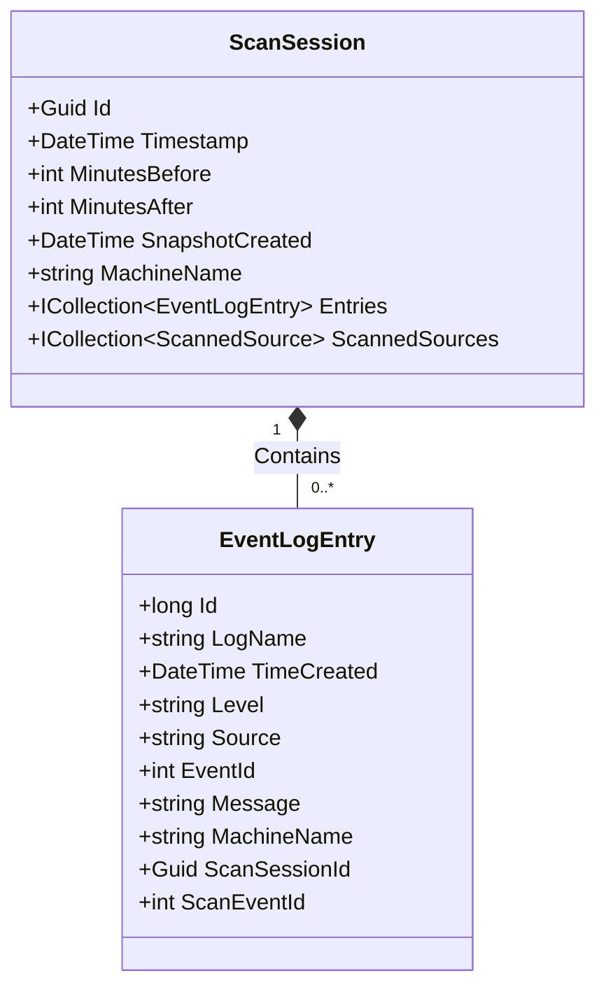

# EventLogEntry Model


## Table of Contents
1. [Introduction](#introduction)
2. [EventLogEntry Properties](#eventlogentry-properties)
3. [EF Core Model Configuration](#ef-core-model-configuration)
4. [Relationship with ScanSession](#relationship-with-scansession)
5. [Population by EventLogScannerService](#population-by-eventlogscannerservice)
6. [Usage in ResultsViewModel](#usage-in-resultsviewmodel)
7. [Performance Considerations](#performance-considerations)

## Introduction
The **EventLogEntry** model is a core entity in Project Janus that represents an individual record from the Windows Event Log. It captures structured event data such as event ID, severity level, timestamp, source provider, message content, and associated metadata. This model serves as the fundamental unit of data collection during forensic analysis of system events surrounding a critical timestamp. The `EventLogEntry` class is defined in the `Janus.Core` project, ensuring a clean separation between data models and application logic. It is populated by the `EventLogScannerService` using the `System.Diagnostics.Eventing.Reader.EventLogRecord` API and stored persistently via Entity Framework Core (EF Core) in a SQLite database. The model plays a crucial role in the application's data hierarchy, being aggregated within a `ScanSession` to represent a complete forensic snapshot.

**Section sources**
- [EventLogEntry.cs](file://Janus.Core/EventLogEntry.cs#L5-L17)

## EventLogEntry Properties
The `EventLogEntry` class contains a comprehensive set of properties to capture all relevant information from a Windows event log record. Each property is declared with the `required` keyword, ensuring that all instances are fully initialized upon creation, a feature of modern C# that enforces data integrity.


```csharp
public class EventLogEntry {
  public required long Id { get; init; }
  public required string LogName { get; init; }
  public required DateTime TimeCreated { get; init; }
  public required string Level { get; init; }
  public required string Source { get; init; }
  public required int EventId { get; init; }
  public required string Message { get; init; }
  public required string MachineName { get; init; }
  public required Guid ScanSessionId { get; init; }
  public int ScanEventId { get; set; }
}
```


The properties are described as follows:
- **Id**: The unique identifier of the event within the Windows Event Log, typically corresponding to the record's sequence number.
- **LogName**: The name of the event log channel from which the event was retrieved (e.g., "Application", "System", "Security").
- **TimeCreated**: The UTC timestamp when the event was originally generated by the system.
- **Level**: A string representation of the event's severity level (e.g., "Error", "Warning", "Information", "Critical").
- **Source**: The name of the provider or service that generated the event (also known as the ProviderName).
- **EventId**: An integer identifier that categorizes the type of event, used by the event provider to distinguish between different event types.
- **Message**: The formatted, human-readable description of the event, generated by the event provider.
- **MachineName**: The name of the computer where the event originated.
- **ScanSessionId**: A foreign key that links the `EventLogEntry` to its parent `ScanSession`, establishing a one-to-many relationship.
- **ScanEventId**: A sequential, human-friendly integer ID assigned during the scanning process for easy reference within the context of a single scan session. Unlike the primary key `Id`, this is not unique across different scans.

**Section sources**
- [EventLogEntry.cs](file://Janus.Core/EventLogEntry.cs#L5-L17)

## EF Core Model Configuration
The `EventLogEntry` model is integrated into the EF Core data access layer through the `EventSnapshotDbContext`. The primary key for the `EventLogEntry` entity is implicitly configured by EF Core convention. Since the property is named `Id`, EF Core automatically recognizes it as the primary key for the `EventLogEntry` table in the database.


```csharp
public class EventSnapshotDbContext(DbContextOptions<EventSnapshotDbContext> options) : DbContext(options) {
  public DbSet<EventLogEntry> EventLogEntries => Set<EventLogEntry>();
  public DbSet<ScanSession> ScanSessions => Set<ScanSession>();
  public DbSet<ScannedSource> ScannedSources => Set<ScannedSource>();

  protected override void OnModelCreating(ModelBuilder modelBuilder) {
    base.OnModelCreating(modelBuilder);

    modelBuilder.Entity<ScanSession>()
      .HasMany(s => s.ScannedSources)
      .WithOne()
      .OnDelete(DeleteBehavior.Cascade);

    modelBuilder.Entity<ScannedSource>()
      .Property(s => s.Status)
      .HasConversion<string>();
  }
}
```


The `EventLogEntries` property in the `EventSnapshotDbContext` exposes a `DbSet<EventLogEntry>`, which provides the API for querying and saving instances of `EventLogEntry` to the database. The `OnModelCreating` method configures the overall data model. While it explicitly defines the relationship between `ScanSession` and `ScannedSource`, it does not contain any explicit configuration for `EventLogEntry`. This means that the `EventLogEntry` entity relies entirely on EF Core's convention-based configuration. The `ScanSessionId` property is automatically recognized as a foreign key due to its naming convention (`[NavigationPropertyName]Id`), establishing the relationship with the `ScanSession` entity. No data annotations (e.g., `[Key]`, `[Required]`) are used on the `EventLogEntry` class, as the `required` modifier and naming conventions are sufficient for EF Core to infer the correct schema.

**Section sources**
- [EventSnapshotDbContext.cs](file://Janus.Core/EventSnapshotDbContext.cs#L8-L24)
- [EventLogEntry.cs](file://Janus.Core/EventLogEntry.cs#L5-L17)

## Relationship with ScanSession
The `EventLogEntry` model exists within a hierarchical data structure centered around the `ScanSession` entity. A `ScanSession` represents a single forensic investigation, defined by a central timestamp and a time window (e.g., 5 minutes before and after). The `ScanSession` aggregates all `EventLogEntry` instances collected during that scan.





**Diagram sources**
- [ScanSession.cs](file://Janus.Core/ScanSession.cs#L5-L34)
- [EventLogEntry.cs](file://Janus.Core/EventLogEntry.cs#L5-L17)

This relationship is implemented as a one-to-many association. The `ScanSession` class has a required `ICollection<EventLogEntry>` property named `Entries`, which holds a collection of all events captured in that session. Conversely, each `EventLogEntry` has a `ScanSessionId` property that acts as a foreign key, pointing back to its parent `ScanSession`. This design ensures data integrity and allows for efficient querying of all events belonging to a specific forensic session. When a `ScanSession` is saved to the database, its associated `EventLogEntry` collection is saved as well, thanks to EF Core's change tracking.

**Section sources**
- [ScanSession.cs](file://Janus.Core/ScanSession.cs#L28)
- [EventLogEntry.cs](file://Janus.Core/EventLogEntry.cs#L16)

## Population by EventLogScannerService
The `EventLogEntry` instances are created and populated by the `EventLogScannerService`, which uses the `System.Diagnostics.Eventing.Reader` namespace to query the Windows Event Log. The service scans all available event logs for entries within a specified time window around a critical timestamp.


```csharp
// Inside EventLogScannerService.ScanAllLogsAsync
var entry = new EventLogEntry {
  Id = record.RecordId ?? 0,
  LogName = logName,
  TimeCreated = record.TimeCreated ?? DateTime.MinValue,
  Level = record.LevelDisplayName ?? "Unknown",
  Source = record.ProviderName ?? "Unknown",
  EventId = record.Id,
  Message = record.FormatDescription() ?? string.Empty,
  MachineName = record.MachineName ?? Environment.MachineName,
  ScanSessionId = Guid.Empty, // To be set by caller
  ScanEventId = Interlocked.Increment(ref scanEventIdCounter)
};
```


**Section sources**
- [EventLogScannerService.cs](file://Janus.App/Services/EventLogScannerService.cs#L65-L86)

The service uses an `EventLogQuery` with an XPath filter to efficiently retrieve events based on their `TimeCreated` property. For each `EventRecord` returned by the `EventLogReader`, a new `EventLogEntry` is instantiated. The properties of the `EventLogEntry` are mapped directly from the corresponding properties of the `EventRecord`. The `ScanSessionId` is initially set to `Guid.Empty` because the `ScanSession` itself is created after the scanning process is complete. The `ScanEventId` is assigned a unique sequential number within the scan using `Interlocked.Increment` to ensure thread safety, as the scanning of different log sources is performed in parallel tasks. This process captures a complete snapshot of system activity for forensic analysis.

## Usage in ResultsViewModel
In the application's user interface, `EventLogEntry` instances are not displayed directly. Instead, they are wrapped by the `EventLogEntryDisplay` class in the `ResultsViewModel`. This wrapper implements `INotifyPropertyChanged` and provides additional properties tailored for the WPF DataGrid, such as `TimeCreatedIso` for formatted display and `MessageInlines` for highlighting search terms within the message text.


```csharp
public class EventLogEntryDisplay : INotifyPropertyChanged {
  private readonly EventLogEntry entry;
  public EventLogEntryDisplay(EventLogEntry entry, Func<string>? getSearchText = null) {
    this.entry = entry;
    this.getSearchText = getSearchText ?? (() => string.Empty);
  }
  public long Id => entry.Id;
  public DateTime TimeCreated => entry.TimeCreated;
  // ... other properties delegated to 'entry'
}
```


**Section sources**
- [ResultsViewModel.cs](file://Janus.App/ViewModels/ResultsViewModel.cs#L17-L20)

The `ResultsViewModel` maintains an `ObservableCollection<EventLogEntryDisplay>` called `Events`. When a scan is complete, the `LoadEvents` method is called with the list of `EventLogEntry` objects. It clears the existing collection and creates a new `EventLogEntryDisplay` for each `EventLogEntry`, adding them to the `Events` collection. The view model uses a `CollectionViewSource` to provide filtering, sorting, and grouping capabilities on the `Events` collection. Users can filter events by level, source, log name, or a search term in the message, and these operations are performed on the `EventLogEntryDisplay` objects, which in turn access the underlying `EventLogEntry` data.

## Performance Considerations
Storing and querying large volumes of `EventLogEntry` records presents several performance considerations. The use of SQLite as the database engine is well-suited for single-user, file-based applications like Project Janus, but performance can degrade with very large datasets.

The primary key `Id` (a `long`) and the foreign key `ScanSessionId` (a `Guid`) are indexed by default, which ensures fast lookups when loading all events for a specific session. However, queries based on other fields, such as `TimeCreated`, `Level`, or `EventId`, may become slow as the number of entries grows, since these fields are not explicitly indexed.

A key performance strategy is implemented in the `ResultsViewModel` through the use of `ICollectionView`. Instead of modifying the underlying `ObservableCollection<EventLogEntryDisplay>` directly, filters and sorts are applied to the `ICollectionView`. This approach is more efficient because it only affects the presentation layer and does not require re-creating or re-sorting the entire collection in memory. The `RebuildView` method creates a new `CollectionViewSource`, which is a lightweight operation compared to manipulating the data collection itself.

For extremely large scans, the application could benefit from adding database indexes on frequently queried columns (e.g., `TimeCreated`, `Level`, `EventId`) in the `OnModelCreating` method. However, this would need to be balanced against the overhead of maintaining these indexes during the initial data insertion phase of the scan. The current design prioritizes a simple, convention-based model over complex performance tuning, which is appropriate for its intended use case of forensic snapshots.

**Section sources**
- [ResultsViewModel.cs](file://Janus.App/ViewModels/ResultsViewModel.cs#L79-L122)
- [EventLogScannerService.cs](file://Janus.App/Services/EventLogScannerService.cs#L43)

**Referenced Files in This Document**   
- [EventLogEntry.cs](file://Janus.Core/EventLogEntry.cs)
- [EventSnapshotDbContext.cs](file://Janus.Core/EventSnapshotDbContext.cs)
- [EventLogScannerService.cs](file://Janus.App/Services/EventLogScannerService.cs)
- [ResultsViewModel.cs](file://Janus.App/ViewModels/ResultsViewModel.cs)
- [ScanSession.cs](file://Janus.Core/ScanSession.cs)