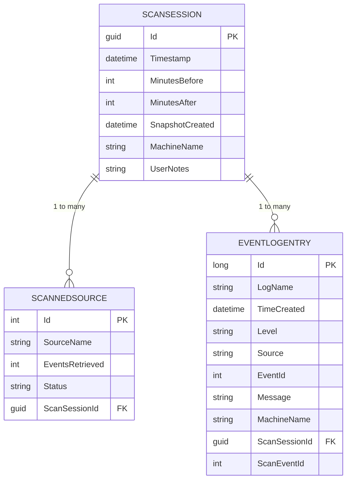
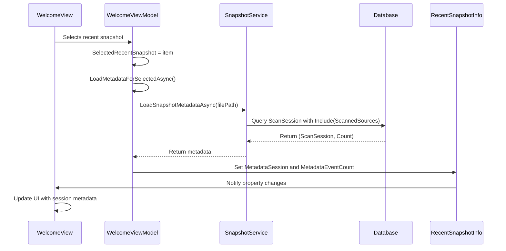

# ScanSession Model


## Table of Contents
1. [Introduction](#introduction)
2. [Core Properties and Structure](#core-properties-and-structure)
3. [Entity Framework Core Configuration](#entity-framework-core-configuration)
4. [Persistence and Serialization via SnapshotService](#persistence-and-serialization-via-snapshotservice)
5. [UI Integration and INotifyPropertyChanged](#ui-integration-and-inotifypropertychanged)
6. [Initialization in LiveScanViewModel](#initialization-in-livescanviewmodel)
7. [Display in ResultsViewModel and WelcomeViewModel](#display-in-resultsviewmodel-and-welcomeviewmodel)
8. [Data Integrity and Version Compatibility](#data-integrity-and-version-compatibility)
9. [Performance Considerations for Large Sessions](#performance-considerations-for-large-sessions)

## Introduction
The **ScanSession** model serves as the root container for a single scan operation within Project Janus, a tool designed for event log analysis. It encapsulates all metadata and data collected during a scan, functioning as the primary unit of persistence for portable `.janus` snapshot files. This document provides a comprehensive analysis of the ScanSession model, detailing its structure, relationships, persistence mechanism, and integration with the application's UI layer through the MVVM pattern. The model is central to both live scanning operations and the loading of saved snapshots, making it a critical component of the application's architecture.

**Section sources**
- [ScanSession.cs](file://Janus.Core/ScanSession.cs)

## Core Properties and Structure
The ScanSession class is defined in the `Janus.Core` namespace and represents a complete scan session. It contains essential metadata and collections of scanned data, designed for both immediate use and long-term storage.

### Key Properties

- **Id**: A required `Guid` that uniquely identifies the scan session. This serves as the primary key in the database and ensures global uniqueness across systems.
- **Timestamp**: A required `DateTime` representing the central point in time around which the scan was performed.
- **MinutesBefore**: An integer specifying the number of minutes before the central timestamp that were included in the scan window.
- **MinutesAfter**: An integer specifying the number of minutes after the central timestamp that were included in the scan window.
- **Window**: A computed property of type `TimeSpan` that returns the total duration of the scan window by summing `MinutesBefore` and `MinutesAfter`.
- **SnapshotCreated**: A required `DateTime` indicating when the snapshot was saved to disk, distinct from the scan's `Timestamp`.
- **MachineName**: A required `string` storing the name of the machine where the scan was executed.
- **UserNotes**: An optional `string` allowing users to attach descriptive notes to the scan session.
- **Entries**: A required `ICollection<EventLogEntry>` containing all event log entries retrieved during the scan.
- **ScannedSources**: A required `ICollection<ScannedSource>` listing all sources (e.g., event logs) that were scanned, including their status and statistics.

The model uses modern C# features such as `required` properties to enforce non-nullability and `init` accessors to ensure immutability after construction, aligning with the project's architectural rules.


```mermaid
classDiagram
class ScanSession {
+Guid Id
+DateTime Timestamp
+int MinutesBefore
+int MinutesAfter
+TimeSpan Window
+DateTime SnapshotCreated
+string MachineName
+string? UserNotes
+ICollection<EventLogEntry> Entries
+ICollection<ScannedSource> ScannedSources
}
class EventLogEntry {
+long Id
+string LogName
+DateTime TimeCreated
+string Level
+string Source
+int EventId
+string Message
+string MachineName
+Guid ScanSessionId
+int ScanEventId
}
class ScannedSource {
+int Id
+string SourceName
+int EventsRetrieved
+ScanStatus Status
}
enum ScanStatus {
Success
Partial
Failed
}
ScanSession "1" *-- "0..*" EventLogEntry : contains
ScanSession "1" *-- "0..*" ScannedSource : contains
EventLogEntry --> ScanSession : ScanSessionId
ScannedSource --> ScanStatus : Status
```


**Diagram sources**
- [ScanSession.cs](file://Janus.Core/ScanSession.cs#L4-L34)
- [EventLogEntry.cs](file://Janus.Core/EventLogEntry.cs#L4-L18)
- [ScannedSource.cs](file://Janus.Core/ScannedSource.cs#L6-L13)

**Section sources**
- [ScanSession.cs](file://Janus.Core/ScanSession.cs#L4-L34)
- [EventLogEntry.cs](file://Janus.Core/EventLogEntry.cs#L4-L18)
- [ScannedSource.cs](file://Janus.Core/ScannedSource.cs#L6-L13)

## Entity Framework Core Configuration
The persistence of ScanSession instances is managed by Entity Framework Core (EF Core) through the `EventSnapshotDbContext`. This context defines the database schema and relationships for all core entities.

### Relationship Configuration
The `OnModelCreating` method in `EventSnapshotDbContext` explicitly configures the relationship between `ScanSession` and `ScannedSource`:
- A `ScanSession` can have many `ScannedSource` entities.
- Each `ScannedSource` belongs to one `ScanSession`.
- The relationship is configured with `OnDelete(DeleteBehavior.Cascade)`, meaning that when a `ScanSession` is deleted from the database, all its associated `ScannedSource` records are automatically deleted as well. This ensures data integrity by preventing orphaned records.

### Property Conversion
The `Status` property of the `ScannedSource` class is of type `enum ScanStatus`. EF Core cannot natively store enums in SQLite, so it uses a value converter to store the enum as a string in the database. This is configured with `.HasConversion<string>()`, which maps `Success`, `Partial`, and `Failed` to their string representations.





**Diagram sources**
- [EventSnapshotDbContext.cs](file://Janus.Core/EventSnapshotDbContext.cs#L15-L22)

**Section sources**
- [EventSnapshotDbContext.cs](file://Janus.Core/EventSnapshotDbContext.cs#L9-L22)

## Persistence and Serialization via SnapshotService
The `SnapshotService` class in the `Janus.App.Services` namespace is responsible for serializing and deserializing `ScanSession` instances to and from portable `.janus` files, which are SQLite databases.

### Saving Snapshots
The `SaveSnapshotAsync` method performs the following steps:
1. Creates a new `DbContextOptions` for the specified file path using SQLite.
2. Ensures the database schema exists with `EnsureCreatedAsync`.
3. Adds a new `ScanSession` entity to the `ScanSessions` `DbSet`, copying all properties from the provided session object.
4. Calls `SaveChangesAsync` to persist the data to the SQLite file.

This process serializes the entire object graph, including all `EventLogEntry` and `ScannedSource` collections, into the database.

### Loading Snapshots
The `LoadSnapshotAsync` method retrieves a `ScanSession` from a `.janus` file:
1. Creates a `DbContextOptions` for the specified file.
2. Uses `Include(s => s.Entries)` and `Include(s => s.ScannedSources)` to eagerly load the related collections.
3. Uses `AsSplitQuery()` to prevent potential performance issues with large result sets by executing separate queries for the main entity and its collections.
4. Returns the first (and only) `ScanSession` from the database.

A separate method, `LoadSnapshotMetadataAsync`, is provided to load only the `ScanSession` and the count of associated `EventLogEntry` records without loading the entire collection, which is useful for populating lists of recent snapshots efficiently.

**Section sources**
- [SnapshotService.cs](file://Janus.App/Services/SnapshotService.cs#L18-L79)

## UI Integration and INotifyPropertyChanged
While the `ScanSession` model itself does not implement `INotifyPropertyChanged`, it is a central data object that is bound to the UI through ViewModels. The `ResultsViewModel` and `WelcomeViewModel` use `ScanSession` instances as data sources for UI elements.

### ResultsViewModel Integration
The `ResultsViewModel` has a `Metadata` property of type `ScanSession?`. When a snapshot is loaded, the `SetMetadata` method is called, which:
- Assigns the `ScanSession` to the `Metadata` property.
- Triggers property change notifications for `Metadata`, `MetadataTimestampLocal`, and `MetadataSnapshotCreatedLocal`, which are binding properties that format the `Timestamp` and `SnapshotCreated` dates for display.
- Calls `LoadScannedSources` to populate the UI with the list of scanned sources.

This allows the UI to dynamically update whenever a new scan session is loaded.

### WelcomeViewModel Integration
The `WelcomeViewModel` manages a list of recent snapshots using the `RecentSnapshotInfo` class, which contains a `MetadataSession` property of type `ScanSession?`. When a user selects a recent snapshot, the `LoadMetadataForSelectedAsync` method calls `SnapshotService.LoadSnapshotMetadataAsync` to load the `ScanSession` and event count, which are then displayed in the UI.





**Diagram sources**
- [WelcomeViewModel.cs](file://Janus.App/ViewModels/WelcomeViewModel.cs#L128-L141)
- [SnapshotService.cs](file://Janus.App/Services/SnapshotService.cs#L59-L79)

**Section sources**
- [ResultsViewModel.cs](file://Janus.App/ViewModels/ResultsViewModel.cs#L299-L300)
- [WelcomeViewModel.cs](file://Janus.App/ViewModels/WelcomeViewModel.cs#L18-L19)

## Initialization in LiveScanViewModel
The `ScanSession` is initialized in the `LiveScanViewModel` after a successful live scan operation. When the `ScanAsync` method completes, it creates a new `ScanSession` instance and passes it to the `ResultsViewModel`.

### Initialization Process
1. The `ScanAsync` method orchestrates the scanning of event logs.
2. Upon completion, it creates a new `ScanSession` object with the collected data:
   - A new `Guid` is generated for the `Id`.
   - The `Timestamp` is set to the time the scan was initiated.
   - `MinutesBefore` and `MinutesAfter` are taken from the user's input.
   - `SnapshotCreated` is set to `DateTime.UtcNow`.
   - `MachineName` is populated with the current machine's name.
   - `Entries` and `ScannedSources` are populated with the results.
3. This `ScanSession` is then passed to the `ResultsViewModel` via the `SetMetadata` method, making it available for display and saving.

This process ensures that every live scan results in a fully formed `ScanSession` that can be immediately analyzed or saved.

**Section sources**
- [LiveScanViewModel.cs](file://Janus.App/ViewModels/LiveScanViewModel.cs#L230-L240)

## Display in ResultsViewModel and WelcomeViewModel
The `ScanSession` model is displayed in two primary locations within the application: the results view after a scan and the welcome view for recent snapshots.

### Results View Display
In the `ResultsViewModel`, the `ScanSession` metadata is displayed in a dedicated panel. Properties like `Timestamp`, `MachineName`, and `UserNotes` are bound directly to UI elements. The `ScannedSources` collection is bound to a list control, showing the status and statistics of each scanned source. The `ScanStatusToBrushConverter` is used to visually represent the `ScanStatus` (Success, Partial, Failed) with corresponding colors (Green, Orange, Red).

### Welcome View Display
The `WelcomeViewModel` displays a list of recent snapshots. For each snapshot, it shows:
- The file name (derived from `FilePath`).
- The `Timestamp` of the scan.
- The `MachineName`.
- The number of events (from `MetadataEventCount`).
- Any loading errors.

This allows users to quickly identify and select a previous scan session to review.

**Section sources**
- [ResultsViewModel.cs](file://Janus.App/ViewModels/ResultsViewModel.cs#L299-L304)
- [WelcomeViewModel.cs](file://Janus.App/ViewModels/WelcomeViewModel.cs#L18-L22)

## Data Integrity and Version Compatibility
The application employs several strategies to ensure data integrity and handle version compatibility.

### Data Integrity
- **Foreign Key Constraints**: The `ScanSessionId` in `EventLogEntry` and the relationship in `ScannedSource` ensure referential integrity.
- **Cascade Delete**: Configured in EF Core, this prevents orphaned records if a session is deleted.
- **Required Properties**: The use of `required` ensures critical fields are never null.

### Version Compatibility
The current implementation relies on EF Core's `EnsureCreatedAsync`, which is schema-agnostic and will create a new database if the schema doesn't exist. However, this does not handle schema migrations. For future app updates that modify the `ScanSession` model, a formal migration strategy using EF Core migrations will be necessary to avoid data loss or corruption when loading snapshots created by older versions of the application.

**Section sources**
- [EventSnapshotDbContext.cs](file://Janus.Core/EventSnapshotDbContext.cs#L15-L18)
- [ScanSession.cs](file://Janus.Core/ScanSession.cs)

## Performance Considerations for Large Sessions
Handling large scan sessions efficiently is critical for application performance.

### Efficient Loading
- **Split Queries**: The use of `AsSplitQuery()` in `LoadSnapshotAsync` prevents the "Cartesian explosion" problem when loading large collections, improving performance and reducing memory usage.
- **Metadata-Only Loading**: The `LoadSnapshotMetadataAsync` method allows the application to display a list of recent snapshots without loading potentially massive `EventLogEntry` collections, significantly improving startup time.

### Memory Management
The `ScanSession` model holds all event data in memory as `ICollection<EventLogEntry>`. For very large scans, this could lead to high memory consumption. Future optimizations could include:
- Implementing pagination or virtualization in the `ResultsViewModel`.
- Using streaming or lazy loading for event data, although this would complicate the persistence model.

The current design prioritizes simplicity and responsiveness for typical scan sizes, with the understanding that extremely large datasets may require architectural adjustments.

**Section sources**
- [SnapshotService.cs](file://Janus.App/Services/SnapshotService.cs#L41-L46)
- [SnapshotService.cs](file://Janus.App/Services/SnapshotService.cs#L59-L64)

**Referenced Files in This Document**   
- [ScanSession.cs](file://Janus.Core/ScanSession.cs)
- [EventSnapshotDbContext.cs](file://Janus.Core/EventSnapshotDbContext.cs)
- [SnapshotService.cs](file://Janus.App/Services/SnapshotService.cs)
- [LiveScanViewModel.cs](file://Janus.App/ViewModels/LiveScanViewModel.cs)
- [ResultsViewModel.cs](file://Janus.App/ViewModels/ResultsViewModel.cs)
- [WelcomeViewModel.cs](file://Janus.App/ViewModels/WelcomeViewModel.cs)
- [EventLogEntry.cs](file://Janus.Core/EventLogEntry.cs)
- [ScannedSource.cs](file://Janus.Core/ScannedSource.cs)