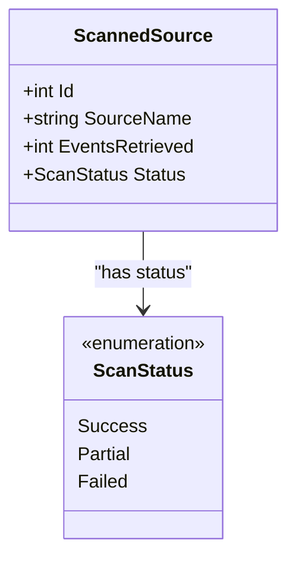
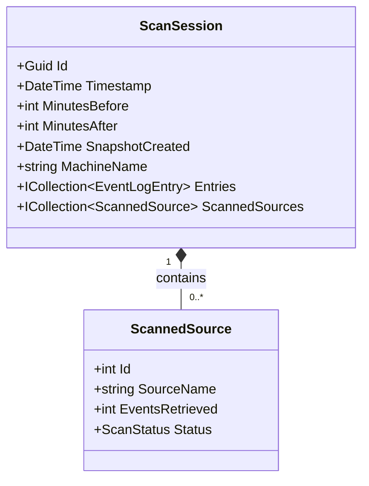
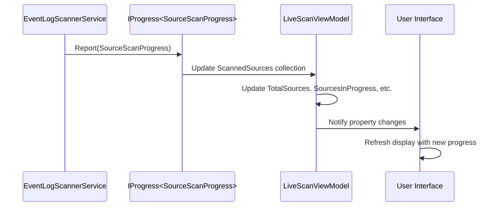
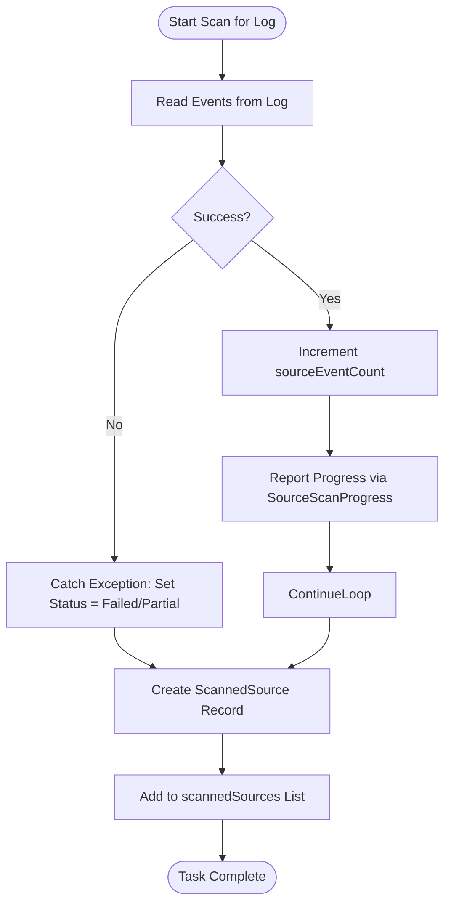

# ScannedSource Model

## Table of Contents
1. [ScannedSource Model Overview](#scannedsource-model-overview)
2. [Properties and Data Structure](#properties-and-data-structure)
3. [Relationship with ScanSession](#relationship-with-scansession)
4. [Real-Time Progress Tracking via SourceScanProgress](#real-time-progress-tracking-via-sourcescanprogress)
5. [Creation and Update During Scanning](#creation-and-update-during-scanning)
6. [Error Handling and Edge Cases](#error-handling-and-edge-cases)
7. [Usage in ResultsView for Filtering and Display](#usage-in-resultsview-for-filtering-and-display)
8. [Persistence with Entity Framework Core](#persistence-with-entity-framework-core)
9. [Summary of Key Functionality](#summary-of-key-functionality)

## ScannedSource Model Overview

The **ScannedSource** model is a core entity in the Project Janus application, designed to track the scanning progress and outcome for individual Windows event log sources such as 'Application', 'Security', or 'System'. It serves as a record of which logs were processed during a scan session, how many events were retrieved, and whether the scan was successful, partially successful, or failed.

This model plays a critical role in both real-time user feedback and post-scan analysis. It enables the application to provide detailed status information during a live scan and supports retrospective analysis of which logs were accessible and processed. The **ScannedSource** is created and updated by the **EventLogScannerService** as part of an asynchronous scanning operation and is later used in the UI to filter and display results based on the source.

**Section sources**
- [ScannedSource.cs](file://d:/devel/Project Janus/Janus.Core/ScannedSource.cs#L7-L13)

## Properties and Data Structure

The **ScannedSource** class is defined with the following key properties:

- **Id**: An integer primary key used by Entity Framework Core for database persistence.
- **SourceName**: A required string that identifies the name of the event log (e.g., "Application", "Security").
- **EventsRetrieved**: A required integer indicating the number of events successfully read from the log.
- **Status**: A required **ScanStatus** enum value that reflects the outcome of the scan for this source.

The **ScanStatus** enum defines three possible states:
- **Success**: The log was fully scanned without errors.
- **Partial**: The scan was interrupted or only partially completed (e.g., due to cancellation).
- **Failed**: The scan failed, typically due to permission issues or system errors.

These properties are immutable after creation (`init` setters), ensuring data integrity once a **ScannedSource** record is finalized.

**Diagram sources**
- [ScannedSource.cs](file://d:/devel/Project Janus/Janus.Core/ScannedSource.cs#L2-L13)

**Section sources**
- [ScannedSource.cs](file://d:/devel/Project Janus/Janus.Core/ScannedSource.cs#L2-L13)

## Relationship with ScanSession

The **ScannedSource** model functions as a child entity of the **ScanSession** model, forming a one-to-many relationship. Each **ScanSession** represents a complete scan operation around a specific timestamp and contains a collection of **ScannedSource** records, one for each event log that was processed.

This relationship is enforced in the Entity Framework Core context (**EventSnapshotDbContext**) using the `HasMany` and `WithOne` configuration, with cascade delete behavior. When a **ScanSession** is deleted, all associated **ScannedSource** records are automatically removed from the database.

The **ScannedSources** property in **ScanSession** is of type `ICollection<ScannedSource>` and is initialized as an empty list. This collection is populated during the scan process and is later persisted to disk when a snapshot is saved.

**Diagram sources**
- [ScanSession.cs](file://d:/devel/Project Janus/Janus.Core/ScanSession.cs#L0-L34)
- [ScannedSource.cs](file://d:/devel/Project Janus/Janus.Core/ScannedSource.cs#L7-L13)
- [EventSnapshotDbContext.cs](file://d:/devel/Project Janus/Janus.Core/EventSnapshotDbContext.cs#L15-L17)

**Section sources**
- [ScanSession.cs](file://d:/devel/Project Janus/Janus.Core/ScanSession.cs#L27-L34)
- [EventSnapshotDbContext.cs](file://d:/devel/Project Janus/Janus.Core/EventSnapshotDbContext.cs#L15-L17)

## Real-Time Progress Tracking via SourceScanProgress

During a scan, the application provides real-time feedback to the user through the **SourceScanProgress** model, which mirrors the **ScannedSource** but is designed for dynamic UI updates. While **ScannedSource** is immutable and finalized after the scan, **SourceScanProgress** is mutable and implements **INotifyPropertyChanged** to support live data binding in the WPF interface.

The **LiveScanViewModel** uses an `IProgress<SourceScanProgress>` reporter to receive updates from the **EventLogScannerService**. Each time progress is reported, the view model updates the corresponding **SourceScanProgress** in its observable collection, adjusting counters for completed, in-progress, and failed sources. The UI displays these updates immediately, showing the number of events retrieved and the current status of each log.

**Diagram sources**
- [EventLogScannerService.cs](file://d:/devel/Project Janus/Janus.App/Services/EventLogScannerService.cs#L31-L160)
- [SourceScanProgress.cs](file://d:/devel/Project Janus/Janus.App/ViewModels/SourceScanProgress.cs#L0-L25)
- [LiveScanViewModel.cs](file://d:/devel/Project Janus/Janus.App/ViewModels/LiveScanViewModel.cs#L61-L260)

**Section sources**
- [SourceScanProgress.cs](file://d:/devel/Project Janus/Janus.App/ViewModels/SourceScanProgress.cs#L0-L25)
- [LiveScanViewModel.cs](file://d:/devel/Project Janus/Janus.App/ViewModels/LiveScanViewModel.cs#L156-L242)

## Creation and Update During Scanning

The **EventLogScannerService** is responsible for creating and updating **ScannedSource** records during the asynchronous scanning process. For each event log, a separate task is spawned to read entries within the specified time window.

Within each task:
1. A local counter (**sourceEventCount**) tracks the number of events retrieved.
2. The **ScanStatus** is initialized as **Success** and updated to **Failed** or **Partial** if an exception occurs.
3. Progress is reported via **SourceScanProgress** at regular intervals or after a certain number of events.
4. Upon completion (successful or failed), a new **ScannedSource** instance is created with the final **SourceName**, **EventsRetrieved**, and **Status**, and added to the shared **scannedSources** list.

The final list of **ScannedSource** objects is returned as part of the **ScanResult** and later assigned to the **ScanSession**.

**Diagram sources**
- [EventLogScannerService.cs](file://d:/devel/Project Janus/Janus.App/Services/EventLogScannerService.cs#L61-L159)

**Section sources**
- [EventLogScannerService.cs](file://d:/devel/Project Janus/Janus.App/Services/EventLogScannerService.cs#L61-L159)

## Error Handling and Edge Cases

The system handles several edge cases, particularly related to inaccessible logs. If a log cannot be read due to **UnauthorizedAccessException** or **EventLogException**, the scan for that source is marked as **Failed**, and the exception message is captured in the **SourceScanProgress** for display to the user.

For example, the **Security** log often requires elevated privileges. When access is denied, the **EventLogScannerService** catches the **UnauthorizedAccessException**, sets the status to **Failed**, and reports the error via **SourceScanProgress**. This allows the UI to display a meaningful message (e.g., "Access denied") without halting the entire scan.

The final **ScannedSource** record reflects the **Failed** status, enabling post-scan analysis to identify which logs were inaccessible. This information is preserved even after the scan completes, supporting troubleshooting and audit purposes.

**Section sources**
- [EventLogScannerService.cs](file://d:/devel/Project Janus/Janus.App/Services/EventLogScannerService.cs#L94-L120)

## Usage in ResultsView for Filtering and Display

After a scan completes, the **ResultsViewModel** loads the **ScannedSource** data from the **ScanSession** and exposes it via the **ScannedSources** observable collection. This collection is used to populate UI elements that allow users to filter events by source.

The **LoadScannedSources** method in **ResultsViewModel** clears the existing collection and adds all **ScannedSource** records, sorted by **SourceName**. This enables the user to see which logs were scanned and their respective statuses.

Additionally, the **ScannedSources** data supports source-based filtering in the results grid. Users can select specific sources to view only events from those logs, enhancing the analysis workflow.

**Section sources**
- [ResultsViewModel.cs](file://d:/devel/Project Janus/Janus.App/ViewModels/ResultsViewModel.cs#L295-L332)

## Persistence with Entity Framework Core

The **ScannedSource** model is persisted to a SQLite database using Entity Framework Core. The **EventSnapshotDbContext** includes a **DbSet<ScannedSource>** and configures the entity in **OnModelCreating**.

Key persistence configurations include:
- **Cascade Delete**: When a **ScanSession** is deleted, its associated **ScannedSource** records are automatically removed.
- **Enum Conversion**: The **ScanStatus** enum is stored as a string in the database using `HasConversion<string>()`, ensuring human-readable values in the database.

When a snapshot is saved via **SnapshotService**, the **ScannedSources** collection is included in the **ScanSession** entity and persisted alongside **EventLogEntry** records.

**Section sources**
- [EventSnapshotDbContext.cs](file://d:/devel/Project Janus/Janus.Core/EventSnapshotDbContext.cs#L15-L24)
- [SnapshotService.cs](file://d:/devel/Project Janus/Janus.App/Services/SnapshotService.cs#L32-L78)

## Summary of Key Functionality

The **ScannedSource** model is a fundamental component for tracking and reporting the status of event log scans in Project Janus. It captures the outcome of scanning individual logs, supports real-time UI feedback through **SourceScanProgress**, and enables post-scan analysis and filtering in the **ResultsView**. Its relationship with **ScanSession** ensures structured data organization, and its configuration in **EventSnapshotDbContext** guarantees reliable persistence. The model effectively handles edge cases like permission errors, providing users with clear feedback on scan success and failures.

**Referenced Files in This Document**   
- [ScannedSource.cs](file://d:/devel/Project Janus/Janus.Core/ScannedSource.cs)
- [EventLogScannerService.cs](file://d:/devel/Project Janus/Janus.App/Services/EventLogScannerService.cs)
- [ScanSession.cs](file://d:/devel/Project Janus/Janus.Core/ScanSession.cs)
- [SourceScanProgress.cs](file://d:/devel/Project Janus/Janus.App/ViewModels/SourceScanProgress.cs)
- [ResultsViewModel.cs](file://d:/devel/Project Janus/Janus.App/ViewModels/ResultsViewModel.cs)
- [EventSnapshotDbContext.cs](file://d:/devel/Project Janus/Janus.Core/EventSnapshotDbContext.cs)