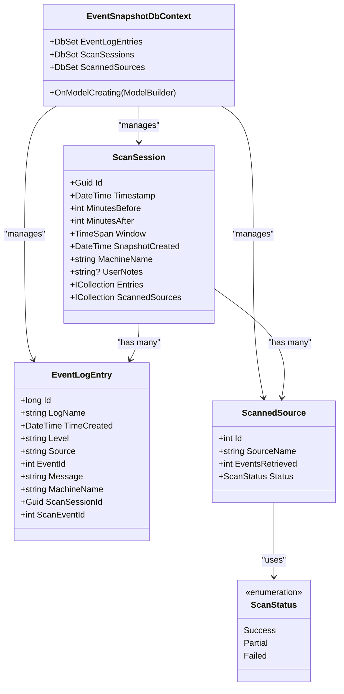
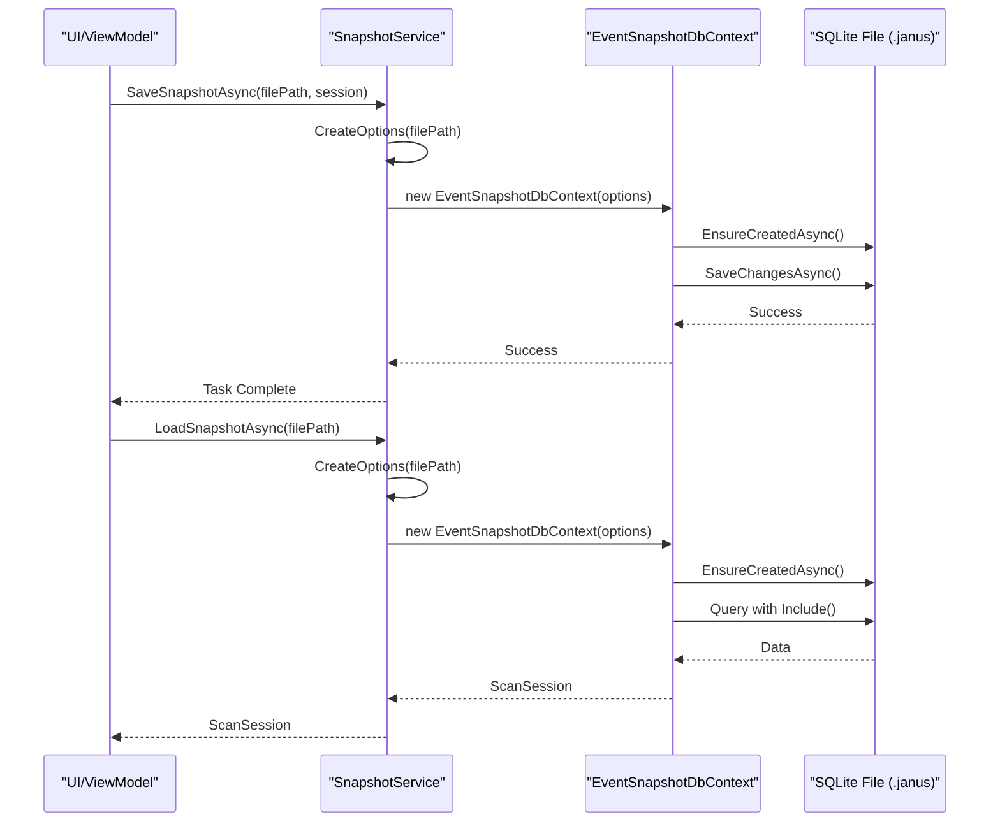

# EventSnapshotDbContext


## Table of Contents
1. [Introduction](#introduction)
2. [Core Components](#core-components)
3. [Architecture Overview](#architecture-overview)
4. [Detailed Component Analysis](#detailed-component-analysis)
5. [Data Access and Query Patterns](#data-access-and-query-patterns)
6. [Connection Management and Transaction Safety](#connection-management-and-transaction-safety)
7. [Performance Optimizations](#performance-optimizations)
8. [Schema Evolution and Versioning](#schema-evolution-and-versioning)
9. [Conclusion](#conclusion)

## Introduction
The **EventSnapshotDbContext** class is a central component of Project Janus, serving as the Entity Framework Core (EF Core) database context responsible for managing snapshot persistence using SQLite. It enables the creation of portable `.janus` files that encapsulate event log data collected during diagnostic scans. These snapshots are designed to be immutable, cross-machine compatible documents for offline analysis.

This document provides a comprehensive analysis of the `EventSnapshotDbContext`, detailing its architecture, configuration, integration with core entities (`ScanSession`, `EventLogEntry`, `ScannedSource`), and interaction with the `SnapshotService`. It also covers database initialization, connection handling, query patterns, performance considerations, and schema versioning strategies.

**Section sources**
- [EventSnapshotDbContext.cs](file://Janus.Core/EventSnapshotDbContext.cs#L1-L24)
- [janus.ai.rules.yml](file://janus.ai.rules.yml#L74-L100)

## Core Components
The `EventSnapshotDbContext` orchestrates data persistence for three primary entities:
- **ScanSession**: Represents a single diagnostic scan session, including metadata like timestamp, scan window, and user notes.
- **EventLogEntry**: Captures individual Windows event log records with properties such as time created, event ID, level, source, and message.
- **ScannedSource**: Tracks the status and results of scanning individual event sources (e.g., "Application", "System").

These classes are defined in the `Janus.Core` project, ensuring separation from UI logic and promoting reusability. The context exposes `DbSet<T>` properties for each entity, enabling EF Core to manage their lifecycle within the database.





**Diagram sources**
- [EventSnapshotDbContext.cs](file://Janus.Core/EventSnapshotDbContext.cs#L7-L24)
- [ScanSession.cs](file://Janus.Core/ScanSession.cs#L4-L34)
- [EventLogEntry.cs](file://Janus.Core/EventLogEntry.cs#L5-L17)
- [ScannedSource.cs](file://Janus.Core/ScannedSource.cs#L8-L13)

**Section sources**
- [EventSnapshotDbContext.cs](file://Janus.Core/EventSnapshotDbContext.cs#L7-L24)
- [ScanSession.cs](file://Janus.Core/ScanSession.cs#L4-L34)
- [EventLogEntry.cs](file://Janus.Core/EventLogEntry.cs#L5-L17)
- [ScannedSource.cs](file://Janus.Core/ScannedSource.cs#L8-L13)

## Architecture Overview
Project Janus follows a strict separation of concerns, with the `EventSnapshotDbContext` residing in the `Janus.Core` layer. This layer is agnostic of UI and application services, focusing solely on data modeling and persistence logic. The `Janus.App` layer contains the `SnapshotService`, which acts as an intermediary between the UI/ViewModels and the database context.

The architecture leverages SQLite as a serverless, single-file database engine, making `.janus` snapshot files inherently portable. EF Core serves as the Object-Relational Mapper (ORM), abstracting database interactions and enabling LINQ-based queries.


```mermaid
graph TB
subgraph "Janus.App"
A[SnapshotService]
B[ViewModels]
C[Views]
end
subgraph "Janus.Core"
D[EventSnapshotDbContext]
E[ScanSession]
F[EventLogEntry]
G[ScannedSource]
end
A --> D : "Uses context for I/O"
D --> H[(.janus File)]
B --> A : "Requests save/load"
C --> B : "User interaction"
style D fill:#f9f,stroke:#333
style A fill:#bbf,stroke:#333
```


**Diagram sources**
- [EventSnapshotDbContext.cs](file://Janus.Core/EventSnapshotDbContext.cs#L1-L24)
- [SnapshotService.cs](file://Janus.App/Services/SnapshotService.cs#L1-L80)

**Section sources**
- [EventSnapshotDbContext.cs](file://Janus.Core/EventSnapshotDbContext.cs#L1-L24)
- [SnapshotService.cs](file://Janus.App/Services/SnapshotService.cs#L1-L80)

## Detailed Component Analysis

### EventSnapshotDbContext Implementation
The `EventSnapshotDbContext` inherits from EF Core's `DbContext` and uses a primary constructor to accept `DbContextOptions<EventSnapshotDbContext>`. This design promotes testability and flexibility in configuration.

#### OnModelCreating Configuration
The `OnModelCreating` method configures the database schema using the Fluent API:

- **Relationship Configuration**: A one-to-many relationship is defined between `ScanSession` and `ScannedSource`, with cascade delete behavior. When a `ScanSession` is deleted, all associated `ScannedSource` records are automatically removed.
- **Value Conversion**: The `Status` property of `ScannedSource` is configured to convert the `ScanStatus` enum to and from a string representation in the database. This ensures human-readable storage and compatibility.


```csharp
modelBuilder.Entity<ScanSession>()
  .HasMany(s => s.ScannedSources)
  .WithOne()
  .OnDelete(DeleteBehavior.Cascade);

modelBuilder.Entity<ScannedSource>()
  .Property(s => s.Status)
  .HasConversion<string>();
```


No explicit table mappings or column configurations are required, as EF Core's conventions handle them based on property names and types.

**Section sources**
- [EventSnapshotDbContext.cs](file://Janus.Core/EventSnapshotDbContext.cs#L15-L24)

### SnapshotService Integration
The `SnapshotService` class in `Janus.App` is responsible for saving and loading snapshots using the `EventSnapshotDbContext`. It encapsulates all database operations and handles error conditions gracefully.

#### Database Initialization
The service uses `EnsureCreatedAsync()` to initialize the database schema:

```csharp
await db.Database.EnsureCreatedAsync();
```

This method checks if the database file exists and creates it with the schema defined by the current C# models if it does not. This approach aligns with the project's "No Migrations" rule, treating `.janus` files as immutable snapshots rather than upgradable databases.

#### Save Operation
The `SaveSnapshotAsync` method creates a new `EventSnapshotDbContext` instance with options configured for a specific file path using `UseSqlite()`. It adds a new `ScanSession` entity and calls `SaveChangesAsync()` to persist the data.

#### Load Operations
The service provides two methods for loading:
- `LoadSnapshotAsync`: Retrieves a complete `ScanSession` with all related `Entries` and `ScannedSources` using `Include()` and `AsSplitQuery()` for performance.
- `LoadSnapshotMetadataAsync`: Retrieves only the `ScanSession` and the count of associated `EventLogEntry` records, useful for quick previews.

All operations are wrapped in `try-catch` blocks to handle `SqliteException`, which is the primary mechanism for detecting schema mismatches between the current application version and an existing snapshot file.





**Diagram sources**
- [SnapshotService.cs](file://Janus.App/Services/SnapshotService.cs#L13-L78)

**Section sources**
- [SnapshotService.cs](file://Janus.App/Services/SnapshotService.cs#L1-L80)

## Data Access and Query Patterns
The `SnapshotService` demonstrates key EF Core query patterns for retrieving snapshot data:

### Full Snapshot Load

```csharp
var res = await db.ScanSessions
  .AsSplitQuery()
  .Include(s => s.Entries)
  .Include(s => s.ScannedSources)
  .FirstOrDefaultAsync();
```

This query uses eager loading (`Include`) to fetch the `ScanSession` along with its related collections in a single logical operation. `AsSplitQuery()` is used to execute the `Include` operations as separate SQL queries, preventing Cartesian explosion when loading large datasets.

### Metadata-Only Load

```csharp
var res = await db.ScanSessions
  .Include(s => s.ScannedSources)
  .Select(s => new {
    Session = s,
    s.Entries.Count
  }).FirstOrDefaultAsync();
```

This projection query retrieves the `ScanSession` and the count of its `Entries` without loading the entire collection, significantly reducing memory usage and I/O for large snapshots.

**Section sources**
- [SnapshotService.cs](file://Janus.App/Services/SnapshotService.cs#L45-L78)

## Connection Management and Transaction Safety
Connection management is handled implicitly by EF Core. The `using` declaration in `SnapshotService` ensures the `EventSnapshotDbContext` is properly disposed, closing the underlying SQLite connection.


```csharp
await using var db = new EventSnapshotDbContext(options);
```


All write operations in `SaveSnapshotAsync` are wrapped in an implicit transaction by `SaveChangesAsync()`. This ensures atomicity: either all changes (the `ScanSession`, its `Entries`, and `ScannedSources`) are committed, or none are if an error occurs. The use of `async`/`await` ensures the UI thread is not blocked during these potentially long-running I/O operations.

**Section sources**
- [SnapshotService.cs](file://Janus.App/Services/SnapshotService.cs#L19-L30)

## Performance Optimizations
The implementation includes several performance optimizations:

### AsSplitQuery for Large Datasets
The use of `.AsSplitQuery()` in `LoadSnapshotAsync` is critical for performance when dealing with large numbers of `EventLogEntry` records. Without it, EF Core would generate a single SQL query with JOINs, resulting in a Cartesian product where each row contains duplicated `ScanSession` data. `AsSplitQuery()` mitigates this by issuing separate queries:
1. One for the `ScanSession`
2. One for the `Entries`
3. One for the `ScannedSources`

This reduces network payload and memory consumption.

### Connection String Configuration
The connection string includes `Pooling=false`, which disables connection pooling. This is appropriate for a file-based application where each `.janus` file is accessed by a single process at a time, avoiding potential locking issues.

**Section sources**
- [SnapshotService.cs](file://Janus.App/Services/SnapshotService.cs#L47)
- [SnapshotService.cs](file://Janus.App/Services/SnapshotService.cs#L13)

## Schema Evolution and Versioning
Project Janus employs a deliberate strategy for schema evolution, as documented in `janus.ai.rules.yml` and `GEMINI.md`:

- **No Migrations**: EF Core Migrations are explicitly forbidden. The `.janus` file is treated as an immutable document, not a versioned database.
- **Schema Creation**: The schema is created from the current C# models using `EnsureCreatedAsync()` when a new snapshot is saved.
- **Schema Validation on Load**: When loading an existing snapshot, a `SqliteException` is caught if the database schema does not match the current model. This exception is rethrown as an `InvalidOperationException` with a user-friendly message, allowing the application to inform the user of a version mismatch.

This approach prioritizes simplicity and portability over backward compatibility. Future updates to the entity models will result in new snapshots using the updated schema, while older snapshots may become unreadable if their schema diverges significantly from the current model.

**Section sources**
- [janus.ai.rules.yml](file://janus.ai.rules.yml#L85-L100)
- [GEMINI.md](file://GEMINI.md#L40-L47)
- [SnapshotService.cs](file://Janus.App/Services/SnapshotService.cs#L21-L23)

## Conclusion
The `EventSnapshotDbContext` is a well-designed, focused component that effectively enables portable snapshot persistence for Project Janus. By leveraging EF Core and SQLite, it provides a robust, cross-platform solution for storing diagnostic event data. Its integration with the `SnapshotService` ensures safe, asynchronous data access with proper error handling. The deliberate choice to avoid migrations in favor of schema recreation aligns with the application's goal of creating immutable, self-contained snapshot files. While this limits backward compatibility, it simplifies the architecture and ensures that snapshots always reflect the exact state of the application's data model at the time of creation.

**Referenced Files in This Document**   
- [EventSnapshotDbContext.cs](file://Janus.Core/EventSnapshotDbContext.cs)
- [ScanSession.cs](file://Janus.Core/ScanSession.cs)
- [EventLogEntry.cs](file://Janus.Core/EventLogEntry.cs)
- [ScannedSource.cs](file://Janus.Core/ScannedSource.cs)
- [SnapshotService.cs](file://Janus.App/Services/SnapshotService.cs)
- [janus.ai.rules.yml](file://janus.ai.rules.yml)
- [GEMINI.md](file://GEMINI.md)