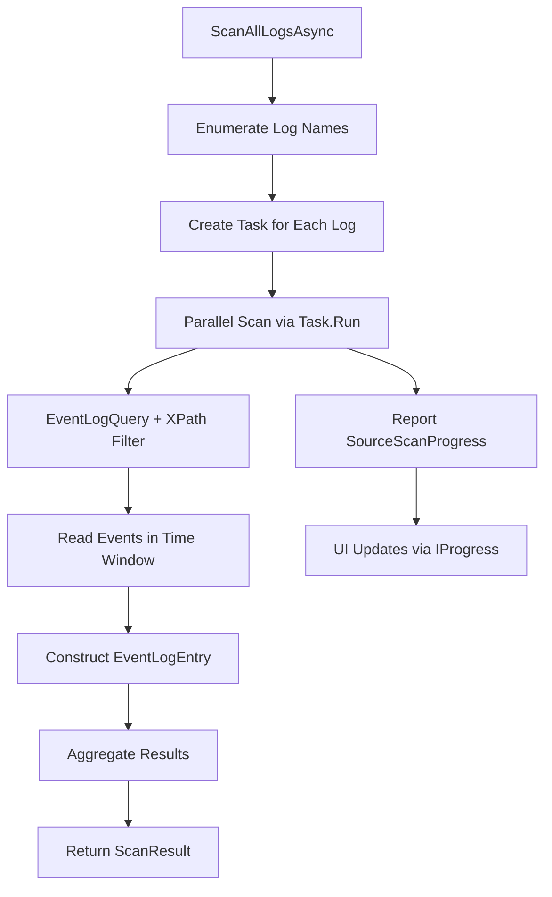
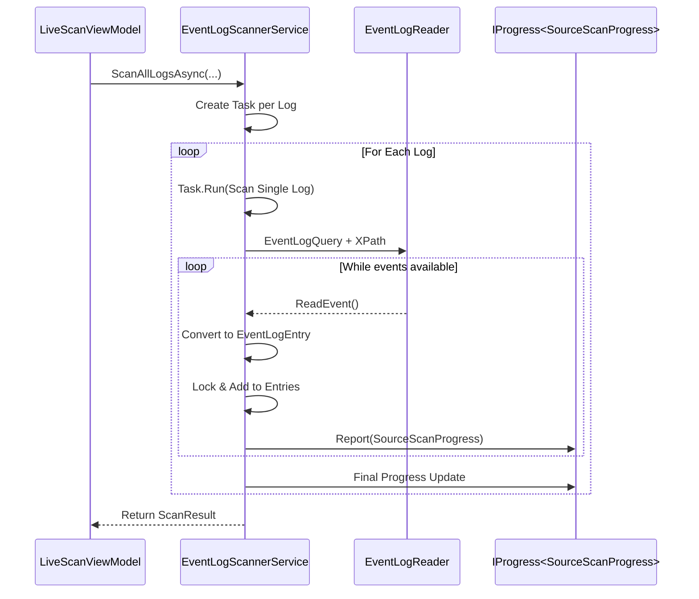
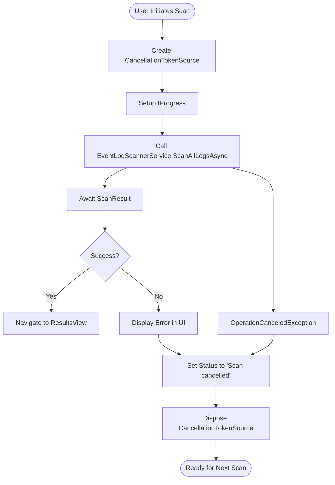

# EventLogScannerService


## Table of Contents
1. [Introduction](#introduction)
2. [Core Components](#core-components)
3. [Architecture Overview](#architecture-overview)
4. [Detailed Component Analysis](#detailed-component-analysis)
5. [Integration with UI Layer](#integration-with-ui-layer)
6. [Error Handling and Exception Propagation](#error-handling-and-exception-propagation)
7. [Performance Considerations](#performance-considerations)
8. [Best Practices and Recommendations](#best-practices-and-recommendations)

## Introduction
The **EventLogScannerService** is a critical component in the Project Janus application responsible for scanning Windows event logs around a specified timestamp. It enables forensic or diagnostic analysis by retrieving events from all available system logs within a configurable time window before and after a central point in time. The service operates asynchronously and in parallel across multiple logs, leveraging `Task.Run` for concurrency and `System.Diagnostics.Eventing.Reader` for efficient log access. It integrates tightly with the UI layer through progress reporting and structured result aggregation, supporting real-time feedback and graceful handling of partial failures.

**Section sources**
- [EventLogScannerService.cs](file://Janus.App/Services/EventLogScannerService.cs#L1-L160)

## Core Components

The EventLogScannerService relies on several key components to deliver its functionality:

- **EventLogScannerService**: Orchestrates parallel scanning of event logs using `EventLogReader` and `EventLogQuery`.
- **ScanResult**: Aggregates the final output, containing both event entries and metadata about scanned sources.
- **SourceScanProgress**: Provides real-time progress updates during scanning, used for UI feedback.
- **EventLogEntry**: Represents individual event log records with structured metadata.
- **ScannedSource**: Tracks per-log scanning outcomes including status and event count.
- **ScanStatus**: Enumeration indicating success, partial completion, or failure of a scan operation.

These components work together to enable robust, observable, and fault-tolerant log scanning.

**Section sources**
- [EventLogScannerService.cs](file://Janus.App/Services/EventLogScannerService.cs#L1-L160)
- [ScanResult.cs](file://Janus.App/Services/ScanResult.cs#L1-L8)
- [SourceScanProgress.cs](file://Janus.App/ViewModels/SourceScanProgress.cs#L1-L25)
- [EventLogEntry.cs](file://Janus.Core/EventLogEntry.cs#L5-L17)
- [ScannedSource.cs](file://Janus.Core/ScannedSource.cs#L8-L13)

## Architecture Overview

The EventLogScannerService follows a parallel processing architecture where each system event log is scanned concurrently using `Task.Run`. This design maximizes throughput by avoiding sequential bottlenecks when accessing potentially slow or large logs. The service uses the `IProgress<T>` pattern to report progress back to the caller, enabling real-time UI updates without blocking the scanning threads.





**Diagram sources**
- [EventLogScannerService.cs](file://Janus.App/Services/EventLogScannerService.cs#L30-L160)

## Detailed Component Analysis

### EventLogScannerService Analysis

The `EventLogScannerService` class provides two primary static methods: `GetAllLogNames` and `ScanAllLogsAsync`.

#### GetAllLogNames Method
This method retrieves all available event log names from the system using `EventLogSession.GlobalSession.GetLogNames()`. It returns an `IReadOnlyList<string>` to prevent modification of the log list after retrieval.


```csharp
public static IReadOnlyList<string> GetAllLogNames() {
    EventLogSession session = EventLogSession.GlobalSession;
    var logNames = new List<string>();
    foreach (string? log in session.GetLogNames()) {
        logNames.Add(log);
    }
    return logNames;
}
```


It handles no exceptions internally, meaning access-denied scenarios will propagate to the caller. This behavior allows higher-level components (like UI) to decide how to handle such cases.

**Section sources**
- [EventLogScannerService.cs](file://Janus.App/Services/EventLogScannerService.cs#L10-L19)

#### ScanAllLogsAsync Method
This is the core method responsible for scanning all logs in parallel. It accepts the following parameters:

- **timestamp**: Central datetime around which to scan.
- **before**: Time window before the timestamp.
- **after**: Time window after the timestamp.
- **perSourceProgress**: Optional `IProgress<SourceScanProgress>` for real-time updates.
- **cancellationToken**: For graceful cancellation.
- **progressUpdateInterval**: Throttling interval for progress updates (default: 250ms).
- **progressUpdateEventCount**: Minimum number of events between progress reports (default: 250).

The method constructs an XPath query to filter events by time:


```csharp
string xpath = $"*[System[TimeCreated[@SystemTime>='{from:O}' and @SystemTime<='{to:O}']]]";
```


Each log is processed in a separate `Task.Run`, ensuring parallel execution. Events are read using `EventLogReader.ReadEvent()` in a loop, converted to `EventLogEntry` objects, and added to a shared thread-safe collection using `lock`.

Progress is reported periodically based on either elapsed time or number of events processed. Final progress updates are sent even if exceptions occur, ensuring the UI receives complete status information.





**Diagram sources**
- [EventLogScannerService.cs](file://Janus.App/Services/EventLogScannerService.cs#L30-L160)

**Section sources**
- [EventLogScannerService.cs](file://Janus.App/Services/EventLogScannerService.cs#L30-L160)

### ScanResult and Data Structures

#### ScanResult
Encapsulates the final output of a scan operation:


```csharp
public class ScanResult {
    public required IReadOnlyList<EventLogEntry> Entries { get; init; }
    public required IReadOnlyList<ScannedSource> ScannedSources { get; init; }
}
```


Both properties are immutable after construction (`init`), ensuring thread safety and consistency.

#### EventLogEntry
Represents a single event log entry with key metadata:

- **Id**: Record ID
- **LogName**: Source log (e.g., "Application", "Security")
- **TimeCreated**: Event timestamp
- **Level**: Severity level (e.g., "Error", "Information")
- **Source**: Provider name
- **EventId**: Event identifier
- **Message**: Formatted description
- **MachineName**: Host machine
- **ScanSessionId**: Session identifier (set externally)
- **ScanEventId**: Sequential ID within scan session

**Section sources**
- [ScanResult.cs](file://Janus.App/Services/ScanResult.cs#L1-L8)
- [EventLogEntry.cs](file://Janus.Core/EventLogEntry.cs#L5-L17)

#### SourceScanProgress
Used for real-time progress reporting. Implements `INotifyPropertyChanged` for WPF data binding:


```csharp
public class SourceScanProgress : INotifyPropertyChanged {
    public string SourceName { get; set; }
    public int EventsRetrieved { get; set; }
    public ScanStatus Status { get; set; }
    public bool IsTotalKnown { get; set; }
    public int? TotalEvents { get; set; }
    public bool IsActive { get; set; }
    public string? ExceptionMessage { get; set; }
}
```


Fields like `IsActive` and `ExceptionMessage` allow the UI to reflect ongoing or failed scans dynamically.

**Section sources**
- [SourceScanProgress.cs](file://Janus.App/ViewModels/SourceScanProgress.cs#L1-L25)

#### ScannedSource and ScanStatus
`ScannedSource` stores final per-log results:


```csharp
public class ScannedSource {
    public required string SourceName { get; init; }
    public required int EventsRetrieved { get; init; }
    public required ScanStatus Status { get; init; }
}
```


`ScanStatus` is an enum with three states:
- **Success**: Complete scan
- **Partial**: Cancelled during execution
- **Failed**: Exception occurred (e.g., access denied)

**Section sources**
- [ScannedSource.cs](file://Janus.Core/ScannedSource.cs#L8-L13)

## Integration with UI Layer

The `LiveScanViewModel` integrates directly with `EventLogScannerService` to provide a responsive user experience. It uses `Progress<SourceScanProgress>` to receive updates and update WPF-bound collections like `ObservableCollection<SourceScanProgress>`.

Key integration points:

- **Progress Reporting**: Each progress update is dispatched to the UI thread using `Dispatcher.Invoke()` to ensure thread-safe UI updates.
- **Statistics Tracking**: Maintains counters for total sources, completed successes/errors, and in-progress scans.
- **Scan Status Display**: Dynamically updates the status bar with real-time statistics.
- **Navigation**: On completion, navigates to `ResultsView` with a populated `ResultsViewModel`.

Example from `LiveScanViewModel`:

```csharp
var progress = new Progress<SourceScanProgress>(progressUpdate => {
    // Update UI thread-safe
    dispatcher.Invoke(() => {
        // Insert new sources, update counts, move active to top
    });
});
```


The view model also handles cancellation via `CancellationTokenSource` and manages navigation state.





**Diagram sources**
- [LiveScanViewModel.cs](file://Janus.App/ViewModels/LiveScanViewModel.cs#L150-L250)

**Section sources**
- [LiveScanViewModel.cs](file://Janus.App/ViewModels/LiveScanViewModel.cs#L61-L260)

## Error Handling and Exception Propagation

The service handles several key exceptions at the per-log level:

- **EventLogException**: General event log access errors.
- **UnauthorizedAccessException**: When the user lacks permissions to read a log.
- **OperationCanceledException**: When the scan is cancelled.

Each exception results in a `ScanStatus.Failed` or `ScanStatus.Partial` update via `SourceScanProgress`, allowing the UI to display per-log errors without aborting the entire scan. This enables partial success—valuable when some logs are inaccessible due to permissions.

For example, the Security log often requires elevated privileges. The service gracefully handles access denial and continues scanning other logs.

The `LiveScanViewModel` catches top-level exceptions and displays them in the UI, while cancellation is handled separately to distinguish user-initiated stops from actual failures.

**Section sources**
- [EventLogScannerService.cs](file://Janus.App/Services/EventLogScannerService.cs#L100-L140)
- [LiveScanViewModel.cs](file://Janus.App/ViewModels/LiveScanViewModel.cs#L220-L240)

## Performance Considerations

### Potential Bottlenecks
- **Large Time Windows**: Scanning broad time ranges (e.g., 24 hours) can yield millions of events, consuming significant memory and CPU.
- **High-Volume Logs**: Logs like "Application" or "System" may contain thousands of entries per minute.
- **Memory Usage**: All `EventLogEntry` objects are held in memory until scan completion.

### Optimization Strategies
- **Limit Time Window**: Use narrow windows (e.g., ±5 minutes) around critical timestamps.
- **Throttle Progress Updates**: Default settings (250ms, 250 events) prevent UI flooding.
- **Parallel Execution**: Scanning logs concurrently improves responsiveness.
- **Lazy Loading**: Future versions could support streaming or pagination.

### Memory Management
The current implementation aggregates all entries in a `List<EventLogEntry>` under a lock. For very large scans, this could lead to memory pressure. Consider:
- Streaming results via `IAsyncEnumerable<EventLogEntry>`
- Writing intermediate results to disk
- Using object pooling for `EventLogEntry`

**Section sources**
- [EventLogScannerService.cs](file://Janus.App/Services/EventLogScannerService.cs#L30-L160)

## Best Practices and Recommendations

### Configuration Best Practices
- **Use Minimal Time Windows**: Focus on relevant timeframes to reduce load.
- **Run with Appropriate Privileges**: Ensure access to privileged logs like Security.
- **Monitor Progress Updates**: Adjust `progressUpdateInterval` and `progressUpdateEventCount` based on UI performance.

### Handling Partial Failures
- Always check `ScannedSources` in `ScanResult` to identify which logs failed.
- Display failed logs prominently in the UI with error messages.
- Allow users to retry specific logs if needed.

### UI Integration Tips
- Use `Progress<T>` for real-time updates.
- Dispatch UI updates to the correct thread.
- Maintain consistent state (e.g., SourcesInProgress counter).
- Provide clear visual feedback for active, completed, and failed sources.

### Scalability Improvements
- Implement cancellation with timeout support.
- Add logging for diagnostic purposes.
- Support filtering by log level or event ID.
- Enable export of results to file.

By following these practices, developers can ensure reliable, performant, and user-friendly event log scanning within the Project Janus ecosystem.

**Section sources**
- [EventLogScannerService.cs](file://Janus.App/Services/EventLogScannerService.cs#L1-L160)
- [LiveScanViewModel.cs](file://Janus.App/ViewModels/LiveScanViewModel.cs#L61-L260)

**Referenced Files in This Document**   
- [EventLogScannerService.cs](file://Janus.App/Services/EventLogScannerService.cs)
- [SourceScanProgress.cs](file://Janus.App/ViewModels/SourceScanProgress.cs)
- [ScanResult.cs](file://Janus.App/Services/ScanResult.cs)
- [LiveScanViewModel.cs](file://Janus.App/ViewModels/LiveScanViewModel.cs)
- [EventLogEntry.cs](file://Janus.Core/EventLogEntry.cs)
- [ScannedSource.cs](file://Janus.Core/ScannedSource.cs)