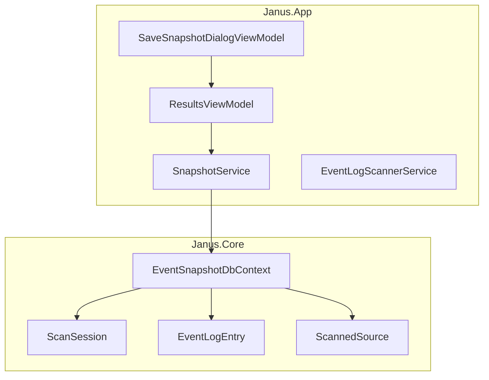
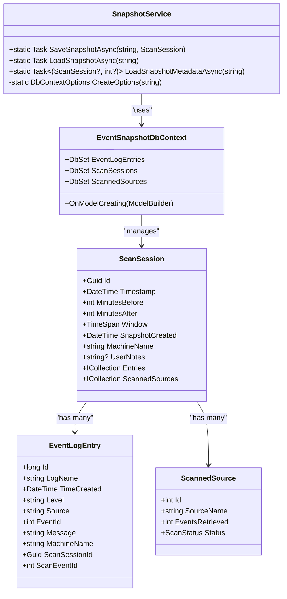
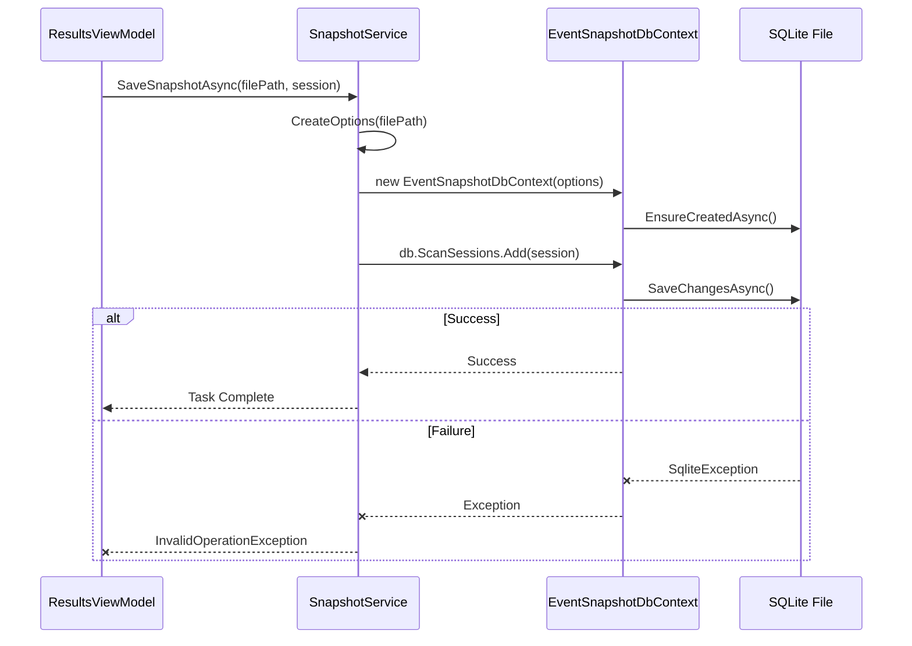
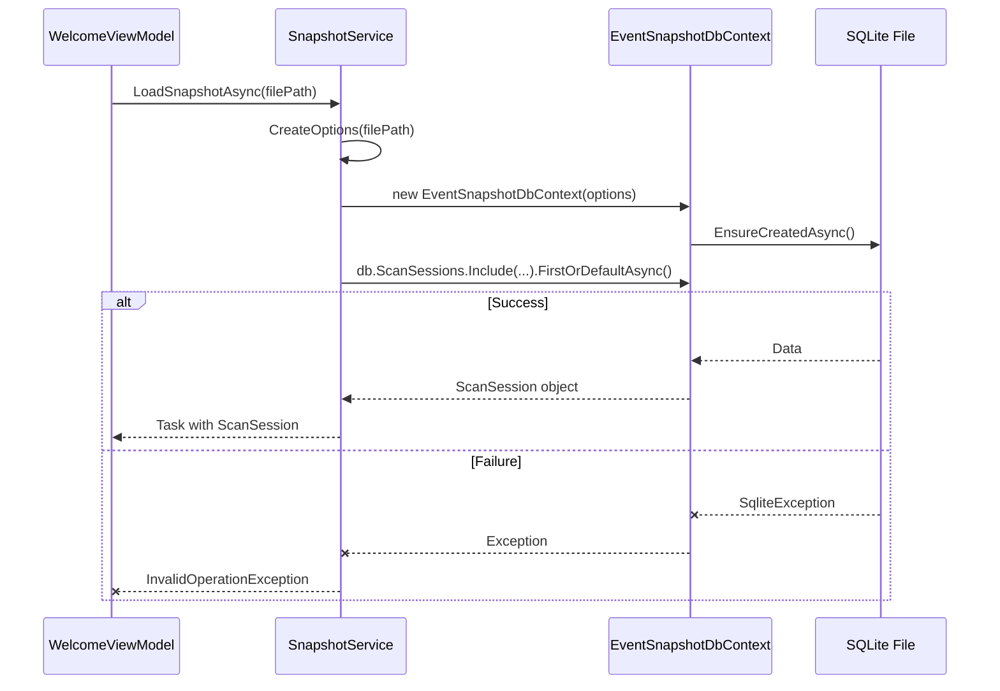
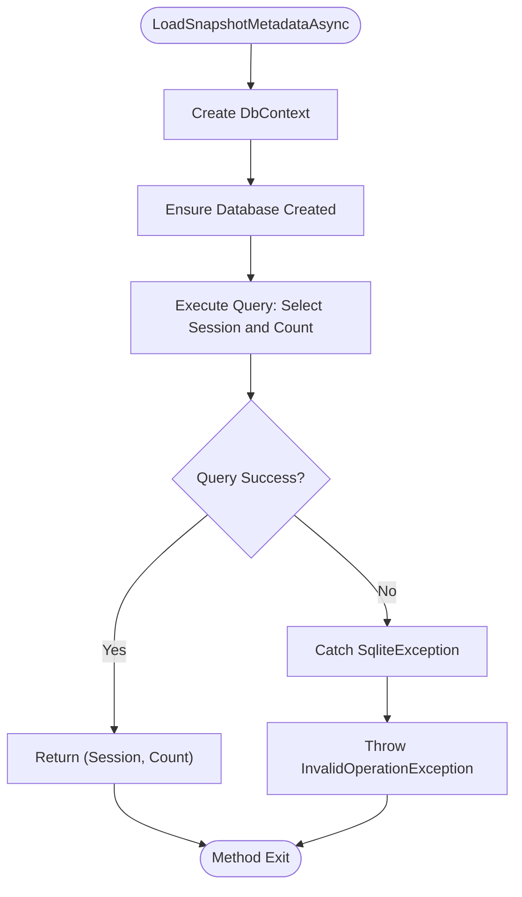
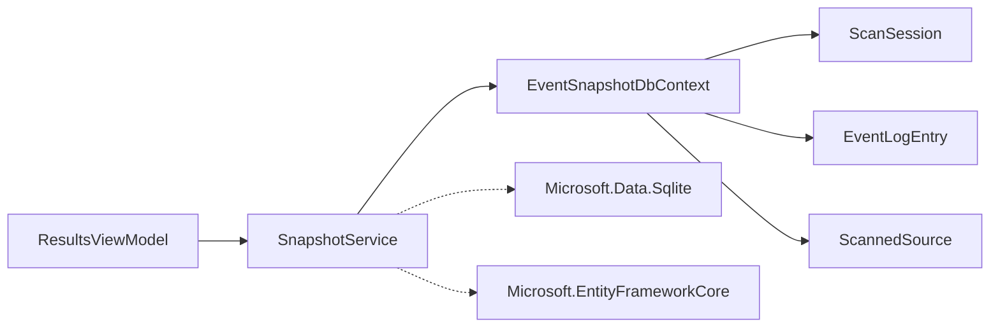

# SnapshotService

## Table of Contents
1. [Introduction](#introduction)
2. [Project Structure](#project-structure)
3. [Core Components](#core-components)
4. [Architecture Overview](#architecture-overview)
5. [Detailed Component Analysis](#detailed-component-analysis)
6. [Dependency Analysis](#dependency-analysis)
7. [Performance Considerations](#performance-considerations)
8. [Troubleshooting Guide](#troubleshooting-guide)
9. [Conclusion](#conclusion)

## Introduction
The **SnapshotService** is a critical component of Project Janus, a Windows diagnostic tool designed to analyze system events around a specific timestamp. This service is responsible for persisting and retrieving portable event log snapshots in the `.janus` file format, which is implemented as an SQLite database using Entity Framework Core (EF Core). The service enables users to save the results of a scan session for offline analysis and share them across systems. It adheres to a strict "no migrations" policy, treating snapshot files as immutable documents. The service manages the entire lifecycle of the database context, ensuring data integrity and handling errors related to schema compatibility and file corruption.

## Project Structure
The Project Janus solution is organized into two primary projects, reflecting a clear separation of concerns. The `Janus.Core` project contains the domain models (`ScanSession`, `EventLogEntry`, `ScannedSource`) and the `EventSnapshotDbContext`, which defines the data access layer using EF Core. This project is UI-agnostic and focuses solely on data structure and persistence logic. The `Janus.App` project contains all application-specific logic, including services like `SnapshotService`, ViewModels that implement the MVVM pattern, Views for the user interface, and other utilities. This structure ensures that the core data model remains decoupled from the presentation layer, promoting maintainability and testability.

**Diagram sources**
- [project_structure](file://.)

**Section sources**
- [project_structure](file://.)

## Core Components
The core functionality of the SnapshotService revolves around three primary methods: `SaveSnapshotAsync`, `LoadSnapshotAsync`, and `LoadSnapshotMetadataAsync`. These methods interact with the `EventSnapshotDbContext` to perform CRUD operations on an SQLite database. The `ScanSession` class acts as the root aggregate, containing a collection of `EventLogEntry` objects and `ScannedSource` objects, which are persisted as related entities. The service uses a factory method, `CreateOptions`, to configure the `DbContextOptions` for a given file path, specifying the SQLite connection string and enabling logging. The integration with the UI is facilitated through ViewModels like `ResultsViewModel`, which orchestrates the save operation by collecting user input and invoking the service.

**Section sources**
- [SnapshotService.cs](file://Janus.App/Services/SnapshotService.cs)
- [ScanSession.cs](file://Janus.Core/ScanSession.cs)
- [ResultsViewModel.cs](file://Janus.App/ViewModels/ResultsViewModel.cs)

## Architecture Overview
The architecture of the SnapshotService is a streamlined implementation of the Repository pattern, abstracted through a simple static service class. It leverages EF Core's code-first approach, where the database schema is derived directly from the C# model classes in `Janus.Core`. When saving a new snapshot, the service uses `EnsureCreatedAsync` to create the database file and schema on disk. When loading a snapshot, it attempts to connect to the existing database. Any `SqliteException` thrown during this process is caught and re-thrown as an `InvalidOperationException`, which is a key mechanism for detecting schema version mismatches between the current application and an older snapshot file. This design eliminates the need for EF Core migrations, treating each `.janus` file as a self-contained, versioned document.

**Diagram sources**
- [SnapshotService.cs](file://Janus.App/Services/SnapshotService.cs#L0-L80)
- [EventSnapshotDbContext.cs](file://Janus.Core/EventSnapshotDbContext.cs#L0-L25)
- [ScanSession.cs](file://Janus.Core/ScanSession.cs#L0-L35)

## Detailed Component Analysis

### SnapshotService Analysis
The `SnapshotService` is a stateless, static class that provides a clean API for snapshot persistence. Its primary responsibility is to bridge the application's in-memory `ScanSession` object with the SQLite database on disk.

#### SaveSnapshotAsync Method
This method is responsible for serializing a `ScanSession` object and its related data into a new `.janus` file.

**Diagram sources**
- [SnapshotService.cs](file://Janus.App/Services/SnapshotService.cs#L15-L35)

**Section sources**
- [SnapshotService.cs](file://Janus.App/Services/SnapshotService.cs#L15-L35)

The method begins by creating a `DbContextOptions` object configured for the provided file path. It then instantiates an `EventSnapshotDbContext` using these options within a `using` statement to ensure proper disposal. The `EnsureCreatedAsync` method is called to create the database file and schema if it does not exist. The `ScanSession` object is added to the `ScanSessions` `DbSet`, and `SaveChangesAsync` persists all changes to the database. The use of `EnsureCreatedAsync` aligns with the project's "No Migrations" rule, as it creates the schema directly from the current C# models. If the file already exists, it is deleted by the `ResultsViewModel` before this method is called.

#### LoadSnapshotAsync Method
This method reconstructs a `ScanSession` object from an existing `.janus` file.

**Diagram sources**
- [SnapshotService.cs](file://Janus.App/Services/SnapshotService.cs#L37-L55)

**Section sources**
- [SnapshotService.cs](file://Janus.App/Services/SnapshotService.cs#L37-L55)

Similar to the save process, the method creates a `DbContext` for the file. `EnsureCreatedAsync` is called, which is safe to call on an existing database. The key operation is a LINQ query that uses `Include` to eagerly load the related `Entries` and `ScannedSources` collections. The `AsSplitQuery` method is used to prevent potential performance issues with complex queries by executing separate SQL queries for the main entity and its related data. The method returns the first (and only) `ScanSession` found in the database. A `SqliteException` is caught and re-thrown, which is the primary way the application detects if a snapshot file was created with an incompatible schema.

#### LoadSnapshotMetadataAsync Method
This method provides a lightweight way to load only the `ScanSession` metadata and the count of associated events, without loading the potentially large collection of `EventLogEntry` objects.

**Diagram sources**
- [SnapshotService.cs](file://Janus.App/Services/SnapshotService.cs#L57-L78)

**Section sources**
- [SnapshotService.cs](file://Janus.App/Services/SnapshotService.cs#L57-L78)

This method uses a projection (`Select`) to create an anonymous object containing the `ScanSession` and the count of its `Entries`. This is significantly more efficient than loading all event data when only metadata is needed, such as when populating a list of recent snapshots in the `WelcomeViewModel`.

### Integration with ViewModels
The `SnapshotService` is tightly integrated with the application's ViewModels to provide a seamless user experience.

#### ResultsViewModel Integration
The `ResultsViewModel` is responsible for managing the state of the results screen, where a user can view and save a scan session. When the user clicks the "Save Snapshot" button, the `SaveSnapshotCommand` is executed. This command first shows a `SaveSnapshotDialog`, which uses the `SaveSnapshotDialogViewModel` to collect user notes. After the user confirms, a `SaveFileDialog` is shown. Once a file path is chosen, the `ResultsViewModel` creates an updated `ScanSession` object with the current UTC time for `SnapshotCreated` and the user-provided notes. It then calls `SnapshotService.SaveSnapshotAsync`. Upon success, it updates the UI state, sets the file path, and disables the save button to prevent accidental overwrites.

**Section sources**
- [ResultsViewModel.cs](file://Janus.App/ViewModels/ResultsViewModel.cs#L483-L548)

#### SaveSnapshotDialogViewModel Integration
The `SaveSnapshotDialogViewModel` is a simple ViewModel that manages the state of the dialog box used to collect user notes before saving a snapshot. It exposes a `UserNotes` property and `SaveCommand`/`CancelCommand` for the UI to bind to. When the `SaveCommand` is executed, it sets the dialog's `DialogResult` to `true`, which closes the dialog and allows the `ResultsViewModel` to proceed with the save operation.

**Section sources**
- [SaveSnapshotDialogViewModel.cs](file://Janus.App/ViewModels/SaveSnapshotDialogViewModel.cs#L0-L26)

## Dependency Analysis
The `SnapshotService` has a direct dependency on the `EventSnapshotDbContext` from the `Janus.Core` project, which in turn depends on the `ScanSession`, `EventLogEntry`, and `ScannedSource` model classes. This creates a dependency chain from the application layer (`Janus.App`) down to the core data models. The service also depends on external libraries: `Microsoft.Data.Sqlite` for the SQLite provider and `Microsoft.EntityFrameworkCore` for the ORM functionality. The `ResultsViewModel` depends on the `SnapshotService`, creating a clear flow of control from the UI layer, through the ViewModel, to the service, and finally to the data access layer. There are no circular dependencies in this architecture.

**Diagram sources**
- [SnapshotService.cs](file://Janus.App/Services/SnapshotService.cs)
- [ResultsViewModel.cs](file://Janus.App/ViewModels/ResultsViewModel.cs)
- [EventSnapshotDbContext.cs](file://Janus.Core/EventSnapshotDbContext.cs)

**Section sources**
- [SnapshotService.cs](file://Janus.App/Services/SnapshotService.cs)
- [ResultsViewModel.cs](file://Janus.App/ViewModels/ResultsViewModel.cs)

## Performance Considerations
The `SnapshotService` is designed with performance in mind, particularly when handling large datasets. The use of `async`/`await` ensures that I/O operations do not block the UI thread, keeping the application responsive. For loading large snapshots, the `LoadSnapshotAsync` method uses `AsSplitQuery` to avoid the "Cartesian explosion" problem that can occur when EF Core tries to load a large number of related entities in a single query. This results in multiple, smaller queries, which is more memory-efficient. The `LoadSnapshotMetadataAsync` method is a prime example of a performance optimization, allowing the application to display snapshot information without the overhead of loading thousands of event entries. For very large snapshots, future enhancements could include async streaming of event data, but the current implementation is sufficient for typical use cases. Memory usage is primarily determined by the size of the `ScanSession` object in memory, which is directly proportional to the number of events scanned.

## Troubleshooting Guide
The `SnapshotService` implements robust error handling for common failure scenarios.

*   **File Corruption or Schema Incompatibility:** If a `.janus` file is corrupted or was created with an older version of the application that has an incompatible database schema, a `SqliteException` will be thrown when attempting to read from the database. The service catches this exception and re-throws it as an `InvalidOperationException` with a user-friendly message. The `WelcomeViewModel` catches this exception and displays an error message in the UI, allowing the user to select a different file.
*   **File Access Issues:** If the file is locked by another process or the user lacks permissions, a `SqliteException` will also be thrown, which is handled in the same manner.
*   **Saving to an Existing File:** The `ResultsViewModel` explicitly checks for an existing file and deletes it before calling `SaveSnapshotAsync`. If this deletion fails (e.g., due to a permissions error), a `MessageBox` is shown to the user, preventing the save operation from proceeding and avoiding a potential `SqliteException`.

**Section sources**
- [SnapshotService.cs](file://Janus.App/Services/SnapshotService.cs#L25-L35)
- [SnapshotService.cs](file://Janus.App/Services/SnapshotService.cs#L45-L55)
- [ResultsViewModel.cs](file://Janus.App/ViewModels/ResultsViewModel.cs#L500-L516)

## Conclusion
The `SnapshotService` is a well-designed, focused component that effectively fulfills its role in the Project Janus application. By leveraging EF Core and SQLite, it provides a reliable and portable mechanism for saving and loading event log analysis sessions. Its adherence to the "No Migrations" rule simplifies the persistence layer and treats snapshots as immutable documents. The service's integration with the MVVM pattern through the `ResultsViewModel` and `SaveSnapshotDialogViewModel` ensures a clean separation of concerns and a responsive user experience. Its error handling strategy gracefully manages schema version mismatches and file I/O errors, making the application robust and user-friendly. Future work could explore adding encryption or compression to the `.janus` files, but the current implementation provides a solid foundation for the application's core functionality.

**Referenced Files in This Document**   
- [SnapshotService.cs](file://Janus.App/Services/SnapshotService.cs)
- [EventSnapshotDbContext.cs](file://Janus.Core/EventSnapshotDbContext.cs)
- [ScanSession.cs](file://Janus.Core/ScanSession.cs)
- [ResultsViewModel.cs](file://Janus.App/ViewModels/ResultsViewModel.cs)
- [SaveSnapshotDialogViewModel.cs](file://Janus.App/ViewModels/SaveSnapshotDialogViewModel.cs)
- [GEMINI.md](file://GEMINI.md)
- [janus.ai.rules.yml](file://janus.ai.rules.yml)