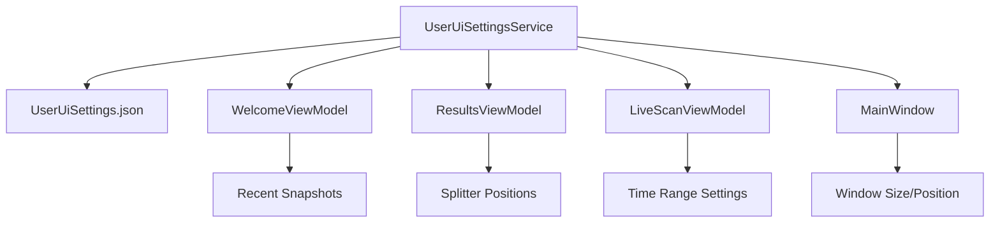
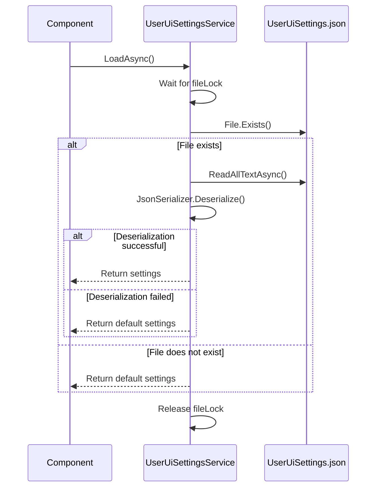
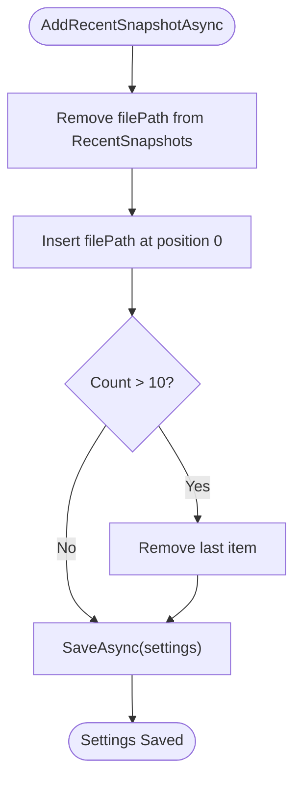
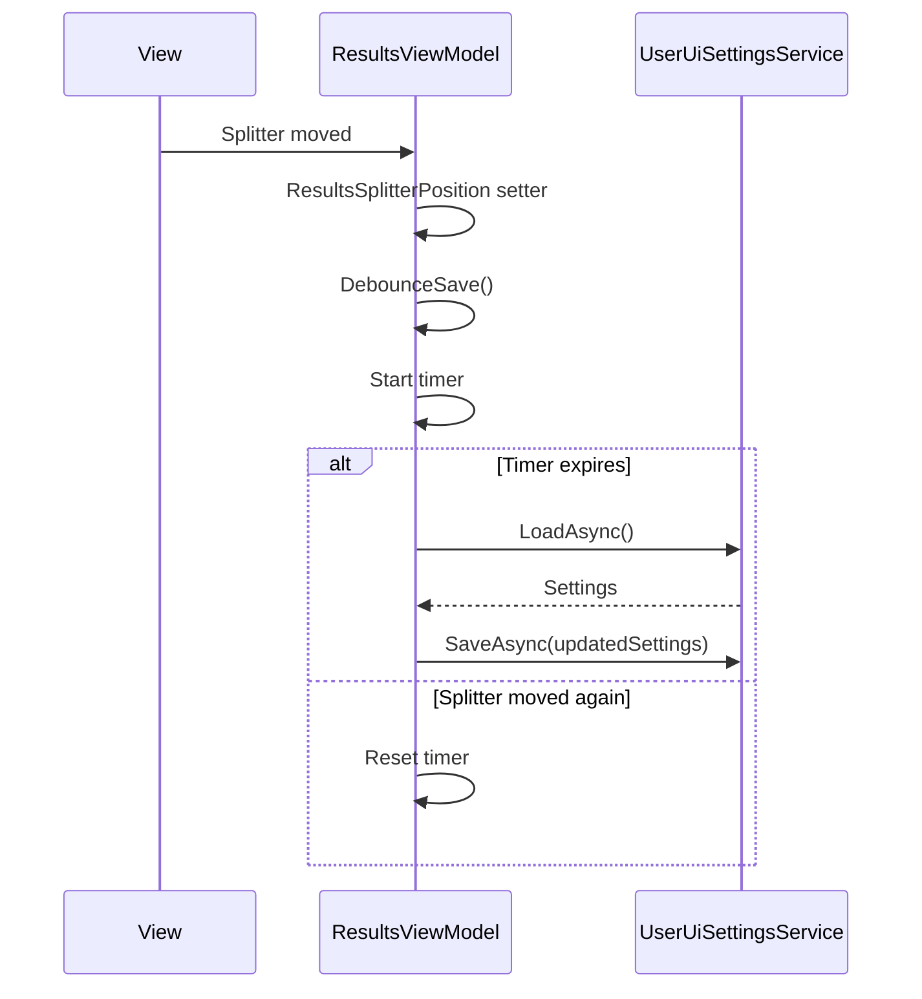
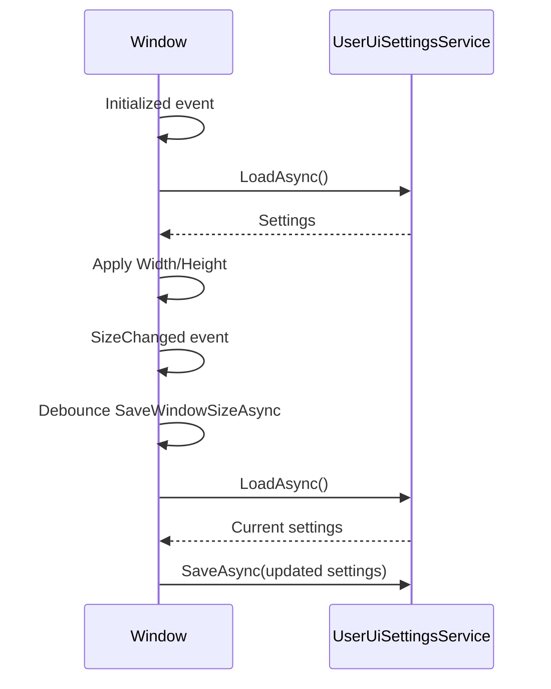

# UserUiSettingsService


## Table of Contents
1. [Introduction](#introduction)
2. [Architecture Overview](#architecture-overview)
3. [Core Components](#core-components)
4. [Detailed Component Analysis](#detailed-component-analysis)
5. [Data Model Structure](#data-model-structure)
6. [Integration with MVVM Pattern](#integration-with-mvvm-pattern)
7. [Error Handling and Robustness](#error-handling-and-robustness)
8. [Best Practices and Extension Guidelines](#best-practices-and-extension-guidelines)
9. [Conclusion](#conclusion)

## Introduction
The UserUiSettingsService is a singleton service responsible for persisting and retrieving user interface state across application sessions in Project Janus. It manages critical UI parameters such as window dimensions, splitter positions, and recent snapshot history. The service ensures a consistent user experience by saving and restoring application state between launches. Implemented with thread safety and error resilience in mind, it uses JSON serialization to store settings in a local file named UserUiSettings.json. This document provides a comprehensive analysis of its implementation, usage patterns, and integration with the application's MVVM architecture.

## Architecture Overview
The UserUiSettingsService operates as a central persistence point for UI state, following a singleton pattern to ensure global access and consistency. It interacts with various ViewModels and UI components to maintain user preferences across sessions. The service is designed with asynchronous operations to prevent UI blocking during file I/O, and employs a SemaphoreSlim to prevent race conditions during concurrent access to the settings file.





**Diagram sources**
- [UserUiSettingsService.cs](file://d:/devel/Project Janus/Janus.App/Services/UserUiSettingsService.cs)
- [MainWindow.xaml.cs](file://d:/devel/Project Janus/Janus.App/Resources/MainWindow.xaml.cs)
- [WelcomeViewModel.cs](file://d:/devel/Project Janus/Janus.App/ViewModels/WelcomeViewModel.cs)
- [ResultsViewModel.cs](file://d:/devel/Project Janus/Janus.App/ViewModels/ResultsViewModel.cs)
- [LiveScanViewModel.cs](file://d:/devel/Project Janus/Janus.App/ViewModels/LiveScanViewModel.cs)

## Core Components
The core functionality of UserUiSettingsService revolves around three primary operations: loading settings, saving settings, and managing recent snapshots. The service uses a nested UiSettings class to encapsulate all persistent UI state. It leverages System.Text.Json for serialization and deserialization, and employs file system operations to persist data to disk. The singleton Instance property ensures only one instance exists throughout the application lifecycle, preventing configuration conflicts.

**Section sources**
- [UserUiSettingsService.cs](file://d:/devel/Project Janus/Janus.App/Services/UserUiSettingsService.cs#L8-L63)

## Detailed Component Analysis

### UserUiSettingsService Implementation
The UserUiSettingsService is implemented as a static-accessible singleton with thread-safe file operations. It uses a SemaphoreSlim to synchronize access to the settings file, preventing race conditions when multiple components attempt to read or write settings concurrently. The service handles file existence checks and deserialization errors gracefully, returning default settings when the file is missing or corrupted.


```mermaid
classDiagram
class UserUiSettingsService {
+static string SettingsFileName
+static string SettingsFilePath
+static SemaphoreSlim fileLock
+static UserUiSettingsService Instance
+static Task<UiSettings> LoadAsync()
+static Task SaveAsync(UiSettings settings)
+static Task AddRecentSnapshotAsync(string filePath)
}
class UserUiSettingsService$UiSettings {
+int MinutesBefore
+int MinutesAfter
+double MainWindowWidth
+double MainWindowHeight
+double ResultsSplitterPosition
+double DetailsSplitterPosition
+List<string> RecentSnapshots
}
UserUiSettingsService --> UserUiSettingsService$UiSettings : "contains"
```


**Diagram sources**
- [UserUiSettingsService.cs](file://d:/devel/Project Janus/Janus.App/Services/UserUiSettingsService.cs#L8-L63)

### Settings Persistence Workflow
The workflow for saving and loading settings involves several steps to ensure data integrity and thread safety. When loading settings, the service first acquires a lock, checks for file existence, reads the JSON content, and attempts deserialization. If any step fails, default settings are returned. When saving, the service acquires the lock, serializes the settings object, and writes the JSON to file.





**Diagram sources**
- [UserUiSettingsService.cs](file://d:/devel/Project Janus/Janus.App/Services/UserUiSettingsService.cs#L27-L49)

## Data Model Structure
The UiSettings class defines the structure of the serialized settings data. It includes properties for time range defaults (MinutesBefore, MinutesAfter), window geometry (MainWindowWidth, MainWindowHeight), splitter positions (ResultsSplitterPosition, DetailsSplitterPosition), and a list of recent snapshot file paths. All properties have sensible default values to ensure the application functions correctly even with a fresh configuration.


```mermaid
erDiagram
UiSettings {
int MinutesBefore
int MinutesAfter
double MainWindowWidth
double MainWindowHeight
double ResultsSplitterPosition
double DetailsSplitterPosition
List<string> RecentSnapshots
}
```


**Diagram sources**
- [UserUiSettingsService.cs](file://d:/devel/Project Janus/Janus.App/Services/UserUiSettingsService.cs#L15-L25)
- [UserUiSettings.json](file://d:/devel/Project Janus/Janus.App/bin/Debug/net9.0-windows/UserUiSettings.json)

### Recent Snapshots Management
The AddRecentSnapshotAsync method implements a Most Recently Used (MRU) list for snapshot files. It ensures the list remains deduplicated and limited to 10 entries by removing the specified file if present, inserting it at the beginning, and trimming the list if it exceeds the maximum size. This provides users with quick access to their most recently opened snapshots.





**Diagram sources**
- [UserUiSettingsService.cs](file://d:/devel/Project Janus/Janus.App/Services/UserUiSettingsService.cs#L55-L63)

## Integration with MVVM Pattern
The UserUiSettingsService integrates seamlessly with the MVVM architecture by allowing ViewModels to load and save UI state during initialization and property changes. ViewModels retrieve settings during construction and update them in response to user interactions, often using debounced saving to avoid excessive file operations.

### WelcomeViewModel Integration
The WelcomeViewModel loads recent snapshot paths during initialization and displays them in the UI. When a user opens a snapshot, the ViewModel adds the file path to the recent list and refreshes the display. It validates file existence before showing snapshot metadata.

**Section sources**
- [WelcomeViewModel.cs](file://d:/devel/Project Janus/Janus.App/ViewModels/WelcomeViewModel.cs#L91-L108)

### ResultsViewModel Integration
The ResultsViewModel manages splitter positions by loading them during initialization and saving them with debouncing when they change. The debounce mechanism prevents excessive file writes during rapid splitter adjustments.





**Diagram sources**
- [ResultsViewModel.cs](file://d:/devel/Project Janus/Janus.App/ViewModels/ResultsViewModel.cs#L79-L122)
- [ResultsViewModel.cs](file://d:/devel/Project Janus/Janus.App/ViewModels/ResultsViewModel.cs#L530-L551)

### LiveScanViewModel Integration
The LiveScanViewModel persists the time range settings (MinutesBefore, MinutesAfter) that define the event log scanning window. These values are loaded at startup and saved whenever they change, ensuring user preferences are maintained across sessions.

**Section sources**
- [LiveScanViewModel.cs](file://d:/devel/Project Janus/Janus.App/ViewModels/LiveScanViewModel.cs#L132-L141)

### MainWindow Integration
The MainWindow loads window size and position settings during initialization and saves them when the window size changes. The saving is debounced to prevent excessive file operations during window resizing.





**Section sources**
- [MainWindow.xaml.cs](file://d:/devel/Project Janus/Janus.App/Resources/MainWindow.xaml.cs#L17-L37)

## Error Handling and Robustness
The UserUiSettingsService implements robust error handling to maintain application stability in the face of corrupted or missing settings files. When deserialization fails, the service returns a new instance of UiSettings with default values rather than propagating the exception. This ensures the application remains functional even if the settings file is damaged.

### Corrupted Settings File Handling
The service uses a try-catch block around the deserialization process. If JSON parsing fails, it returns default settings, preventing application startup issues due to configuration problems.

**Section sources**
- [UserUiSettingsService.cs](file://d:/devel/Project Janus/Janus.App/Services/UserUiSettingsService.cs#L30-L35)

### Race Condition Prevention
The service uses a static SemaphoreSlim with a count of 1 to ensure exclusive access to the settings file. This prevents multiple threads from reading and writing simultaneously, which could lead to data corruption or IOExceptions.

**Section sources**
- [UserUiSettingsService.cs](file://d:/devel/Project Janus/Janus.App/Services/UserUiSettingsService.cs#L8-L9)

## Best Practices and Extension Guidelines
When extending the UserUiSettingsService with new UI parameters, developers should follow established patterns to maintain consistency and reliability.

### Adding New Settings
To add a new UI parameter, extend the UiSettings class with a new property that includes appropriate default values. Update relevant ViewModels to load and save the new property, following the existing patterns for debounced saving when appropriate.


```csharp
public class UiSettings {
    // Existing properties...
    public bool AutoRefreshEnabled { get; set; } = true; // New setting with default
}
```


### Thread Safety Considerations
All access to the settings file is already synchronized through the fileLock SemaphoreSlim. When adding new methods that read or write settings, ensure they use the existing LoadAsync and SaveAsync methods or follow the same locking pattern.

### Version Migration Strategy
The current implementation does not include explicit version migration logic. When adding new properties, ensure they have sensible defaults so that older settings files (missing the new properties) will still deserialize correctly with default values for the new fields.

## Conclusion
The UserUiSettingsService provides a robust, thread-safe mechanism for persisting UI state in Project Janus. Its implementation follows best practices for configuration management, including graceful error handling, race condition prevention, and seamless integration with the MVVM pattern. By centralizing UI state persistence, it ensures a consistent user experience across application sessions while maintaining application stability in the face of configuration issues. The service's design allows for straightforward extension with new UI parameters while preserving backward compatibility with existing settings files.

**Referenced Files in This Document**   
- [UserUiSettingsService.cs](file://d:/devel/Project Janus/Janus.App/Services/UserUiSettingsService.cs)
- [MainWindow.xaml.cs](file://d:/devel/Project Janus/Janus.App/Resources/MainWindow.xaml.cs)
- [WelcomeViewModel.cs](file://d:/devel/Project Janus/Janus.App/ViewModels/WelcomeViewModel.cs)
- [ResultsViewModel.cs](file://d:/devel/Project Janus/Janus.App/ViewModels/ResultsViewModel.cs)
- [LiveScanViewModel.cs](file://d:/devel/Project Janus/Janus.App/ViewModels/LiveScanViewModel.cs)
- [UserUiSettings.json](file://d:/devel/Project Janus/Janus.App/bin/Debug/net9.0-windows/UserUiSettings.json)