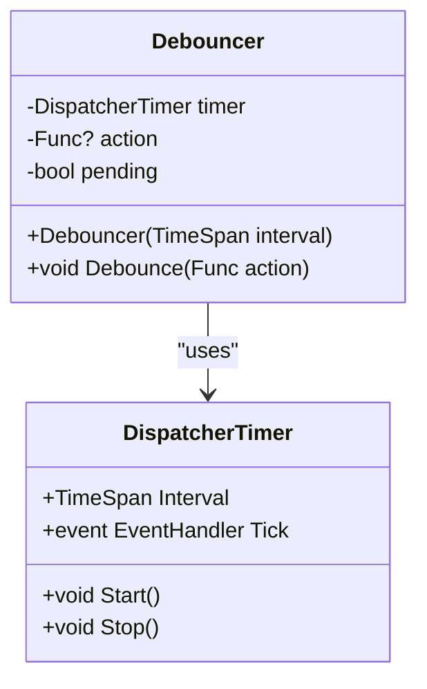
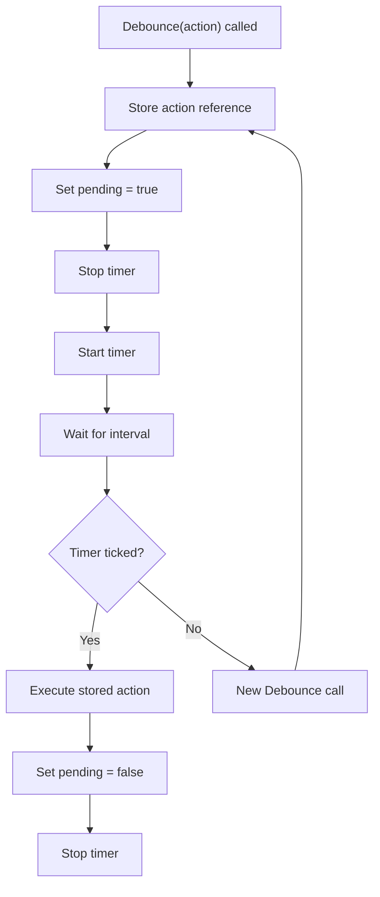
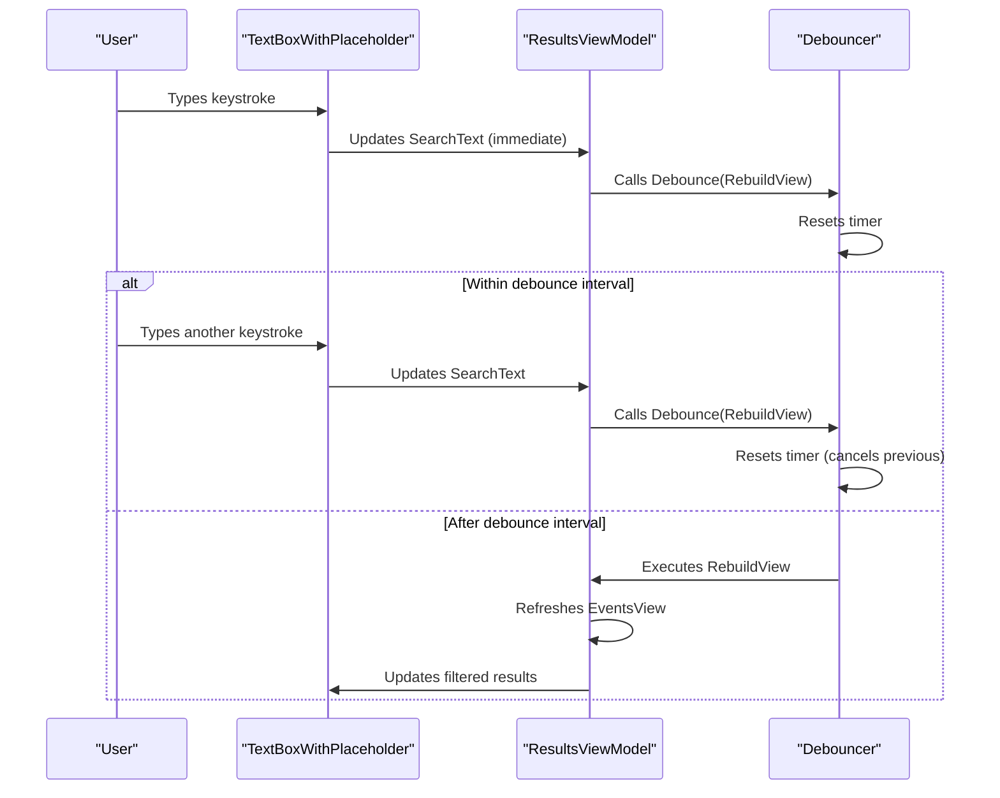

# Debouncer


## Table of Contents
1. [Introduction](#introduction)
2. [Core Functionality](#core-functionality)
3. [Implementation Details](#implementation-details)
4. [Usage in ResultsViewModel](#usage-in-resultsviewmodel)
5. [Integration with WPF Data Binding](#integration-with-wpf-data-binding)
6. [Thread Safety and Timer Considerations](#thread-safety-and-timer-considerations)
7. [Common Issues and Best Practices](#common-issues-and-best-practices)
8. [Performance Recommendations](#performance-recommendations)

## Introduction
The Debouncer utility class is designed to prevent rapid-fire execution of events in WPF applications, particularly useful for UI interactions such as text input filtering or state changes that trigger expensive operations. By introducing a configurable delay threshold, it ensures that actions are only executed after a specified period of inactivity, significantly improving application responsiveness and reducing unnecessary processing.

This document provides a comprehensive analysis of the Debouncer implementation, its integration patterns within the Project Janus codebase, and best practices for usage in WPF applications. The class is primarily used to optimize filtering operations and UI state persistence by preventing excessive reprocessing during user interactions.

## Core Functionality

### Purpose and Design
The Debouncer serves as a mechanism to delay and consolidate rapid successive calls to a function, executing only the most recent invocation after a specified timeout period. This is particularly valuable in scenarios where user input (such as typing in a search box) would otherwise trigger expensive operations on every keystroke.

**Key Features:**
- **Async Support**: Designed to work with asynchronous actions using `Func<Task>`
- **UI Thread Safety**: Utilizes `DispatcherTimer` to ensure execution on the UI thread
- **Action Cancellation**: Automatically cancels pending executions when new requests arrive
- **Configurable Delay**: Accepts a `TimeSpan` parameter to define the debounce interval

### Public Interface
The Debouncer exposes a simple, focused API:


```csharp
public sealed class Debouncer {
    public Debouncer(TimeSpan interval)
    public void Debounce(Func<Task> action)
}
```


**Parameters:**
- `interval`: The time window during which rapid calls are consolidated
- `action`: The asynchronous operation to be debounced

**Behavior:**
1. When `Debounce` is called, it stores the provided action
2. It resets the internal timer, canceling any pending execution
3. After the specified interval elapses without another call, the stored action is executed
4. Only the most recent action is executed if multiple calls occur within the interval

**Section sources**
- [Debouncer.cs](file://Janus.App/Services/Debouncer.cs#L5-L32)

## Implementation Details

### Internal Mechanism
The Debouncer uses `DispatcherTimer` from the `System.Windows.Threading` namespace, which is specifically designed for WPF applications to ensure thread safety when updating UI elements.





**Diagram sources**
- [Debouncer.cs](file://Janus.App/Services/Debouncer.cs#L5-L32)

**Section sources**
- [Debouncer.cs](file://Janus.App/Services/Debouncer.cs#L5-L32)

### Step-by-Step Execution Flow




**Diagram sources**
- [Debouncer.cs](file://Janus.App/Services/Debouncer.cs#L5-L32)

## Usage in ResultsViewModel

### Filter Operation Optimization
The Debouncer is used in the `ResultsViewModel` to optimize filtering operations and prevent excessive reprocessing during typing. When users interact with filter controls or type in search boxes, the debouncer ensures that expensive view rebuilding operations are only performed after a pause in user input.

In the `ResultsViewModel`, the debouncer is specifically used to:
- Delay UI settings persistence
- Optimize filter application
- Prevent excessive view refreshes

### Code Implementation

```csharp
private readonly System.Timers.Timer debounceTimer;
private bool pendingSave;

private async Task LoadUiSettingsAsync() {
    UserUiSettingsService.UiSettings settings = await UserUiSettingsService.LoadAsync();
    ResultsSplitterPosition = settings.ResultsSplitterPosition;
    DetailsSplitterPosition = settings.DetailsSplitterPosition;
}

private async Task SaveUiSettingsAsync() {
    UserUiSettingsService.UiSettings settings = await UserUiSettingsService.LoadAsync();
    settings.ResultsSplitterPosition = ResultsSplitterPosition;
    settings.DetailsSplitterPosition = DetailsSplitterPosition;
    await UserUiSettingsService.SaveAsync(settings);
}

private void DebounceSave() {
    pendingSave = true;
    debounceTimer.Stop();
    debounceTimer.Start();
}
```


The `DebounceSave` method is called whenever UI state changes (such as splitter positions), ensuring that settings are only saved after a period of inactivity.

**Section sources**
- [ResultsViewModel.cs](file://Janus.App/ViewModels/ResultsViewModel.cs#L79-L81)
- [ResultsViewModel.cs](file://Janus.App/ViewModels/ResultsViewModel.cs#L368-L372)
- [ResultsViewModel.cs](file://Janus.App/ViewModels/ResultsViewModel.cs#L556-L557)

## Integration with WPF Data Binding

### View-Level Implementation
The Debouncer is instantiated at the view level in `ResultsView.xaml.cs` and used to manage UI interactions:


```csharp
private readonly Debouncer debouncer = new(TimeSpan.FromMilliseconds(500));
```


This instance is configured with a 500ms debounce interval, which is a common choice for balancing responsiveness with performance optimization.

### XAML Binding Context
The debouncer works in conjunction with WPF data binding through the MVVM pattern. In `ResultsView.xaml`, various UI elements are bound to properties and commands in the `ResultsViewModel`:


```xml
<controls:TextBoxWithPlaceholder
    Text="{Binding SearchText, UpdateSourceTrigger=PropertyChanged}"
    Placeholder="Filter event messages..."
    Width="Auto" Margin="0,0,0,8" />
```


The `UpdateSourceTrigger=PropertyChanged` setting ensures that the `SearchText` property is updated on every keystroke, but the actual filtering operation is debounced to prevent excessive processing.





**Diagram sources**
- [ResultsView.xaml.cs](file://Janus.App/Views/ResultsView.xaml.cs#L11-L12)
- [ResultsView.xaml](file://Janus.App/Views/ResultsView.xaml#L270-L273)
- [ResultsViewModel.cs](file://Janus.App/ViewModels/ResultsViewModel.cs#L200-L210)

**Section sources**
- [ResultsView.xaml.cs](file://Janus.App/Views/ResultsView.xaml.cs#L11-L12)
- [ResultsView.xaml](file://Janus.App/Views/ResultsView.xaml#L270-L273)

## Thread Safety and Timer Considerations

### DispatcherTimer vs System.Timers.Timer
The Debouncer uses `DispatcherTimer` rather than `System.Timers.Timer` for critical reasons related to WPF threading:

**DispatcherTimer Advantages:**
- Executes on the same thread that created it (typically the UI thread)
- Safe for updating UI elements directly
- Integrated with WPF's dispatcher system
- Properly handles application shutdown

**System.Timers.Timer Limitations:**
- Executes on thread pool threads
- Requires explicit marshaling to UI thread for UI updates
- Can cause cross-thread exceptions if not handled properly

The choice of `DispatcherTimer` ensures that the debounced actions can safely update UI-bound properties without requiring additional thread synchronization.

### Thread Safety Analysis
The Debouncer implementation is thread-safe for its intended use case:

- **Single-threaded Context**: Since it uses `DispatcherTimer`, all operations occur on the UI thread
- **State Management**: The `pending` flag and `action` reference are only accessed from the UI thread
- **Timer Operations**: `Stop()` and `Start()` calls are atomic operations on the timer

However, it's important to note that while the implementation is thread-safe within the UI context, it should not be shared across multiple threads or used in non-UI contexts.

**Section sources**
- [Debouncer.cs](file://Janus.App/Services/Debouncer.cs#L5-L32)
- [ResultsViewModel.cs](file://Janus.App/ViewModels/ResultsViewModel.cs#L79-L81)

## Common Issues and Best Practices

### Potential Issues

**Unintended Cancellations:**
When multiple debounced operations share the same Debouncer instance, calling `Debounce` for one operation will cancel any pending execution of another. This can lead to unexpected behavior if not properly managed.

**Memory Leaks:**
The current implementation does not implement `IDisposable`, which could lead to memory leaks if the timer holds references to objects that should be garbage collected. `DispatcherTimer` automatically stops when the application shuts down, but in long-running applications with dynamic view creation, explicit disposal may be necessary.

**Timer Precision:**
WPF timers are not high-precision and may have slight variations in their firing intervals, especially under heavy load. This is typically not an issue for debounce scenarios but should be considered for time-critical applications.

### Proper Disposal Patterns
To prevent potential memory leaks, consider implementing `IDisposable`:


```csharp
public sealed class Debouncer : IDisposable {
    private readonly DispatcherTimer timer;
    private bool disposed;
    
    public void Dispose() {
        if (!disposed) {
            timer.Stop();
            timer.Tick -= Timer_Tick;
            disposed = true;
        }
    }
    
    private async void Timer_Tick(object? sender, EventArgs e) {
        if (disposed) return;
        // existing logic
    }
}
```


### Integration with ICommand
The Debouncer integrates well with WPF's `ICommand` pattern, particularly with the `RelayCommand` implementation found in the codebase:


```csharp
// In ResultsViewModel
private void RebuildView() {
    // Expensive operation that should be debounced
    EventsView.Refresh();
}

// Property binding in XAML uses standard ICommand pattern
```


The `RelayCommand` implementation properly handles command state changes and integrates with WPF's command system.

**Section sources**
- [Debouncer.cs](file://Janus.App/Services/Debouncer.cs#L5-L32)
- [RelayCommand.cs](file://Janus.App/Helpers/RelayCommand.cs#L0-L42)
- [ResultsViewModel.cs](file://Janus.App/ViewModels/ResultsViewModel.cs#L79-L81)

## Performance Recommendations

### Choosing Optimal Intervals
The optimal debounce interval depends on the specific use case:

**Recommended Values:**
- **Text Input Filtering**: 300-500ms
  - Balances responsiveness with performance
  - Matches typical typing speed
- **UI State Persistence**: 500-1000ms
  - Allows for rapid successive changes
  - Prevents excessive disk I/O
- **Expensive Operations**: 1000-2000ms
  - For operations that involve database queries or file operations
  - Gives users time to complete their input

The 500ms interval used in the `ResultsView` is well-chosen for filter operations, providing a responsive feel while preventing excessive processing.

### Alternatives for High-Frequency Scenarios
For scenarios requiring more sophisticated throttling or handling of high-frequency events:

**Throttling vs Debouncing:**
- **Debouncing**: Wait for pause in events, then execute once
- **Throttling**: Execute at most once per interval, regardless of event frequency

**Custom Solutions:**
For high-frequency scenarios, consider:
- **Priority-based queuing**: Process critical updates immediately, delay less important ones
- **Adaptive intervals**: Adjust debounce time based on system load or user behavior
- **Batch processing**: Collect multiple changes and process them together

### Performance Monitoring
To ensure optimal performance:
- Monitor CPU usage during filtering operations
- Measure the frequency of view rebuilds
- Profile the application with realistic data sets
- Test with various debounce intervals to find the optimal balance

The current implementation effectively addresses the primary performance concern of excessive view rebuilding during user interactions, making it a valuable optimization for the application's responsiveness.

**Referenced Files in This Document**   
- [Debouncer.cs](file://Janus.App/Services/Debouncer.cs)
- [ResultsViewModel.cs](file://Janus.App/ViewModels/ResultsViewModel.cs)
- [ResultsView.xaml.cs](file://Janus.App/Views/ResultsView.xaml.cs)
- [ResultsView.xaml](file://Janus.App/Views/ResultsView.xaml)
- [RelayCommand.cs](file://Janus.App/Helpers/RelayCommand.cs)