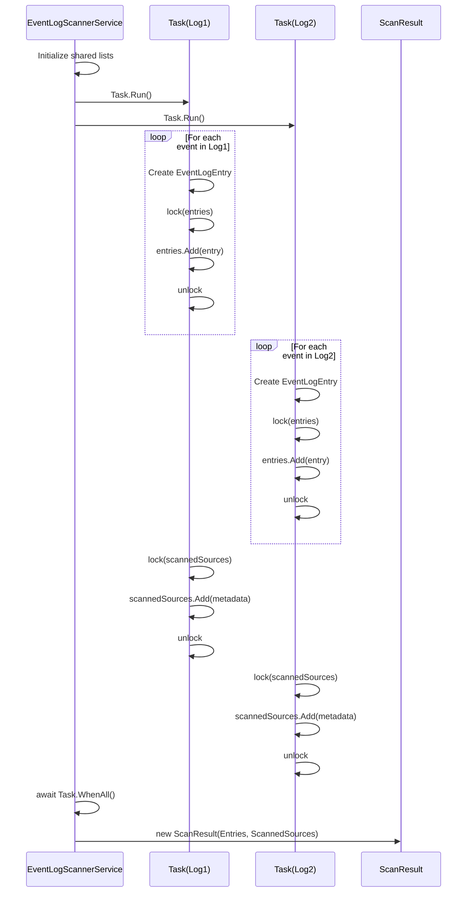
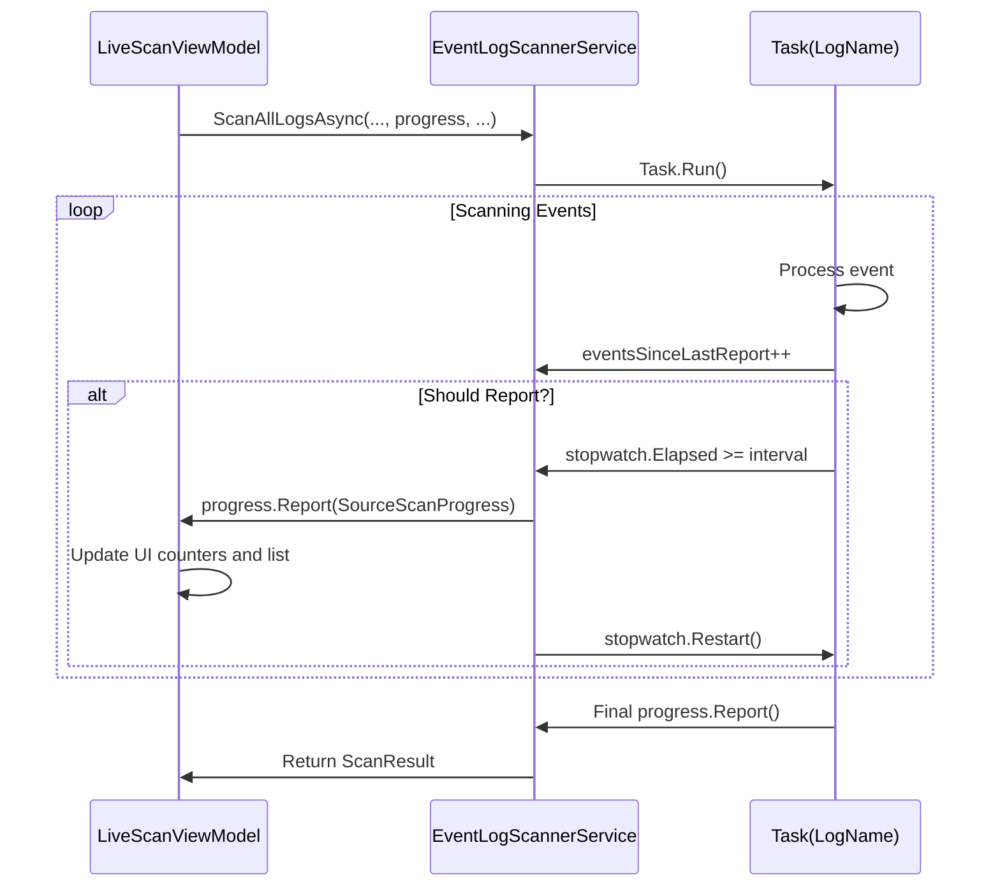

# ScanResult


## Table of Contents
1. [Introduction](#introduction)
2. [Core Properties](#core-properties)
3. [Immutability and Thread-Safe Construction](#immutability-and-thread-safe-construction)
4. [Integration with SourceScanProgress for Real-Time Feedback](#integration-with-sourcescanprogress-for-real-time-feedback)
5. [Data Flow from EventLogScannerService to LiveScanViewModel](#data-flow-from-eventlogscannerservice-to-livescanviewmodel)
6. [Relationship with ScanSession and Partial Results Handling](#relationship-with-scansession-and-partial-results-handling)
7. [Performance Considerations and Memory Management](#performance-considerations-and-memory-management)
8. [Extensibility for Analytics and Filtering](#extensibility-for-analytics-and-filtering)
9. [Conclusion](#conclusion)

## Introduction
The **ScanResult** data model serves as the primary container for results generated by event log scanning operations in Project Janus. It aggregates collections of **EventLogEntry** objects with comprehensive metadata about the scanning process, including statistics on scanned sources, error counts, and overall scan duration. This model is central to the application's ability to collect, process, and display Windows event log data around a critical timestamp of interest. The **ScanResult** is designed to be immutable and thread-safe, enabling safe consumption by the UI layer after parallel scanning operations. It acts as a bridge between the low-level scanning service and the higher-level view models that present data to users, ensuring that all relevant information from the scanning process is preserved and accessible for analysis and visualization.

**Section sources**
- [ScanResult.cs](file://d:/devel/Project Janus/Janus.App/Services/ScanResult.cs#L4-L7)

## Core Properties
The **ScanResult** class is defined with two essential, required properties that capture the complete output of a scanning operation:

- **Entries**: An `IReadOnlyList<EventLogEntry>` that contains all event log entries retrieved during the scan. Each **EventLogEntry** includes detailed information such as the event's ID, timestamp, log level, source, message, and machine name. This collection is the primary data payload of the scan result.
- **ScannedSources**: An `IReadOnlyList<ScannedSource>` that provides metadata about each event log source (e.g., "Application", "System") that was scanned. For each source, it records the number of events retrieved and the final **ScanStatus** (Success, Partial, or Failed).

These properties are declared with `init` accessors, meaning they can only be set during object construction, which enforces the immutability of the **ScanResult** instance. The use of `IReadOnlyList<T>` ensures that the collections cannot be modified after the **ScanResult** is created, protecting the integrity of the scan data.


```mermaid
classDiagram
class ScanResult {
+IReadOnlyList<EventLogEntry> Entries
+IReadOnlyList<ScannedSource> ScannedSources
}
class EventLogEntry {
+long Id
+string LogName
+DateTime TimeCreated
+string Level
+string Source
+int EventId
+string Message
+string MachineName
+Guid ScanSessionId
+int ScanEventId
}
class ScannedSource {
+string SourceName
+int EventsRetrieved
+ScanStatus Status
}
enum ScanStatus {
Success
Partial
Failed
}
ScanResult --> EventLogEntry : "contains"
ScanResult --> ScannedSource : "contains"
```


**Diagram sources**
- [ScanResult.cs](file://d:/devel/Project Janus/Janus.App/Services/ScanResult.cs#L4-L7)
- [EventLogEntry.cs](file://d:/devel/Project Janus/Janus.Core/EventLogEntry.cs#L0-L17)
- [ScannedSource.cs](file://d:/devel/Project Janus/Janus.Core/ScannedSource.cs#L0-L13)

**Section sources**
- [ScanResult.cs](file://d:/devel/Project Janus/Janus.App/Services/ScanResult.cs#L4-L7)
- [EventLogEntry.cs](file://d:/devel/Project Janus/Janus.Core/EventLogEntry.cs#L0-L17)
- [ScannedSource.cs](file://d:/devel/Project Janus/Janus.Core/ScannedSource.cs#L0-L13)

## Immutability and Thread-Safe Construction
The **ScanResult** model is designed with immutability as a core principle. Its properties are declared with `get; init;`, which allows them to be set only during the object's initialization phase. This design ensures that once a **ScanResult** is created, its data cannot be altered, making it safe to pass between threads and components without the risk of unintended modifications.

The thread-safe construction of **ScanResult** occurs within the **EventLogScannerService.ScanAllLogsAsync** method, which performs parallel scanning of multiple event log sources. The scanning process uses a `Task.Run` for each log source, and the results are aggregated into shared `List<T>` collections (`entries` and `scannedSources`). To prevent race conditions when multiple tasks attempt to add data simultaneously, the code uses `lock` statements around the operations that modify these shared lists. For example, when a new **EventLogEntry** is created, it is added to the shared `entries` list within a `lock (entries)` block. Similarly, the final **ScannedSource** metadata for each log is added to the `scannedSources` list within a `lock (scannedSources)` block. After all parallel tasks complete with `await Task.WhenAll(tasks)`, a new **ScanResult** is constructed using the now-complete lists. This approach ensures that the **ScanResult** is built from a consistent, thread-safe state.





**Diagram sources**
- [EventLogScannerService.cs](file://d:/devel/Project Janus/Janus.App/Services/EventLogScannerService.cs#L31-L160)

**Section sources**
- [ScanResult.cs](file://d:/devel/Project Janus/Janus.App/Services/ScanResult.cs#L4-L7)
- [EventLogScannerService.cs](file://d:/devel/Project Janus/Janus.App/Services/EventLogScannerService.cs#L31-L160)

## Integration with SourceScanProgress for Real-Time Feedback
The **ScanResult** model works in conjunction with the **SourceScanProgress** class to provide real-time feedback during the scanning process. While **ScanResult** represents the final, immutable output, **SourceScanProgress** is used to report the state of individual log sources as they are being scanned.

The **EventLogScannerService.ScanAllLogsAsync** method accepts an `IProgress<SourceScanProgress>` parameter. As each parallel task processes a log source, it periodically calls `perSourceProgress?.Report()` with a **SourceScanProgress** object. This object contains the current count of retrieved events, the active status, and any exception messages. In the **LiveScanViewModel**, this progress is captured by a `Progress<SourceScanProgress>` instance, which updates the UI in real-time. It maintains an `ObservableCollection<SourceScanProgress>` to display the status of each source, updating counters for total sources, successful sources, sources with errors, and the total number of events retrieved. This allows the user to see the scan's progress, including which sources are currently being processed and which have completed or failed, long before the final **ScanResult** is returned.





**Diagram sources**
- [EventLogScannerService.cs](file://d:/devel/Project Janus/Janus.App/Services/EventLogScannerService.cs#L31-L160)
- [SourceScanProgress.cs](file://d:/devel/Project Janus/Janus.App/ViewModels/SourceScanProgress.cs#L0-L25)
- [LiveScanViewModel.cs](file://d:/devel/Project Janus/Janus.App/ViewModels/LiveScanViewModel.cs#L61-L260)

**Section sources**
- [SourceScanProgress.cs](file://d:/devel/Project Janus/Janus.App/ViewModels/SourceScanProgress.cs#L0-L25)
- [LiveScanViewModel.cs](file://d:/devel/Project Janus/Janus.App/ViewModels/LiveScanViewModel.cs#L61-L260)

## Data Flow from EventLogScannerService to LiveScanViewModel
The **ScanResult** is passed from the **EventLogScannerService** to the **LiveScanViewModel** as the final output of a successful scan. In the **LiveScanViewModel.ScanAsync** method, the view model calls `EventLogScannerService.ScanAllLogsAsync` with the configured timestamp, time window, and a progress reporter. Upon completion, the returned **ScanResult** is used to create a new **ResultsViewModel** and navigate to the results view.

Specifically, the **Entries** collection from the **ScanResult** is passed directly to the **ResultsViewModel.LoadEvents** method to populate the displayed list of events. Furthermore, the **ScanResult** data is used to construct a new **ScanSession** object, which serves as a persistent record of the scan. The **Entries** and **ScannedSources** from the **ScanResult** are copied into the **ScanSession**'s `Entries` and `ScannedSources` collections using collection expressions (`[.. scanResult.Entries]`). This **ScanSession** object can then be saved to disk as a snapshot for later analysis. This flow demonstrates how the **ScanResult** acts as a transient data carrier between the scanning service and the presentation layer.


```mermaid
flowchart TD
A[LiveScanViewModel.ScanAsync] --> B[Call EventLogScannerService.ScanAllLogsAsync]
B --> C[Parallel Scan of Log Sources]
C --> D[Construct ScanResult]
D --> E[Return ScanResult to ViewModel]
E --> F{Scan Success?}
F --> |Yes| G[Create ResultsViewModel]
G --> H[LoadEvents(scanResult.Entries)]
G --> I[Create ScanSession]
I --> J[Set Entries = [.. scanResult.Entries]]
I --> K[Set ScannedSources = [.. scanResult.ScannedSources]]
G --> L[Navigate to ResultsView]
F --> |No| M[Handle Exception]
```


**Diagram sources**
- [EventLogScannerService.cs](file://d:/devel/Project Janus/Janus.App/Services/EventLogScannerService.cs#L31-L160)
- [LiveScanViewModel.cs](file://d:/devel/Project Janus/Janus.App/ViewModels/LiveScanViewModel.cs#L211-L242)
- [ResultsViewModel.cs](file://d:/devel/Project Janus/Janus.App/ViewModels/ResultsViewModel.cs#L0-L199)
- [ScanSession.cs](file://d:/devel/Project Janus/Janus.Core/ScanSession.cs#L0-L34)

**Section sources**
- [LiveScanViewModel.cs](file://d:/devel/Project Janus/Janus.App/ViewModels/LiveScanViewModel.cs#L211-L242)
- [ResultsViewModel.cs](file://d:/devel/Project Janus/Janus.App/ViewModels/ResultsViewModel.cs#L0-L199)

## Relationship with ScanSession and Partial Results Handling
The **ScanResult** is closely related to the **ScanSession** model, which represents a persistent snapshot of a scan. While **ScanResult** is the immediate output of a scan operation, **ScanSession** is designed for long-term storage, often in a database. The **ScanResult** is used to populate a new **ScanSession** instance, as seen in the **LiveScanViewModel**.

The system handles partial results gracefully through the use of the **ScanStatus.Partial** enum value. If a scan is cancelled via the `CancellationToken`, the `OperationCanceledException` is caught, the status is set to **Partial**, and a final progress update is reported. The **ScannedSource** for that log will reflect the number of events successfully retrieved before cancellation. This means that even if a scan is interrupted, the **ScanResult** will still contain all the valid data collected up to that point, allowing the user to analyze the partial results. The **ScanSession** created from this **ScanResult** will preserve this partial data, providing a complete record of what was scanned.

**Section sources**
- [EventLogScannerService.cs](file://d:/devel/Project Janus/Janus.App/Services/EventLogScannerService.cs#L116-L159)
- [ScanSession.cs](file://d:/devel/Project Janus/Janus.Core/ScanSession.cs#L0-L34)
- [LiveScanViewModel.cs](file://d:/devel/Project Janus/Janus.App/ViewModels/LiveScanViewModel.cs#L240-L259)

## Performance Considerations and Memory Management
The **ScanResult** model can potentially hold very large datasets, as Windows event logs can contain thousands or millions of entries. The current implementation loads all **EventLogEntry** objects into memory within a `List<EventLogEntry>` before constructing the **ScanResult**. This approach is simple but can lead to high memory usage and potential performance issues for very large scans.

Strategies for incremental processing are not implemented in the current code. All data is aggregated in memory during the parallel scan and only exposed to the UI after the entire operation completes. For large result sets, this could cause the application to become unresponsive. A potential optimization would be to implement a streaming or pagination mechanism, where results are processed and displayed incrementally. However, the use of `IReadOnlyList<T>` in the **ScanResult** contract makes this challenging, as it implies a complete, random-access collection. Future improvements could involve introducing a separate model for incremental results or modifying the **ScanResult** to support lazy loading, though this would require significant changes to the data flow between the service and the view models.

**Section sources**
- [EventLogScannerService.cs](file://d:/devel/Project Janus/Janus.App/Services/EventLogScannerService.cs#L31-L160)
- [ScanResult.cs](file://d:/devel/Project Janus/Janus.App/Services/ScanResult.cs#L4-L7)

## Extensibility for Analytics and Filtering
The **ScanResult** model itself is not directly extensible, as it is a simple data container with a fixed set of properties. However, its data is used extensively in the **ResultsViewModel** to enable powerful analytics and filtering capabilities.

The **ResultsViewModel** uses the **Entries** from the **ScanResult** to populate an `ObservableCollection<EventLogEntryDisplay>`. It provides filtering based on log level, source, and log name through `ObservableCollection<string>` properties. The view model uses `ICollectionView` to apply these filters efficiently. It also implements analytics by providing count providers (`LogLevelCountProvider`, `SourceCountProvider`, `LogNameCountProvider`) that calculate the number of events matching the current filters for each category, enabling dynamic UI updates. Furthermore, it performs text highlighting in the event message based on a search term. These features demonstrate how the **ScanResult** serves as a foundation for rich data analysis, even though the extension logic resides in the view model rather than the **ScanResult** class itself.

**Section sources**
- [ResultsViewModel.cs](file://d:/devel/Project Janus/Janus.App/ViewModels/ResultsViewModel.cs#L0-L199)

## Conclusion
The **ScanResult** data model is a critical component in Project Janus, acting as the definitive container for the output of event log scanning operations. Its design as an immutable, thread-safe object makes it well-suited for use in a parallel processing environment. By aggregating **EventLogEntry** collections with metadata from **ScannedSource**, it provides a complete picture of the scan's outcome. Its integration with **SourceScanProgress** enables real-time user feedback, and its seamless passage from **EventLogScannerService** to **LiveScanViewModel** facilitates a smooth user experience. While the current implementation is effective, considerations around memory usage for large datasets present opportunities for future optimization. The model's simplicity allows higher-level components like **ResultsViewModel** to build sophisticated analytics and filtering features on top of its data, making it a robust foundation for event log analysis.

**Referenced Files in This Document**   
- [ScanResult.cs](file://d:/devel/Project Janus/Janus.App/Services/ScanResult.cs)
- [EventLogScannerService.cs](file://d:/devel/Project Janus/Janus.App/Services/EventLogScannerService.cs)
- [LiveScanViewModel.cs](file://d:/devel/Project Janus/Janus.App/ViewModels/LiveScanViewModel.cs)
- [ResultsViewModel.cs](file://d:/devel/Project Janus/Janus.App/ViewModels/ResultsViewModel.cs)
- [SourceScanProgress.cs](file://d:/devel/Project Janus/Janus.App/ViewModels/SourceScanProgress.cs)
- [EventLogEntry.cs](file://d:/devel/Project Janus/Janus.Core/EventLogEntry.cs)
- [ScannedSource.cs](file://d:/devel/Project Janus/Janus.Core/ScannedSource.cs)
- [ScanSession.cs](file://d:/devel/Project Janus/Janus.Core/ScanSession.cs)