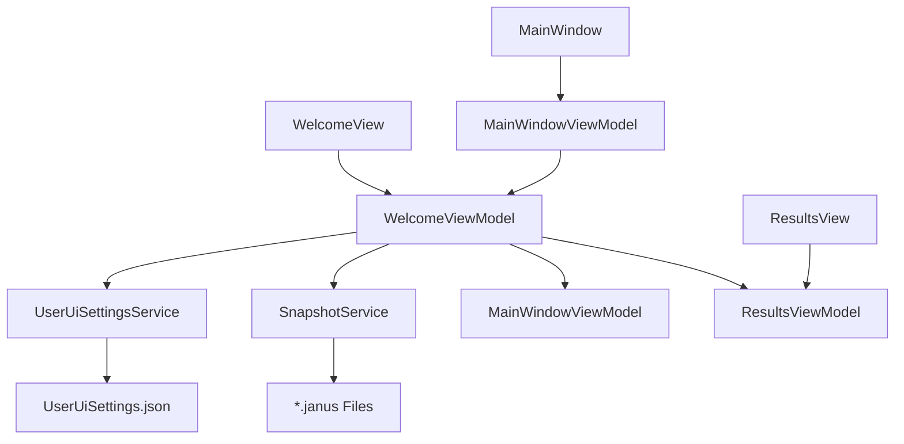
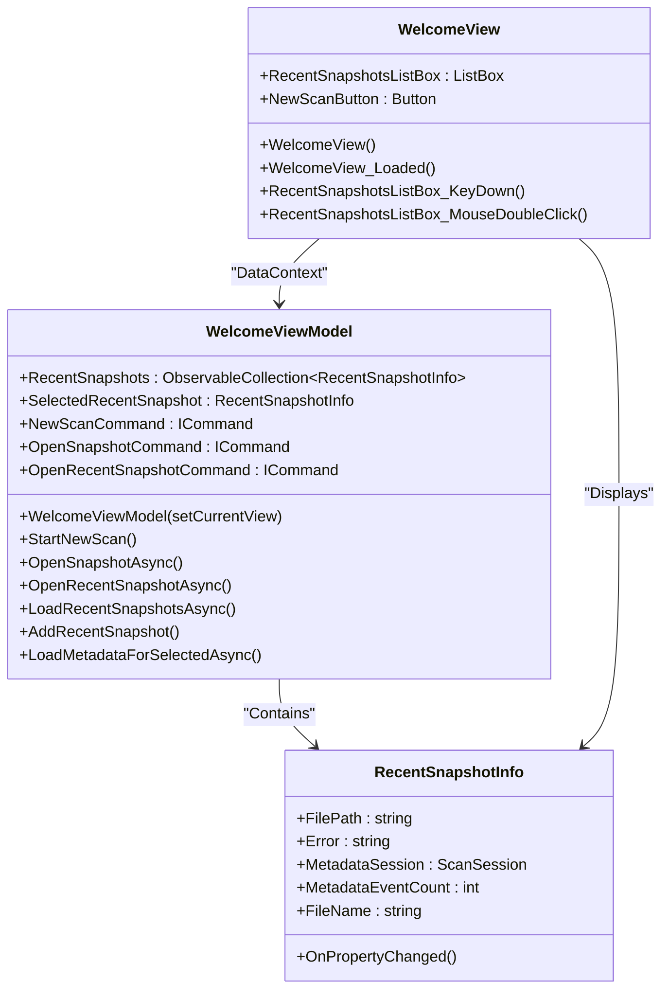
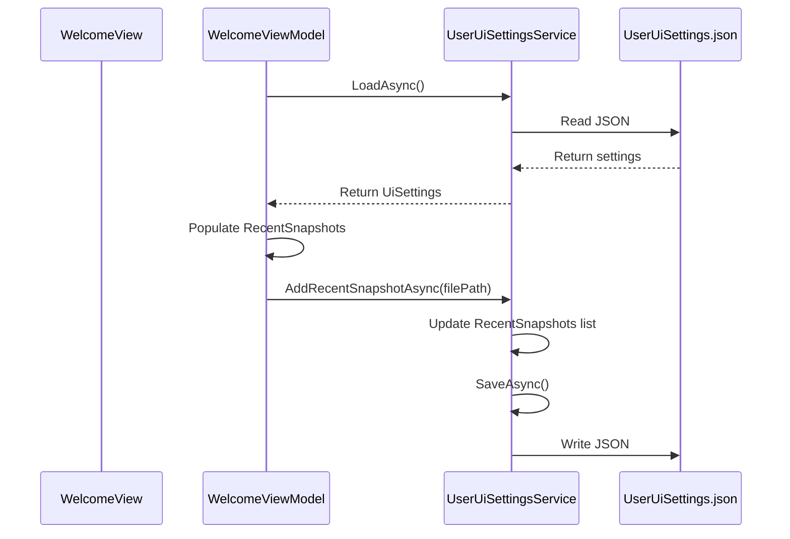
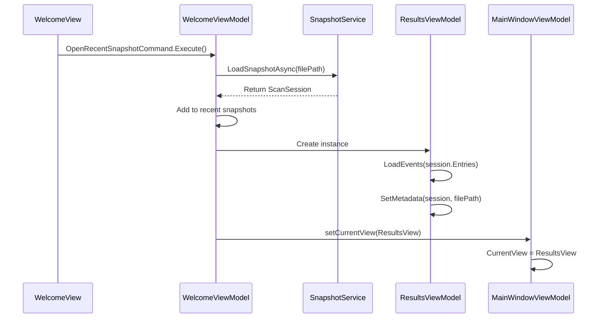

# Welcome Screen


## Table of Contents
1. [Introduction](#introduction)
2. [Architecture Overview](#architecture-overview)
3. [Core Components](#core-components)
4. [Detailed Component Analysis](#detailed-component-analysis)
5. [Data Flow and Integration](#data-flow-and-integration)
6. [Troubleshooting Guide](#troubleshooting-guide)
7. [Customization Options](#customization-options)

## Introduction
The Welcome Screen serves as the primary entry point for the Project Janus application, providing users with immediate access to recent snapshots and navigation options for initiating new scans or loading saved data. This document details the implementation of the `WelcomeView` and `WelcomeViewModel` components, which follow the Model-View-ViewModel (MVVM) pattern to ensure clean separation of concerns. The screen displays a list of recently accessed snapshots, allows double-click or Enter key activation, and integrates with persistent user settings to maintain history across sessions. The UI is built using WPF with XAML, leveraging data binding, commands, and property change notifications for responsive interaction.

## Architecture Overview
The Welcome Screen implements a classic MVVM architecture where the `WelcomeView` (View) binds to the `WelcomeViewModel` (ViewModel) through data context. The ViewModel manages application state, commands, and business logic, while the View handles visual presentation and user interaction. The component integrates with `UserUiSettingsService` for persistence and `SnapshotService` for data operations. Navigation is coordinated through a callback mechanism passed from the `MainWindowViewModel`.





**Diagram sources**
- [WelcomeView.xaml](file://d:/devel/Project Janus/Janus.App/Views/WelcomeView.xaml)
- [WelcomeViewModel.cs](file://d:/devel/Project Janus/Janus.App/ViewModels/WelcomeViewModel.cs)
- [UserUiSettingsService.cs](file://d:/devel/Project Janus/Janus.App/Services/UserUiSettingsService.cs)
- [MainWindowViewModel.cs](file://d:/devel/Project Janus/Janus.App/ViewModels/MainWindowViewModel.cs)

## Core Components
The core functionality of the Welcome Screen is distributed across several key components:
- **WelcomeView**: The XAML-based user interface that defines layout, styling, and event handling
- **WelcomeViewModel**: The data and command logic that powers the view using INotifyPropertyChanged
- **RecentSnapshotInfo**: A bindable model class representing snapshot metadata
- **UserUiSettingsService**: Handles persistence of recent snapshot history
- **RelayCommand/AsyncRelayCommand**: Implements ICommand for UI command binding

These components work together to provide a responsive, stateful entry point that maintains user context between sessions.

**Section sources**
- [WelcomeView.xaml](file://d:/devel/Project Janus/Janus.App/Views/WelcomeView.xaml)
- [WelcomeViewModel.cs](file://d:/devel/Project Janus/Janus.App/ViewModels/WelcomeViewModel.cs)
- [UserUiSettingsService.cs](file://d:/devel/Project Janus/Janus.App/Services/UserUiSettingsService.cs)
- [RelayCommand.cs](file://d:/devel/Project Janus/Janus.App/Helpers/RelayCommand.cs)

## Detailed Component Analysis

### WelcomeView Analysis
The `WelcomeView` is implemented as a WPF UserControl with a rich XAML definition that includes branding elements, action buttons, and a recent snapshots panel. The view uses data binding to connect UI elements to the ViewModel's properties and commands.





**Diagram sources**
- [WelcomeView.xaml.cs](file://d:/devel/Project Janus/Janus.App/Views/WelcomeView.xaml.cs)
- [WelcomeViewModel.cs](file://d:/devel/Project Janus/Janus.App/ViewModels/WelcomeViewModel.cs)

#### XAML Structure and Data Templates
The XAML structure is organized into two main sections: the action card and the recent snapshots panel. The action card contains buttons for starting a new live scan or opening a snapshot, while the recent snapshots panel displays a list of recently accessed files with detailed metadata.

Key UI elements include:
- **AnimatedGlowButtonStyle**: A custom button style with animated light effects
- **RecentSnapshotsListBox**: A ListBox bound to the `RecentSnapshots` collection with custom templates for empty states
- **Data Binding**: Extensive use of `{Binding}` syntax to connect UI properties to ViewModel properties

When the `RecentSnapshots` collection is empty, a custom ControlTemplate displays a helpful message guiding the user to create their first snapshot.

**Section sources**
- [WelcomeView.xaml](file://d:/devel/Project Janus/Janus.App/Views/WelcomeView.xaml)

#### Event Routing and User Interaction
The `WelcomeView` handles several user interactions through event handlers:
- **Loaded event**: Sets initial focus and selection
- **KeyDown event**: Handles Enter key press on selected snapshot
- **MouseDoubleClick event**: Opens selected snapshot with double-click


```csharp
private void WelcomeView_Loaded(object sender, RoutedEventArgs e) {
    if (DataContext is WelcomeViewModel && RecentSnapshotsListBox.Items.Count > 0 && RecentSnapshotsListBox.SelectedIndex == -1) {
        RecentSnapshotsListBox.SelectedIndex = 0;
    }
    NewScanButton.Focus();
}

private void RecentSnapshotsListBox_KeyDown(object sender, KeyEventArgs e) {
    if (e.Key == Key.Enter && DataContext is WelcomeViewModel vm && RecentSnapshotsListBox.SelectedItem is RecentSnapshotInfo info) {
        if (vm.OpenRecentSnapshotCommand.CanExecute(info)) {
            vm.OpenRecentSnapshotCommand.Execute(info);
        }
        e.Handled = true;
    }
}
```


These handlers ensure intuitive keyboard navigation and immediate feedback for user actions.

**Section sources**
- [WelcomeView.xaml.cs](file://d:/devel/Project Janus/Janus.App/Views/WelcomeView.xaml.cs)

### WelcomeViewModel Analysis
The `WelcomeViewModel` implements the core logic of the Welcome Screen using the MVVM pattern. It exposes observable collections and commands that the view binds to, and uses `INotifyPropertyChanged` to notify the UI of state changes.

#### MVVM Pattern Implementation
The ViewModel follows standard MVVM practices:
- **INotifyPropertyChanged**: Implemented for both `WelcomeViewModel` and `RecentSnapshotInfo` classes
- **RelayCommand**: Used for synchronous commands (`NewScanCommand`)
- **AsyncRelayCommand**: Used for asynchronous operations (`OpenSnapshotCommand`, `OpenRecentSnapshotCommand`)
- **Two-way binding**: For `SelectedRecentSnapshot` property


```csharp
public class WelcomeViewModel : INotifyPropertyChanged {
    private RecentSnapshotInfo? selectedRecentSnapshot;
    public RecentSnapshotInfo? SelectedRecentSnapshot {
        get => selectedRecentSnapshot;
        set {
            selectedRecentSnapshot = value;
            OnPropertyChanged();
            LoadMetadataForSelectedAsync();
        }
    }
    // ...
}
```


Property changes trigger UI updates through the `OnPropertyChanged` method, ensuring the view remains synchronized with the model state.

**Section sources**
- [WelcomeViewModel.cs](file://d:/devel/Project Janus/Janus.App/ViewModels/WelcomeViewModel.cs)

#### Command Handling with RelayCommand
Commands are implemented using `RelayCommand` and `AsyncRelayCommand` from the application's helper library. These classes implement `ICommand` and provide the necessary infrastructure for WPF command binding.


```csharp
public WelcomeViewModel(Action<object> setCurrentView) {
    this.setCurrentView = setCurrentView;
    NewScanCommand = new RelayCommand(_ => StartNewScan());
    OpenSnapshotCommand = new AsyncRelayCommand(OpenSnapshotAsync);
    OpenRecentSnapshotCommand = new AsyncRelayCommand(OpenRecentSnapshotAsync, () => SelectedRecentSnapshot != null);
    _ = LoadRecentSnapshotsAsync();
}
```


The `NewScanCommand` transitions the application to the live scan interface, while the open commands handle snapshot loading operations.

**Section sources**
- [WelcomeViewModel.cs](file://d:/devel/Project Janus/Janus.App/ViewModels/WelcomeViewModel.cs)
- [RelayCommand.cs](file://d:/devel/Project Janus/Janus.App/Helpers/RelayCommand.cs)

#### Recent Snapshots Collection Management
The `RecentSnapshots` collection is an `ObservableCollection<RecentSnapshotInfo>` that is populated from persistent user settings:


```csharp
private async Task LoadRecentSnapshotsAsync() {
    UserUiSettingsService.UiSettings settings = await UserUiSettingsService.LoadAsync();
    RecentSnapshots.Clear();
    foreach (string? path in settings.RecentSnapshots.Distinct().Take(10)) {
        if (!File.Exists(path)) {
            continue;
        }
        RecentSnapshots.Add(new RecentSnapshotInfo { FilePath = path });
    }
    if (RecentSnapshots.Count > 0) {
        SelectedRecentSnapshot = RecentSnapshots[0];
    }
}
```


This method:
1. Loads settings from `UserUiSettings.json`
2. Clears the existing collection
3. Adds up to 10 existing snapshot paths
4. Sets the first item as selected by default

The collection automatically updates when new snapshots are added through the `AddRecentSnapshot` method.

**Section sources**
- [WelcomeViewModel.cs](file://d:/devel/Project Janus/Janus.App/ViewModels/WelcomeViewModel.cs)

## Data Flow and Integration

### Integration with UserUiSettingsService
The `UserUiSettingsService` provides persistence for the recent snapshots history. It stores an ordered list of file paths in a JSON file, with the most recently accessed snapshot at the beginning.





**Diagram sources**
- [WelcomeViewModel.cs](file://d:/devel/Project Janus/Janus.App/ViewModels/WelcomeViewModel.cs)
- [UserUiSettingsService.cs](file://d:/devel/Project Janus/Janus.App/Services/UserUiSettingsService.cs)

The service uses a thread-safe approach with `SemaphoreSlim` to prevent race conditions during file operations. The `AddRecentSnapshotAsync` method ensures the list is capped at 10 items and removes duplicates.

### Snapshot Loading and Navigation Flow
When a user opens a snapshot, a coordinated flow occurs across multiple components:





**Diagram sources**
- [WelcomeViewModel.cs](file://d:/devel/Project Janus/Janus.App/ViewModels/WelcomeViewModel.cs)
- [SnapshotService.cs](file://d:/devel/Project Janus/Janus.App/Services/SnapshotService.cs)
- [ResultsViewModel.cs](file://d:/devel/Project Janus/Janus.App/ViewModels/ResultsViewModel.cs)
- [MainWindowViewModel.cs](file://d:/devel/Project Janus/Janus.App/ViewModels/MainWindowViewModel.cs)

The `setCurrentView` callback, originally provided by `MainWindowViewModel`, enables the Welcome Screen to navigate to other views without direct dependencies.

## Troubleshooting Guide
This section addresses common issues users may encounter with the Welcome Screen and provides diagnostic steps and solutions.

### Missing Recent Snapshots
**Symptoms**: The recent snapshots list appears empty despite previous usage.

**Causes and Solutions**:
1. **Settings file missing or corrupted**: Check for `UserUiSettings.json` in the application directory. If missing, it will be recreated on next use. If corrupted, rename or delete it to force recreation.
2. **Snapshot files moved or deleted**: The loading process filters out non-existent files. Verify that snapshot files still exist at their recorded paths.
3. **Permission issues**: Ensure the application has read/write access to its directory.

**Diagnostic Steps**:
- Verify `UserUiSettings.json` exists and contains valid JSON
- Check the `RecentSnapshots` array in the settings file
- Confirm snapshot files exist at the specified paths

### UI Not Updating After Loading Snapshot
**Symptoms**: The view does not transition after clicking "Load Snapshot" or double-clicking a recent snapshot.

**Causes and Solutions**:
1. **Command execution failure**: Check for error messages from `SnapshotService`. The file may be corrupted or in an invalid format.
2. **Navigation callback null**: Ensure `setCurrentView` is properly initialized. This is typically set by `MainWindowViewModel`.
3. **Asynchronous operation not awaited**: The `OpenRecentSnapshotAsync` method is fire-and-forget in the constructor call (`_ = LoadRecentSnapshotsAsync()`), but this is by design.

**Diagnostic Steps**:
- Check for MessageBox error dialogs indicating loading failures
- Verify the `DataContext` of `WelcomeView` is properly set to `WelcomeViewModel`
- Confirm the `setCurrentView` delegate is not null in the ViewModel

### Metadata Not Displaying for Selected Snapshot
**Symptoms**: When selecting a recent snapshot, the details panel shows no metadata or displays "File not found."

**Causes and Solutions**:
1. **File no longer exists**: The snapshot file was moved or deleted after being added to recent list.
2. **Permission issues**: Application lacks read permissions for the file.
3. **Corrupted snapshot**: The SQLite database within the .janus file is corrupted.

**Diagnostic Steps**:
- Verify the file exists at the path shown in the FilePath field
- Check file permissions
- Attempt to open the file manually through the "Open Snapshot..." button

## Customization Options
The Welcome Screen can be customized in several ways to meet specific requirements:

### Layout Modifications
The XAML structure can be modified to:
- Change the position or size of the action card and recent snapshots panel
- Modify the branding elements (logo, tagline)
- Adjust spacing and margins through the Grid and DockPanel definitions
- Change the number of recent snapshots displayed (currently capped at 10)

### Behavior Modifications
Key behaviors that can be customized:
- **Selection behavior**: Modify the `WelcomeView_Loaded` method to change initial selection logic
- **Keyboard shortcuts**: Extend the `RecentSnapshotsListBox_KeyDown` handler to support additional keys
- **Double-click behavior**: Modify the mouse double-click handler or disable it entirely
- **Recent snapshots limit**: Change the `Take(10)` in `LoadRecentSnapshotsAsync` to adjust the history length

### Styling Customization
The visual appearance can be customized through:
- **AnimatedGlowButtonStyle**: Modify the animation storyboard or colors
- **Color scheme**: Update the LinearGradientBrush in the Grid.Background
- **Typography**: Change font sizes and families in the Grid.Resources section
- **Empty state template**: Customize the message displayed when no recent snapshots exist

These customizations can be implemented without modifying the underlying ViewModel logic, preserving the separation of concerns established by the MVVM pattern.

**Section sources**
- [WelcomeView.xaml](file://d:/devel/Project Janus/Janus.App/Views/WelcomeView.xaml)
- [WelcomeView.xaml.cs](file://d:/devel/Project Janus/Janus.App/Views/WelcomeView.xaml.cs)
- [WelcomeViewModel.cs](file://d:/devel/Project Janus/Janus.App/ViewModels/WelcomeViewModel.cs)

**Referenced Files in This Document**   
- [WelcomeView.xaml](file://d:/devel/Project Janus/Janus.App/Views/WelcomeView.xaml)
- [WelcomeView.xaml.cs](file://d:/devel/Project Janus/Janus.App/Views/WelcomeView.xaml.cs)
- [WelcomeViewModel.cs](file://d:/devel/Project Janus/Janus.App/ViewModels/WelcomeViewModel.cs)
- [UserUiSettingsService.cs](file://d:/devel/Project Janus/Janus.App/Services/UserUiSettingsService.cs)
- [RelayCommand.cs](file://d:/devel/Project Janus/Janus.App/Helpers/RelayCommand.cs)
- [SnapshotService.cs](file://d:/devel/Project Janus/Janus.App/Services/SnapshotService.cs)
- [MainWindowViewModel.cs](file://d:/devel/Project Janus/Janus.App/ViewModels/MainWindowViewModel.cs)
- [ResultsViewModel.cs](file://d:/devel/Project Janus/Janus.App/ViewModels/ResultsViewModel.cs)