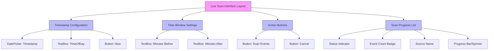
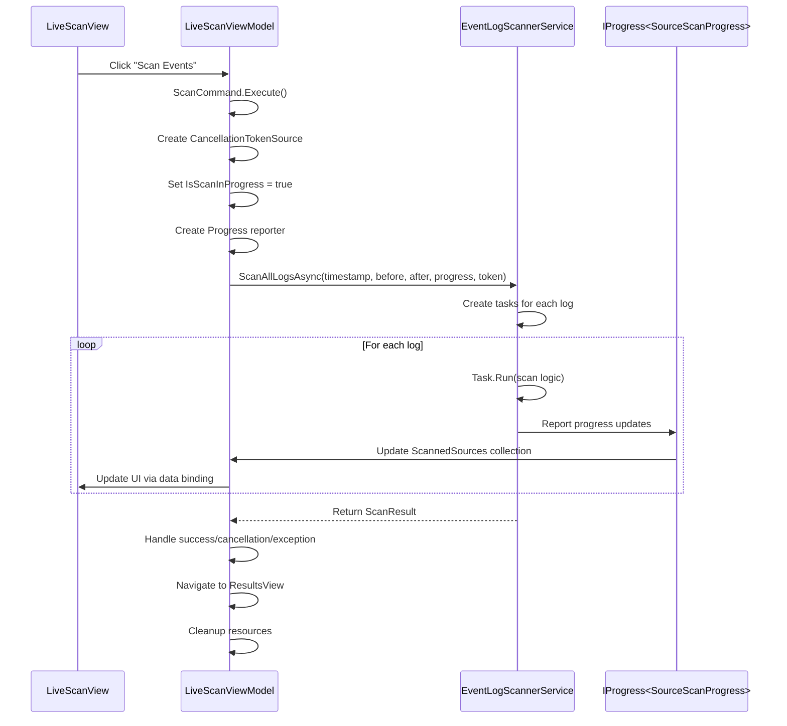
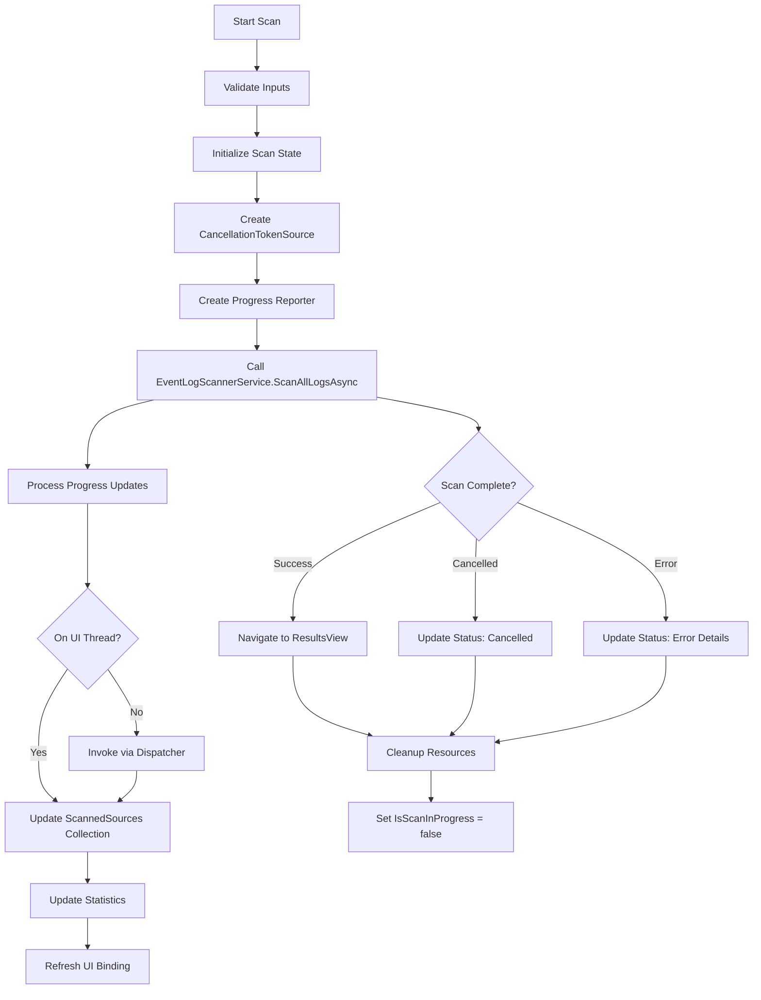
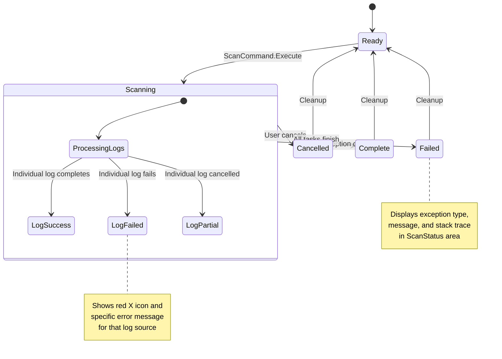
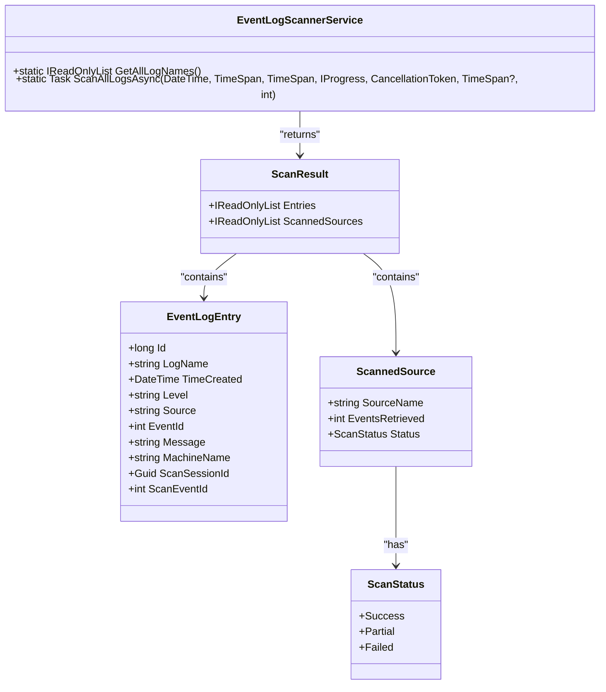
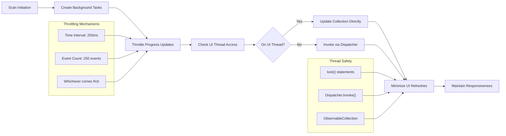

# Live Scan Interface


## Table of Contents
1. [Introduction](#introduction)
2. [XAML Layout and User Controls](#xaml-layout-and-user-controls)
3. [ViewModel Properties and Data Binding](#viewmodel-properties-and-data-binding)
4. [Command Pattern and Asynchronous Execution](#command-pattern-and-asynchronous-execution)
5. [Scan Initiation and Progress Feedback](#scan-initiation-and-progress-feedback)
6. [Error Handling and Validation](#error-handling-and-validation)
7. [Integration with Services Layer](#integration-with-services-layer)
8. [UI Responsiveness and Performance](#ui-responsiveness-and-performance)
9. [Extensibility and Customization](#extensibility-and-customization)

## Introduction
The Live Scan Interface is a critical component of Project Janus that enables users to configure and initiate event log scans around a specific timestamp. This interface provides a user-friendly way to define a time window, select target logs, and monitor scan progress in real-time. The component follows the Model-View-ViewModel (MVVM) pattern, with a XAML-based view that binds to a ViewModel which orchestrates interactions with backend services. The primary purpose is to facilitate forensic analysis of Windows event logs by allowing users to focus on a specific point in time and retrieve relevant events from multiple log sources simultaneously.

**Section sources**
- [LiveScanView.xaml](file://Janus.App/Views/LiveScanView.xaml#L1-L185)
- [LiveScanViewModel.cs](file://Janus.App/ViewModels/LiveScanViewModel.cs#L1-L260)

## XAML Layout and User Controls
The Live Scan Interface is defined in XAML with a structured layout that organizes user input controls into logical groups. The interface uses a Grid with multiple RowDefinitions to arrange controls vertically.

### Timestamp Configuration
The first row contains controls for specifying the timestamp of interest:
- **DatePicker**: Bound to the `Timestamp` property, allows selection of a date
- **TextBox**: Bound to `TimeOfDay`, accepts time input in HH:mm:ss format
- **Button**: Labeled "Now", executes `SetNowCommand` to set the current time

### Time Window Settings
The second row configures the time window for the scan:
- **Minutes Before**: TextBox bound to `MinutesBefore` property, defines how far back to scan
- **Minutes After**: TextBox bound to `MinutesAfter` property, defines how far forward to scan

### Action Buttons
The third row contains primary action buttons:
- **Scan Events**: Button that triggers the scan operation via `ScanCommand`
- **Cancel**: Button that cancels an ongoing scan via `CancelCommand`

### Scan Progress Visualization
The interface includes a ListBox that displays real-time progress for each scanned log source. Each item in the list shows:
- **Status Indicator**: Color-coded icon representing scan status (gray = pending, blue = in progress, green = success, orange = partial, red = failed)
- **Event Count**: Badge showing number of events retrieved
- **Source Name**: Name of the event log being scanned
- **Progress Bar**: Visible when total event count is known
- **Status Text**: "Scanning..." during active scans or error message on failure





**Diagram sources**
- [LiveScanView.xaml](file://Janus.App/Views/LiveScanView.xaml#L1-L185)

**Section sources**
- [LiveScanView.xaml](file://Janus.App/Views/LiveScanView.xaml#L1-L185)

## ViewModel Properties and Data Binding
The LiveScanViewModel serves as the data context for the LiveScanView, exposing properties that are bound to UI elements and implementing the INotifyPropertyChanged interface to enable data binding.

### Core Properties
The ViewModel exposes several properties that directly correspond to UI controls:

:Timestamp: DateTime property bound to the DatePicker, representing the central timestamp for the scan
:TimeOfDay: String property bound to the time TextBox, formatted as HH:mm:ss
:MinutesBefore: Integer property controlling how many minutes before the timestamp to scan
:MinutesAfter: Integer property controlling how many minutes after the timestamp to scan
:ScanStatus: String property displayed in the status area, showing real-time scan information
:IsScanInProgress: Boolean property that enables/disables UI elements during scanning

### Collection Properties
:ScannedSources: ObservableCollection<SourceScanProgress> that populates the progress list, with each item representing a scanned log source

### Property Change Notification
All properties implement change notification through the `OnPropertyChanged` method, which is called whenever a property value changes. This ensures that the UI is automatically updated when ViewModel properties change.

### UI Settings Persistence
The ViewModel automatically saves and loads user preferences for time window settings:
- **LoadUiSettingsAsync**: Called during initialization to restore previous MinutesBefore and MinutesAfter values
- **SaveUiSettingsAsync**: Called whenever MinutesBefore or MinutesAfter changes, persisting the values via UserUiSettingsService


```mermaid
classDiagram
class LiveScanViewModel {
+DateTime Timestamp
+string TimeOfDay
+int MinutesBefore
+int MinutesAfter
+string ScanStatus
+bool IsScanInProgress
+ObservableCollection<SourceScanProgress> ScannedSources
+ICommand ScanCommand
+ICommand CancelCommand
+ICommand SetNowCommand
+ICommand BackCommand
+event PropertyChangedEventHandler PropertyChanged
+LiveScanViewModel(Action<object>)
+OnPropertyChanged(string)
+SetNow()
+ScanAsync()
+CancelScan()
+GoBack()
}
class SourceScanProgress {
+string SourceName
+int EventsRetrieved
+ScanStatus Status
+bool IsTotalKnown
+int? TotalEvents
+bool IsActive
+string? ExceptionMessage
+event PropertyChangedEventHandler PropertyChanged
+OnPropertyChanged(string)
}
LiveScanViewModel --> SourceScanProgress : "contains"
LiveScanViewModel --> "IProgress<SourceScanProgress>" : "reports to"
```


**Diagram sources**
- [LiveScanViewModel.cs](file://Janus.App/ViewModels/LiveScanViewModel.cs#L1-L260)
- [SourceScanProgress.cs](file://Janus.App/ViewModels/SourceScanProgress.cs#L1-L25)

**Section sources**
- [LiveScanViewModel.cs](file://Janus.App/ViewModels/LiveScanViewModel.cs#L1-L260)
- [SourceScanProgress.cs](file://Janus.App/ViewModels/SourceScanProgress.cs#L1-L25)

## Command Pattern and Asynchronous Execution
The Live Scan Interface implements the command pattern through ICommand properties in the ViewModel, enabling separation of UI actions from business logic.

### Command Implementation
The ViewModel exposes four primary commands:

:ScanCommand: AsyncRelayCommand that initiates the scanning process, can only execute when no scan is in progress
:CancelCommand: RelayCommand that cancels an ongoing scan, can only execute when a scan is in progress
:SetNowCommand: RelayCommand that sets the timestamp to the current time and date
:BackCommand: RelayCommand that navigates back to the Welcome view, disabled during scans

### Asynchronous Execution
The ScanCommand uses an AsyncRelayCommand implementation to prevent UI blocking during the potentially long-running scan operation. This approach ensures the application remains responsive while the scan executes in the background.

### Command CanExecute Logic
Each command includes a can-execute delegate that determines whether the command should be enabled:
- **ScanCommand**: Disabled when a scan is already in progress
- **CancelCommand**: Enabled only when a scan is currently running
- **BackCommand**: Disabled during scans to prevent navigation away from the progress screen





**Diagram sources**
- [LiveScanViewModel.cs](file://Janus.App/ViewModels/LiveScanViewModel.cs#L1-L260)
- [EventLogScannerService.cs](file://Janus.App/Services/EventLogScannerService.cs#L1-L160)

**Section sources**
- [LiveScanViewModel.cs](file://Janus.App/ViewModels/LiveScanViewModel.cs#L1-L260)

## Scan Initiation and Progress Feedback
The scan initiation process involves coordinating between the ViewModel and the EventLogScannerService to retrieve events from multiple log sources around a specified timestamp.

### Scan Parameters
When the user clicks "Scan Events", the ViewModel collects the following parameters:
- **Central Timestamp**: Combined from DatePicker and TimeOfDay inputs, converted to UTC
- **Time Window**: Defined by MinutesBefore and MinutesAfter values
- **Progress Reporter**: IProgress<SourceScanProgress> implementation for real-time updates
- **Cancellation Token**: For graceful termination of the scan

### Progress Reporting Mechanism
The ViewModel implements a progress reporting system that updates the UI in a thread-safe manner:

1. **Dispatcher Check**: Ensures updates occur on the UI thread using Application.Current.Dispatcher
2. **Collection Management**: Maintains the ScannedSources ObservableCollection with thread-safe operations
3. **Statistics Tracking**: Aggregates real-time statistics (sources completed, events retrieved, etc.)
4. **Status Updates**: Dynamically updates the ScanStatus text with current progress metrics

### Real-time Feedback
The interface provides multiple forms of real-time feedback:
- **Visual Indicators**: Color-coded icons showing scan status for each log source
- **Progress Bars**: For sources where total event count is known
- **Text Status**: "Scanning..." indicator during active scans
- **Error Messages**: Displayed when a log source fails to scan
- **Aggregated Status**: Summary text showing overall progress statistics





**Diagram sources**
- [LiveScanViewModel.cs](file://Janus.App/ViewModels/LiveScanViewModel.cs#L1-L260)
- [EventLogScannerService.cs](file://Janus.App/Services/EventLogScannerService.cs#L1-L160)

**Section sources**
- [LiveScanViewModel.cs](file://Janus.App/ViewModels/LiveScanViewModel.cs#L1-L260)

## Error Handling and Validation
The Live Scan Interface implements comprehensive error handling and input validation to ensure robust operation and provide meaningful feedback to users.

### Input Validation
While the interface does not perform extensive validation on numeric inputs, it relies on the XAML binding system:
- **Two-way Binding**: MinutesBefore and MinutesAfter use TwoWay binding mode to ensure immediate synchronization
- **Implicit Validation**: WPF binding system handles basic type conversion and validation
- **Persistence**: Validated values are automatically saved to user settings

### Exception Handling
The ScanAsync method implements structured exception handling:

:OperationCanceledException: Caught when the user cancels the scan, resulting in "Scan cancelled" status
:General Exception: Catches all other exceptions, displaying the exception type, message, and stack trace in the status area

### Error States
The interface can display several error states:
- **Individual Log Failures**: Specific log sources may fail due to permissions or access issues, shown with red X icon and error message
- **Complete Scan Failure**: The entire scan operation may fail due to system-level issues
- **Partial Success**: Some log sources succeed while others fail, indicated by orange dash icon

### Status Communication
Error information is communicated through multiple channels:
- **ScanStatus Text**: Displays detailed error messages at the top of the interface
- **Individual Item Messages**: Failed log sources show specific error messages in the progress list
- **Visual Indicators**: Color-coded icons immediately convey the status of each operation





**Diagram sources**
- [LiveScanViewModel.cs](file://Janus.App/ViewModels/LiveScanViewModel.cs#L1-L260)

**Section sources**
- [LiveScanViewModel.cs](file://Janus.App/ViewModels/LiveScanViewModel.cs#L1-L260)

## Integration with Services Layer
The Live Scan Interface integrates with the backend services layer through well-defined interfaces and data transfer objects.

### EventLogScannerService Integration
The primary integration point is with EventLogScannerService, which provides the core scanning functionality:

:ScanAllLogsAsync: Static method that performs the actual scanning of Windows event logs
:Parameter Passing: The ViewModel passes timestamp, time window, progress reporter, and cancellation token
:Return Value: ScanResult object containing retrieved events and scan metadata

### Data Flow
The data flow between components follows a clear pattern:

1. **Parameter Construction**: ViewModel constructs scan parameters from user inputs
2. **Service Invocation**: ViewModel calls ScanAllLogsAsync with parameters and progress reporter
3. **Progress Reporting**: Service reports progress through IProgress<SourceScanProgress>
4. **Result Processing**: ViewModel processes the returned ScanResult and navigates to ResultsView

### Data Transfer Objects
Several DTOs facilitate communication between layers:

:ScanResult: Contains the final output of the scan operation
::Entries: List of EventLogEntry objects retrieved during the scan
::ScannedSources: List of ScannedSource objects with per-source scan results

:EventLogEntry: Represents a single event log entry with properties like Id, LogName, TimeCreated, Level, Source, EventId, Message, MachineName, and ScanSessionId

:ScannedSource: Represents the result of scanning a single log source with SourceName, EventsRetrieved, and Status





**Diagram sources**
- [EventLogScannerService.cs](file://Janus.App/Services/EventLogScannerService.cs#L1-L160)
- [ScanResult.cs](file://Janus.App/Services/ScanResult.cs#L1-L7)
- [EventLogEntry.cs](file://Janus.Core/EventLogEntry.cs#L1-L18)
- [ScannedSource.cs](file://Janus.Core/ScannedSource.cs#L1-L13)

**Section sources**
- [EventLogScannerService.cs](file://Janus.App/Services/EventLogScannerService.cs#L1-L160)
- [ScanResult.cs](file://Janus.App/Services/ScanResult.cs#L1-L7)

## UI Responsiveness and Performance
The Live Scan Interface implements several strategies to maintain UI responsiveness during potentially long-running scan operations.

### Asynchronous Processing
The core scanning operation runs asynchronously to prevent UI blocking:
- **Task.Run**: Individual log scans execute on background threads
- **Task.WhenAll**: Coordinates completion of all scan tasks
- **Async/Await**: ViewModel methods use async/await pattern for non-blocking execution

### Throttled Progress Reporting
To prevent overwhelming the UI with updates, the EventLogScannerService implements throttling:
- **Time-based Throttling**: Progress updates limited to every 250ms by default
- **Event-based Throttling**: Updates triggered after every 250 events processed
- **Configurable Intervals**: Both thresholds can be customized via method parameters

### Thread-safe Collection Updates
The ViewModel ensures thread-safe updates to the observable collection:
- **Dispatcher Invocation**: UI updates are marshaled to the UI thread when necessary
- **Collection Synchronization**: Uses lock statements when modifying shared collections from background threads
- **Batch Updates**: Minimizes the frequency of UI refreshes by batching related changes

### Common Issues and Solutions
**Issue**: UI becomes unresponsive during scans with many log sources
**Solution**: Ensure all long-running operations are properly offloaded to background threads and progress reporting is throttled

**Issue**: Race conditions when updating progress from multiple threads
**Solution**: Use proper synchronization mechanisms like lock statements and thread-safe collections

**Issue**: Memory consumption increases with large numbers of events
**Solution**: Consider implementing virtualization and pagination for very large result sets





**Diagram sources**
- [EventLogScannerService.cs](file://Janus.App/Services/EventLogScannerService.cs#L1-L160)
- [LiveScanViewModel.cs](file://Janus.App/ViewModels/LiveScanViewModel.cs#L1-L260)

**Section sources**
- [EventLogScannerService.cs](file://Janus.App/Services/EventLogScannerService.cs#L1-L160)
- [LiveScanViewModel.cs](file://Janus.App/ViewModels/LiveScanViewModel.cs#L1-L260)

## Extensibility and Customization
The Live Scan Interface is designed with extensibility in mind, allowing for easy addition of new features and customization options.

### Adding New Scan Options
New scan parameters can be added by:
1. **Extending ViewModel**: Add new properties to LiveScanViewModel with appropriate change notification
2. **Updating XAML**: Add new UI controls bound to the new properties
3. **Modifying Service Call**: Pass new parameters to ScanAllLogsAsync method
4. **Updating Service**: Modify EventLogScannerService to accept and use new parameters

### Custom Input Validators
The interface can be extended with custom validation logic:
- **Custom Validation Rules**: Implement custom WPF validation rules for input controls
- **ViewModel-level Validation**: Add validation logic in property setters
- **Error Templates**: Customize the visual appearance of validation errors

### Progress Reporting Extensions
The progress reporting system can be enhanced by:
- **Additional Progress Data**: Extend SourceScanProgress class with new properties
- **Custom Progress Indicators**: Add new visual indicators for different scan states
- **Enhanced Filtering**: Implement filtering options for the progress list

### Integration Points
Key extensibility points include:
- **IProgress<T> Interface**: Allows custom progress reporting implementations
- **CancellationToken**: Enables integration with other cancellation systems
- **ObservableCollection<T>**: Supports custom collection behaviors and extensions
- **RelayCommand Pattern**: Facilitates addition of new commands with custom logic


```mermaid
classDiagram
class LiveScanViewModel {
+// Extensibility Points
+CancellationTokenSource cts
+IProgress<SourceScanProgress> progress
+ObservableCollection<SourceScanProgress> ScannedSources
+RelayCommand ScanCommand
+RelayCommand CancelCommand
}
class SourceScanProgress {
+// Can be extended
+string SourceName
+int EventsRetrieved
+ScanStatus Status
+bool IsTotalKnown
+int? TotalEvents
+bool IsActive
+string? ExceptionMessage
}
class EventLogScannerService {
+// Can be extended
+static Task<ScanResult> ScanAllLogsAsync(DateTime, TimeSpan, TimeSpan, IProgress<SourceScanProgress>, CancellationToken, TimeSpan?, int)
}
class ScanResult {
+// Can be extended
+IReadOnlyList<EventLogEntry> Entries
+IReadOnlyList<ScannedSource> ScannedSources
}
LiveScanViewModel --> SourceScanProgress : "contains"
LiveScanViewModel --> EventLogScannerService : "uses"
EventLogScannerService --> ScanResult : "returns"
note right of LiveScanViewModel
New properties and commands
can be added to support
additional functionality
end note
note right of SourceScanProgress
Can be extended with
additional metadata
about the scan process
end note
```


**Diagram sources**
- [LiveScanViewModel.cs](file://Janus.App/ViewModels/LiveScanViewModel.cs#L1-L260)
- [SourceScanProgress.cs](file://Janus.App/ViewModels/SourceScanProgress.cs#L1-L25)
- [EventLogScannerService.cs](file://Janus.App/Services/EventLogScannerService.cs#L1-L160)
- [ScanResult.cs](file://Janus.App/Services/ScanResult.cs#L1-L7)

**Section sources**
- [LiveScanViewModel.cs](file://Janus.App/ViewModels/LiveScanViewModel.cs#L1-L260)
- [SourceScanProgress.cs](file://Janus.App/ViewModels/SourceScanProgress.cs#L1-L25)

**Referenced Files in This Document**   
- [LiveScanView.xaml](file://Janus.App/Views/LiveScanView.xaml#L1-L185)
- [LiveScanViewModel.cs](file://Janus.App/ViewModels/LiveScanViewModel.cs#L1-L260)
- [EventLogScannerService.cs](file://Janus.App/Services/EventLogScannerService.cs#L1-L160)
- [SourceScanProgress.cs](file://Janus.App/ViewModels/SourceScanProgress.cs#L1-L25)
- [ScanResult.cs](file://Janus.App/Services/ScanResult.cs#L1-L7)
- [ScannedSource.cs](file://Janus.Core/ScannedSource.cs#L1-L13)
- [EventLogEntry.cs](file://Janus.Core/EventLogEntry.cs#L1-L18)
- [ResultsViewModel.cs](file://Janus.App/ViewModels/ResultsViewModel.cs#L75-L563)