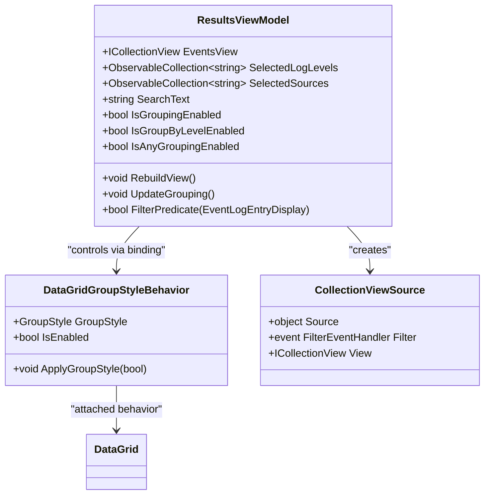
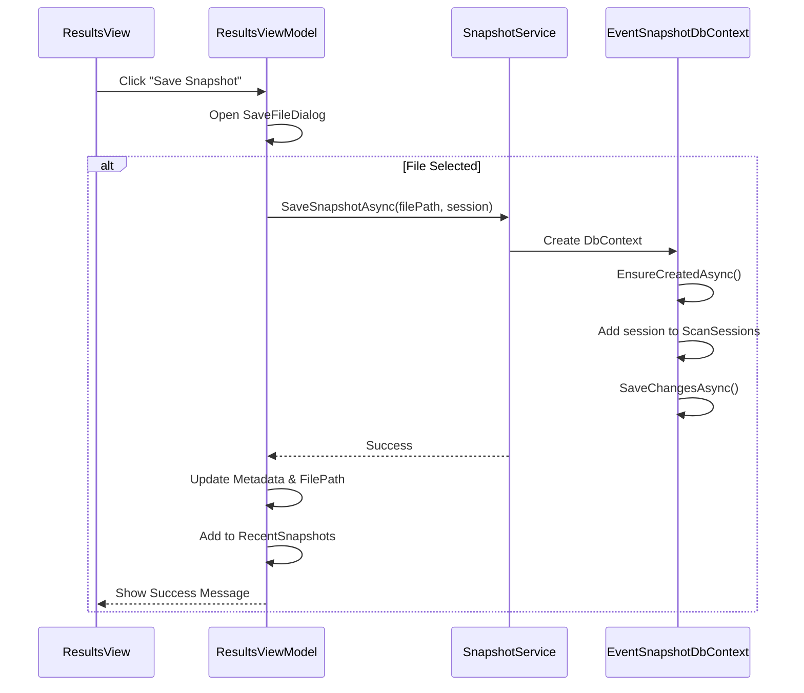

# Results View


## Table of Contents
1. [Results View](#results-view)
2. [Component Overview](#component-overview)
3. [Data Structure and Model](#data-structure-and-model)
4. [XAML Implementation and DataGrid Configuration](#xaml-implementation-and-datagrid-configuration)
5. [Filtering, Sorting, and Search Logic](#filtering-sorting-and-search-logic)
6. [Grouping and Visual Organization](#grouping-and-visual-organization)
7. [Color Coding and Converters](#color-coding-and-converters)
8. [Clipboard and Copy Functionality](#clipboard-and-copy-functionality)
9. [Snapshot Saving and Integration with SnapshotService](#snapshot-saving-and-integration-with-snapshotservice)
10. [Performance Considerations and Optimization](#performance-considerations-and-optimization)
11. [Common Issues and Troubleshooting](#common-issues-and-troubleshooting)

## Component Overview

The **Results View** is a critical user interface component in Project Janus responsible for displaying scanned Windows event logs in a structured, chronological timeline. It enables users to analyze event data through filtering, sorting, searching, and visual grouping. The view is implemented as a WPF `UserControl` (`ResultsView`) and is tightly integrated with its corresponding `ResultsViewModel`, which manages data binding, filtering logic, and command execution.

The component supports real-time interaction, including keyboard shortcuts for toggling row selection and copying message content. It also provides metadata display, UI state persistence, and snapshot saving capabilities. The design emphasizes usability, performance, and responsiveness, especially when handling large datasets.

**Section sources**
- [ResultsView.xaml.cs](file://Janus.App/Views/ResultsView.xaml.cs#L1-L56)
- [ResultsView.xaml](file://Janus.App/Views/ResultsView.xaml#L1-L399)
- [ResultsViewModel.cs](file://Janus.App/ViewModels/ResultsViewModel.cs#L1-L565)

## Data Structure and Model

The Results View displays event log entries based on the `EventLogEntry` model from the `Janus.Core` namespace. Each entry contains structured information about a Windows event, including timestamp, log name, severity level, source, event ID, message, and machine context.


```csharp
public class EventLogEntry {
  public required long Id { get; init; }
  public required string LogName { get; init; }
  public required DateTime TimeCreated { get; init; }
  public required string Level { get; init; }
  public required string Source { get; init; }
  public required int EventId { get; init; }
  public required string Message { get; init; }
  public required string MachineName { get; init; }
  public required Guid ScanSessionId { get; init; }
  public int ScanEventId { get; set; }
}
```


To support UI-specific features like search highlighting and data binding, the `EventLogEntryDisplay` wrapper class is used. It implements `INotifyPropertyChanged` and provides computed properties such as `TimeCreatedIso` (ISO 8601 formatted timestamp) and `MessageInlines`, which dynamically highlights search terms within the message text using `Run` elements with yellow background.

The `ScannedSource` class tracks metadata about each log source scanned, including retrieval status (`Success`, `Partial`, `Failed`) and event count. This data is displayed in the left metadata panel with visual indicators.


```csharp
public class ScannedSource {
  public int Id { get; set; }
  public required string SourceName { get; init; }
  public required int EventsRetrieved { get; init; }
  public required ScanStatus Status { get; init; }
}
```


The `ScanSession` class encapsulates the entire scan context, including the central timestamp, time window, user notes, and collections of entries and scanned sources.

**Section sources**
- [EventLogEntry.cs](file://Janus.Core/EventLogEntry.cs#L5-L17)
- [ScannedSource.cs](file://Janus.Core/ScannedSource.cs#L8-L13)
- [ScanSession.cs](file://Janus.Core/ScanSession.cs#L4-L34)
- [ResultsViewModel.cs](file://Janus.App/ViewModels/ResultsViewModel.cs#L10-L565)

## XAML Implementation and DataGrid Configuration

The Results View is defined in XAML using a `DataGrid` control (`ResultsDataGrid`) to display event logs. The grid is configured with virtualization enabled to optimize performance with large datasets.


```xml
<DataGrid x:Name="ResultsDataGrid"
          ItemsSource="{Binding EventsView}"
          SelectedItem="{Binding SelectedEvent, Mode=TwoWay}"
          AutoGenerateColumns="False"
          EnableRowVirtualization="True"
          VirtualizingPanel.IsVirtualizing="True"
          VirtualizingPanel.VirtualizationMode="Recycling">
```


The `DataGrid` columns are explicitly defined with bindings to properties of `EventLogEntryDisplay`. Key columns include:

- **✔ (Checkbox)**: A `DataGridTemplateColumn` with a `CheckBox` bound via `MultiBinding` using `ScanIdCheckedMultiConverter` to determine checked state based on `CheckedScanEventIds`.
- **# (ScanEventId)**: Sequential ID for human readability.
- **Time**: Bound to `TimeCreatedIso` for consistent ISO 8601 display.
- **Log, Level, Source, EventId**: Direct text bindings.
- **Message**: Uses `FirstLineConverter` to display only the first line in the grid, with full message shown in the details pane.

Row background colors are conditionally styled based on the `Level` property using `DataTrigger`s in `DataGrid.RowStyle`, providing visual distinction for different severity levels (e.g., red for `Critical`, orange for `Warning`).

**Section sources**
- [ResultsView.xaml](file://Janus.App/Views/ResultsView.xaml#L1-L399)
- [ResultsViewModel.cs](file://Janus.App/ViewModels/ResultsViewModel.cs#L10-L565)

## Filtering, Sorting, and Search Logic

Filtering is managed entirely by the `ResultsViewModel` using a `CollectionView` (`EventsView`) that wraps the `Events` collection. The filter logic is implemented in the `FilterPredicate` method, which evaluates each `EventLogEntryDisplay` against multiple criteria:

- Selected log levels (`SelectedLogLevels`)
- Selected sources (`SelectedSources`)
- Selected log names (`SelectedLogNames`)
- Text search (`SearchText`)
- Checked state filtering (`ShowOnlyChecked`)

The filtering is applied asynchronously via the `RebuildView` method, which creates a new `CollectionViewSource`, applies the filter, sorts by `TimeCreated` in ascending order (oldest first), and updates the `EventsView`. This approach ensures that the UI is fully refreshed with the latest filtered results.


```csharp
private void RebuildView() {
  var cvs = new CollectionViewSource { Source = Events };
  cvs.Filter += (s, e) => { e.Accepted = FilterPredicate(e.Item as EventLogEntryDisplay); };
  EventsView = cvs.View;
  EventsView.SortDescriptions.Add(new SortDescription(nameof(EventLogEntryDisplay.TimeCreated), ListSortDirection.Ascending));
  UpdateGrouping();
  EventCount = EventsView.Cast<object>().Count();
  NotifyCrossFilterProperties();
}
```


The `SearchText` property uses `UpdateSourceTrigger=PropertyChanged`, enabling real-time filtering as the user types. The `debouncer` mechanism in the view ensures that UI updates are not triggered too frequently.

**Section sources**
- [ResultsViewModel.cs](file://Janus.App/ViewModels/ResultsViewModel.cs#L10-L565)
- [ResultsView.xaml](file://Janus.App/Views/ResultsView.xaml#L1-L399)

## Grouping and Visual Organization

Visual grouping is implemented using WPF's `ICollectionView.GroupDescriptions` and a custom behavior `DataGridGroupStyleBehavior`. The user can choose to group events by **Log** or by **Level**, but not both simultaneously (mutually exclusive).

The `IsAnyGroupingEnabled` property in `ResultsViewModel` determines whether grouping is active. When enabled, `UpdateGrouping()` clears existing group descriptions and adds a new `PropertyGroupDescription` based on the selected grouping option.


```csharp
private void UpdateGrouping() {
  EventsView.GroupDescriptions.Clear();
  if (IsGroupingEnabled) {
    EventsView.GroupDescriptions.Add(new PropertyGroupDescription("LogName"));
  } else if (IsGroupByLevelEnabled) {
    EventsView.GroupDescriptions.Add(new PropertyGroupDescription("Level"));
  }
}
```


The `DataGridGroupStyleBehavior` applies a predefined `GroupStyle` (defined in XAML as `MyEventGroupStyle`) to the `DataGrid` when `IsEnabled` is true. This behavior dynamically adds or removes the group style from the `DataGrid.GroupStyle` collection.


```csharp
private void ApplyGroupStyle(bool isEnabled) {
  AssociatedObject.GroupStyle.Clear();
  if (isEnabled && GroupStyle != null) {
    AssociatedObject.GroupStyle.Add(GroupStyle);
  }
}
```


A warning is displayed in the UI indicating that grouping is performance-intensive and should be used cautiously.

**Diagram sources**




**Diagram sources**
- [ResultsViewModel.cs](file://Janus.App/ViewModels/ResultsViewModel.cs#L10-L565)
- [DataGridGroupStyleBehaviour.cs](file://Janus.App/Helpers/DataGridGroupStyleBehaviour.cs#L1-L57)

**Section sources**
- [ResultsViewModel.cs](file://Janus.App/ViewModels/ResultsViewModel.cs#L10-L565)
- [DataGridGroupStyleBehaviour.cs](file://Janus.App/Helpers/DataGridGroupStyleBehaviour.cs#L1-L57)
- [ResultsView.xaml](file://Janus.App/Views/ResultsView.xaml#L1-L399)

## Color Coding and Converters

The Results View uses value converters to apply color coding based on event severity and scan status.

### ScanStatusToBrushConverter

This `IMultiValueConverter` maps `ScanStatus` enum values to `Brush` objects for visual indicators in the scanned sources list:


```csharp
public object Convert(object[] values, Type targetType, object parameter, CultureInfo culture) {
  if (values[0] is not ScanStatus status) return Brushes.Gray;
  return status switch {
    ScanStatus.Success => Brushes.Green,
    ScanStatus.Partial => Brushes.Orange,
    ScanStatus.Failed => Brushes.Red,
    _ => Brushes.Gray
  };
}
```


It is used in the `ListBox` item template to display colored icons (checkmark, dash, cross) next to each source.

### LogLevelSelectedConverter and Others

Additional converters include:
- `LogLevelSelectedConverter`: Likely used for multi-select UI state.
- `FirstLineConverter`: Extracts the first line of the message for grid display.
- `StringNotEmptyToVisibleConverter`: Controls visibility of UI elements (e.g., snapshot path).
- `BooleanToGridLengthConverter`: Manages expandable panel widths.

These converters enhance the UI by enabling dynamic, data-driven visual behavior without code-behind logic.

**Section sources**
- [ScanStatusToBrushConverter.cs](file://Janus.App/Helpers/ScanStatusToBrushConverter.cs#L1-L25)
- [ResultsView.xaml](file://Janus.App/Views/ResultsView.xaml#L1-L399)

## Clipboard and Copy Functionality

The Results View supports copying the full message of the selected event to the clipboard via the **Copy Message** button or keyboard shortcuts (`Ctrl+C` or `Enter`). This is implemented using the `CopyMessageCommand` in `ResultsViewModel`.


```csharp
private void CopyMessage() {
  if (SelectedEvent is not null) {
    Clipboard.SetText(SelectedEvent.Message ?? string.Empty);
  }
}
```


The command is only enabled when an event is selected (`SelectedEvent != null`). The `ResultsView` handles key events in `ResultsDataGrid_KeyDown`, intercepting `Ctrl+C` and `Enter` to execute the command.


```csharp
private void ResultsDataGrid_KeyDown(object sender, KeyEventArgs e) {
  if (e.Key == Key.C && Keyboard.Modifiers.HasFlag(ModifierKeys.Control)) {
    vm.CopyMessageCommand.Execute(null);
    e.Handled = true;
  }
}
```


This integration provides a seamless user experience for extracting event details for external use.

**Section sources**
- [ResultsView.xaml.cs](file://Janus.App/Views/ResultsView.xaml.cs#L1-L56)
- [ResultsViewModel.cs](file://Janus.App/ViewModels/ResultsViewModel.cs#L10-L565)

## Snapshot Saving and Integration with SnapshotService

Users can save the current scan session as a snapshot file (`.janus`) using the **Save Snapshot** button. This functionality is powered by the `SnapshotService` class, which uses Entity Framework Core to persist data to an SQLite database.

The `SaveSnapshotCommand` in `ResultsViewModel` opens a `SaveFileDialog` and serializes the current `ScanSession` (including metadata, entries, and sources) to the selected file.


```csharp
private async Task SaveSnapshotAsync() {
  var saveFileDialog = new SaveFileDialog {
    Filter = "Janus Snapshot (*.janus)|*.janus",
    FileName = defaultFileName
  };
  if (saveFileDialog.ShowDialog() == true) {
    var service = new SnapshotService();
    await SnapshotService.SaveSnapshotAsync(filePath, updatedSession);
    SetMetadata(updatedSession, filePath);
    CanSaveSnapshot = false;
  }
}
```


The `SnapshotService.SaveSnapshotAsync` method creates an `EventSnapshotDbContext` and saves the session using EF Core's `Add` and `SaveChangesAsync`. The file path is stored in `UserUiSettingsService` for recent file tracking.

UI settings such as splitter positions are also persisted using `UserUiSettingsService`, which serializes settings to a JSON file (`UserUiSettings.json`) on disk.

**Diagram sources**




**Diagram sources**
- [ResultsViewModel.cs](file://Janus.App/ViewModels/ResultsViewModel.cs#L10-L565)
- [SnapshotService.cs](file://Janus.App/Services/SnapshotService.cs#L1-L80)

**Section sources**
- [ResultsViewModel.cs](file://Janus.App/ViewModels/ResultsViewModel.cs#L10-L565)
- [SnapshotService.cs](file://Janus.App/Services/SnapshotService.cs#L1-L80)
- [UserUiSettingsService.cs](file://Janus.App/Services/UserUiSettingsService.cs#L5-L63)

## Performance Considerations and Optimization

The Results View is designed to handle large result sets efficiently through several optimization techniques:

- **UI Virtualization**: Enabled via `VirtualizingPanel.IsVirtualizing="True"` and `VirtualizationMode="Recycling"` to render only visible rows.
- **Async Filtering**: The `RebuildView` method recreates the `CollectionViewSource`, which efficiently applies filters without blocking the UI thread.
- **Debounced Settings Save**: UI state changes (splitter positions) are debounced using a timer to avoid excessive disk I/O.
- **Cross-Filter Counting**: The `LogLevelCountProvider`, `SourceCountProvider`, and `LogNameCountProvider` functions calculate filtered counts efficiently using LINQ, enabling accurate multi-select counters.

Despite these measures, grouping is noted as a performance-intensive operation and is disabled by default. Users are warned via UI text when enabling grouping.

For optimal performance:
- Avoid grouping with large datasets (>10k events).
- Use text search with specific terms to minimize filtering overhead.
- Close the metadata panel if not in use to reduce layout complexity.

**Section sources**
- [ResultsView.xaml](file://Janus.App/Views/ResultsView.xaml#L1-L399)
- [ResultsViewModel.cs](file://Janus.App/ViewModels/ResultsViewModel.cs#L10-L565)

## Common Issues and Troubleshooting

### Issue: Slow Rendering with Large Datasets
**Symptoms**: UI freezes or lags when loading thousands of events.
**Solution**: Ensure virtualization is enabled. Avoid enabling grouping. Consider filtering to reduce dataset size.

### Issue: Filters Not Applying Correctly
**Symptoms**: Events appear that should be filtered out.
**Solution**: Verify that `RebuildView()` is called after filter changes. Check that `CollectionChanged` events on `SelectedLogLevels`, `SelectedSources`, etc., trigger `RebuildView`.

### Issue: Grouping Not Displaying
**Symptoms**: No group headers appear despite enabling grouping.
**Solution**: Confirm that `DataGridGroupStyleBehavior.IsEnabled` is bound to `IsAnyGroupingEnabled`. Ensure the `GroupStyle` resource is correctly defined in XAML.

### Issue: Clipboard Copy Fails
**Symptoms**: Nothing is copied to clipboard.
**Solution**: Verify `SelectedEvent` is not null. Check that `CopyMessageCommand.CanExecute` returns true.

### Issue: Snapshot Save Fails
**Symptoms**: Error message when saving snapshot.
**Solution**: Ensure the file path is writable. Check for existing file locks. Validate that `ScanSession` has required data.

These issues are typically resolved by verifying data bindings, command states, and proper event handling in the view model.

**Section sources**
- [ResultsView.xaml](file://Janus.App/Views/ResultsView.xaml#L1-L399)
- [ResultsViewModel.cs](file://Janus.App/ViewModels/ResultsViewModel.cs#L10-L565)
- [SnapshotService.cs](file://Janus.App/Services/SnapshotService.cs#L1-L80)

**Referenced Files in This Document**   
- [ResultsView.xaml.cs](file://Janus.App/Views/ResultsView.xaml.cs)
- [ResultsView.xaml](file://Janus.App/Views/ResultsView.xaml)
- [ResultsViewModel.cs](file://Janus.App/ViewModels/ResultsViewModel.cs)
- [DataGridGroupStyleBehaviour.cs](file://Janus.App/Helpers/DataGridGroupStyleBehaviour.cs)
- [ScanStatusToBrushConverter.cs](file://Janus.App/Helpers/ScanStatusToBrushConverter.cs)
- [SnapshotService.cs](file://Janus.App/Services/SnapshotService.cs)
- [EventLogEntry.cs](file://Janus.Core/EventLogEntry.cs)
- [ScannedSource.cs](file://Janus.Core/ScannedSource.cs)
- [ScanSession.cs](file://Janus.Core/ScanSession.cs)
- [UserUiSettingsService.cs](file://Janus.App/Services/UserUiSettingsService.cs)