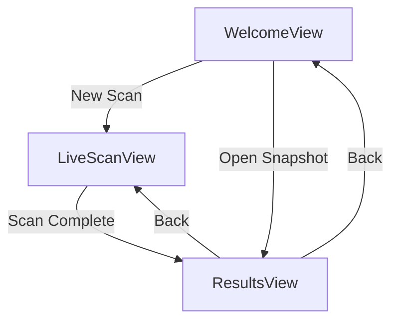
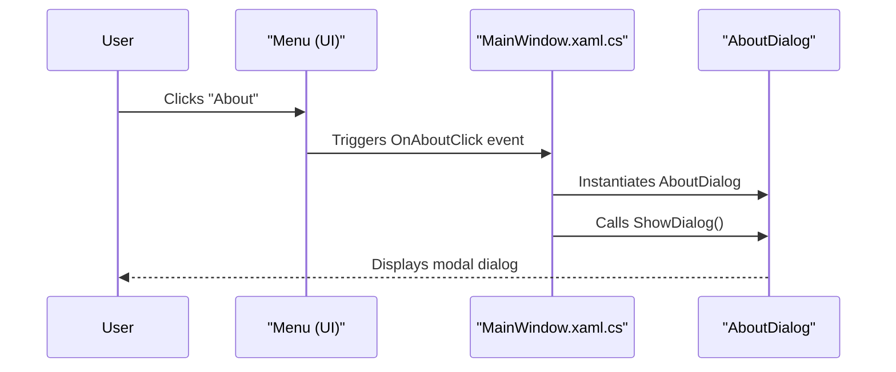

# Main Window Layout


## Table of Contents
1. [Introduction](#introduction)
2. [Main Window Structure](#main-window-structure)
3. [View Switching Mechanism](#view-switching-mechanism)
4. [Application Initialization and State Management](#application-initialization-and-state-management)
5. [Event Handling and Commands](#event-handling-and-commands)
6. [Layout and UI Integration](#layout-and-ui-integration)
7. [Common Layout Issues and Solutions](#common-layout-issues-and-solutions)
8. [Customization and Branding](#customization-and-branding)

## Introduction
The Main Window Layout serves as the root container for the Project Janus application, orchestrating navigation between different views: Welcome, LiveScan, and Results. It functions as the shell that hosts dynamic content through data binding and view model coordination. This document provides a comprehensive analysis of the MainWindow's XAML structure, code-behind logic, integration with the application lifecycle, and its role in managing view transitions and application state.

**Section sources**
- [MainWindow.xaml](file://d:/devel/Project Janus/Janus.App/Resources/MainWindow.xaml#L1-L32)
- [MainWindow.xaml.cs](file://d:/devel/Project Janus/Janus.App/Resources/MainWindow.xaml.cs#L1-L45)

## Main Window Structure
The MainWindow is defined in XAML as a `Window` element that uses a `DockPanel` to organize its layout. The structure consists of a top-aligned `Menu` and a central `ContentControl` that dynamically hosts the current view.

### XAML Layout Components
The main window's XAML structure is minimal and focused on content hosting:

- **Menu**: Contains a single "Help" menu with an "About" item that triggers the `OnAboutClick` event handler.
- **ContentControl**: The primary content region that displays the current view based on the `CurrentView` property of the `MainWindowViewModel`.
- **DataTemplates**: Implicit data templates in `Window.Resources` automatically associate view models with their corresponding views.


```xml
<Window x:Class="Janus.App.MainWindow"
        xmlns="http://schemas.microsoft.com/winfx/2006/xaml/presentation"
        xmlns:x="http://schemas.microsoft.com/winfx/2006/xaml"
        xmlns:local="clr-namespace:Janus.App"
        Title="{Binding Title}">
    <Window.Resources>
        <DataTemplate DataType="{x:Type local:WelcomeViewModel}">
            <local:WelcomeView/>
        </DataTemplate>
        <DataTemplate DataType="{x:Type local:LiveScanViewModel}">
            <local:LiveScanView/>
        </DataTemplate>
    </Window.Resources>
    <DockPanel LastChildFill="True">
        <Menu DockPanel.Dock="Top">
            <MenuItem Header="Help">
                <MenuItem Header="About" Click="OnAboutClick"/>
            </MenuItem>
        </Menu>
        <ContentControl DataContext="{Binding CurrentView}"
                Content="{Binding}"
                VerticalAlignment="Stretch"
                HorizontalAlignment="Stretch"/>
    </DockPanel>
</Window>
```


This structure follows the MVVM pattern, where the `ContentControl` binds to the `CurrentView` property, and WPF's data templating automatically instantiates the appropriate view based on the view model type.

**Section sources**
- [MainWindow.xaml](file://d:/devel/Project Janus/Janus.App/Resources/MainWindow.xaml#L1-L32)

## View Switching Mechanism
The view switching mechanism is implemented through a combination of the `MainWindowViewModel` and direct view model manipulation, enabling seamless navigation between application states.

### ViewModel Coordination
The `MainWindowViewModel` acts as the central coordinator for view management:

- **CurrentView Property**: A bindable property of type `object` that holds the currently displayed view model.
- **SetCurrentView Method**: A public method that updates the `CurrentView`, triggering UI updates via `INotifyPropertyChanged`.
- **Initial View**: The Welcome view is set as the default view upon application startup.


```csharp
public class MainWindowViewModel : INotifyPropertyChanged {
  private object? currentView;
  public object? CurrentView {
    get => currentView;
    set { currentView = value; OnPropertyChanged(); }
  }

  public void SetCurrentView(object view) => CurrentView = view;

  public MainWindowViewModel() {
    CurrentView = new WelcomeViewModel(SetCurrentView);
  }
}
```


### Navigation Flow
Navigation between views is initiated from within the view models themselves, which receive a callback to `SetCurrentView`:

1. **Welcome to LiveScan**: Triggered by the `NewScanCommand`, which instantiates a `LiveScanViewModel` and passes it to `SetCurrentView`.
2. **Welcome to Results**: Triggered by opening a snapshot, which loads data and navigates to the `ResultsView`.
3. **LiveScan to Results**: After a successful scan, the `LiveScanViewModel` creates a `ResultsViewModel` with the scan results and navigates to it.
4. **Results to Previous View**: The `BackCommand` in `ResultsViewModel` returns to either the Welcome or LiveScan view based on context.

This pattern ensures that navigation logic is encapsulated within the view models while maintaining loose coupling through the callback mechanism.





**Diagram sources**
- [MainWindowViewModel.cs](file://d:/devel/Project Janus/Janus.App/ViewModels/MainWindowViewModel.cs#L1-L25)
- [WelcomeViewModel.cs](file://d:/devel/Project Janus/Janus.App/ViewModels/WelcomeViewModel.cs#L1-L143)
- [LiveScanViewModel.cs](file://d:/devel/Project Janus/Janus.App/ViewModels/LiveScanViewModel.cs#L1-L261)
- [ResultsViewModel.cs](file://d:/devel/Project Janus/Janus.App/ViewModels/ResultsViewModel.cs#L1-L565)

**Section sources**
- [MainWindowViewModel.cs](file://d:/devel/Project Janus/Janus.App/ViewModels/MainWindowViewModel.cs#L1-L25)
- [WelcomeViewModel.cs](file://d:/devel/Project Janus/Janus.App/ViewModels/WelcomeViewModel.cs#L1-L143)
- [LiveScanViewModel.cs](file://d:/devel/Project Janus/Janus.App/ViewModels/LiveScanViewModel.cs#L1-L261)
- [ResultsViewModel.cs](file://d:/devel/Project Janus/Janus.App/ViewModels/ResultsViewModel.cs#L1-L565)

## Application Initialization and State Management
The application lifecycle is managed through the `App.xaml.cs` file, which handles startup initialization, global exception handling, and window state persistence.

### Startup and Initialization
The `App` class configures global event handlers during construction:

- **DispatcherUnhandledException**: Handles WPF dispatcher exceptions, logs them, and displays an error dialog.
- **UnhandledException**: Handles non-UI thread exceptions and logs them to a crash file.


```csharp
public App() {
    this.DispatcherUnhandledException += OnDispatcherUnhandledException;
    AppDomain.CurrentDomain.UnhandledException += OnDomainUnhandledException;
}
```


### Window State Persistence
The `MainWindow` persists its size and position between sessions using the `UserUiSettingsService`:

- **Initialization**: On the `Initialized` event, the window loads its previous size and position.
- **Size Change Handling**: The `SizeChanged` event is debounced to avoid excessive writes, and the new size is saved asynchronously.


```csharp
public MainWindow() {
    Initialized += async (s, e) => {
        UserUiSettingsService.UiSettings settings = await UserUiSettingsService.LoadAsync();
        Width = settings.MainWindowWidth;
        Height = settings.MainWindowHeight;
    };
    InitializeComponent();
    DataContext = new MainWindowViewModel();
    SizeChanged += MainWindow_SizeChanged;
}

private void MainWindow_SizeChanged(object? sender, SizeChangedEventArgs e) => windowSizeDebouncer.Debounce(SaveWindowSizeAsync);

private async Task SaveWindowSizeAsync() {
    UserUiSettingsService.UiSettings settings = await UserUiSettingsService.LoadAsync();
    settings.MainWindowWidth = Width;
    settings.MainWindowHeight = Height;
    await UserUiSettingsService.SaveAsync(settings);
}
```


This approach ensures that user preferences are respected across application restarts while minimizing I/O operations through debouncing.

**Section sources**
- [App.xaml.cs](file://d:/devel/Project Janus/Janus.App/Resources/App.xaml.cs#L1-L37)
- [MainWindow.xaml.cs](file://d:/devel/Project Janus/Janus.App/Resources/MainWindow.xaml.cs#L1-L45)

## Event Handling and Commands
The main window handles several key events and commands that provide essential functionality to the application.

### About Dialog Command
The "About" menu item triggers the `OnAboutClick` event handler, which displays a modal dialog:


```csharp
private void OnAboutClick(object sender, RoutedEventArgs e) {
    var about = new AboutDialog();
    about.ShowDialog();
}
```


This pattern of creating and showing a dialog is straightforward and follows WPF conventions for modal windows.

### Window-Level Event Flow
The sequence of events from menu interaction to dialog display:





**Diagram sources**
- [MainWindow.xaml](file://d:/devel/Project Janus/Janus.App/Resources/MainWindow.xaml#L1-L32)
- [MainWindow.xaml.cs](file://d:/devel/Project Janus/Janus.App/Resources/MainWindow.xaml.cs#L1-L45)

**Section sources**
- [MainWindow.xaml.cs](file://d:/devel/Project Janus/Janus.App/Resources/MainWindow.xaml.cs#L1-L45)

## Layout and UI Integration
The main window integrates with various UI components through data binding and resource management.

### Data Template Integration
The implicit data templates in `MainWindow.xaml` enable automatic view resolution:


```xml
<Window.Resources>
    <DataTemplate DataType="{x:Type local:WelcomeViewModel}">
        <local:WelcomeView/>
    </DataTemplate>
    <DataTemplate DataType="{x:Type local:LiveScanViewModel}">
        <local:LiveScanView/>
    </DataTemplate>
</Window.Resources>
```


When the `CurrentView` property is set to a `WelcomeViewModel`, WPF automatically instantiates the `WelcomeView` and sets its `DataContext` to the view model.

### View-Specific Layout Characteristics
Each view has distinct layout requirements that are accommodated by the flexible `ContentControl`:

- **WelcomeView**: Features a branded welcome screen with action buttons and recent snapshots.
- **LiveScanView**: Provides a form-like interface for configuring scan parameters.
- **ResultsView**: Implements a complex layout with data grids, filters, and metadata panels.

The main window's simple structure allows these diverse layouts to be hosted without interference.

**Section sources**
- [MainWindow.xaml](file://d:/devel/Project Janus/Janus.App/Resources/MainWindow.xaml#L1-L32)
- [WelcomeView.xaml](file://d:/devel/Project Janus/Janus.App/Views/WelcomeView.xaml#L1-L286)
- [LiveScanView.xaml](file://d:/devel/Project Janus/Janus.App/Views/LiveScanView.xaml#L1-L186)
- [ResultsView.xaml](file://d:/devel/Project Janus/Janus.App/Views/ResultsView.xaml#L1-L399)

## Common Layout Issues and Solutions
Several potential layout issues can arise in the main window implementation, along with their solutions.

### Incorrect Sizing
**Issue**: The window may not restore to its previous size correctly.
**Solution**: Ensure that window size is loaded during the `Initialized` event, not `Loaded`, to prevent flickering.

### Docking Problems
**Issue**: The `ContentControl` may not fill the available space.
**Solution**: The `DockPanel.LastChildFill="True"` property ensures that the `ContentControl` expands to fill the remaining space after the menu is docked.

### Resource Leaks During View Changes
**Issue**: Event handlers or timers in views may not be properly cleaned up.
**Solution**: Implement `IDisposable` in view models and ensure cleanup in the `Dispose` method. For example, the `LiveScanViewModel` cancels its `CancellationTokenSource` when scanning is complete.

### Memory Management
The current implementation relies on WPF's garbage collection, but long-running operations should be monitored for memory leaks, particularly in the `ResultsView` which can handle large datasets.

**Section sources**
- [MainWindow.xaml](file://d:/devel/Project Janus/Janus.App/Resources/MainWindow.xaml#L1-L32)
- [MainWindow.xaml.cs](file://d:/devel/Project Janus/Janus.App/Resources/MainWindow.xaml.cs#L1-L45)
- [LiveScanViewModel.cs](file://d:/devel/Project Janus/Janus.App/ViewModels/LiveScanViewModel.cs#L1-L261)

## Customization and Branding
The main window layout can be customized for branding or additional functionality.

### Branding Customization
The `WelcomeView` already includes a custom logo template that can be modified:


```xml
<ControlTemplate x:Key="JanusLogoIcon" TargetType="Control">
    <Viewbox>
        <Canvas Width="256" Height="256">
            <!-- Logo path data -->
        </Canvas>
    </Viewbox>
</ControlTemplate>
```


This template can be replaced with a company logo or rebranded design.

### Adding Toolbars
Additional toolbars can be integrated by modifying the `DockPanel` structure:


```xml
<DockPanel LastChildFill="True">
    <Menu DockPanel.Dock="Top">...</Menu>
    <ToolBar DockPanel.Dock="Top">...</ToolBar>
    <ContentControl .../>
</DockPanel>
```


### Theme Customization
Global styles can be added to `App.xaml` to change the application's appearance, or specific styles can be applied to the main window for a unique look.

**Section sources**
- [WelcomeView.xaml](file://d:/devel/Project Janus/Janus.App/Views/WelcomeView.xaml#L1-L286)
- [MainWindow.xaml](file://d:/devel/Project Janus/Janus.App/Resources/MainWindow.xaml#L1-L32)

**Referenced Files in This Document**   
- [MainWindow.xaml](file://d:/devel/Project Janus/Janus.App/Resources/MainWindow.xaml)
- [MainWindow.xaml.cs](file://d:/devel/Project Janus/Janus.App/Resources/MainWindow.xaml.cs)
- [App.xaml.cs](file://d:/devel/Project Janus/Janus.App/Resources/App.xaml.cs)
- [MainWindowViewModel.cs](file://d:/devel/Project Janus/Janus.App/ViewModels/MainWindowViewModel.cs)
- [WelcomeView.xaml](file://d:/devel/Project Janus/Janus.App/Views/WelcomeView.xaml)
- [LiveScanView.xaml](file://d:/devel/Project Janus/Janus.App/Views/LiveScanView.xaml)
- [ResultsView.xaml](file://d:/devel/Project Janus/Janus.App/Views/ResultsView.xaml)
- [WelcomeViewModel.cs](file://d:/devel/Project Janus/Janus.App/ViewModels/WelcomeViewModel.cs)
- [LiveScanViewModel.cs](file://d:/devel/Project Janus/Janus.App/ViewModels/LiveScanViewModel.cs)
- [ResultsViewModel.cs](file://d:/devel/Project Janus/Janus.App/ViewModels/ResultsViewModel.cs)