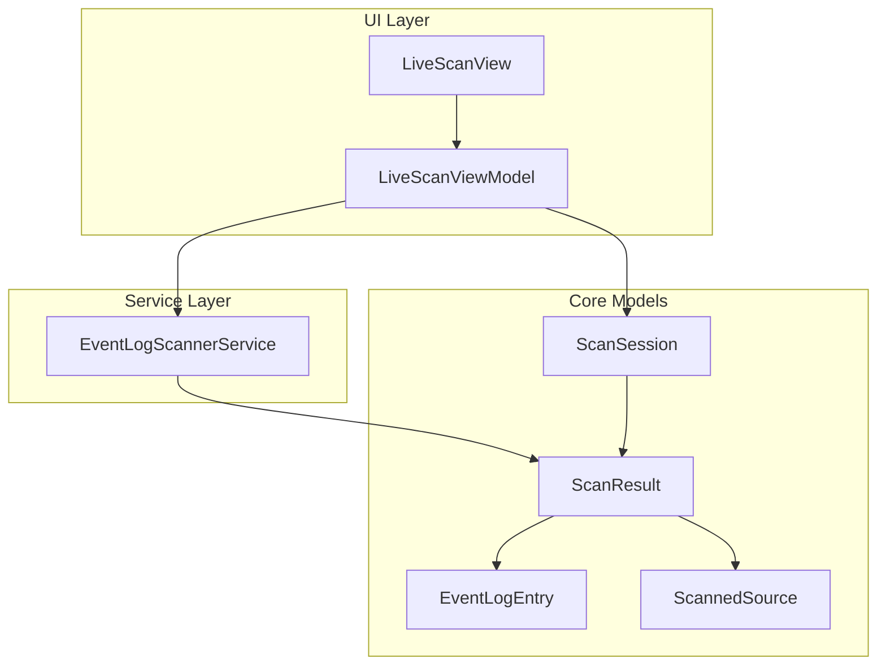
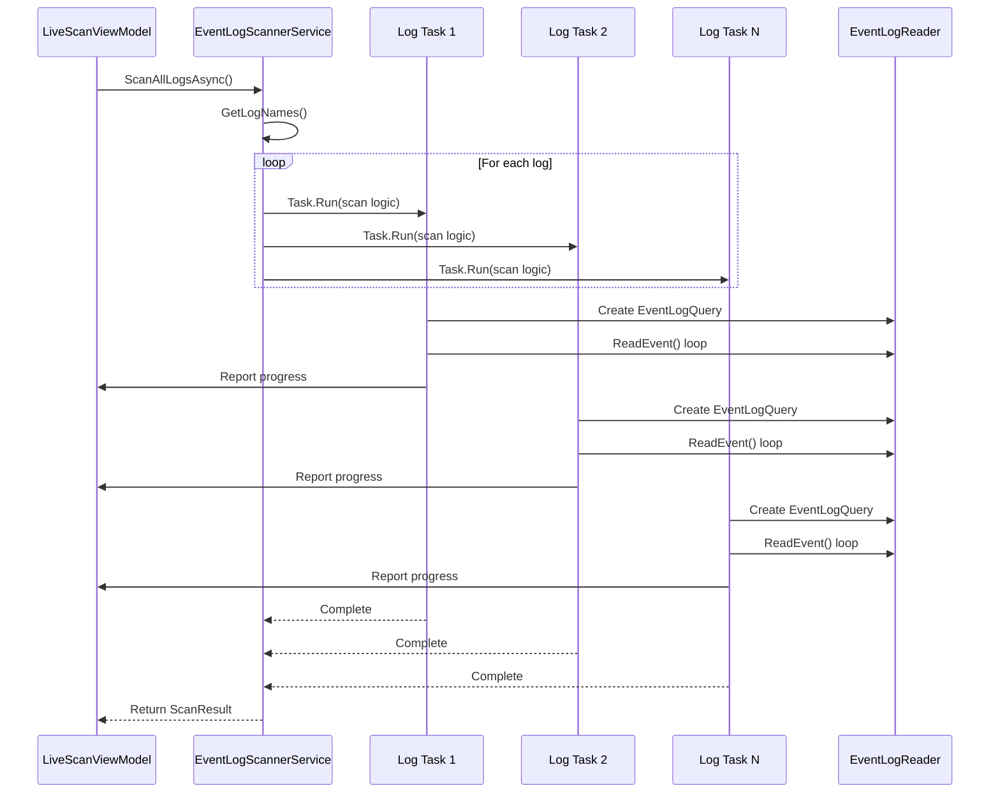
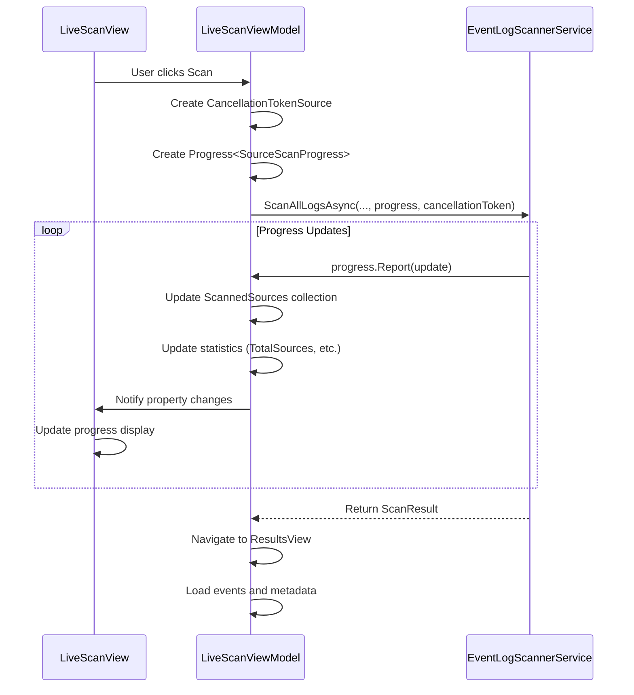
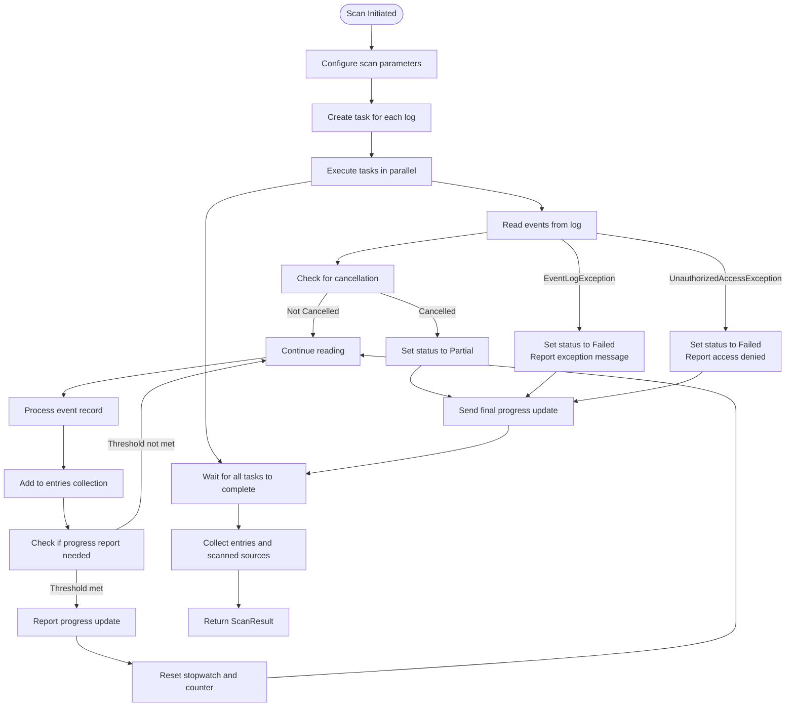

# Unified Event Log Scanning


## Table of Contents
1. [Introduction](#introduction)
2. [Core Components](#core-components)
3. [Architecture Overview](#architecture-overview)
4. [Detailed Component Analysis](#detailed-component-analysis)
5. [Parallel Scanning Mechanism](#parallel-scanning-mechanism)
6. [Progress Tracking and UI Integration](#progress-tracking-and-ui-integration)
7. [Error Handling and Cancellation](#error-handling-and-cancellation)
8. [Performance Considerations](#performance-considerations)
9. [Forensic Analysis Capabilities](#forensic-analysis-capabilities)
10. [Troubleshooting Guide](#troubleshooting-guide)

## Introduction
The Unified Event Log Scanning feature in Project Janus enables forensic investigators to correlate events across all Windows event logs around a user-defined timestamp. This capability is essential for incident response, security analysis, and system troubleshooting. By aggregating events from multiple logs into a single chronological timeline, the feature provides a comprehensive view of system activity during critical periods. The implementation leverages the `System.Diagnostics.Eventing.Reader` namespace for efficient, parallel access to event logs while maintaining a responsive user interface through asynchronous programming patterns.

## Core Components
The Unified Event Log Scanning feature is built upon several key components that work together to provide a seamless scanning experience. These components include the `EventLogScannerService` for log access, `ScanResult` for data aggregation, `ScannedSource` for per-log tracking, and integration with the `LiveScanViewModel` for UI presentation. The architecture follows a strict separation of concerns, with core data models residing in `Janus.Core` and application logic in `Janus.App`.

**Section sources**
- [EventLogScannerService.cs](file://Janus.App/Services/EventLogScannerService.cs#L1-L160)
- [ScanResult.cs](file://Janus.App/Services/ScanResult.cs#L1-L8)
- [ScannedSource.cs](file://Janus.Core/ScannedSource.cs#L1-L14)

## Architecture Overview
The Unified Event Log Scanning feature follows a layered architecture that separates data access, business logic, and presentation concerns. The scanning process begins in the `LiveScanViewModel`, which coordinates the scan operation and handles user interaction. It delegates the actual log scanning to the `EventLogScannerService`, which uses the `System.Diagnostics.Eventing.Reader` API to query event logs in parallel. Scanned events are collected in `EventLogEntry` objects and aggregated into a `ScanResult`, which is then passed back to the view model for display in the results view.





**Diagram sources**
- [LiveScanViewModel.cs](file://Janus.App/ViewModels/LiveScanViewModel.cs#L1-L260)
- [EventLogScannerService.cs](file://Janus.App/Services/EventLogScannerService.cs#L1-L160)
- [ScanResult.cs](file://Janus.App/Services/ScanResult.cs#L1-L8)

## Detailed Component Analysis

### EventLogScannerService Analysis
The `EventLogScannerService` is a static service class responsible for scanning Windows event logs around a specified timestamp. It provides two primary methods: `GetAllLogNames()` to enumerate available logs and `ScanAllLogsAsync()` to perform the actual scanning operation. The service uses the `System.Diagnostics.Eventing.Reader` namespace, specifically `EventLogSession`, `EventLogQuery`, and `EventLogReader` classes, to access event logs efficiently.


```mermaid
classDiagram
class EventLogScannerService {
+static IReadOnlyList<string> GetAllLogNames()
+static async Task<ScanResult> ScanAllLogsAsync(DateTime, TimeSpan, TimeSpan, IProgress<SourceScanProgress>, CancellationToken, TimeSpan?, int)
}
class ScanResult {
+IReadOnlyList<EventLogEntry> Entries
+IReadOnlyList<ScannedSource> ScannedSources
}
class EventLogEntry {
+long Id
+string LogName
+DateTime TimeCreated
+string Level
+string Source
+int EventId
+string Message
+string MachineName
+Guid ScanSessionId
+int ScanEventId
}
class ScannedSource {
+int Id
+string SourceName
+int EventsRetrieved
+ScanStatus Status
}
enum ScanStatus {
Success
Partial
Failed
}
EventLogScannerService --> ScanResult : "returns"
ScanResult --> EventLogEntry : "contains"
ScanResult --> ScannedSource : "contains"
```


**Diagram sources**
- [EventLogScannerService.cs](file://Janus.App/Services/EventLogScannerService.cs#L1-L160)
- [ScanResult.cs](file://Janus.App/Services/ScanResult.cs#L1-L8)
- [EventLogEntry.cs](file://Janus.Core/EventLogEntry.cs#L1-L19)
- [ScannedSource.cs](file://Janus.Core/ScannedSource.cs#L1-L14)

**Section sources**
- [EventLogScannerService.cs](file://Janus.App/Services/EventLogScannerService.cs#L1-L160)

### ScanResult and Data Model Analysis
The `ScanResult` class serves as a container for the output of a scanning operation, aggregating both the collected events and metadata about the scanning process. It contains two required properties: `Entries`, which holds a read-only list of `EventLogEntry` objects, and `ScannedSources`, which tracks the status and progress of each individual log source. The `EventLogEntry` class represents a single event from a Windows event log, capturing essential information such as the event ID, timestamp, level, source, and message. The `ScannedSource` class tracks per-log scanning progress, including the number of events retrieved and the final status of the scan for that source.


```mermaid
classDiagram
class ScanResult {
+IReadOnlyList<EventLogEntry> Entries
+IReadOnlyList<ScannedSource> ScannedSources
}
class EventLogEntry {
+long Id
+string LogName
+DateTime TimeCreated
+string Level
+string Source
+int EventId
+string Message
+string MachineName
+Guid ScanSessionId
+int ScanEventId
}
class ScannedSource {
+int Id
+string SourceName
+int EventsRetrieved
+ScanStatus Status
}
enum ScanStatus {
Success
Partial
Failed
}
ScanResult --> EventLogEntry : "contains"
ScanResult --> ScannedSource : "contains"
```


**Diagram sources**
- [ScanResult.cs](file://Janus.App/Services/ScanResult.cs#L1-L8)
- [EventLogEntry.cs](file://Janus.Core/EventLogEntry.cs#L1-L19)
- [ScannedSource.cs](file://Janus.Core/ScannedSource.cs#L1-L14)

**Section sources**
- [ScanResult.cs](file://Janus.App/Services/ScanResult.cs#L1-L8)
- [EventLogEntry.cs](file://Janus.Core/EventLogEntry.cs#L1-L19)
- [ScannedSource.cs](file://Janus.Core/ScannedSource.cs#L1-L14)

## Parallel Scanning Mechanism
The Unified Event Log Scanning feature employs a parallel scanning mechanism to improve performance when processing multiple event logs. The `ScanAllLogsAsync` method in `EventLogScannerService` creates a separate task for each available event log using `Task.Run`, allowing logs to be scanned concurrently. This approach maximizes resource utilization and reduces overall scan time, especially on systems with numerous event logs.

Each task executes an `EventLogQuery` against a specific log name using an XPath filter that targets events within the specified time window around the central timestamp. The XPath expression `*[System[TimeCreated[@SystemTime>='{from:O}' and @SystemTime<='{to:O}']]]` efficiently filters events based on their creation time, minimizing data transfer and processing overhead.





**Diagram sources**
- [EventLogScannerService.cs](file://Janus.App/Services/EventLogScannerService.cs#L32-L158)

**Section sources**
- [EventLogScannerService.cs](file://Janus.App/Services/EventLogScannerService.cs#L32-L158)

## Progress Tracking and UI Integration
The scanning feature provides real-time progress tracking through the `IProgress<SourceScanProgress>` interface, which enables responsive UI updates without blocking the main thread. The `LiveScanViewModel` creates a `Progress<SourceScanProgress>` instance that receives updates from the scanner service and updates the UI accordingly.

The `SourceScanProgress` class implements `INotifyPropertyChanged` to support data binding in the WPF UI, allowing the view to automatically reflect changes in scan status. The view model maintains an `ObservableCollection<SourceScanProgress>` that displays the progress of each log source, including the number of events retrieved, current status, and any error messages.





**Diagram sources**
- [LiveScanViewModel.cs](file://Janus.App/ViewModels/LiveScanViewModel.cs#L1-L260)
- [SourceScanProgress.cs](file://Janus.App/ViewModels/SourceScanProgress.cs#L1-L26)

**Section sources**
- [LiveScanViewModel.cs](file://Janus.App/ViewModels/LiveScanViewModel.cs#L1-L260)
- [SourceScanProgress.cs](file://Janus.App/ViewModels/SourceScanProgress.cs#L1-L26)

## Error Handling and Cancellation
The scanning implementation includes robust error handling and cancellation support to ensure reliability and user control. The `ScanAllLogsAsync` method accepts a `CancellationToken` parameter, allowing the operation to be cancelled at any time. When cancellation is requested, the method throws an `OperationCanceledException`, which is caught and handled gracefully by setting the scan status to `Partial`.

The service handles several specific exceptions that may occur during log scanning:
- `EventLogException`: Indicates a problem accessing a specific event log
- `UnauthorizedAccessException`: Occurs when the application lacks permission to read a log
- `OperationCanceledException`: Thrown when the scan is cancelled by the user

For each exception, the service updates the progress reporter with the appropriate status and error message, allowing the UI to display meaningful information to the user. Even if some logs cannot be accessed, the scan continues for other logs, ensuring that partial results are always available.





**Diagram sources**
- [EventLogScannerService.cs](file://Janus.App/Services/EventLogScannerService.cs#L32-L158)

**Section sources**
- [EventLogScannerService.cs](file://Janus.App/Services/EventLogScannerService.cs#L32-L158)

## Performance Considerations
The Unified Event Log Scanning feature is designed with performance in mind, particularly for systems with numerous event logs. The parallel scanning approach using `Task.Run` allows multiple logs to be processed simultaneously, significantly reducing total scan time compared to sequential processing.

To prevent overwhelming the UI with progress updates, the implementation includes throttling mechanisms. Progress reporting is limited by both time interval (default 250ms) and event count (default 250 events), ensuring that updates are frequent enough to provide feedback but not so frequent as to impact performance.

The use of `System.Diagnostics.Eventing.Reader` with XPath filtering ensures that only relevant events are retrieved from the event logs, minimizing memory usage and processing overhead. The service also uses thread-safe collections and locking mechanisms to safely aggregate results from multiple concurrent tasks.

For systems with a large number of event logs, users should be aware that scan times may increase significantly. Best practices include:
- Using precise time windows to minimize the number of events processed
- Ensuring the application runs with administrator privileges to avoid access denied errors
- Monitoring system resource usage during scans

**Section sources**
- [EventLogScannerService.cs](file://Janus.App/Services/EventLogScannerService.cs#L32-L158)
- [LiveScanViewModel.cs](file://Janus.App/ViewModels/LiveScanViewModel.cs#L1-L260)

## Forensic Analysis Capabilities
The Unified Event Log Scanning feature enables powerful forensic analysis by providing a correlated timeline of events across all Windows event logs. By scanning around a user-defined timestamp, investigators can reconstruct the sequence of events leading up to and following a critical incident.

The feature's ability to aggregate events from multiple logs into a single chronological sequence allows analysts to identify relationships between events that might otherwise be missed when examining logs in isolation. For example, a security analyst could correlate a failed login attempt in the Security log with a process creation event in the System log to identify potential attack patterns.

The `ScanSession` class captures metadata about each scan, including the timestamp of interest, time window, and machine information, creating a reproducible forensic record. This metadata, combined with the complete set of relevant events, provides a comprehensive snapshot of system activity that can be saved, shared, and analyzed offline.

**Section sources**
- [ScanSession.cs](file://Janus.Core/ScanSession.cs#L1-L35)
- [EventLogScannerService.cs](file://Janus.App/Services/EventLogScannerService.cs#L1-L160)

## Troubleshooting Guide
This section addresses common issues encountered when using the Unified Event Log Scanning feature and provides solutions for each.

**Missing Event Sources**
- **Symptom**: Some expected event logs do not appear in the scan results.
- **Cause**: The application may lack sufficient privileges to access certain logs.
- **Solution**: Ensure Project Janus is running with administrator privileges. Check the `app.manifest` file contains `requestedExecutionLevel="requireAdministrator"`.

**Permission Errors**
- **Symptom**: Scan progress shows "Access Denied" or "UnauthorizedAccessException" for specific logs.
- **Cause**: Insufficient permissions to read particular event logs.
- **Solution**: Run the application as an administrator. Some logs (e.g., Security log) require elevated privileges to access.

**Slow Scan Performance**
- **Symptom**: Scanning takes an excessively long time to complete.
- **Cause**: Large time windows or systems with numerous event logs.
- **Solution**: Narrow the time window around the timestamp of interest. Consider the system's event log volume and adjust expectations accordingly.

**Partial Results After Cancellation**
- **Symptom**: Scan completes with partial results after being cancelled.
- **Cause**: Expected behavior when user cancels the scan operation.
- **Solution**: Review the available results, which may still contain valuable information. The feature is designed to preserve partial results when scans are cancelled.

**Empty Scan Results**
- **Symptom**: Scan completes successfully but returns no events.
- **Cause**: No events exist within the specified time window.
- **Solution**: Verify the timestamp and time window are correct. Expand the time window or check system event generation.

**Section sources**
- [EventLogScannerService.cs](file://Janus.App/Services/EventLogScannerService.cs#L1-L160)
- [LiveScanViewModel.cs](file://Janus.App/ViewModels/LiveScanViewModel.cs#L1-L260)
- [GEMINI.md](file://GEMINI.md#L15-L54)

**Referenced Files in This Document**   
- [EventLogScannerService.cs](file://Janus.App/Services/EventLogScannerService.cs)
- [LiveScanViewModel.cs](file://Janus.App/ViewModels/LiveScanViewModel.cs)
- [ScanResult.cs](file://Janus.App/Services/ScanResult.cs)
- [ScannedSource.cs](file://Janus.Core/ScannedSource.cs)
- [EventLogEntry.cs](file://Janus.Core/EventLogEntry.cs)
- [SourceScanProgress.cs](file://Janus.App/ViewModels/SourceScanProgress.cs)
- [ScanSession.cs](file://Janus.Core/ScanSession.cs)