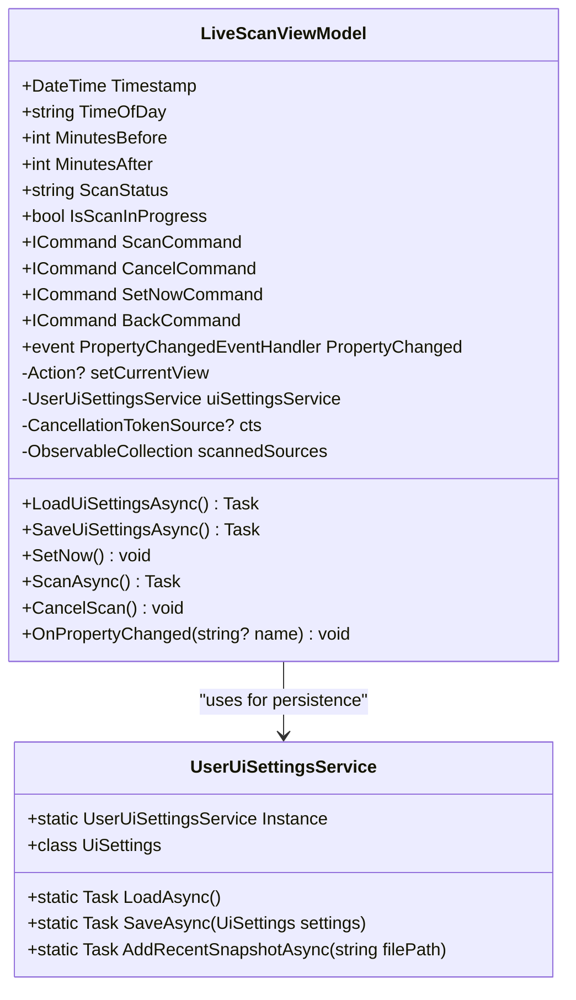
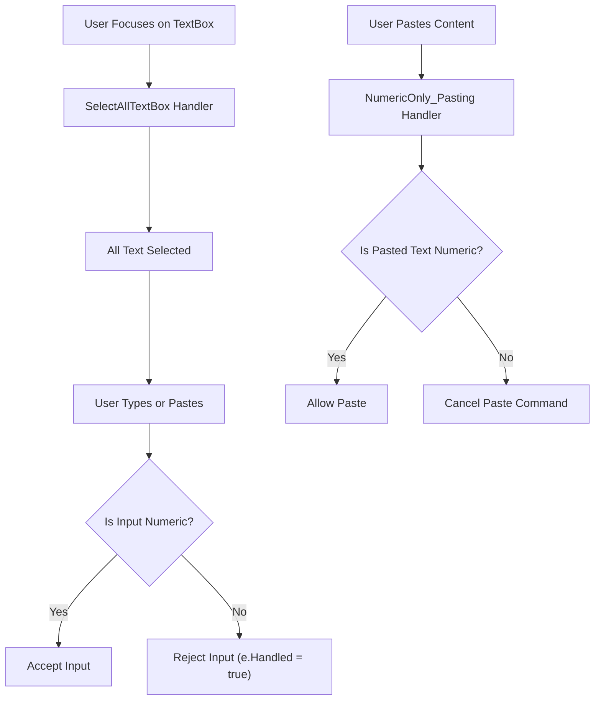
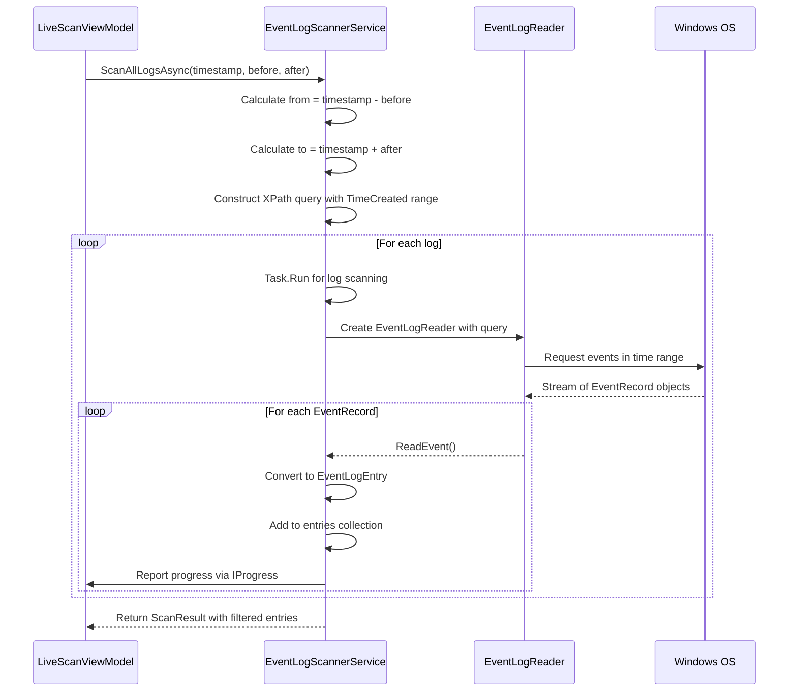
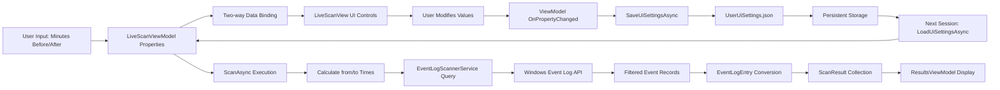

# Configurable Time Window


## Table of Contents
1. [Introduction](#introduction)
2. [Core Components](#core-components)
3. [Time Window Configuration in LiveScanViewModel](#time-window-configuration-in-livescanviewmodel)
4. [UI Integration and User Experience](#ui-integration-and-user-experience)
5. [Event Filtering Logic in EventLogScannerService](#event-filtering-logic-in-eventlogscannerservice)
6. [Data Flow and Processing Pipeline](#data-flow-and-processing-pipeline)
7. [Validation and Edge Cases](#validation-and-edge-cases)
8. [Persistence of Time Window Settings](#persistence-of-time-window-settings)
9. [Performance Considerations](#performance-considerations)
10. [Best Practices for Time Range Selection](#best-practices-for-time-range-selection)

## Introduction
The Configurable Time Window feature enables users to define a temporal context around a target timestamp for incident investigation. By specifying pre-event and post-event durations (e.g., ±5 minutes), users can retrieve relevant system events that occurred before and after a critical moment. This contextualization is essential for diagnosing system anomalies, security incidents, or application failures. The implementation leverages MVVM architecture with observable properties, WPF data binding, and asynchronous event scanning. The time window values are persisted across sessions and used to construct XPath queries that filter Windows Event Log entries based on their `TimeCreated` property.

## Core Components
The Configurable Time Window functionality is implemented through several interconnected components:
- **LiveScanViewModel**: Manages the time window state, validation, and command execution
- **EventLogScannerService**: Performs actual event log scanning using the configured time window
- **NumericUpDown**: Custom control for numeric input of time values
- **LiveScanView**: UI layer with XAML bindings to view model properties
- **UserUiSettingsService**: Persists user preferences including time window settings

These components work together to provide a seamless experience for defining, validating, and applying time-based filters to system event logs.

**Section sources**
- [LiveScanViewModel.cs](file://d:/devel/Project Janus/Janus.App/ViewModels/LiveScanViewModel.cs#L1-L260)
- [EventLogScannerService.cs](file://d:/devel/Project Janus/Janus.App/Services/EventLogScannerService.cs#L1-L160)
- [NumericUpDown.cs](file://d:/devel/Project Janus/Janus.App/Helpers/NumericUpDown.cs#L1-L50)

## Time Window Configuration in LiveScanViewModel
The `LiveScanViewModel` class exposes two key observable properties for time window configuration:


```csharp
public int MinutesBefore {
    get => minutesBefore;
    set {
        if (minutesBefore != value) {
            minutesBefore = value;
            OnPropertyChanged();
            _ = SaveUiSettingsAsync();
        }
    }
}

public int MinutesAfter {
    get => minutesAfter;
    set {
        if (minutesAfter != value) {
            minutesAfter = value;
            OnPropertyChanged();
            _ = SaveUiSettingsAsync();
        }
    }
}
```


These properties are initialized to 5 minutes by default and implement the `INotifyPropertyChanged` interface to enable data binding. When modified, they trigger UI updates and automatically persist the new values via `SaveUiSettingsAsync()`. The initial values are loaded from persistent storage in the constructor through `LoadUiSettingsAsync()`.





**Diagram sources**
- [LiveScanViewModel.cs](file://d:/devel/Project Janus/Janus.App/ViewModels/LiveScanViewModel.cs#L1-L260)
- [UserUiSettingsService.cs](file://d:/devel/Project Janus/Janus.App/Services/UserUiSettingsService.cs#L1-L64)

**Section sources**
- [LiveScanViewModel.cs](file://d:/devel/Project Janus/Janus.App/ViewModels/LiveScanViewModel.cs#L78-L124)

## UI Integration and User Experience
The time window controls are integrated into the UI through XAML data binding in `LiveScanView.xaml`. Two `TextBox` elements are bound to the `MinutesBefore` and `MinutesAfter` properties:


```xml
<StackPanel Orientation="Horizontal" Grid.Row="1" Margin="0,0,0,10">
    <TextBlock Text="Minutes Before:" VerticalAlignment="Center" Margin="0,0,10,0"/>
    <TextBox x:Name="MinutesBeforeBox" Text="{Binding MinutesBefore, Mode=TwoWay}" Width="60"/>
    <TextBlock Text="Minutes After:" VerticalAlignment="Center" Margin="20,0,10,0"/>
    <TextBox x:Name="MinutesAfterBox" Text="{Binding MinutesAfter, Mode=TwoWay}" Width="60"/>
</StackPanel>
```


The code-behind file `LiveScanView.xaml.cs` enhances the user experience with several features:
- Text selection on focus: When a user clicks on a time input box, all text is automatically selected
- Numeric input validation: The `PreviewTextInput` event ensures only digits can be entered
- Paste protection: The `DataObjectPastingHandler` prevents non-numeric text from being pasted


```csharp
private void NumericOnly_PreviewTextInput(object sender, TextCompositionEventArgs e) 
    => e.Handled = !IsTextNumeric(e.Text);

private void NumericOnly_Pasting(object sender, DataObjectPastingEventArgs e) {
    if (e.DataObject.GetDataPresent(typeof(string))) {
        string text = (string)e.DataObject.GetData(typeof(string));
        if (!IsTextNumeric(text)) {
            e.CancelCommand();
        }
    } else {
        e.CancelCommand();
    }
}
```


This creates a robust input experience that prevents invalid characters while allowing efficient editing.





**Diagram sources**
- [LiveScanView.xaml](file://d:/devel/Project Janus/Janus.App/Views/LiveScanView.xaml#L1-L186)
- [LiveScanView.xaml.cs](file://d:/devel/Project Janus/Janus.App/Views/LiveScanView.xaml.cs#L1-L55)

**Section sources**
- [LiveScanView.xaml](file://d:/devel/Project Janus/Janus.App/Views/LiveScanView.xaml#L1-L186)
- [LiveScanView.xaml.cs](file://d:/devel/Project Janus/Janus.App/Views/LiveScanView.xaml.cs#L1-L55)

## Event Filtering Logic in EventLogScannerService
The `EventLogScannerService` uses the configured time window to filter events via `EventLogQuery.TimeCreated`. The `ScanAllLogsAsync` method constructs an XPath query that includes both the pre-event and post-event boundaries:


```csharp
DateTime from = (timestamp - before).ToUniversalTime();
DateTime to = (timestamp + after).ToUniversalTime();
string xpath = $"*[System[TimeCreated[@SystemTime>='{from:O}' and @SystemTime<='{to:O}']]]";
```


The `:O` format specifier ensures ISO 8601 formatting for the timestamp, which is required by the Event Log API. The query filters events where `TimeCreated` falls within the inclusive range `[from, to]`. This approach leverages the Windows Event Log infrastructure's native filtering capabilities for optimal performance.

The service processes all available event logs in parallel using `Task.Run`, with each log being scanned in a separate task. Progress is reported through the `IProgress<SourceScanProgress>` interface, allowing the UI to update in real-time.





**Diagram sources**
- [EventLogScannerService.cs](file://d:/devel/Project Janus/Janus.App/Services/EventLogScannerService.cs#L1-L160)
- [LiveScanViewModel.cs](file://d:/devel/Project Janus/Janus.App/ViewModels/LiveScanViewModel.cs#L1-L260)

**Section sources**
- [EventLogScannerService.cs](file://d:/devel/Project Janus/Janus.App/Services/EventLogScannerService.cs#L1-L160)

## Data Flow and Processing Pipeline
The complete data flow for the Configurable Time Window feature follows a clear pipeline from user input to final results:





When the user initiates a scan, the `ScanAsync` method in `LiveScanViewModel` combines the `Timestamp`, `MinutesBefore`, and `MinutesAfter` values to create a `DateTime` range. This range is passed to `EventLogScannerService.ScanAllLogsAsync`, which returns a `ScanResult` containing `EventLogEntry` objects that match the time criteria.

**Diagram sources**
- [LiveScanViewModel.cs](file://d:/devel/Project Janus/Janus.App/ViewModels/LiveScanViewModel.cs#L1-L260)
- [EventLogScannerService.cs](file://d:/devel/Project Janus/Janus.App/Services/EventLogScannerService.cs#L1-L160)
- [ScanResult.cs](file://d:/devel/Project Janus/Janus.App/Services/ScanResult.cs#L1-L8)
- [EventLogEntry.cs](file://d:/devel/Project Janus/Janus.Core/EventLogEntry.cs#L1-L19)

**Section sources**
- [LiveScanViewModel.cs](file://d:/devel/Project Janus/Janus.App/ViewModels/LiveScanViewModel.cs#L1-L260)
- [EventLogScannerService.cs](file://d:/devel/Project Janus/Janus.App/Services/EventLogScannerService.cs#L1-L160)

## Validation and Edge Cases
The implementation handles several edge cases and validation scenarios:

**Zero Values**: Users can set `MinutesBefore` or `MinutesAfter` to zero, which creates an asymmetric time window. For example, setting `MinutesBefore=10` and `MinutesAfter=0` retrieves only events that occurred before the timestamp.

**Negative Values**: While the UI validation prevents non-numeric input, the underlying system does not explicitly validate against negative values. If negative values were allowed, they would create invalid time ranges (e.g., `from > to`), potentially causing the Event Log query to return no results.

**Large Values**: Extremely large time windows (e.g., thousands of minutes) could impact performance due to the volume of events retrieved. The system does not impose upper limits, relying on user discretion.

**Time Zone Handling**: The implementation properly converts local time to UTC using `ToUniversalTime()` before querying the event logs, ensuring accurate time-based filtering regardless of system time zone.


```csharp
DateTime scanTimestamp = DateTime.SpecifyKind(Timestamp.Date.Add(TimeSpan.Parse(TimeOfDay)), DateTimeKind.Local).ToUniversalTime();
var before = TimeSpan.FromMinutes(MinutesBefore);
var after = TimeSpan.FromMinutes(MinutesAfter);
DateTime from = (scanTimestamp - before).ToUniversalTime();
DateTime to = (scanTimestamp + after).ToUniversalTime();
```


The UI's numeric-only validation prevents most invalid inputs, but additional validation could be added to the view model to ensure values are non-negative and within reasonable bounds.

**Section sources**
- [LiveScanView.xaml.cs](file://d:/devel/Project Janus/Janus.App/Views/LiveScanView.xaml.cs#L1-L55)
- [LiveScanViewModel.cs](file://d:/devel/Project Janus/Janus.App/ViewModels/LiveScanViewModel.cs#L1-L260)

## Persistence of Time Window Settings
Time window settings are persisted across application sessions using the `UserUiSettingsService`. The service stores user preferences in a JSON file (`UserUiSettings.json`) located in the application directory:


```csharp
private const string SettingsFileName = "UserUiSettings.json";
private static readonly string SettingsFilePath = Path.Combine(AppContext.BaseDirectory, SettingsFileName);
```


The `UiSettings` class contains the time window properties with default values:


```csharp
public class UiSettings {
    public int MinutesBefore { get; set; } = 5;
    public int MinutesAfter { get; set; } = 5;
    // other settings...
}
```


Settings are automatically saved whenever the user modifies the time window values:


```csharp
public int MinutesBefore {
    get => minutesBefore;
    set {
        if (minutesBefore != value) {
            minutesBefore = value;
            OnPropertyChanged();
            _ = SaveUiSettingsAsync(); // Fire-and-forget async save
        }
    }
}
```


The use of `SemaphoreSlim` ensures thread-safe file access, preventing race conditions when multiple operations might attempt to read or write the settings file simultaneously.

**Section sources**
- [UserUiSettingsService.cs](file://d:/devel/Project Janus/Janus.App/Services/UserUiSettingsService.cs#L1-L64)
- [LiveScanViewModel.cs](file://d:/devel/Project Janus/Janus.App/ViewModels/LiveScanViewModel.cs#L1-L260)

## Performance Considerations
The Configurable Time Window feature has several performance implications:

**Query Efficiency**: By using the Event Log API's native time-based filtering, the system avoids retrieving unnecessary events. This is significantly more efficient than retrieving all events and filtering in memory.

**Parallel Processing**: The `EventLogScannerService` scans multiple event logs concurrently using `Task.Run`, maximizing CPU utilization and reducing total scan time.

**Progress Throttling**: To prevent UI thread overload, progress updates are throttled to every 250ms or 250 events (whichever comes first), configurable via parameters.

**Memory Usage**: All matching events are stored in memory in a `List<EventLogEntry>`. For very large time windows, this could lead to high memory consumption. The system does not currently implement pagination or streaming to disk.

**Scan Duration**: Larger time windows naturally result in longer scan times due to the increased number of events to process. Users should be aware that expanding the time window linearly increases the potential data volume.

The optimal time window balances comprehensiveness with performance. For most incidents, a window of ±5 to ±15 minutes provides sufficient context without excessive overhead.

**Section sources**
- [EventLogScannerService.cs](file://d:/devel/Project Janus/Janus.App/Services/EventLogScannerService.cs#L1-L160)
- [LiveScanViewModel.cs](file://d:/devel/Project Janus/Janus.App/ViewModels/LiveScanViewModel.cs#L1-L260)

## Best Practices for Time Range Selection
When selecting time ranges for incident investigation, consider the following guidelines:

**Critical System Events**: For system crashes or reboots, use a wider window (±15-30 minutes) to capture boot sequences, driver loading, and related services.

**Application Failures**: For application-specific issues, a narrower window (±2-5 minutes) is often sufficient, focusing on the immediate context of the failure.

**Security Incidents**: For suspected security breaches, use a broader window (±30-60 minutes) to identify potential reconnaissance activities, privilege escalation, and lateral movement.

**Performance Degradation**: For slow performance issues, consider using multiple smaller windows rather than one large window to isolate the onset of the problem.

**Known Event Timestamps**: When the exact time of an event is known (e.g., from an alert), use asymmetric windows (e.g., 10 minutes before, 1 minute after) to focus on precursor events.

**Iterative Refinement**: Start with a moderate window (±5 minutes) and expand or contract based on initial findings. The persistent settings make it easy to adjust and re-scan.

The default ±5 minute window provides a balanced starting point for most investigations, offering sufficient context while maintaining reasonable performance.

**Section sources**
- [LiveScanViewModel.cs](file://d:/devel/Project Janus/Janus.App/ViewModels/LiveScanViewModel.cs#L1-L260)
- [EventLogScannerService.cs](file://d:/devel/Project Janus/Janus.App/Services/EventLogScannerService.cs#L1-L160)

**Referenced Files in This Document**   
- [LiveScanViewModel.cs](file://d:/devel/Project Janus/Janus.App/ViewModels/LiveScanViewModel.cs)
- [EventLogScannerService.cs](file://d:/devel/Project Janus/Janus.App/Services/EventLogScannerService.cs)
- [NumericUpDown.cs](file://d:/devel/Project Janus/Janus.App/Helpers/NumericUpDown.cs)
- [LiveScanView.xaml](file://d:/devel/Project Janus/Janus.App/Views/LiveScanView.xaml)
- [LiveScanView.xaml.cs](file://d:/devel/Project Janus/Janus.App/Views/LiveScanView.xaml.cs)
- [UserUiSettingsService.cs](file://d:/devel/Project Janus/Janus.App/Services/UserUiSettingsService.cs)
- [EventLogEntry.cs](file://d:/devel/Project Janus/Janus.Core/EventLogEntry.cs)
- [ScanResult.cs](file://d:/devel/Project Janus/Janus.App/Services/ScanResult.cs)
- [ScannedSource.cs](file://d:/devel/Project Janus/Janus.Core/ScannedSource.cs)