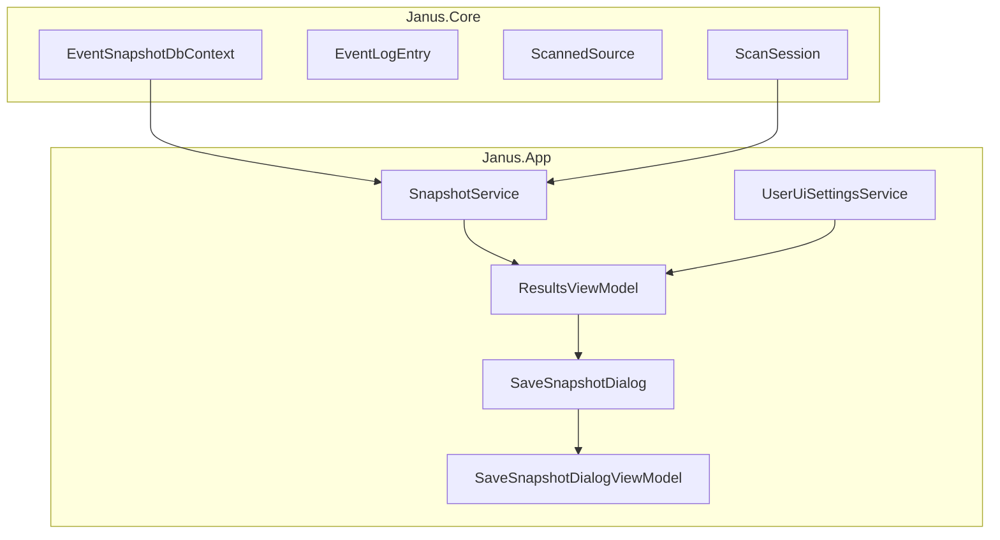
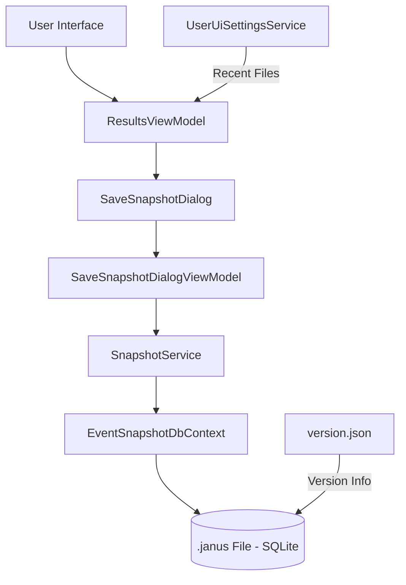
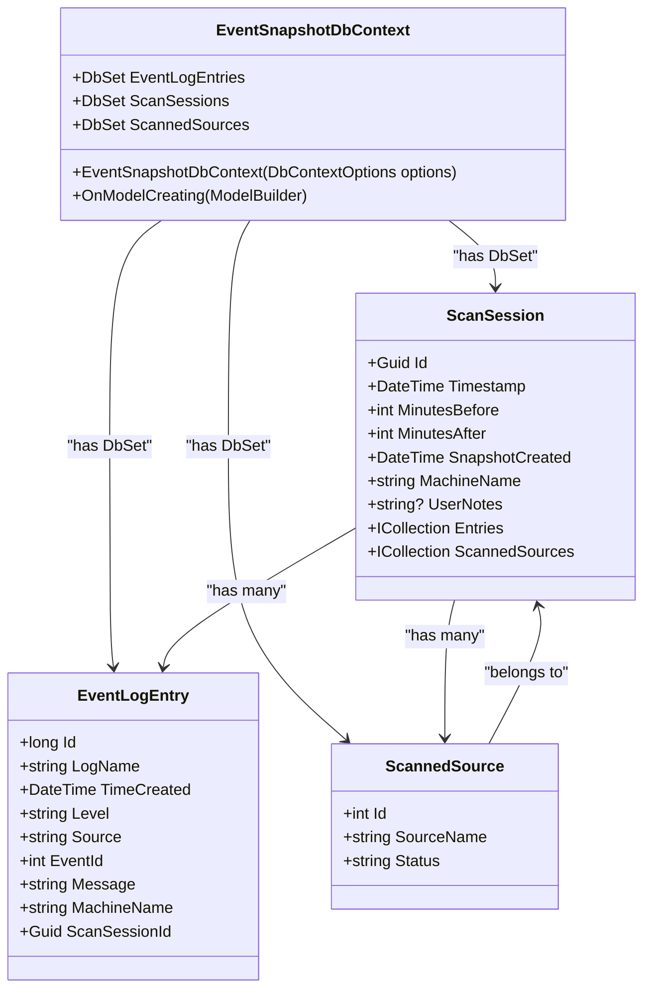
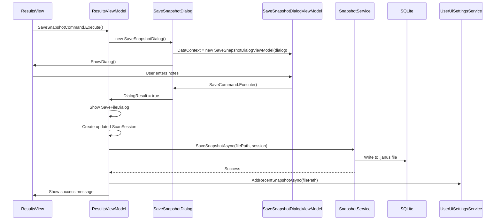
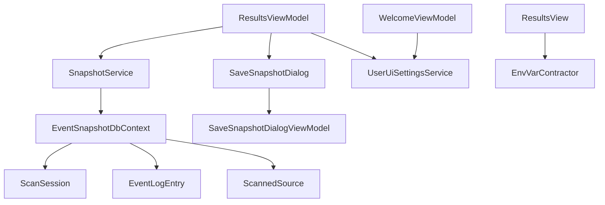

# Portable Snapshot Creation


## Table of Contents
1. [Introduction](#introduction)
2. [Project Structure](#project-structure)
3. [Core Components](#core-components)
4. [Architecture Overview](#architecture-overview)
5. [Detailed Component Analysis](#detailed-component-analysis)
6. [Dependency Analysis](#dependency-analysis)
7. [Performance Considerations](#performance-considerations)
8. [Troubleshooting Guide](#troubleshooting-guide)
9. [Conclusion](#conclusion)

## Introduction
Portable Snapshot Creation in Project Janus enables users to save and share complete event log scan sessions in a self-contained, offline-capable format using `.janus` files. These snapshots are SQLite databases generated via Entity Framework Core (EF Core), encapsulating all scan data including entries, sources, metadata, and user notes. This document details the serialization mechanism, file format structure, versioning, user interface workflow, error handling, and best practices for managing snapshots. The system ensures data portability, supports offline analysis, and maintains compatibility across application versions.

## Project Structure
The project is organized into layered components: core models in `Janus.Core`, application services and view models in `Janus.App`, and shared utilities. Snapshot functionality spans multiple layers, with data models in the core, persistence logic in services, and UI integration in view models.





**Diagram sources**
- [ScanSession.cs](file://d:/devel/Project Janus/Janus.Core/ScanSession.cs)
- [EventSnapshotDbContext.cs](file://d:/devel/Project Janus/Janus.Core/EventSnapshotDbContext.cs)
- [SnapshotService.cs](file://d:/devel/Project Janus/Janus.App/Services/SnapshotService.cs)
- [ResultsViewModel.cs](file://d:/devel/Project Janus/Janus.App/ViewModels/ResultsViewModel.cs)
- [SaveSnapshotDialog.xaml.cs](file://d:/devel/Project Janus/Janus.App/Resources/SaveSnapshotDialog.xaml.cs)
- [SaveSnapshotDialogViewModel.cs](file://d:/devel/Project Janus/Janus.App/ViewModels/SaveSnapshotDialogViewModel.cs)
- [UserUiSettingsService.cs](file://d:/devel/Project Janus/Janus.App/Services/UserUiSettingsService.cs)

**Section sources**
- [project_structure](file://d:/devel/Project Janus)

## Core Components
The core components of the portable snapshot system include the `ScanSession` model, `EventSnapshotDbContext` for EF Core persistence, `SnapshotService` for save/load operations, and integration with `ResultsViewModel` for UI interaction. The `.janus` file is a SQLite database containing serialized scan data, enabling full session restoration.

**Section sources**
- [ScanSession.cs](file://d:/devel/Project Janus/Janus.Core/ScanSession.cs)
- [EventSnapshotDbContext.cs](file://d:/devel/Project Janus/Janus.Core/EventSnapshotDbContext.cs)
- [SnapshotService.cs](file://d:/devel/Project Janus/Janus.App/Services/SnapshotService.cs)
- [ResultsViewModel.cs](file://d:/devel/Project Janus/Janus.App/ViewModels/ResultsViewModel.cs)

## Architecture Overview
The snapshot architecture follows a layered pattern: the UI triggers snapshot creation via `ResultsViewModel`, which opens a dialog to collect user notes. The `SnapshotService` then serializes the `ScanSession` into a SQLite database using EF Core. The `EventSnapshotDbContext` manages the database schema and relationships. Snapshots are versioned via `version.json`, and recent files are tracked in `UserUiSettingsService`.





**Diagram sources**
- [ResultsViewModel.cs](file://d:/devel/Project Janus/Janus.App/ViewModels/ResultsViewModel.cs)
- [SaveSnapshotDialog.xaml.cs](file://d:/devel/Project Janus/Janus.App/Resources/SaveSnapshotDialog.xaml.cs)
- [SaveSnapshotDialogViewModel.cs](file://d:/devel/Project Janus/Janus.App/ViewModels/SaveSnapshotDialogViewModel.cs)
- [SnapshotService.cs](file://d:/devel/Project Janus/Janus.App/Services/SnapshotService.cs)
- [EventSnapshotDbContext.cs](file://d:/devel/Project Janus/Janus.Core/EventSnapshotDbContext.cs)
- [UserUiSettingsService.cs](file://d:/devel/Project Janus/Janus.App/Services/UserUiSettingsService.cs)
- [version.json](file://d:/devel/Project Janus/version.json)

## Detailed Component Analysis

### SnapshotService Analysis
The `SnapshotService` is responsible for saving and loading `.janus` snapshot files using EF Core and SQLite. It provides static async methods for serialization and deserialization.

#### SaveSnapshotAsync Method
This method serializes a `ScanSession` into a SQLite database at the specified file path.


```csharp
public static async Task SaveSnapshotAsync(string filePath, ScanSession session) {
  try {
    DbContextOptions<EventSnapshotDbContext> options = CreateOptions(filePath);
    await using var db = new EventSnapshotDbContext(options);
    await db.Database.EnsureCreatedAsync();
    db.ScanSessions.Add(new ScanSession {
      Id = session.Id,
      Timestamp = session.Timestamp,
      MinutesBefore = session.MinutesBefore,
      MinutesAfter = session.MinutesAfter,
      SnapshotCreated = session.SnapshotCreated,
      MachineName = session.MachineName,
      UserNotes = session.UserNotes,
      Entries = session.Entries,
      ScannedSources = session.ScannedSources
    });
    await db.SaveChangesAsync();
  } catch (SqliteException ex) {
    throw new InvalidOperationException("Failed to save snapshot.", ex);
  }
}
```


**Key Implementation Details:**
- Uses `DbContextOptionsBuilder` to configure SQLite connection with pooling disabled
- Calls `EnsureCreatedAsync()` to create the database schema if it doesn't exist
- Adds a new `ScanSession` entity with all related data (entries and sources)
- Uses `SaveChangesAsync()` within an async transaction
- Handles `SqliteException` for schema mismatches or file access errors

#### LoadSnapshotAsync Method
This method deserializes a `ScanSession` from a `.janus` file.


```csharp
public static async Task<ScanSession?> LoadSnapshotAsync(string filePath) {
  try {
    DbContextOptions<EventSnapshotDbContext> options = CreateOptions(filePath);
    await using var db = new EventSnapshotDbContext(options);
    await db.Database.EnsureCreatedAsync();
    ScanSession? res = await db.ScanSessions
      .AsSplitQuery()
      .Include(s => s.Entries)
      .Include(s => s.ScannedSources)
      .FirstOrDefaultAsync();
    return res;
  } catch (SqliteException ex) {
    throw new InvalidOperationException("Failed to load snapshot.", ex);
  }
}
```


**Key Implementation Details:**
- Uses `AsSplitQuery()` to avoid Cartesian explosion when loading related data
- Includes both `Entries` and `ScannedSources` collections via `Include()`
- Returns `null` if no session is found
- Same error handling as save operation

#### LoadSnapshotMetadataAsync Method
This method loads only metadata and event count, improving performance for file browsing.


```csharp
public static async Task<(ScanSession?, int?)> LoadSnapshotMetadataAsync(string filePath) {
  try {
    DbContextOptions<EventSnapshotDbContext> options = CreateOptions(filePath);
    await using var db = new EventSnapshotDbContext(options);
    await db.Database.EnsureCreatedAsync();
    var res = await db.ScanSessions
      .Include(s => s.ScannedSources)
      .Select(s => new {
        Session = s,
        s.Entries.Count
      }).FirstOrDefaultAsync();
    return (res?.Session, res?.Count);
  } catch (SqliteException ex) {
    throw new InvalidOperationException("Failed to load snapshot metadata.", ex);
  }
}
```


**Section sources**
- [SnapshotService.cs](file://d:/devel/Project Janus/Janus.App/Services/SnapshotService.cs#L15-L78)

### EventSnapshotDbContext Analysis
This EF Core context defines the database schema for snapshots.





**Key Configuration:**
- Configures cascade delete for `ScannedSources`
- Converts `Status` enum to string in database
- Uses default EF Core conventions for relationships

**Section sources**
- [EventSnapshotDbContext.cs](file://d:/devel/Project Janus/Janus.Core/EventSnapshotDbContext.cs#L5-L25)

### SaveSnapshotDialog Workflow
The dialog workflow allows users to add notes before saving.





**Section sources**
- [SaveSnapshotDialog.xaml.cs](file://d:/devel/Project Janus/Janus.App/Resources/SaveSnapshotDialog.xaml.cs#L5-L10)
- [SaveSnapshotDialogViewModel.cs](file://d:/devel/Project Janus/Janus.App/ViewModels/SaveSnapshotDialogViewModel.cs#L5-L26)
- [ResultsViewModel.cs](file://d:/devel/Project Janus/Janus.App/ViewModels/ResultsViewModel.cs#L483-L516)

### ResultsViewModel Integration
The `ResultsViewModel` orchestrates snapshot creation and displays metadata.


```csharp
private async Task SaveSnapshotAsync() {
  var dialog = new SaveSnapshotDialog();
  if (dialog.ShowDialog() == true) {
    var vm = (SaveSnapshotDialogViewModel)dialog.DataContext;
    // ... configure SaveFileDialog
    if (saveFileDialog.ShowDialog() == true && Metadata is not null) {
      var updatedSession = new ScanSession {
        Id = Metadata.Id,
        Timestamp = Metadata.Timestamp,
        MinutesBefore = Metadata.MinutesBefore,
        MinutesAfter = Metadata.MinutesAfter,
        SnapshotCreated = DateTime.UtcNow,
        MachineName = Metadata.MachineName,
        UserNotes = vm.UserNotes,
        Entries = Metadata.Entries,
        ScannedSources = Metadata.ScannedSources
      };
      await SnapshotService.SaveSnapshotAsync(filePath, updatedSession);
      await UserUiSettingsService.AddRecentSnapshotAsync(filePath);
      SetMetadata(updatedSession, filePath);
      CanSaveSnapshot = false;
    }
  }
}
```


**Section sources**
- [ResultsViewModel.cs](file://d:/devel/Project Janus/Janus.App/ViewModels/ResultsViewModel.cs#L483-L516)

## Dependency Analysis
The snapshot system has a clear dependency hierarchy.





**Diagram sources**
- [ResultsViewModel.cs](file://d:/devel/Project Janus/Janus.App/ViewModels/ResultsViewModel.cs)
- [SnapshotService.cs](file://d:/devel/Project Janus/Janus.App/Services/SnapshotService.cs)
- [EventSnapshotDbContext.cs](file://d:/devel/Project Janus/Janus.Core/EventSnapshotDbContext.cs)
- [ScanSession.cs](file://d:/devel/Project Janus/Janus.Core/ScanSession.cs)
- [SaveSnapshotDialog.xaml.cs](file://d:/devel/Project Janus/Janus.App/Resources/SaveSnapshotDialog.xaml.cs)
- [SaveSnapshotDialogViewModel.cs](file://d:/devel/Project Janus/Janus.App/ViewModels/SaveSnapshotDialogViewModel.cs)
- [UserUiSettingsService.cs](file://d:/devel/Project Janus/Janus.App/Services/UserUiSettingsService.cs)
- [ResultsView.xaml.cs](file://d:/devel/Project Janus/Janus.App/Views/ResultsView.xaml.cs)
- [EnvVarContractor.cs](file://d:/devel/Project Janus/Janus.App/Utils/EnvVarContractor.cs)

**Section sources**
- [ResultsViewModel.cs](file://d:/devel/Project Janus/Janus.App/ViewModels/ResultsViewModel.cs)
- [SnapshotService.cs](file://d:/devel/Project Janus/Janus.App/Services/SnapshotService.cs)
- [EventSnapshotDbContext.cs](file://d:/devel/Project Janus/Janus.Core/EventSnapshotDbContext.cs)
- [ScanSession.cs](file://d:/devel/Project Janus/Janus.Core/ScanSession.cs)
- [SaveSnapshotDialog.xaml.cs](file://d:/devel/Project Janus/Janus.App/Resources/SaveSnapshotDialog.xaml.cs)
- [SaveSnapshotDialogViewModel.cs](file://d:/devel/Project Janus/Janus.App/ViewModels/SaveSnapshotDialogViewModel.cs)
- [UserUiSettingsService.cs](file://d:/devel/Project Janus/Janus.App/Services/UserUiSettingsService.cs)
- [ResultsView.xaml.cs](file://d:/devel/Project Janus/Janus.App/Views/ResultsView.xaml.cs)
- [EnvVarContractor.cs](file://d:/devel/Project Janus/Janus.App/Utils/EnvVarContractor.cs)

## Performance Considerations
- **Large Snapshots**: For sessions with thousands of events, `LoadSnapshotAsync` may be slow due to loading all entries. Use `LoadSnapshotMetadataAsync` when only metadata is needed.
- **Transaction Handling**: The current implementation uses implicit transactions via `SaveChangesAsync()`. For very large datasets, consider batching.
- **Memory Usage**: The entire `ScanSession` is loaded into memory. Monitor memory usage for large snapshots.
- **Split Queries**: `AsSplitQuery()` prevents Cartesian explosion but may result in multiple database queries.

## Troubleshooting Guide
### Common Issues and Solutions

**Issue: Failed to save snapshot**
- **Cause**: File permission issues or invalid path
- **Solution**: Ensure write permissions and valid directory path

**Issue: Failed to load snapshot**
- **Cause**: Schema mismatch or corrupted file
- **Solution**: Verify file integrity and application version compatibility

**Issue: Slow loading of large snapshots**
- **Cause**: Loading all entries at once
- **Solution**: Use metadata loading for browsing, implement pagination

**Issue: Recent snapshots not appearing**
- **Cause**: Settings file corruption or path changes
- **Solution**: Check `UserUiSettings.json` file and verify snapshot paths exist

**Corrupted Snapshot Recovery**:
1. Verify file exists and has `.janus` extension
2. Check if file is accessible and not locked
3. Attempt to open with SQLite browser to verify database integrity
4. If database is corrupted, recovery may not be possible

**Section sources**
- [SnapshotService.cs](file://d:/devel/Project Janus/Janus.App/Services/SnapshotService.cs#L32-L78)
- [UserUiSettingsService.cs](file://d:/devel/Project Janus/Janus.App/Services/UserUiSettingsService.cs#L50-L63)

## Conclusion
The portable snapshot system in Project Janus provides a robust mechanism for saving and sharing event log analysis sessions. By leveraging EF Core and SQLite, it creates self-contained `.janus` files that preserve complete scan data and metadata. The integration with the UI through `ResultsViewModel` and `SaveSnapshotDialog` provides a seamless user experience, while versioning and recent file tracking enhance usability. For optimal performance, users should follow best practices for naming and organizing snapshots, and developers should monitor memory usage with large datasets.

**Referenced Files in This Document**   
- [SnapshotService.cs](file://d:/devel/Project Janus/Janus.App/Services/SnapshotService.cs)
- [EventSnapshotDbContext.cs](file://d:/devel/Project Janus/Janus.Core/EventSnapshotDbContext.cs)
- [ScanSession.cs](file://d:/devel/Project Janus/Janus.Core/ScanSession.cs)
- [SaveSnapshotDialog.xaml.cs](file://d:/devel/Project Janus/Janus.App/Resources/SaveSnapshotDialog.xaml.cs)
- [SaveSnapshotDialogViewModel.cs](file://d:/devel/Project Janus/Janus.App/ViewModels/SaveSnapshotDialogViewModel.cs)
- [ResultsViewModel.cs](file://d:/devel/Project Janus/Janus.App/ViewModels/ResultsViewModel.cs)
- [ResultsView.xaml.cs](file://d:/devel/Project Janus/Janus.App/Views/ResultsView.xaml.cs)
- [UserUiSettingsService.cs](file://d:/devel/Project Janus/Janus.App/Services/UserUiSettingsService.cs)
- [EnvVarContractor.cs](file://d:/devel/Project Janus/Janus.App/Utils/EnvVarContractor.cs)
- [version.json](file://d:/devel/Project Janus/version.json)