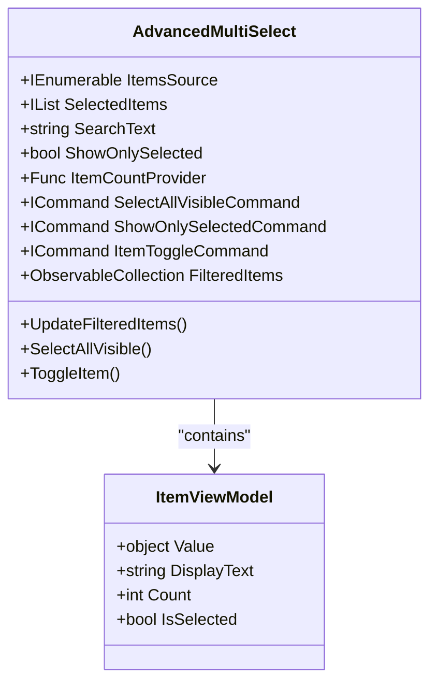
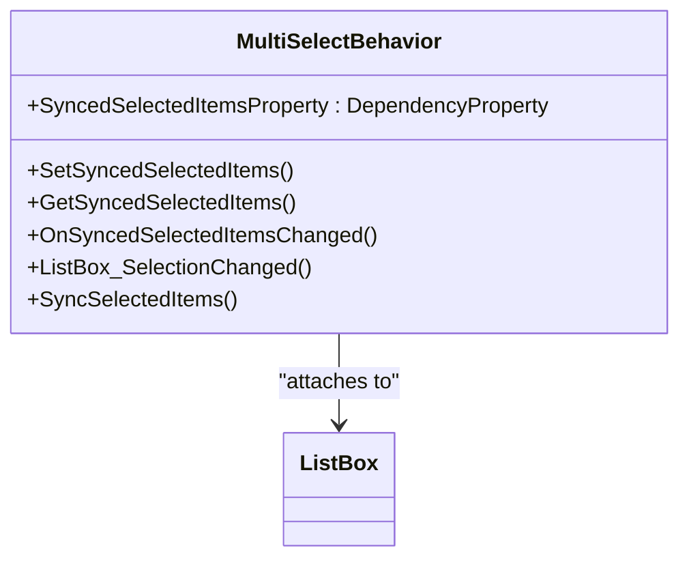
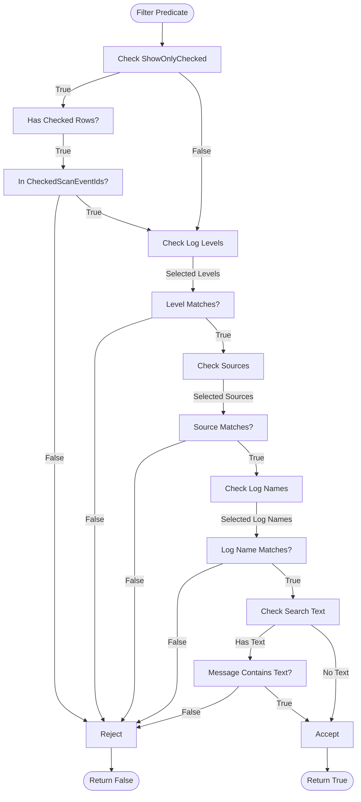
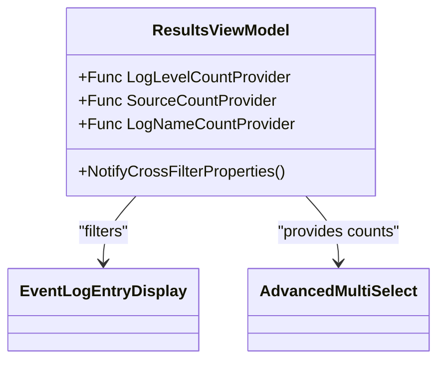
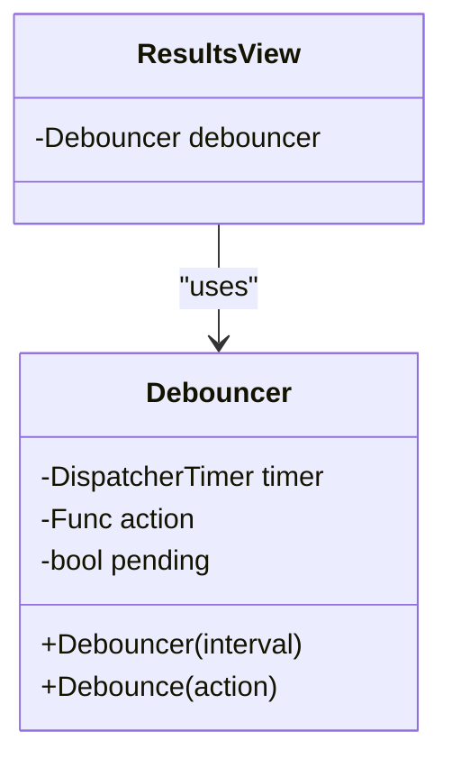
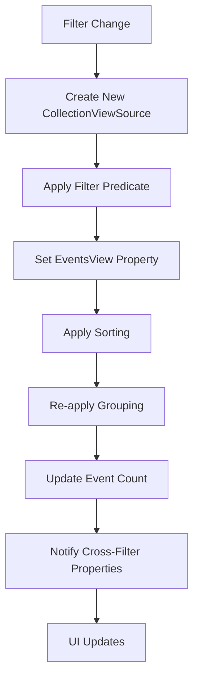
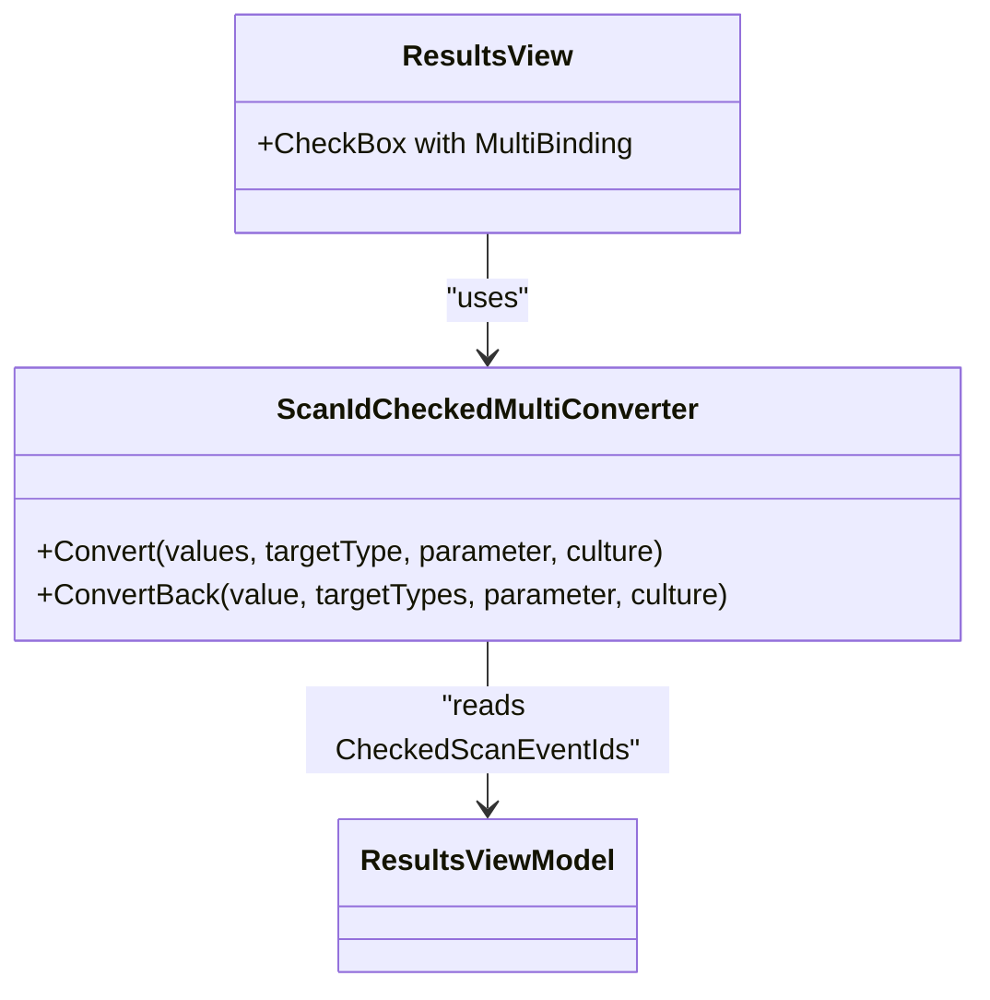
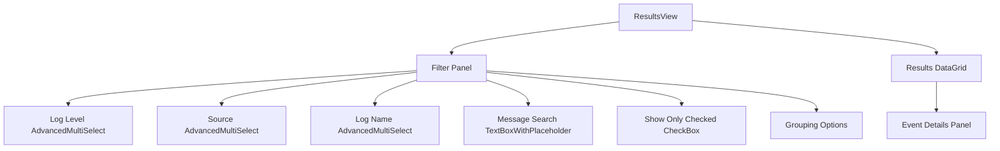

# Advanced Filtering

## Table of Contents
1. [Introduction](#introduction)
2. [Core Filtering Components](#core-filtering-components)
3. [Advanced Multi-Select Controls](#advanced-multi-select-controls)
4. [Filtering Logic and Performance](#filtering-logic-and-performance)
5. [Real-Time UI Updates and Debouncing](#real-time-ui-updates-and-debouncing)
6. [Data Binding and Converters](#data-binding-and-converters)
7. [User Workflows and Keyboard Shortcuts](#user-workflows-and-keyboard-shortcuts)
8. [Best Practices and Common Issues](#best-practices-and-common-issues)

## Introduction
The Advanced Filtering system in Project Janus enables users to efficiently navigate large volumes of event log data through multiple filtering dimensions. This document details the implementation of filtering by log level, source, log name, and full-text search, with real-time UI updates and performance optimizations. The system leverages WPF's data binding, collection views, and custom controls to provide an interactive experience while maintaining responsiveness even with large datasets.

## Core Filtering Components

The filtering system is built around several key components that work together to provide a seamless user experience. The `ResultsViewModel` serves as the central orchestrator, managing filter states and applying them to the event collection. Filterable properties include log level, source, log name, and message content, each with dedicated UI controls.

The `EventLogEntry` class represents the core data model being filtered, containing essential properties such as `Level`, `Source`, `LogName`, and `Message`. The `ResultsViewModel` wraps these entries in `EventLogEntryDisplay` objects that provide additional functionality like message highlighting for search terms.

**Section sources**
- [EventLogEntry.cs](file://d:/devel/Project Janus/Janus.Core/EventLogEntry.cs#L1-L18)
- [ResultsViewModel.cs](file://d:/devel/Project Janus/Janus.App/ViewModels/ResultsViewModel.cs#L0-L40)

## Advanced Multi-Select Controls

### AdvancedMultiSelect Implementation
The `AdvancedMultiSelect` control provides a reusable component for multi-selection filtering with search capabilities. It supports filtering of items, selection management, and visual feedback through item counts.

**Diagram sources**
- [AdvancedMultiSelect.xaml.cs](file://d:/devel/Project Janus/Janus.App/Controls/AdvancedMultiSelect.xaml.cs#L0-L176)

**Section sources**
- [AdvancedMultiSelect.xaml.cs](file://d:/devel/Project Janus/Janus.App/Controls/AdvancedMultiSelect.xaml.cs#L0-L176)

### MultiSelectBehavior for Synchronization
The `MultiSelectBehavior` class provides an attached property that synchronizes the selected items of a `ListBox` with an external `IList`. This enables two-way binding between UI selection and view model state.

**Diagram sources**
- [MultiSelectBehavior.cs](file://d:/devel/Project Janus/Janus.App/Helpers/MultiSelectBehavior.cs#L0-L54)

**Section sources**
- [MultiSelectBehavior.cs](file://d:/devel/Project Janus/Janus.App/Helpers/MultiSelectBehavior.cs#L0-L54)

## Filtering Logic and Performance

### LINQ-Based Filtering in ResultsViewModel
The `ResultsViewModel` implements filtering logic using LINQ predicates applied through a `CollectionViewSource`. The `FilterPredicate` method evaluates each event against the current filter criteria.

**Diagram sources**
- [ResultsViewModel.cs](file://d:/devel/Project Janus/Janus.App/ViewModels/ResultsViewModel.cs#L300-L340)

**Section sources**
- [ResultsViewModel.cs](file://d:/devel/Project Janus/Janus.App/ViewModels/ResultsViewModel.cs#L265-L340)

### Cross-Filtering and Dynamic Counts
The system implements cross-filtering where the count of available options in one filter reflects the current state of other filters. This is achieved through count provider functions that calculate how many events would match if a particular option were selected.

**Diagram sources**
- [ResultsViewModel.cs](file://d:/devel/Project Janus/Janus.App/ViewModels/ResultsViewModel.cs#L125-L155)

## Real-Time UI Updates and Debouncing

### Debouncer Implementation
The `Debouncer` class prevents excessive filtering operations during rapid text input by delaying execution of the filter action until a specified interval has passed without new input.

**Diagram sources**
- [Debouncer.cs](file://d:/devel/Project Janus/Janus.App/Services/Debouncer.cs#L0-L33)
- [ResultsView.xaml.cs](file://d:/devel/Project Janus/Janus.App/Views/ResultsView.xaml.cs#L7-L9)

**Section sources**
- [Debouncer.cs](file://d:/devel/Project Janus/Janus.App/Services/Debouncer.cs#L0-L33)
- [ResultsView.xaml.cs](file://d:/devel/Project Janus/Janus.App/Views/ResultsView.xaml.cs#L7-L9)

### RebuildView Optimization Strategy
Instead of modifying the existing `ICollectionView`, the system creates a new `CollectionViewSource` instance when filters change. This approach ensures complete refresh of the view and prevents potential state corruption.

**Diagram sources**
- [ResultsViewModel.cs](file://d:/devel/Project Janus/Janus.App/ViewModels/ResultsViewModel.cs#L265-L298)

## Data Binding and Converters

### ScanIdCheckedMultiConverter
This converter enables two-way binding between the checked state of a checkbox and the `CheckedScanEventIds` collection in the view model, using multi-binding to pass both the collection and the item's ID.

**Diagram sources**
- [ScanIdCheckedMultiConverter.cs](file://d:/devel/Project Janus/Janus.App/Helpers/ScanIdCheckedMultiConverter.cs#L0-L23)
- [ResultsView.xaml](file://d:/devel/Project Janus/Janus.App/Views/ResultsView.xaml#L200-L220)

**Section sources**
- [ScanIdCheckedMultiConverter.cs](file://d:/devel/Project Janus/Janus.App/Helpers/ScanIdCheckedMultiConverter.cs#L0-L23)

## User Workflows and Keyboard Shortcuts

### UI Layout and Control Integration
The filtering controls are integrated into the right panel of the `ResultsView`, providing a consistent and accessible interface. The layout includes dedicated sections for each filter type with appropriate visual separators.

**Diagram sources**
- [ResultsView.xaml](file://d:/devel/Project Janus/Janus.App/Views/ResultsView.xaml#L0-L398)

**Section sources**
- [ResultsView.xaml](file://d:/devel/Project Janus/Janus.App/Views/ResultsView.xaml#L0-L398)

### Keyboard Navigation
The application supports several keyboard shortcuts for efficient navigation and interaction:

- **Space**: Toggle checked state of selected row
- **Ctrl+C**: Copy message of selected event to clipboard
- **Enter**: Copy message of selected event to clipboard
- **Tab**: Navigate between UI elements
- **Arrow keys**: Navigate within the data grid

These shortcuts are implemented in the `ResultsView` code-behind, which handles key events and delegates actions to the view model.

**Section sources**
- [ResultsView.xaml.cs](file://d:/devel/Project Janus/Janus.App/Views/ResultsView.xaml.cs#L38-L55)

## Best Practices and Common Issues

### Performance Implications on Large Datasets
The filtering system is designed to handle large datasets efficiently through several optimizations:

1. **Virtualization**: The `DataGrid` uses row and column virtualization to render only visible items
2. **Debouncing**: Text input is debounced to prevent excessive filtering during rapid typing
3. **CollectionViewSource**: Uses WPF's built-in filtering rather than LINQ operations on the source collection
4. **New View Creation**: Creating a new `ICollectionView` instead of modifying the existing one prevents memory leaks and state issues

### Common Issues and Solutions

**Case Sensitivity**: All string comparisons use `StringComparison.OrdinalIgnoreCase` to ensure case-insensitive matching, making filters more user-friendly.

**Partial Matching**: The search functionality supports partial matching through `IndexOf` with `StringComparison.OrdinalIgnoreCase`, allowing users to find events even with incomplete search terms.

**Filter Reset Behavior**: When a filter is cleared, the system automatically refreshes all related controls and updates cross-filter counts to reflect the new state.

**Performance with Grouping**: Grouping is explicitly marked as potentially slow in the UI, with a warning message to users. The implementation clears and re-applies grouping descriptions only when necessary.

**Section sources**
- [ResultsViewModel.cs](file://d:/devel/Project Janus/Janus.App/ViewModels/ResultsViewModel.cs#L300-L340)
- [AdvancedMultiSelect.xaml.cs](file://d:/devel/Project Janus/Janus.App/Controls/AdvancedMultiSelect.xaml.cs#L100-L120)
- [ResultsView.xaml](file://d:/devel/Project Janus/Janus.App/Views/ResultsView.xaml#L350-L360)

**Referenced Files in This Document**   
- [AdvancedMultiSelect.xaml.cs](file://d:/devel/Project Janus/Janus.App/Controls/AdvancedMultiSelect.xaml.cs)
- [MultiSelectBehavior.cs](file://d:/devel/Project Janus/Janus.App/Helpers/MultiSelectBehavior.cs)
- [Debouncer.cs](file://d:/devel/Project Janus/Janus.App/Services/Debouncer.cs)
- [ResultsViewModel.cs](file://d:/devel/Project Janus/Janus.App/ViewModels/ResultsViewModel.cs)
- [ScanIdCheckedMultiConverter.cs](file://d:/devel/Project Janus/Janus.App/Helpers/ScanIdCheckedMultiConverter.cs)
- [ResultsView.xaml](file://d:/devel/Project Janus/Janus.App/Views/ResultsView.xaml)
- [ResultsView.xaml.cs](file://d:/devel/Project Janus/Janus.App/Views/ResultsView.xaml.cs)
- [EventLogEntry.cs](file://d:/devel/Project Janus/Janus.Core/EventLogEntry.cs)