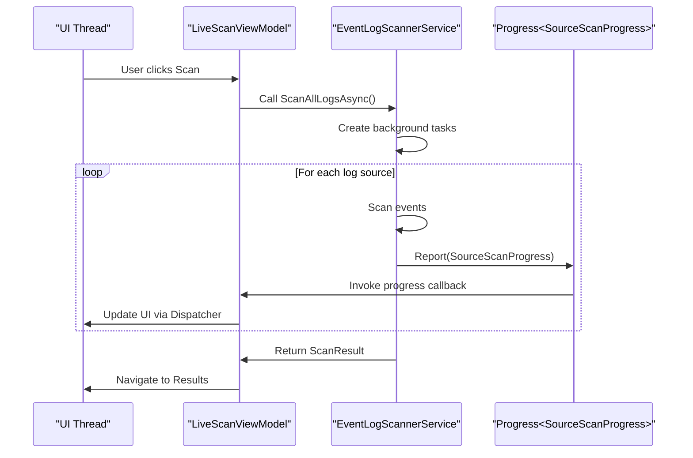
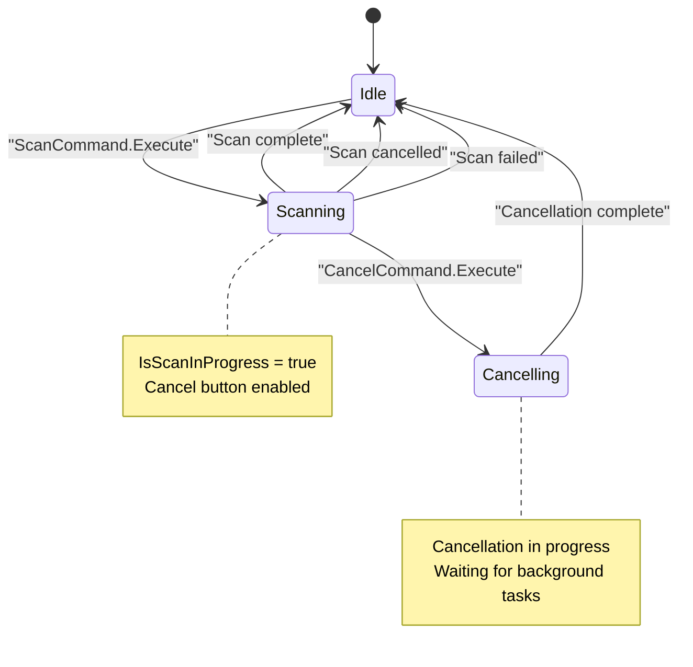

# Real-time Progress and Cancellation


## Table of Contents
1. [Introduction](#introduction)
2. [Core Components Overview](#core-components-overview)
3. [Progress Tracking with SourceScanProgress](#progress-tracking-with-sourcescanprogress)
4. [Asynchronous Scanning and Progress Reporting](#asynchronous-scanning-and-progress-reporting)
5. [UI Integration and Thread Safety](#ui-integration-and-thread-safety)
6. [Cancellation Mechanism](#cancellation-mechanism)
7. [User Experience and Progress Accuracy](#user-experience-and-progress-accuracy)
8. [Troubleshooting Common Issues](#troubleshooting-common-issues)

## Introduction
This document details the real-time progress tracking and cancellation functionality in the Project Janus application. It explains how scanning operations are performed asynchronously, how progress is reported per log source, and how users can cancel long-running scans. The system uses modern async/await patterns, progress reporting via `IProgress<T>`, and MVVM-compliant command binding to ensure a responsive UI.

**Section sources**
- [SourceScanProgress.cs](file://Janus.App/ViewModels/SourceScanProgress.cs)
- [EventLogScannerService.cs](file://Janus.App/Services/EventLogScannerService.cs)
- [LiveScanViewModel.cs](file://Janus.App/ViewModels/LiveScanViewModel.cs)

## Core Components Overview
The real-time progress and cancellation system is built around several key components:
- **SourceScanProgress**: Tracks scanning status for individual log sources
- **EventLogScannerService**: Performs asynchronous scanning with progress reporting
- **LiveScanViewModel**: Manages UI state and user commands
- **RelayCommand**: Enables command binding in MVVM pattern

These components work together to provide a responsive, cancellable scanning experience.


```mermaid
classDiagram
class SourceScanProgress {
+string SourceName
+int EventsRetrieved
+ScanStatus Status
+bool IsTotalKnown
+int? TotalEvents
+bool IsActive
+string? ExceptionMessage
+event PropertyChanged
+OnPropertyChanged(string)
}
class EventLogScannerService {
+static Task<ScanResult> ScanAllLogsAsync(DateTime, TimeSpan, TimeSpan, IProgress<SourceScanProgress>, CancellationToken)
+static IReadOnlyList<string> GetAllLogNames()
}
class LiveScanViewModel {
+bool IsScanInProgress
+ICommand ScanCommand
+ICommand CancelCommand
+ObservableCollection<SourceScanProgress> ScannedSources
+event PropertyChanged
}
class RelayCommand {
+bool CanExecute(object)
+void Execute(object)
+event CanExecuteChanged
+static void RaiseCanExecuteChanged()
}
SourceScanProgress --> INotifyPropertyChanged : implements
LiveScanViewModel --> INotifyPropertyChanged : implements
LiveScanViewModel --> RelayCommand : uses
EventLogScannerService --> IProgress<SourceScanProgress> : accepts
EventLogScannerService --> CancellationToken : accepts
LiveScanViewModel --> EventLogScannerService : calls
```


**Diagram sources**
- [SourceScanProgress.cs](file://Janus.App/ViewModels/SourceScanProgress.cs#L1-L25)
- [EventLogScannerService.cs](file://Janus.App/Services/EventLogScannerService.cs#L1-L160)
- [LiveScanViewModel.cs](file://Janus.App/ViewModels/LiveScanViewModel.cs#L1-L260)
- [RelayCommand.cs](file://Janus.App/Helpers/RelayCommand.cs#L1-L42)

## Progress Tracking with SourceScanProgress
The `SourceScanProgress` class is responsible for tracking the scanning status of individual event log sources. It implements `INotifyPropertyChanged` to enable data binding in the UI.

### Key Properties
- **SourceName**: Name of the event log being scanned
- **EventsRetrieved**: Number of events successfully retrieved
- **Status**: Current scan status (Success, Partial, Failed)
- **IsTotalKnown**: Indicates if total event count is known
- **TotalEvents**: Total number of events expected (if known)
- **IsActive**: Indicates whether scanning is currently in progress
- **ExceptionMessage**: Error message if scan failed


```csharp
public class SourceScanProgress : INotifyPropertyChanged {
  public string SourceName { get; set; } = string.Empty;
  public int EventsRetrieved { get; set; }
  public ScanStatus Status { get; set; } = ScanStatus.Success;
  public bool IsTotalKnown { get; set; }
  public int? TotalEvents { get; set; }
  public bool IsActive { get; set; }
  public string? ExceptionMessage { get; set; }

  public event PropertyChangedEventHandler? PropertyChanged;

  public void OnPropertyChanged(string propertyName)
      => PropertyChanged?.Invoke(this, new PropertyChangedEventArgs(propertyName));
}
```


The class raises property change notifications whenever a property value changes, allowing the UI to update automatically.

**Section sources**
- [SourceScanProgress.cs](file://Janus.App/ViewModels/SourceScanProgress.cs#L1-L25)

## Asynchronous Scanning and Progress Reporting
The `EventLogScannerService` performs scanning operations asynchronously using `async/await` patterns to avoid blocking the UI thread.

### Key Implementation Details
- Uses `Task.Run()` to execute scanning on background threads
- Accepts `IProgress<SourceScanProgress>` for progress reporting
- Accepts `CancellationToken` for cancellation support
- Processes multiple log sources in parallel


```csharp
public static async Task<ScanResult> ScanAllLogsAsync(
    DateTime timestamp,
    TimeSpan before,
    TimeSpan after,
    IProgress<Janus.App.SourceScanProgress>? perSourceProgress,
    CancellationToken cancellationToken,
    TimeSpan? progressUpdateInterval = null,
    int progressUpdateEventCount = 250) {
    
    // Create tasks for each log source
    foreach (string? logName in logNames) {
      tasks.Add(Task.Run(() => {
        // Scanning logic here
        // Report progress periodically
        perSourceProgress?.Report(new Janus.App.SourceScanProgress {
          SourceName = logName,
          EventsRetrieved = sourceEventCount,
          Status = status,
          IsActive = true
        });
      }, cancellationToken));
    }
    
    await Task.WhenAll(tasks);
    return new ScanResult { Entries = entries, ScannedSources = scannedSources };
}
```


### Progress Throttling
To prevent overwhelming the UI with updates, progress reporting is throttled:
- **Time-based**: Updates at most every 250ms (configurable)
- **Event-based**: Updates after every 250 events (configurable)

This ensures smooth UI performance while maintaining responsive feedback.





**Diagram sources**
- [EventLogScannerService.cs](file://Janus.App/Services/EventLogScannerService.cs#L30-L160)
- [LiveScanViewModel.cs](file://Janus.App/ViewModels/LiveScanViewModel.cs#L100-L200)

**Section sources**
- [EventLogScannerService.cs](file://Janus.App/Services/EventLogScannerService.cs#L30-L160)

## UI Integration and Thread Safety
The `LiveScanViewModel` bridges the gap between the background scanning service and the UI, ensuring thread-safe updates.

### Progress Handling
The view model creates a `Progress<SourceScanProgress>` instance that marshals updates to the UI thread:


```csharp
var progress = new Progress<SourceScanProgress>(progressUpdate => {
  void update() {
    // Update UI-bound properties
    SourceScanProgress? existing = ScannedSources.FirstOrDefault(s => s.SourceName == progressUpdate.SourceName);
    if (existing == null) {
      ScannedSources.Insert(0, progressUpdate);
      TotalSources++;
    } else {
      // Update existing progress
      existing.EventsRetrieved = progressUpdate.EventsRetrieved;
      // ... other property updates
      existing.OnPropertyChanged(nameof(existing.EventsRetrieved));
    }
    // Update summary statistics
    ScanStatus = $"Sources: {TotalSources}/Success: {SourcesCompletedSuccess}/Errors: {SourcesCompletedError} | Events: {TotalEvents}";
  }
  
  // Ensure UI thread execution
  if (dispatcher != null && !dispatcher.CheckAccess()) {
    dispatcher.Invoke(update);
  } else {
    update();
  }
});
```


### Key UI Properties
- **ScannedSources**: ObservableCollection that binds to UI list
- **TotalSources**: Total number of sources being scanned
- **SourcesCompletedSuccess**: Number of successfully completed sources
- **SourcesInProgress**: Number of sources currently being scanned
- **TotalEvents**: Cumulative count of events retrieved
- **ScanStatus**: Human-readable status message

**Section sources**
- [LiveScanViewModel.cs](file://Janus.App/ViewModels/LiveScanViewModel.cs#L50-L150)

## Cancellation Mechanism
The system provides robust cancellation support through the `CancellationToken` pattern.

### Implementation
1. **LiveScanViewModel** creates a `CancellationTokenSource` when scanning starts
2. The token is passed to `EventLogScannerService`
3. **CancelCommand** calls `Cancel()` on the token source
4. Background tasks periodically check for cancellation


```csharp
// In LiveScanViewModel
private CancellationTokenSource? cts;

private async Task ScanAsync() {
  cts = new CancellationTokenSource();
  // ... other setup
  try {
    ScanResult scanResult = await EventLogScannerService.ScanAllLogsAsync(
      scanTimestamp, before, after, progress, cts.Token);
  } catch (OperationCanceledException) {
    ScanStatus = "Scan cancelled";
  } finally {
    cts = null;
    IsScanInProgress = false;
  }
}

private void CancelScan() => cts?.Cancel();

// In EventLogScannerService
cancellationToken.ThrowIfCancellationRequested();
```


### Command Binding
The `CancelCommand` uses `RelayCommand` with a can-execute predicate:


```csharp
public ICommand CancelCommand { get; }

// Initialized in constructor
CancelCommand = new RelayCommand(_ => CancelScan(), _ => cts is not null);
```


This automatically enables/disables the cancel button based on scanning state.





**Diagram sources**
- [LiveScanViewModel.cs](file://Janus.App/ViewModels/LiveScanViewModel.cs#L100-L200)
- [RelayCommand.cs](file://Janus.App/Helpers/RelayCommand.cs#L1-L42)

**Section sources**
- [LiveScanViewModel.cs](file://Janus.App/ViewModels/LiveScanViewModel.cs#L100-L200)
- [RelayCommand.cs](file://Janus.App/Helpers/RelayCommand.cs#L1-L42)

## User Experience and Progress Accuracy
The system provides a responsive user experience with accurate progress feedback.

### Progress Display
- **Per-source progress**: Each log source shows individual progress
- **Aggregate statistics**: Summary of sources and events processed
- **Status messaging**: Clear indication of current state
- **Visual ordering**: Most recently active sources appear at top

### Accuracy Considerations
- **Event counts**: Accurate and cumulative
- **Source completion**: Precise tracking of success/failure
- **Timing**: Real-time updates with throttling for performance
- **Error reporting**: Detailed exception messages for failed sources

### Limitations
- **Total event count**: Not known in advance (IsTotalKnown is always false)
- **Progress percentage**: Cannot show percentage complete due to unknown totals
- **Timing estimates**: No ETA available due to variable scan speeds

The UI displays progress as:

```
Sources: 15/Success: 12/Errors: 1/In Progress: 2 | Events: 2,347
```


This provides comprehensive information without misleading precision.

**Section sources**
- [LiveScanViewModel.cs](file://Janus.App/ViewModels/LiveScanViewModel.cs#L150-L200)
- [SourceScanProgress.cs](file://Janus.App/ViewModels/SourceScanProgress.cs#L1-L25)

## Troubleshooting Common Issues

### Unresponsive Cancellation
**Symptoms**: Cancel button pressed but scan continues

**Causes and Solutions**:
1. **Infrequent cancellation checks**: The scanner only checks for cancellation between events
   - *Solution*: Ensure `cancellationToken.ThrowIfCancellationRequested()` is called frequently
2. **Long-running event processing**: Individual event processing may take time
   - *Solution*: Optimize event processing logic
3. **Thread synchronization issues**: Rare race conditions
   - *Solution*: Verify proper disposal of CancellationTokenSource

### Inaccurate Progress Display
**Symptoms**: UI shows incorrect event counts or source status

**Causes and Solutions**:
1. **Threading issues**: Updates from background threads not properly marshaled
   - *Solution*: Ensure all UI updates use Dispatcher.Invoke
2. **Race conditions in counters**: Concurrent access to shared counters
   - *Solution*: Use Interlocked.Increment for thread-safe counting
3. **Missing property notifications**: INotifyPropertyChanged not raised
   - *Solution*: Verify OnPropertyChanged is called for all changed properties

### Performance Issues
**Symptoms**: UI becomes sluggish during scanning

**Causes and Solutions**:
1. **Too frequent progress updates**: Default 250ms/250 events may be too aggressive
   - *Solution*: Increase progressUpdateInterval or progressUpdateEventCount
2. **Large number of sources**: Many log sources create many UI updates
   - *Solution*: Consider batching updates or virtualizing the UI list
3. **Dispatcher overload**: Too many Invoke calls
   - *Solution*: Batch multiple updates into single Invoke call

### Debugging Tips
1. **Enable detailed logging**: Add logging to progress callbacks
2. **Monitor cancellation token state**: Check `cancellationToken.IsCancellationRequested`
3. **Verify thread affinity**: Ensure UI updates occur on UI thread
4. **Test with large datasets**: Validate behavior with many log sources

**Section sources**
- [EventLogScannerService.cs](file://Janus.App/Services/EventLogScannerService.cs#L30-L160)
- [LiveScanViewModel.cs](file://Janus.App/ViewModels/LiveScanViewModel.cs#L100-L200)
- [SourceScanProgress.cs](file://Janus.App/ViewModels/SourceScanProgress.cs#L1-L25)

**Referenced Files in This Document**   
- [SourceScanProgress.cs](file://Janus.App/ViewModels/SourceScanProgress.cs)
- [EventLogScannerService.cs](file://Janus.App/Services/EventLogScannerService.cs)
- [LiveScanViewModel.cs](file://Janus.App/ViewModels/LiveScanViewModel.cs)
- [RelayCommand.cs](file://Janus.App/Helpers/RelayCommand.cs)
- [ScanResult.cs](file://Janus.App/Services/ScanResult.cs)
- [ScannedSource.cs](file://Janus.Core/ScannedSource.cs)