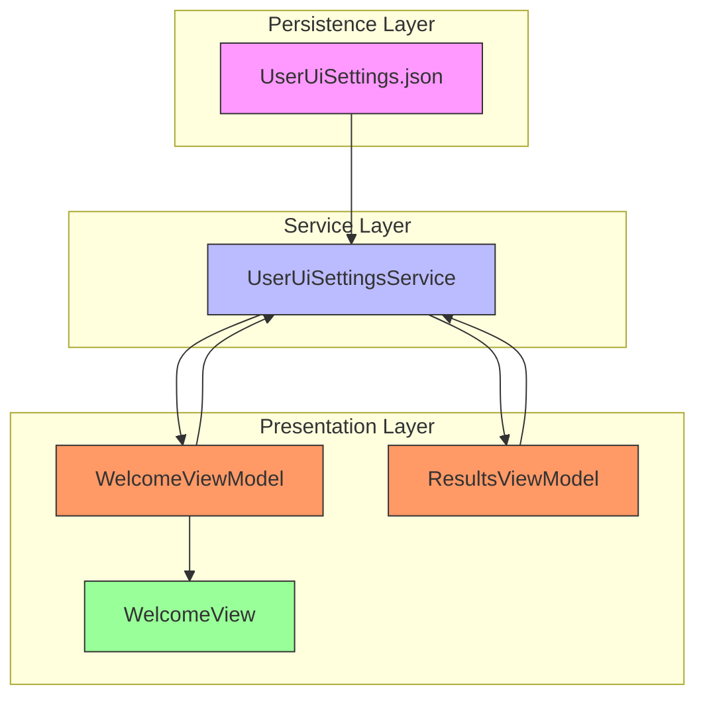
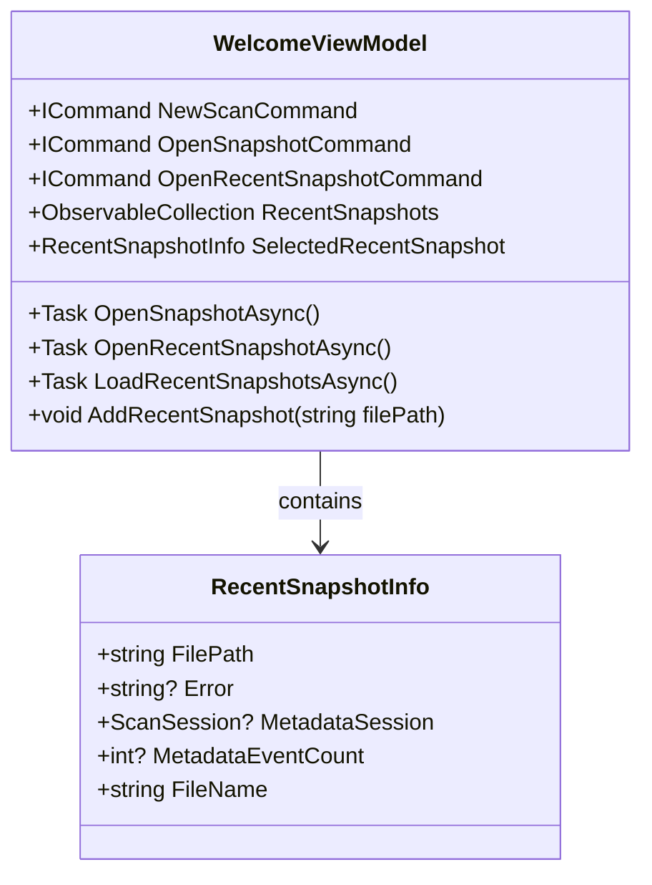
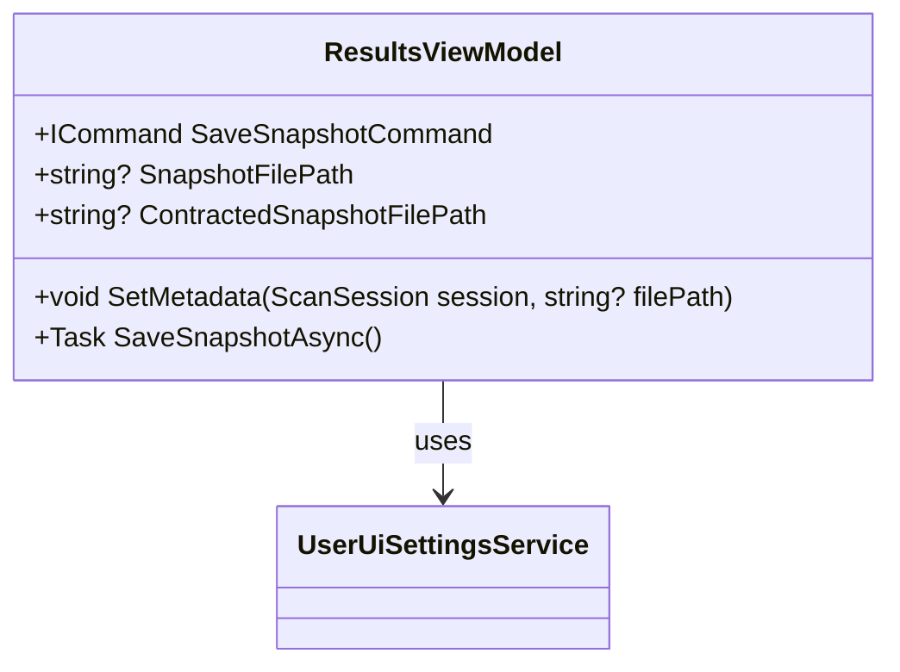
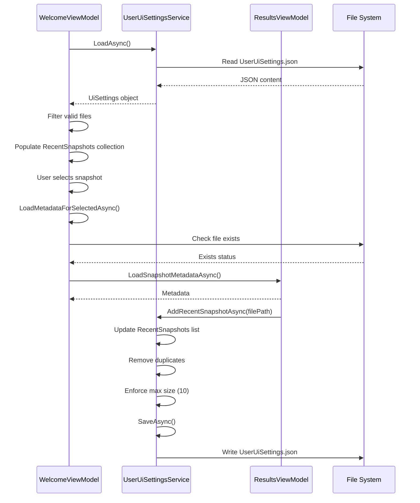

# Recent Snapshots Management


## Table of Contents
1. [Introduction](#introduction)
2. [Core Components](#core-components)
3. [Architecture Overview](#architecture-overview)
4. [Detailed Component Analysis](#detailed-component-analysis)
5. [Data Flow and Integration](#data-flow-and-integration)
6. [UI Behavior and User Interaction](#ui-behavior-and-user-interaction)
7. [Edge Cases and Error Handling](#edge-cases-and-error-handling)
8. [Best Practices and Recommendations](#best-practices-and-recommendations)

## Introduction
The Recent Snapshots Management system in Project Janus enables users to quickly access previously opened snapshot files through a Most Recently Used (MRU) list. This functionality enhances user experience by reducing navigation time and providing immediate access to recent analysis sessions. The system persists snapshot paths across application restarts using a JSON configuration file and integrates seamlessly with the application's view model architecture. This document details the implementation, behavior, and integration points of this feature.

## Core Components
The recent snapshots functionality is implemented through three primary components:
- **UserUiSettingsService**: Manages persistence of UI settings including recent snapshot paths
- **WelcomeViewModel**: Displays the list of recent snapshots on the welcome screen
- **ResultsViewModel**: Updates the recent snapshots list when a snapshot is loaded

These components work together to provide a cohesive user experience for managing recent snapshot history.

**Section sources**
- [UserUiSettingsService.cs](file://Janus.App/Services/UserUiSettingsService.cs#L1-L65)
- [WelcomeViewModel.cs](file://Janus.App/ViewModels/WelcomeViewModel.cs#L1-L143)
- [ResultsViewModel.cs](file://Janus.App/ViewModels/ResultsViewModel.cs#L1-L565)

## Architecture Overview





**Diagram sources**
- [UserUiSettingsService.cs](file://Janus.App/Services/UserUiSettingsService.cs#L1-L65)
- [WelcomeViewModel.cs](file://Janus.App/ViewModels/WelcomeViewModel.cs#L1-L143)
- [ResultsViewModel.cs](file://Janus.App/ViewModels/ResultsViewModel.cs#L1-L565)

## Detailed Component Analysis

### UserUiSettingsService Analysis

The UserUiSettingsService class is responsible for persisting and retrieving application UI settings, including the list of recent snapshots. It uses a JSON file for storage and provides thread-safe access through a SemaphoreSlim.


```mermaid
classDiagram
class UserUiSettingsService {
+static string SettingsFileName
+static string SettingsFilePath
+static SemaphoreSlim fileLock
+static UserUiSettingsService Instance
+static Task<UiSettings> LoadAsync()
+static Task SaveAsync(UiSettings settings)
+static Task AddRecentSnapshotAsync(string filePath)
}
class UserUiSettingsService$UiSettings {
+int MinutesBefore
+int MinutesAfter
+double MainWindowWidth
+double MainWindowHeight
+double ResultsSplitterPosition
+double DetailsSplitterPosition
+List<string> RecentSnapshots
}
UserUiSettingsService --> UserUiSettingsService$UiSettings : contains
```


**Diagram sources**
- [UserUiSettingsService.cs](file://Janus.App/Services/UserUiSettingsService.cs#L1-L65)

#### JSON Serialization and File Persistence
The service persists settings to a JSON file named `UserUiSettings.json` located in the application's base directory. The file path is constructed using `AppContext.BaseDirectory`, ensuring it's accessible regardless of the execution context.


```csharp
private const string SettingsFileName = "UserUiSettings.json";
private static readonly string SettingsFilePath = Path.Combine(AppContext.BaseDirectory, SettingsFileName);
```


The `LoadAsync` method reads the JSON file and deserializes it into a `UiSettings` object. If the file doesn't exist or deserialization fails, it returns a new `UiSettings` instance with default values:


```csharp
public static async Task<UiSettings> LoadAsync() {
    await fileLock.WaitAsync();
    try {
        if (File.Exists(SettingsFilePath)) {
            try {
                string json = await File.ReadAllTextAsync(SettingsFilePath);
                UiSettings? settings = JsonSerializer.Deserialize<UiSettings>(json);
                return settings ?? new UiSettings();
            } catch {
                return new UiSettings();
            }
        }
        return new UiSettings();
    } finally {
        fileLock.Release();
    }
}
```


The `SaveAsync` method serializes the `UiSettings` object back to JSON and writes it to the file:


```csharp
public static async Task SaveAsync(UiSettings settings) {
    await fileLock.WaitAsync();
    try {
        string json = JsonSerializer.Serialize(settings);
        await File.WriteAllTextAsync(SettingsFilePath, json);
    } finally {
        fileLock.Release();
    }
}
```


#### Recent Snapshots Management
The `AddRecentSnapshotAsync` method manages the recent snapshots list by:
1. Loading existing settings
2. Removing any duplicate entry of the same file path
3. Inserting the new path at the beginning (most recent position)
4. Trimming the list to a maximum of 10 items
5. Saving the updated settings


```csharp
public static async Task AddRecentSnapshotAsync(string filePath) {
    UiSettings settings = await LoadAsync();
    settings.RecentSnapshots.Remove(filePath);
    settings.RecentSnapshots.Insert(0, filePath);
    while (settings.RecentSnapshots.Count > 10) {
        settings.RecentSnapshots.RemoveAt(settings.RecentSnapshots.Count - 1);
    }
    await SaveAsync(settings);
}
```


**Section sources**
- [UserUiSettingsService.cs](file://Janus.App/Services/UserUiSettingsService.cs#L1-L65)

### WelcomeViewModel Analysis

The WelcomeViewModel manages the display of recent snapshots on the application's welcome screen. It uses the `RecentSnapshotInfo` class to represent each recent snapshot with additional metadata.





**Diagram sources**
- [WelcomeViewModel.cs](file://Janus.App/ViewModels/WelcomeViewModel.cs#L1-L143)

#### Recent Snapshots Loading and Display
The `LoadRecentSnapshotsAsync` method loads recent snapshot paths from the settings service and validates their existence before adding them to the UI collection:


```csharp
private async Task LoadRecentSnapshotsAsync() {
    UserUiSettingsService.UiSettings settings = await UserUiSettingsService.LoadAsync();
    RecentSnapshots.Clear();
    foreach (string? path in settings.RecentSnapshots.Distinct().Take(10)) {
        if (!File.Exists(path)) {
            continue;
        }
        RecentSnapshots.Add(new RecentSnapshotInfo { FilePath = path });
    }
    if (RecentSnapshots.Count > 0) {
        SelectedRecentSnapshot = RecentSnapshots[0];
    } else {
        SelectedRecentSnapshot = null;
    }
}
```


The method performs several important functions:
- Loads settings from UserUiSettingsService
- Clears the existing collection
- Filters out non-existent files
- Limits to 10 items (though the service already limits to 10)
- Sets the first item as selected by default

#### Metadata Loading
When a recent snapshot is selected, the `LoadMetadataForSelectedAsync` method attempts to load metadata from the snapshot file:


```csharp
private async void LoadMetadataForSelectedAsync() {
    if (SelectedRecentSnapshot == null) {
        return;
    }

    if (!File.Exists(SelectedRecentSnapshot.FilePath)) {
        SelectedRecentSnapshot.Error = "File not found.";
        SelectedRecentSnapshot.MetadataSession = null;
        SelectedRecentSnapshot.MetadataEventCount = null;
        SelectedRecentSnapshot.OnPropertyChanged(nameof(RecentSnapshotInfo.Error));
        SelectedRecentSnapshot.OnPropertyChanged(nameof(RecentSnapshotInfo.MetadataSession));
        SelectedRecentSnapshot.OnPropertyChanged(nameof(RecentSnapshotInfo.MetadataEventCount));
        return;
    }
    var service = new SnapshotService();
    try {
        (ScanSession?, int?) sessioninfo = await SnapshotService.LoadSnapshotMetadataAsync(SelectedRecentSnapshot.FilePath);
        SelectedRecentSnapshot.MetadataSession = sessioninfo.Item1;
        SelectedRecentSnapshot.MetadataEventCount = sessioninfo.Item2;
        SelectedRecentSnapshot.Error = null;
    } catch (Exception ex) {
        SelectedRecentSnapshot.MetadataSession = null;
        SelectedRecentSnapshot.MetadataEventCount = null;
        SelectedRecentSnapshot.Error = ex.Message;
    }
    SelectedRecentSnapshot.OnPropertyChanged(nameof(RecentSnapshotInfo.MetadataSession));
    SelectedRecentSnapshot.OnPropertyChanged(nameof(RecentSnapshotInfo.MetadataEventCount));
    SelectedRecentSnapshot.OnPropertyChanged(nameof(RecentSnapshotInfo.Error));
}
```


This method handles edge cases such as missing files and loading errors, updating the UI accordingly.

**Section sources**
- [WelcomeViewModel.cs](file://Janus.App/ViewModels/WelcomeViewModel.cs#L1-L143)

### ResultsViewModel Analysis

The ResultsViewModel updates the recent snapshots list when a snapshot is successfully loaded, ensuring the file appears in the MRU list.





**Diagram sources**
- [ResultsViewModel.cs](file://Janus.App/ViewModels/ResultsViewModel.cs#L1-L565)

#### Snapshot Loading Integration
When a snapshot is loaded and displayed in the ResultsView, the `OpenSnapshotFileAsync` method in WelcomeViewModel calls `AddRecentSnapshot` which updates the recent snapshots list:


```csharp
private async Task OpenSnapshotFileAsync(string filePath) {
    var service = new SnapshotService();
    try {
        ScanSession? session = await SnapshotService.LoadSnapshotAsync(filePath);
        if (session is not null) {
            AddRecentSnapshot(filePath);
            var resultsVm = new ResultsViewModel(setCurrentView, ResultsViewModel.PreviousView.Welcome);
            resultsVm.LoadEvents(session.Entries);
            resultsVm.SetMetadata(session, filePath);
            setCurrentView?.Invoke(new ResultsView { DataContext = resultsVm });
        } else {
            MessageBox.Show("No snapshot data found.", "Error", MessageBoxButton.OK, MessageBoxImage.Error);
        }
    } catch (Exception ex) {
        MessageBox.Show($"Failed to load snapshot: {ex.Message}", "Error", MessageBoxButton.OK, MessageBoxImage.Error);
    }
}
```


#### Saving New Snapshots
When a user saves a new snapshot, the `SaveSnapshotAsync` method adds the file path to the recent snapshots list:


```csharp
await UserUiSettingsService.AddRecentSnapshotAsync(filePath);
```


This ensures that newly created snapshots are immediately available in the recent files list.

**Section sources**
- [ResultsViewModel.cs](file://Janus.App/ViewModels/ResultsViewModel.cs#L1-L565)

## Data Flow and Integration





**Diagram sources**
- [UserUiSettingsService.cs](file://Janus.App/Services/UserUiSettingsService.cs#L1-L65)
- [WelcomeViewModel.cs](file://Janus.App/ViewModels/WelcomeViewModel.cs#L1-L143)
- [ResultsViewModel.cs](file://Janus.App/ViewModels/ResultsViewModel.cs#L1-L565)

## UI Behavior and User Interaction

### Welcome Screen Display
The recent snapshots are displayed in the WelcomeView using a ListBox bound to the RecentSnapshots collection:


```csharp
public partial class WelcomeView : UserControl {
    public WelcomeView() {
        InitializeComponent();
        this.Loaded += WelcomeView_Loaded;
        RecentSnapshotsListBox.KeyDown += RecentSnapshotsListBox_KeyDown;
    }
    
    private void RecentSnapshotsListBox_MouseDoubleClick(object sender, MouseButtonEventArgs e) {
        if (DataContext is WelcomeViewModel vm && sender is ListBox lb && lb.SelectedItem is RecentSnapshotInfo info) {
            if (vm.OpenRecentSnapshotCommand.CanExecute(info)) {
                vm.OpenRecentSnapshotCommand.Execute(info);
            }
        }
    }
    
    private void RecentSnapshotsListBox_KeyDown(object sender, KeyEventArgs e) {
        if (e.Key == Key.Enter && DataContext is WelcomeViewModel vm && RecentSnapshotsListBox.SelectedItem is RecentSnapshotInfo info) {
            if (vm.OpenRecentSnapshotCommand.CanExecute(info)) {
                vm.OpenRecentSnapshotCommand.Execute(info);
            }
            e.Handled = true;
        }
    }
}
```


Users can open a recent snapshot by:
- Double-clicking on an item
- Selecting an item and pressing Enter
- Clicking the "Open" button

### Path Display and Contraction
File paths are displayed in a contracted format using environment variables to improve readability:


```csharp
public static string GetContractedSnapshotPath(string? path)
    => string.IsNullOrEmpty(path) ? string.Empty : EnvVarContractor.ContractPath(path);
```


The `EnvVarContractor.ContractPath` method replaces known directory prefixes with environment variable references (e.g., `%USERPROFILE%`):


```csharp
public static string ContractPath(string path) {
    if (string.IsNullOrEmpty(path)) {
        return path;
    }

    string? bestVar = null;
    string? bestValue = null;
    int bestLen = 0;
    foreach (DictionaryEntry env in Environment.GetEnvironmentVariables()) {
        string var = env.Key.ToString()!;
        string value = env.Value.ToString()!;
        if (string.IsNullOrWhiteSpace(value)) {
            continue;
        }
        string normValue = Path.GetFullPath(value).TrimEnd(Path.DirectorySeparatorChar, Path.AltDirectorySeparatorChar) + Path.DirectorySeparatorChar;
        string normPath = Path.GetFullPath(path);
        if (normPath.StartsWith(normValue, StringComparison.OrdinalIgnoreCase) && normValue.Length > bestLen) {
            bestVar = var;
            bestValue = normValue;
            bestLen = normValue.Length;
        }
    }
    if (bestVar != null && bestValue != null) {
        string contracted = "%" + bestVar + "%" + path[(bestValue.Length - 1)..];
        return contracted;
    }
    return path;
}
```


This feature enhances cross-machine compatibility by making paths more portable and readable.

**Section sources**
- [WelcomeView.xaml.cs](file://Janus.App/Views/WelcomeView.xaml.cs#L1-L38)
- [ResultsView.xaml.cs](file://Janus.App/Views/ResultsView.xaml.cs#L1-L56)
- [EnvVarContractor.cs](file://Janus.App/Utils/EnvVarContractor.cs#L1-L37)

## Edge Cases and Error Handling

### Missing Snapshot Files
When a recent snapshot file no longer exists, the system handles this gracefully:
- The file is filtered out during the loading process in `LoadRecentSnapshotsAsync`
- If a user attempts to open a missing file, an error message is displayed
- The UI updates to show "File not found" for the selected item


```csharp
if (!File.Exists(path)) {
    continue;
}
```


### JSON File Corruption
The `LoadAsync` method includes error handling for corrupted or invalid JSON files:


```csharp
try {
    string json = await File.ReadAllTextAsync(SettingsFilePath);
    UiSettings? settings = JsonSerializer.Deserialize<UiSettings>(json);
    return settings ?? new UiSettings();
} catch {
    return new UiSettings();
}
```


If deserialization fails, the method returns a new `UiSettings` instance with default values, preventing application crashes due to configuration issues.

### Concurrent Access
The service uses a SemaphoreSlim to prevent race conditions when multiple threads access the settings file:


```csharp
private static readonly SemaphoreSlim fileLock = new(1, 1);
```


This ensures that read and write operations are atomic and thread-safe.

### Path Validation
The system performs basic path validation by checking file existence before adding items to the display list. However, it does not validate that the file is a valid snapshot file until the user attempts to open it.

**Section sources**
- [UserUiSettingsService.cs](file://Janus.App/Services/UserUiSettingsService.cs#L1-L65)
- [WelcomeViewModel.cs](file://Janus.App/ViewModels/WelcomeViewModel.cs#L1-L143)

## Best Practices and Recommendations

### Configuration Management
- The `UserUiSettings.json` file should be included in user-specific configuration directories rather than the application directory for better portability
- Consider implementing automatic backup of the settings file to prevent data loss
- Add versioning to the settings file to support future schema changes

### Privacy Considerations
- The recent snapshots list may contain sensitive file paths that could reveal user activity
- Consider adding an option to disable recent file tracking for privacy-conscious users
- Implement automatic clearing of the recent files list after a configurable period

### Performance Optimization
- The current implementation loads all settings on every operation; consider caching the settings in memory
- Implement lazy loading of metadata for recent snapshots to improve welcome screen load time
- Add debouncing to file system operations to prevent excessive disk I/O

### User Experience Improvements
- Increase the maximum recent snapshots from 10 to allow more history
- Add a "Clear Recent Files" option in the UI
- Implement keyboard navigation and search within the recent files list
- Add timestamps to recent files to show when they were last accessed

### Cross-Platform Compatibility
- The current path contraction using environment variables works well on Windows
- For cross-platform compatibility, consider using a more universal path shortening strategy
- Test path resolution on different operating systems to ensure consistent behavior

### Error Recovery
- Implement automatic repair of corrupted settings files by creating a backup before writing
- Add logging for settings-related errors to aid in troubleshooting
- Provide a reset option to restore default settings

**Referenced Files in This Document**   
- [UserUiSettingsService.cs](file://Janus.App/Services/UserUiSettingsService.cs)
- [WelcomeViewModel.cs](file://Janus.App/ViewModels/WelcomeViewModel.cs)
- [ResultsViewModel.cs](file://Janus.App/ViewModels/ResultsViewModel.cs)
- [WelcomeView.xaml.cs](file://Janus.App/Views/WelcomeView.xaml.cs)
- [ResultsView.xaml.cs](file://Janus.App/Views/ResultsView.xaml.cs)
- [EnvVarContractor.cs](file://Janus.App/Utils/EnvVarContractor.cs)