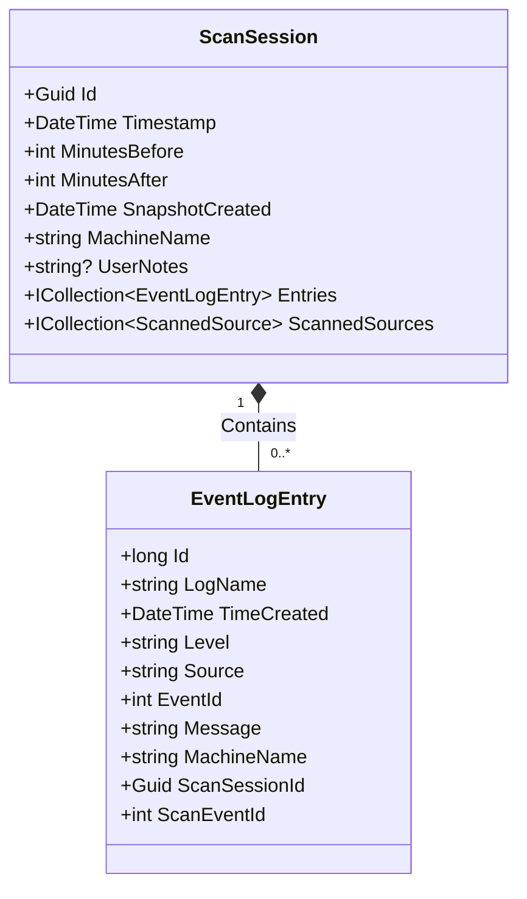
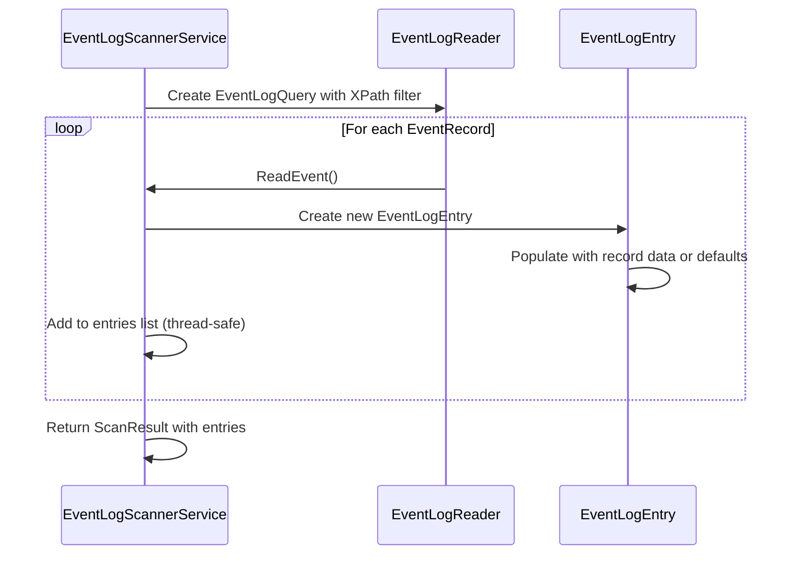

# EventLogEntry Model


## Table of Contents
1. [Introduction](#introduction)
2. [Data Model Definition](#data-model-definition)
3. [Property Details](#property-details)
4. [Relationship with ScanSession](#relationship-with-scansession)
5. [Persistence and Database Configuration](#persistence-and-database-configuration)
6. [Scanning and Data Validation](#scanning-and-data-validation)
7. [Query Performance and Indexing](#query-performance-and-indexing)
8. [Typical Event Data Examples](#typical-event-data-examples)
9. [Performance Considerations](#performance-considerations)

## Introduction
The **EventLogEntry** entity is a core data model in Project Janus, designed to capture and store individual entries from Windows Event Logs during diagnostic scans. It serves as a structured representation of system and application events, enabling unified analysis around a critical timestamp. This document provides a comprehensive overview of the EventLogEntry model, including its properties, relationships, persistence strategy, and operational context within the application.

**Section sources**
- [EventLogEntry.cs](file://Janus.Core/EventLogEntry.cs#L1-L18)

## Data Model Definition
The `EventLogEntry` class represents a single event log entry extracted from Windows Event Logs. It is defined as a C# record with required properties, ensuring data integrity and immutability for key fields. The model captures essential metadata about each event, including temporal, categorical, and descriptive information.


```csharp
public class EventLogEntry {
  public required long Id { get; init; }
  public required string LogName { get; init; }
  public required DateTime TimeCreated { get; init; }
  public required string Level { get; init; }
  public required string Source { get; init; }
  public required int EventId { get; init; }
  public required string Message { get; init; }
  public required string MachineName { get; init; }
  public required Guid ScanSessionId { get; init; }
  public int ScanEventId { get; set; }
}
```


**Section sources**
- [EventLogEntry.cs](file://Janus.Core/EventLogEntry.cs#L1-L18)

## Property Details
Each property in the `EventLogEntry` model is defined with specific data types, nullability constraints, and semantic meaning:

- **Id**: `long` - The unique record identifier from the Windows Event Log. Required and immutable.
- **LogName**: `string` - The name of the event log source (e.g., "System", "Application"). Required and immutable.
- **TimeCreated**: `DateTime` - The timestamp when the event was generated. Required and immutable.
- **Level**: `string` - The severity level of the event (e.g., "Error", "Warning", "Information"). Required and immutable.
- **Source**: `string` - The provider or component that generated the event (e.g., "Kernel-PnP", "MyApp.exe"). Required and immutable.
- **EventId**: `int` - The numeric identifier for the event type. Required and immutable.
- **Message**: `string` - The human-readable description of the event. Required and immutable.
- **MachineName**: `string` - The name of the machine where the event occurred. Required and immutable.
- **ScanSessionId**: `Guid` - Foreign key linking the entry to its parent `ScanSession`. Required and immutable.
- **ScanEventId**: `int` - A sequential, human-friendly identifier assigned during the scan for easy reference. Mutable.

All properties except `ScanEventId` are marked with `required` and use `init` accessors, enforcing that they must be set during object construction and cannot be modified afterward.

**Section sources**
- [EventLogEntry.cs](file://Janus.Core/EventLogEntry.cs#L1-L18)

## Relationship with ScanSession
The `EventLogEntry` entity has a one-to-many relationship with the `ScanSession` entity, where each scan session can contain multiple event log entries. This relationship is implemented through the `ScanSessionId` foreign key in `EventLogEntry` and the `Entries` collection in `ScanSession`.





**Diagram sources**
- [ScanSession.cs](file://Janus.Core/ScanSession.cs#L1-L35)
- [EventLogEntry.cs](file://Janus.Core/EventLogEntry.cs#L1-L18)

**Section sources**
- [ScanSession.cs](file://Janus.Core/ScanSession.cs#L1-L35)
- [EventLogEntry.cs](file://Janus.Core/EventLogEntry.cs#L1-L18)

## Persistence and Database Configuration
The `EventLogEntry` model is persisted using Entity Framework Core with a SQLite database. The `EventSnapshotDbContext` configures the database context and defines the entity sets for `EventLogEntry`, `ScanSession`, and `ScannedSource`.


```csharp
public class EventSnapshotDbContext(DbContextOptions<EventSnapshotDbContext> options) : DbContext(options) {
  public DbSet<EventLogEntry> EventLogEntries => Set<EventLogEntry>();
  public DbSet<ScanSession> ScanSessions => Set<ScanSession>();
  public DbSet<ScannedSource> ScannedSources => Set<ScannedSource>();

  protected override void OnModelCreating(ModelBuilder modelBuilder) {
    base.OnModelCreating(modelBuilder);

    modelBuilder.Entity<ScanSession>()
      .HasMany(s => s.ScannedSources)
      .WithOne()
      .OnDelete(DeleteBehavior.Cascade);

    modelBuilder.Entity<ScannedSource>()
      .Property(s => s.Status)
      .HasConversion<string>();
  }
}
```


The current configuration includes cascade deletion for `ScannedSource` entities but does not explicitly define the relationship between `ScanSession` and `EventLogEntry` in `OnModelCreating`. However, EF Core will infer the one-to-many relationship based on the navigation property and foreign key.

**Section sources**
- [EventSnapshotDbContext.cs](file://Janus.Core/EventSnapshotDbContext.cs#L1-L25)

## Scanning and Data Validation
During the scanning process, `EventLogEntry` objects are created and populated by the `EventLogScannerService`. The service uses `System.Diagnostics.Eventing.Reader` to query Windows Event Logs within a specified time window. Data validation is performed during population, with fallback values used for null or missing fields:

- **Id**: Defaults to `0` if `record.RecordId` is null.
- **TimeCreated**: Defaults to `DateTime.MinValue` if null.
- **Level**: Defaults to `"Unknown"` if `record.LevelDisplayName` is null.
- **Source**: Defaults to `"Unknown"` if `record.ProviderName` is null.
- **Message**: Defaults to empty string if `record.FormatDescription()` returns null.
- **MachineName**: Defaults to `Environment.MachineName` if `record.MachineName` is null.
- **ScanSessionId**: Initially set to `Guid.Empty` and later assigned by the caller.

The scanning process is asynchronous and cancellable, with progress reporting to ensure UI responsiveness.





**Diagram sources**
- [EventLogScannerService.cs](file://Janus.App/Services/EventLogScannerService.cs#L1-L160)

**Section sources**
- [EventLogScannerService.cs](file://Janus.App/Services/EventLogScannerService.cs#L1-L160)

## Query Performance and Indexing
While the current `OnModelCreating` implementation does not explicitly define indexes on `EventLogEntry` properties such as `TimeCreated` and `Level`, optimal query performance for filtering and sorting would benefit from such indexes. Given the typical use case of querying events by time range and severity level, creating database indexes on these fields is strongly recommended:

- **TimeCreated**: Essential for time-based filtering around the critical timestamp.
- **Level**: Important for filtering by severity (e.g., showing only "Error" events).
- **ScanSessionId**: Critical for retrieving all events belonging to a specific scan session.

Although not configured in code, these indexes could be added manually or through future EF Core migrations to enhance query performance, especially when dealing with large volumes of event data.

**Section sources**
- [EventSnapshotDbContext.cs](file://Janus.Core/EventSnapshotDbContext.cs#L1-L25)

## Typical Event Data Examples
Based on the example workflow in the project documentation, typical `EventLogEntry` instances include system and application events with varying severity levels:

| Timestamp | Level | Source | Event ID | Log Name | Message |
|---------|-------|--------|----------|----------|---------|
| 09:55:10 AM | Error | Kernel-PnP | 219 | System | The driver \Driver\WudfRd failed to load for the device... |
| 09:56:59 AM | Warning | e1dexpress | 27 | System | Network adapter detected a speed change. |
| 09:57:01 AM | Info | MyApp.exe | 1001 | Application | Application started successfully. |

These examples illustrate the diversity of event sources and the importance of having a unified view for diagnostic purposes.

**Section sources**
- [oldREADME.md](file://oldREADME.md#L81-L110)

## Performance Considerations
When querying large volumes of event entries, several performance considerations arise:

- **Memory Usage**: All events are loaded into memory during scanning and display. For very large datasets, pagination or virtualization may be necessary.
- **UI Responsiveness**: The ResultsViewModel loads all events into an `ObservableCollection`, which can impact UI performance. Virtualized data grids could mitigate this.
- **Batch Insertion**: The current implementation does not use batch insertion; events are added individually to a list. For large scans, batch processing could improve efficiency.
- **Deferred Loading**: Related data is fully loaded; no lazy/eager loading patterns are evident. This ensures complete data availability but increases initial load time.

The scanning process uses parallel tasks for different log sources and throttled progress reporting to maintain responsiveness, demonstrating thoughtful performance optimization at the data acquisition stage.

**Section sources**
- [EventLogScannerService.cs](file://Janus.App/Services/EventLogScannerService.cs#L1-L160)
- [ResultsViewModel.cs](file://Janus.App/ViewModels/ResultsViewModel.cs#L396-L445)

**Referenced Files in This Document**   
- [EventLogEntry.cs](file://Janus.Core/EventLogEntry.cs#L1-L18)
- [ScanSession.cs](file://Janus.Core/ScanSession.cs#L1-L35)
- [EventSnapshotDbContext.cs](file://Janus.Core/EventSnapshotDbContext.cs#L1-L25)
- [EventLogScannerService.cs](file://Janus.App/Services/EventLogScannerService.cs#L1-L160)
- [oldREADME.md](file://oldREADME.md#L81-L110)