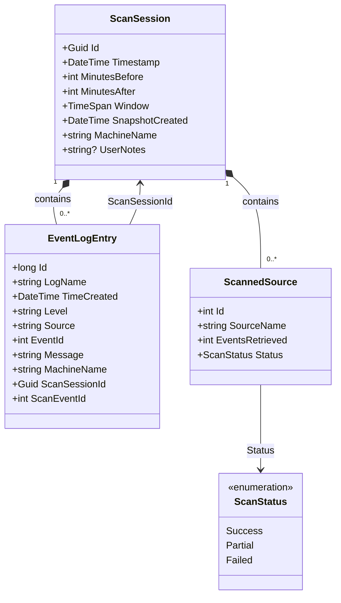
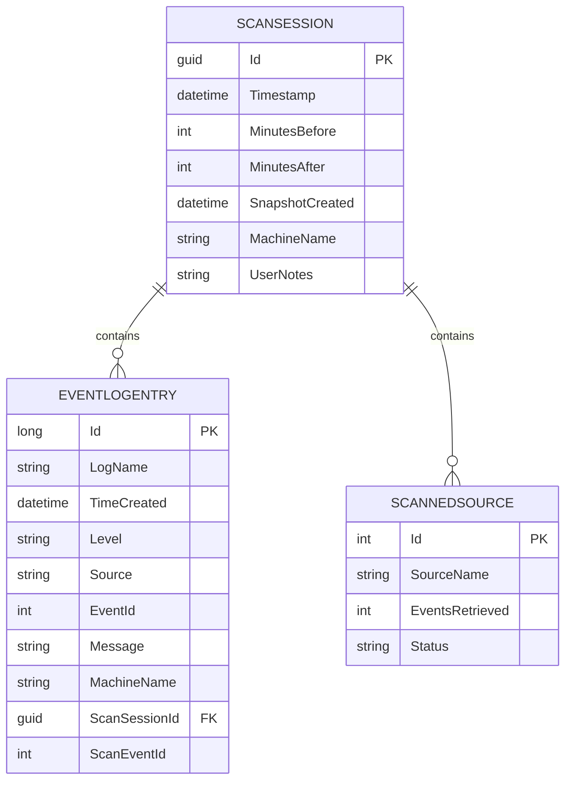
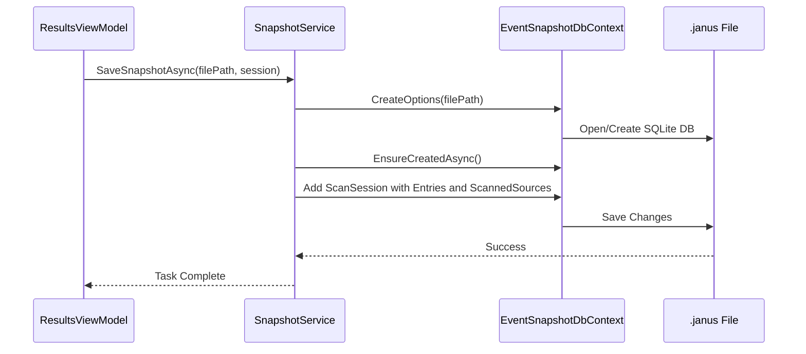

# ScanSession Model


## Table of Contents
1. [Introduction](#introduction)
2. [Core Properties and Structure](#core-properties-and-structure)
3. [Entity Relationships](#entity-relationships)
4. [Data Persistence and Configuration](#data-persistence-and-configuration)
5. [Snapshot Serialization and Portability](#snapshot-serialization-and-portability)
6. [Business Rules and Immutability](#business-rules-and-immutability)
7. [Integration with UI and Services](#integration-with-ui-and-services)
8. [Sample Data Representation](#sample-data-representation)
9. [Conclusion](#conclusion)

## Introduction
The **ScanSession** entity serves as the root aggregate for a single event log snapshot in **Project Janus**, a diagnostic tool for analyzing Windows system events around a critical timestamp. It encapsulates a complete snapshot of event logs collected within a defined time window, enabling portable, offline analysis. This document provides a comprehensive overview of the ScanSession model, detailing its properties, relationships, persistence mechanism, and integration within the application architecture.

**Section sources**
- [ScanSession.cs](file://Janus.Core/ScanSession.cs#L4-L34)
- [README.md](file://README.md#L1-L105)

## Core Properties and Structure
The ScanSession class is defined in the `Janus.Core` namespace and represents a single scanning session. It contains metadata about the scan, including temporal parameters, system context, and user annotations.

### Key Properties:
- **Id**: A `Guid` uniquely identifying the session. This serves as the primary key in the database.
- **Timestamp**: The central point in time around which the scan is performed.
- **MinutesBefore**: The number of minutes before the Timestamp to include in the scan window.
- **MinutesAfter**: The number of minutes after the Timestamp to include.
- **Window**: A computed property representing the total duration of the scan window as a `TimeSpan`.
- **SnapshotCreated**: The UTC timestamp when the snapshot was saved to disk.
- **MachineName**: The name of the machine where the scan was performed.
- **UserNotes**: Optional user-provided notes associated with the session.
- **Entries**: A collection of `EventLogEntry` objects captured during the scan.
- **ScannedSources**: A collection of `ScannedSource` objects tracking the status and results of scanning individual event sources.

All properties are marked as `required` and use `init` accessors, enforcing immutability after object construction.


```csharp
public class ScanSession {
  public required Guid Id { get; init; }
  public required DateTime Timestamp { get; init; }
  public required int MinutesBefore { get; init; }
  public required int MinutesAfter { get; init; }
  public TimeSpan Window => TimeSpan.FromMinutes(MinutesBefore + MinutesAfter);
  public required DateTime SnapshotCreated { get; init; }
  public required string MachineName { get; init; }
  public required string? UserNotes { get; init; }
  public required ICollection<EventLogEntry> Entries { get; init; }
  public required ICollection<ScannedSource> ScannedSources { get; init; } = [];
}
```


**Section sources**
- [ScanSession.cs](file://Janus.Core/ScanSession.cs#L4-L34)

## Entity Relationships
ScanSession acts as the parent entity in one-to-many relationships with both `EventLogEntry` and `ScannedSource`, forming a hierarchical aggregate root.

### Relationship with EventLogEntry
Each `EventLogEntry` belongs to exactly one `ScanSession`, identified by the `ScanSessionId` property. This relationship is managed through Entity Framework Core's navigation properties and is not explicitly configured in `OnModelCreating`, implying a conventional one-to-many relationship.


```csharp
public class EventLogEntry {
  public required Guid ScanSessionId { get; init; }
  // Other properties...
}
```


### Relationship with ScannedSource
The `ScanSession` has a one-to-many relationship with `ScannedSource`, where each `ScannedSource` represents a specific event log source (e.g., "Application", "System") that was scanned. This relationship is explicitly configured in the `EventSnapshotDbContext` to cascade deletes, ensuring that when a `ScanSession` is deleted, all associated `ScannedSource` records are also removed.





**Diagram sources**
- [ScanSession.cs](file://Janus.Core/ScanSession.cs#L4-L34)
- [EventLogEntry.cs](file://Janus.Core/EventLogEntry.cs#L4-L17)
- [ScannedSource.cs](file://Janus.Core/ScannedSource.cs#L4-L13)

**Section sources**
- [ScanSession.cs](file://Janus.Core/ScanSession.cs#L4-L34)
- [EventLogEntry.cs](file://Janus.Core/EventLogEntry.cs#L4-L17)
- [ScannedSource.cs](file://Janus.Core/ScannedSource.cs#L4-L13)

## Data Persistence and Configuration
Persistence of ScanSession and its related entities is managed by Entity Framework Core using the `EventSnapshotDbContext`. The context is configured to use SQLite, enabling self-contained, portable snapshot files.

### Primary Key and Model Configuration
The primary key for `ScanSession` is the `Id` property of type `Guid`. While not explicitly configured in `OnModelCreating`, EF Core conventionally treats a property named `Id` as the primary key. The `ScannedSource` entity has an explicitly defined `int Id` as its primary key.

The only explicitly configured relationship is between `ScanSession` and `ScannedSource`, which is set to cascade deletes:


```csharp
modelBuilder.Entity<ScanSession>()
  .HasMany(s => s.ScannedSources)
  .WithOne()
  .OnDelete(DeleteBehavior.Cascade);
```


Additionally, the `Status` property of `ScannedSource` is configured to be stored as a string in the database:


```csharp
modelBuilder.Entity<ScannedSource>()
  .Property(s => s.Status)
  .HasConversion<string>();
```





**Diagram sources**
- [EventSnapshotDbContext.cs](file://Janus.Core/EventSnapshotDbContext.cs#L15-L24)
- [ScanSession.cs](file://Janus.Core/ScanSession.cs#L4-L34)
- [ScannedSource.cs](file://Janus.Core/ScannedSource.cs#L4-L13)

**Section sources**
- [EventSnapshotDbContext.cs](file://Janus.Core/EventSnapshotDbContext.cs#L15-L24)

## Snapshot Serialization and Portability
ScanSession enables portable snapshot functionality by being serialized into `.janus` files. These files are SQLite databases created and managed by the `SnapshotService`.

### SnapshotService Workflow
The `SnapshotService` class provides static methods to save and load snapshots:

- **SaveSnapshotAsync**: Creates a new SQLite database at the specified file path, ensures the schema is created, and inserts the `ScanSession` and its related data.
- **LoadSnapshotAsync**: Opens an existing `.janus` file, loads the `ScanSession` with its `Entries` and `ScannedSources` included.
- **LoadSnapshotMetadataAsync**: Loads only the `ScanSession` and `ScannedSources` to retrieve metadata and event count without loading all entries.

The service uses a connection string with `Pooling=false` to ensure exclusive access to the SQLite file.





**Diagram sources**
- [SnapshotService.cs](file://Janus.App/Services/SnapshotService.cs#L15-L79)

**Section sources**
- [SnapshotService.cs](file://Janus.App/Services/SnapshotService.cs#L15-L79)

## Business Rules and Immutability
The ScanSession model enforces several business rules to ensure data integrity and consistency:

- **Immutability**: All properties are declared with `init` accessors, meaning they can only be set during object construction. Once a `ScanSession` is created, its core properties cannot be modified.
- **Required Properties**: The `required` keyword ensures that all essential fields must be provided, preventing incomplete session data.
- **Snapshot Creation Time**: The `SnapshotCreated` field is set to `DateTime.UtcNow` when the snapshot is saved, providing an accurate audit trail.
- **Retention Policies**: While not explicitly coded in the model, the `.janus` file format allows users to manage snapshot retention externally. The application supports adding snapshots to a recent files list for quick access.

**Section sources**
- [ScanSession.cs](file://Janus.Core/ScanSession.cs#L4-L34)
- [SnapshotService.cs](file://Janus.App/Services/SnapshotService.cs#L50-L55)

## Integration with UI and Services
The ScanSession model is tightly integrated with the application's UI through the `ResultsViewModel`.

### ResultsViewModel Integration
The `ResultsViewModel` holds a reference to the current `ScanSession` via the `Metadata` property. This allows the UI to display session metadata such as the timestamp and creation time.

When saving a snapshot, the view model creates a new `ScanSession` instance based on the current metadata, updates the `SnapshotCreated` time and `UserNotes`, and passes it to the `SnapshotService`:


```csharp
var updatedSession = new ScanSession {
  Id = Metadata.Id,
  Timestamp = Metadata.Timestamp,
  MinutesBefore = Metadata.MinutesBefore,
  MinutesAfter = Metadata.MinutesAfter,
  SnapshotCreated = DateTime.UtcNow,
  MachineName = Metadata.MachineName,
  UserNotes = vm.UserNotes,
  Entries = Metadata.Entries,
  ScannedSources = Metadata.ScannedSources
};
await SnapshotService.SaveSnapshotAsync(filePath, updatedSession);
```


The `SetMetadata` method updates the view model's state and notifies the UI of changes.

**Section sources**
- [ResultsViewModel.cs](file://Janus.App/ViewModels/ResultsViewModel.cs#L38-L81)
- [ResultsViewModel.cs](file://Janus.App/ViewModels/ResultsViewModel.cs#L514-L548)

## Sample Data Representation
Below is a JSON representation of a typical ScanSession and its related data:


```json
{
  "Id": "a1b2c3d4-e5f6-7890-g1h2-i3j4k5l6m7n8",
  "Timestamp": "2025-08-05T09:57:00Z",
  "MinutesBefore": 5,
  "MinutesAfter": 5,
  "SnapshotCreated": "2025-08-05T10:15:30Z",
  "MachineName": "WORKSTATION01",
  "UserNotes": "Investigating application crash at 09:57",
  "Entries": [
    {
      "Id": 12345,
      "LogName": "Application",
      "TimeCreated": "2025-08-05T09:56:59Z",
      "Level": "Error",
      "Source": "MyApp.exe",
      "EventId": 1001,
      "Message": "Application failed to start due to missing dependency.",
      "MachineName": "WORKSTATION01",
      "ScanSessionId": "a1b2c3d4-e5f6-7890-g1h2-i3j4k5l6m7n8",
      "ScanEventId": 1
    }
  ],
  "ScannedSources": [
    {
      "Id": 1,
      "SourceName": "Application",
      "EventsRetrieved": 15,
      "Status": "Success"
    },
    {
      "Id": 2,
      "SourceName": "System",
      "EventsRetrieved": 8,
      "Status": "Partial"
    }
  ]
}
```


**Section sources**
- [ScanSession.cs](file://Janus.Core/ScanSession.cs#L4-L34)
- [EventLogEntry.cs](file://Janus.Core/EventLogEntry.cs#L4-L17)
- [ScannedSource.cs](file://Janus.Core/ScannedSource.cs#L4-L13)

## Conclusion
The ScanSession entity is the cornerstone of Project Janus's snapshot functionality. As the root aggregate, it provides a structured, immutable container for event log data collected around a critical timestamp. Its design, leveraging EF Core and SQLite, enables the creation of portable `.janus` files that can be shared and analyzed offline. The integration with the `SnapshotService` and `ResultsViewModel` ensures a seamless user experience for saving, loading, and reviewing diagnostic data. The model's immutability and required properties enforce data integrity, making it a reliable foundation for system diagnostics.

**Section sources**
- [ScanSession.cs](file://Janus.Core/ScanSession.cs#L4-L34)
- [SnapshotService.cs](file://Janus.App/Services/SnapshotService.cs#L15-L79)
- [ResultsViewModel.cs](file://Janus.App/ViewModels/ResultsViewModel.cs#L38-L81)

**Referenced Files in This Document**   
- [ScanSession.cs](file://Janus.Core/ScanSession.cs)
- [EventLogEntry.cs](file://Janus.Core/EventLogEntry.cs)
- [ScannedSource.cs](file://Janus.Core/ScannedSource.cs)
- [EventSnapshotDbContext.cs](file://Janus.Core/EventSnapshotDbContext.cs)
- [SnapshotService.cs](file://Janus.App/Services/SnapshotService.cs)
- [ResultsViewModel.cs](file://Janus.App/ViewModels/ResultsViewModel.cs)
- [README.md](file://README.md)
- [oldREADME.md](file://oldREADME.md)