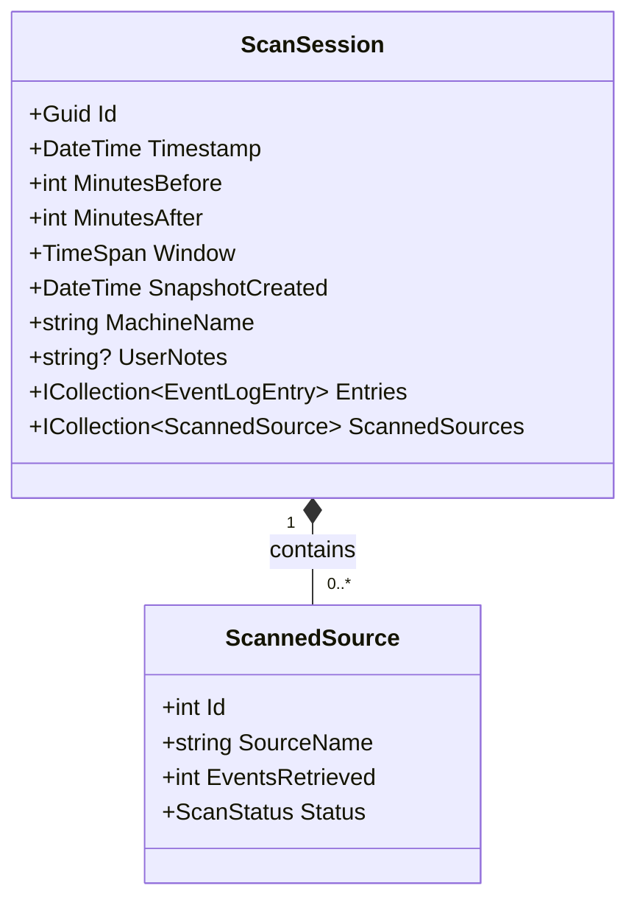
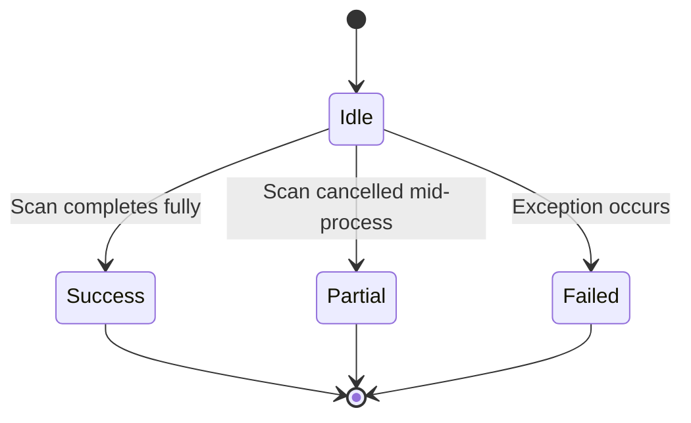
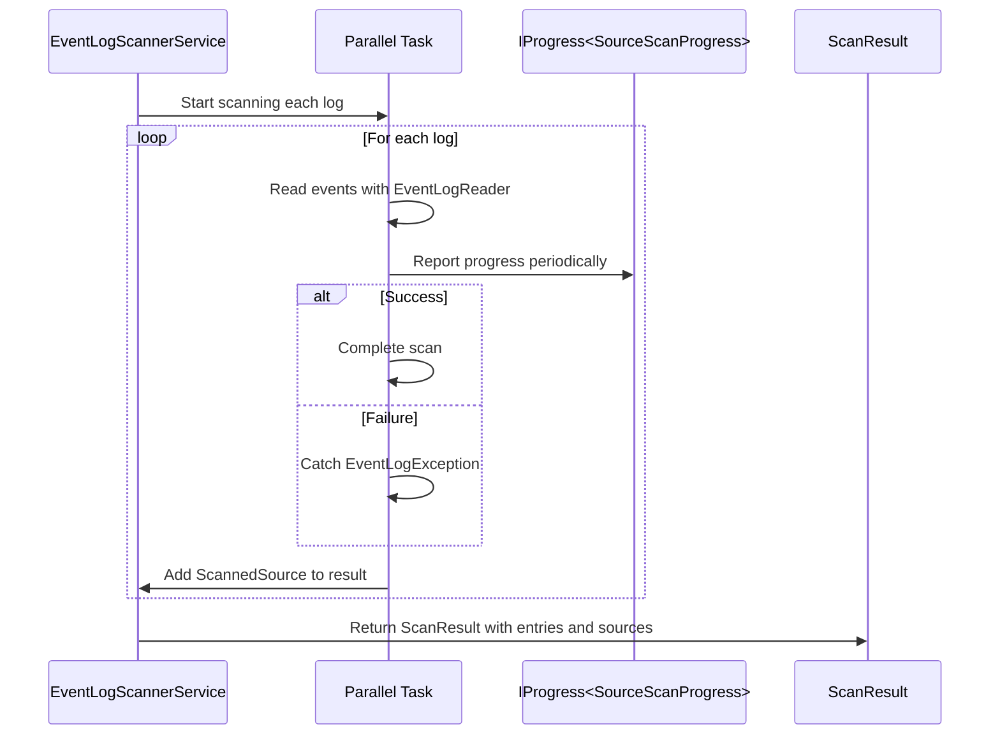
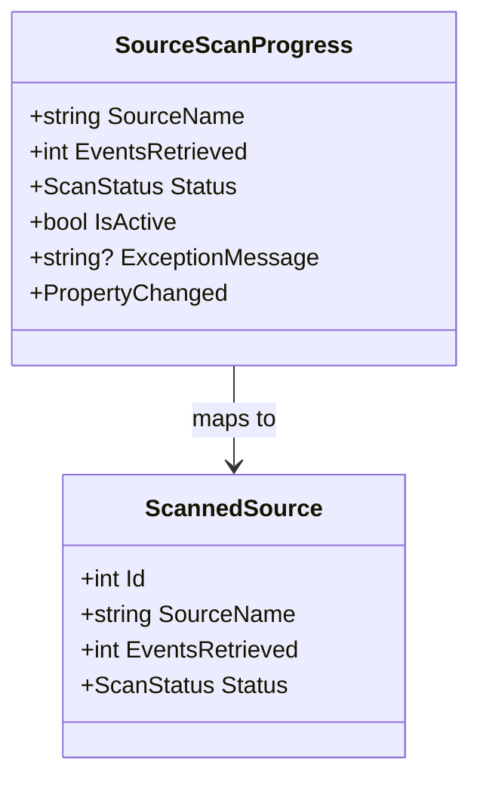

# ScannedSource Model


## Table of Contents
1. [Introduction](#introduction)
2. [Entity Structure and Properties](#entity-structure-and-properties)
3. [Relationship with ScanSession](#relationship-with-scansession)
4. [ScanStatus Enumeration](#scanstatus-enumeration)
5. [Data Population During Parallel Scanning](#data-population-during-parallel-scanning)
6. [Persistence via EF Core](#persistence-via-ef-core)
7. [Usage in User Interface and Progress Reporting](#usage-in-user-interface-and-progress-reporting)
8. [Post-Scan Analysis and Filtering](#post-scan-analysis-and-filtering)
9. [Performance Implications and Indexing](#performance-implications-and-indexing)

## Introduction
The `ScannedSource` entity is a core component of the Project Janus system, designed to capture metadata about each event log source scanned during a session. It serves as a child entity of `ScanSession`, recording per-log statistics such as the number of retrieved events and the outcome of the scanning process. This model enables detailed progress tracking, error diagnostics, and post-scan analysis through the ResultsView interface. The data is collected in parallel using the `EventLogScannerService` and persisted via Entity Framework Core (EF Core) into a SQLite database. This documentation provides a comprehensive overview of its structure, behavior, relationships, and role in the application ecosystem.

**Section sources**
- [ScannedSource.cs](file://Janus.Core/ScannedSource.cs#L1-L13)

## Entity Structure and Properties
The `ScannedSource` class defines metadata for individual event log sources scanned during a session. It includes the following key properties:

- **Id**: Integer primary key used by EF Core for database identification.
- **SourceName**: Required string representing the name of the event log (e.g., "Application", "System"). This corresponds to the Windows Event Log channel name.
- **EventsRetrieved**: Required integer indicating the number of events successfully retrieved from the source.
- **Status**: Required `ScanStatus` enum value indicating the outcome of the scan operation.

All properties are marked with `init` accessors, ensuring immutability after object construction, which supports thread-safe population during parallel scanning.

There are no explicit maximum length constraints defined on the `SourceName` property in code or EF Core configuration. However, Windows Event Log channel names typically have practical limits (usually under 256 characters), so the effective length is constrained by the operating system rather than application-level validation.


```csharp
public class ScannedSource {
  public int Id { get; set; }
  public required string SourceName { get; init; }
  public required int EventsRetrieved { get; init; }
  public required ScanStatus Status { get; init; }
}
```


**Section sources**
- [ScannedSource.cs](file://Janus.Core/ScannedSource.cs#L7-L13)

## Relationship with ScanSession
The `ScannedSource` entity functions as a child of the `ScanSession` parent entity, forming a one-to-many relationship where each scan session can include multiple scanned sources. This relationship is configured in EF Core using the `HasMany` and `WithOne` fluent API, with cascade delete behavior enabled. When a `ScanSession` is deleted, all associated `ScannedSource` records are automatically removed from the database.

The `ScanSession` class contains a required collection of `ScannedSource` objects, which is initialized as an empty list by default. This collection aggregates scanning outcomes across all log sources, enabling high-level summaries and filtering capabilities in the UI.


```csharp
public required ICollection<ScannedSource> ScannedSources { get; init; } = [];
```


This hierarchical structure allows the system to maintain context about when and why a scan was performed while preserving granular per-source results.





**Diagram sources**
- [ScanSession.cs](file://Janus.Core/ScanSession.cs#L1-L35)
- [ScannedSource.cs](file://Janus.Core/ScannedSource.cs#L1-L13)

**Section sources**
- [ScanSession.cs](file://Janus.Core/ScanSession.cs#L28-L35)

## ScanStatus Enumeration
The `ScanStatus` enum defines the possible outcomes of a source scanning operation:

- **Success**: All events were retrieved without errors.
- **Partial**: The scan was interrupted (e.g., by user cancellation) but some events were retrieved.
- **Failed**: The scan encountered an error (e.g., access denied, log corruption) and no or few events were retrieved.

This enumeration is used both in the `ScannedSource` model and in real-time progress reporting via the `SourceScanProgress` view model. In the UI, it drives visual indicators such as color-coded status badges through the `ScanStatusToBrushConverter`, which maps:
- `Success` → Green
- `Partial` → Orange
- `Failed` → Red

This provides immediate visual feedback to users about the health of each log source scan.





**Diagram sources**
- [ScannedSource.cs](file://Janus.Core/ScannedSource.cs#L3-L6)
- [ScanStatusToBrushConverter.cs](file://Janus.App/Helpers/ScanStatusToBrushConverter.cs#L1-L24)

**Section sources**
- [ScannedSource.cs](file://Janus.Core/ScannedSource.cs#L3-L6)
- [ScanStatusToBrushConverter.cs](file://Janus.App/Helpers/ScanStatusToBrushConverter.cs#L1-L24)

## Data Population During Parallel Scanning
The `ScannedSource` instances are created and populated during parallel scanning by the `EventLogScannerService.ScanAllLogsAsync` method. Each event log source is processed in a separate task, allowing concurrent reads from multiple logs to improve performance.

For each log:
- A dedicated `Task` is spawned to read events using `EventLogReader`.
- Events are filtered by a time window around a central timestamp using XPath queries.
- As events are read, they are added to a shared list under lock protection.
- Progress updates are reported via an `IProgress<SourceScanProgress>` callback, providing real-time feedback.
- Upon completion (normal, canceled, or failed), a `ScannedSource` object is constructed with:
  - `SourceName`: The log name (e.g., "Security")
  - `EventsRetrieved`: Count of successfully read events
  - `Status`: Determined by exception handling (`Success`, `Partial`, or `Failed`)

These objects are collected in a thread-safe manner using `lock (scannedSources)` and returned as part of a `ScanResult` object.





**Diagram sources**
- [EventLogScannerService.cs](file://Janus.App/Services/EventLogScannerService.cs#L50-L160)

**Section sources**
- [EventLogScannerService.cs](file://Janus.App/Services/EventLogScannerService.cs#L50-L160)

## Persistence via EF Core
The `ScannedSource` entity is persisted using EF Core within the `EventSnapshotDbContext`. The context exposes a `DbSet<ScannedSource>` for database operations and configures the model in `OnModelCreating`.

Key configuration details:
- The `Status` property is converted to a string in the database using `.HasConversion<string>()`, allowing enum values to be stored as text (e.g., "Success", "Failed").
- No explicit indexing is defined on `SourceName` or other fields in the current configuration.
- Cascade delete is enabled from `ScanSession` to `ScannedSource`, ensuring referential integrity.

Despite the lack of explicit indexes, the typical query pattern—loading all sources for a given session—benefits from the foreign key relationship and does not require additional indexing for acceptable performance given moderate data volumes.


```csharp
modelBuilder.Entity<ScannedSource>()
  .Property(s => s.Status)
  .HasConversion<string>();
```


**Section sources**
- [EventSnapshotDbContext.cs](file://Janus.Core/EventSnapshotDbContext.cs#L15-L24)

## Usage in User Interface and Progress Reporting
During scanning, `ScannedSource` data is mirrored in real time through the `SourceScanProgress` class, which implements `INotifyPropertyChanged` for WPF data binding. This model is used by `LiveScanViewModel` to update the UI with live statistics such as:
- Number of sources completed successfully or with errors
- Per-source event count and status
- Active/inactive state for progress indication

The `SourceScanProgress` object is updated multiple times per source (during scanning and at completion), enabling smooth progress reporting. Once the scan completes, the final `ScannedSource` data is transferred to `ResultsViewModel`.





**Diagram sources**
- [SourceScanProgress.cs](file://Janus.App/ViewModels/SourceScanProgress.cs#L1-L25)
- [ScannedSource.cs](file://Janus.Core/ScannedSource.cs#L1-L13)

**Section sources**
- [SourceScanProgress.cs](file://Janus.App/ViewModels/SourceScanProgress.cs#L1-L25)

## Post-Scan Analysis and Filtering
After scanning, `ScannedSource` data is displayed in the `ResultsView` via the `ResultsViewModel`. The `LoadScannedSources` method populates an `ObservableCollection<ScannedSource>`, which is bound to a UI control for user inspection.

This data supports several user-facing features:
- **Source Filtering**: Users can filter event logs by source name using multi-select controls.
- **Error Diagnostics**: Failed scans are highlighted in red, and exception messages (from `SourceScanProgress`) help identify permission or access issues.
- **Statistical Overview**: Total sources scanned, success rate, and distribution of scan statuses are derived from this data.
- **Progress Summary**: The UI displays counts of successful, failed, and partially scanned sources.

The `ScannedSources` collection is sorted alphabetically by `SourceName` for consistent presentation.

**Section sources**
- [ResultsViewModel.cs](file://Janus.App/ViewModels/ResultsViewModel.cs#L295-L332)

## Performance Implications and Indexing
Storing per-source metadata in the `ScannedSource` table has minimal performance overhead due to the relatively small number of event logs on most systems (typically fewer than 100). Each scan session generates one row per log source, making the total data volume manageable.

Although no explicit database indexes are defined beyond the primary key and foreign key relationships, the current access patterns do not necessitate additional indexing:
- Data is typically loaded in bulk for a single session.
- Filtering occurs in-memory via WPF collections.
- There are no complex queries or joins on `SourceName`.

However, if the application scales to support long-term archival or cross-session analysis, adding an index on `SourceName` or `Status` could improve query performance for filtering operations.

Potential future optimizations:
- Introduce composite index on `(ScanSessionId, SourceName)` if querying specific sources across sessions.
- Consider caching frequently accessed scan summaries.

**Section sources**
- [EventSnapshotDbContext.cs](file://Janus.Core/EventSnapshotDbContext.cs#L15-L24)
- [ScannedSource.cs](file://Janus.Core/ScannedSource.cs#L1-L13)

**Referenced Files in This Document**   
- [ScannedSource.cs](file://Janus.Core/ScannedSource.cs)
- [ScanSession.cs](file://Janus.Core/ScanSession.cs)
- [EventLogScannerService.cs](file://Janus.App/Services/EventLogScannerService.cs)
- [EventSnapshotDbContext.cs](file://Janus.Core/EventSnapshotDbContext.cs)
- [ResultsViewModel.cs](file://Janus.App/ViewModels/ResultsViewModel.cs)
- [SourceScanProgress.cs](file://Janus.App/ViewModels/SourceScanProgress.cs)
- [ScanStatusToBrushConverter.cs](file://Janus.App/Helpers/ScanStatusToBrushConverter.cs)