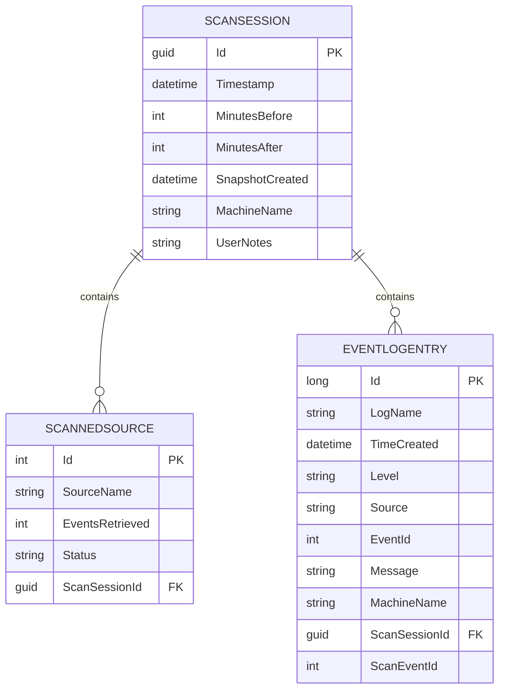
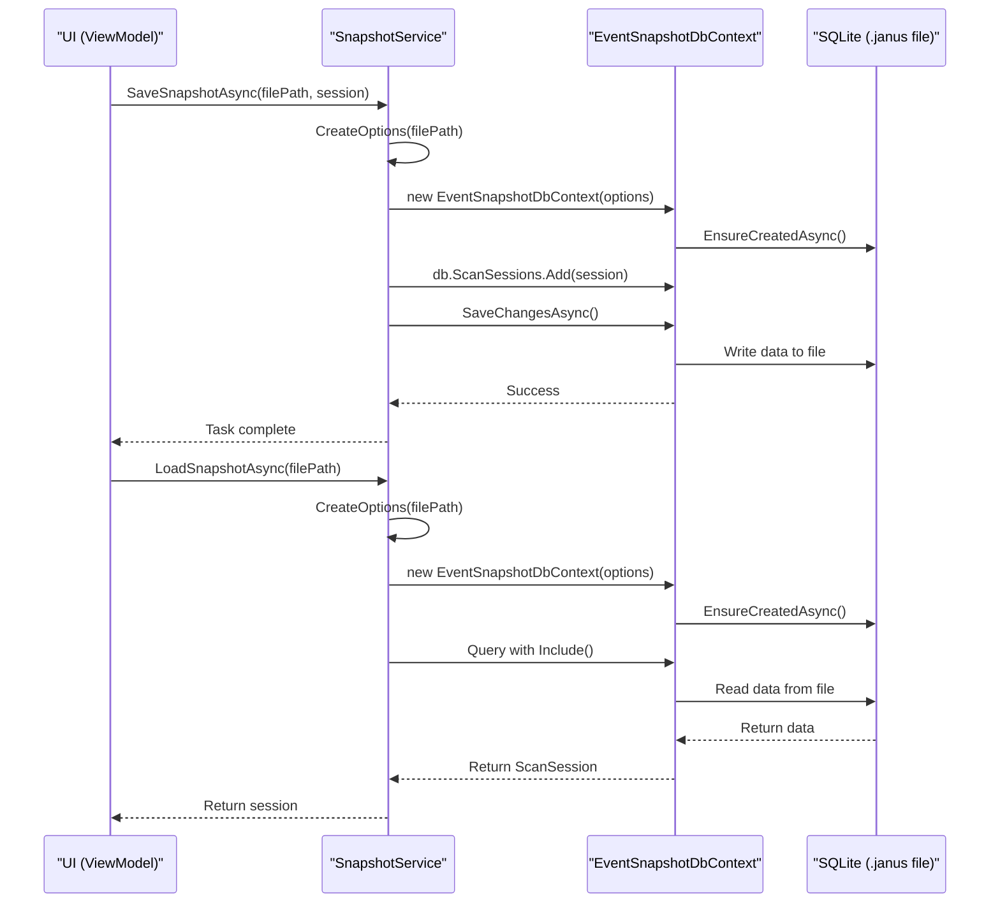

# EventSnapshotDbContext and Database Schema


## Table of Contents
1. [Introduction](#introduction)
2. [Core Entities and DbSet Configuration](#core-entities-and-dbset-configuration)
3. [OnModelCreating Configuration Details](#onmodelcreating-configuration-details)
4. [Database Schema and Relationships](#database-schema-and-relationships)
5. [SQLite Provider and .janus File Structure](#sqlite-provider-and-janus-file-structure)
6. [Context Lifecycle and SnapshotService Integration](#context-lifecycle-and-snapshotservice-integration)
7. [Connection String and Performance Considerations](#connection-string-and-performance-considerations)
8. [Migration Strategy and Schema Management](#migration-strategy-and-schema-management)
9. [Security and Corruption Handling](#security-and-corruption-handling)

## Introduction
The `EventSnapshotDbContext` class is the Entity Framework Core database context responsible for managing the persistence of event log snapshot data in Project Janus. It defines the data model and provides the interface for saving and loading scan results to portable `.janus` files. This document details the structure of the context, its entity configurations, relationship mappings, and integration with the application's services. The context is designed around the principle of creating immutable snapshot files using SQLite as a lightweight, serverless, and portable database engine.

## Core Entities and DbSet Configuration
The `EventSnapshotDbContext` exposes three primary `DbSet` properties that correspond to the core entities of a scan session: `ScanSession`, `EventLogEntry`, and `ScannedSource`. These sets provide access to the collections of entities that are persisted to the database.

**Entity Configuration:**
- **ScanSession**: Represents the top-level container for a single scan operation. It contains metadata about the scan window, creation time, machine name, and user notes. It serves as the root entity for the snapshot.
- **EventLogEntry**: Represents an individual event log record retrieved during the scan. It contains detailed information such as the log name, timestamp, event level, source, event ID, message, and machine name.
- **ScannedSource**: Represents a specific event log source (e.g., "Application", "Security") that was scanned. It tracks the number of events retrieved and the overall status of the scan for that source.

The `DbSet` properties are implemented as expression-bodied members that return the result of the `Set<T>()` method, a common pattern in EF Core for exposing entity sets.


```csharp
public DbSet<EventLogEntry> EventLogEntries => Set<EventLogEntry>();
public DbSet<ScanSession> ScanSessions => Set<ScanSession>();
public DbSet<ScannedSource> ScannedSources => Set<ScannedSource>();
```


**Section sources**
- [EventSnapshotDbContext.cs](file://Janus.Core/EventSnapshotDbContext.cs#L7-L10)
- [ScanSession.cs](file://Janus.Core/ScanSession.cs#L5-L24)
- [EventLogEntry.cs](file://Janus.Core/EventLogEntry.cs#L5-L14)
- [ScannedSource.cs](file://Janus.Core/ScannedSource.cs#L7-L11)

## OnModelCreating Configuration Details
The `OnModelCreating` method is overridden to configure the database schema using the Fluent API. This method defines table relationships, column types, and other model-specific settings that cannot be expressed through data annotations alone.

### Relationship Mappings
The most significant configuration is the one-to-many relationship between `ScanSession` and `ScannedSource`. A single `ScanSession` can have multiple `ScannedSource` entries, representing the various log sources that were analyzed. This relationship is configured with a cascade delete behavior, meaning that if a `ScanSession` is deleted from the database, all of its associated `ScannedSource` records will be automatically deleted as well.


```csharp
modelBuilder.Entity<ScanSession>()
  .HasMany(s => s.ScannedSources)
  .WithOne()
  .OnDelete(DeleteBehavior.Cascade);
```


### Value Conversions
The `ScannedSource` entity contains a `Status` property of type `ScanStatus`, which is a C# enum. EF Core cannot natively map enums to SQLite columns. To persist this value, a value conversion is applied to store the enum as its string representation in the database.


```csharp
modelBuilder.Entity<ScannedSource>()
  .Property(s => s.Status)
  .HasConversion<string>();
```


This configuration ensures that values like `Success`, `Partial`, and `Failed` are stored as text in the database, making the data human-readable and easily queryable.

**Section sources**
- [EventSnapshotDbContext.cs](file://Janus.Core/EventSnapshotDbContext.cs#L12-L20)

## Database Schema and Relationships
The database schema consists of three main tables that reflect the entity classes. The following Entity Relationship (ER) diagram illustrates the tables, their columns, primary keys, foreign keys, and the referential constraints between them.





**Diagram sources**
- [ScanSession.cs](file://Janus.Core/ScanSession.cs#L5-L24)
- [ScannedSource.cs](file://Janus.Core/ScannedSource.cs#L7-L11)
- [EventLogEntry.cs](file://Janus.Core/EventLogEntry.cs#L5-L14)
- [EventSnapshotDbContext.cs](file://Janus.Core/EventSnapshotDbContext.cs#L12-L15)

### Key Schema Elements
- **Primary Keys**: Each table has a primary key (`Id`). `EventLogEntry` uses a `long` for its `Id`, while `ScannedSource` uses an `int`. `ScanSession` uses a `Guid` to ensure global uniqueness.
- **Foreign Keys**: Both `ScannedSource` and `EventLogEntry` have a `ScanSessionId` column that references the `Id` of the `ScanSession` table, establishing the parent-child relationship.
- **Column Types**: The schema uses appropriate SQLite types: `TEXT` for strings, `INTEGER` for numbers, and `DATETIME` for timestamps. The `Status` column in `SCANNEDSOURCE` is stored as `TEXT` due to the string conversion.
- **Referential Constraints**: The foreign key relationships enforce data integrity. The cascade delete on the `SCANSESSION` -> `SCANNEDSOURCE` relationship ensures data consistency.

## SQLite Provider and .janus File Structure
Project Janus uses SQLite as its database provider, which is configured through the `Microsoft.EntityFrameworkCore.Sqlite` package. The primary advantage of SQLite is its ability to store an entire database in a single, portable file. This aligns perfectly with the project's goal of creating self-contained snapshot files.

### .janus Snapshot Files
A `.janus` file is fundamentally a SQLite database file with a custom file extension. When a user saves a scan, the `SnapshotService` serializes the entire `ScanSession` object, including its `EventLogEntries` and `ScannedSources`, into a new SQLite database file. This file can be easily shared, archived, or loaded later for offline analysis. The portability of the SQLite format means that the snapshot can be opened with any standard SQLite browser or tool for inspection.

**Section sources**
- [GEMINI.md](file://GEMINI.md#L15-L20)
- [janus.ai.rules.yml](file://janus.ai.rules.yml#L25-L28)

## Context Lifecycle and SnapshotService Integration
The `EventSnapshotDbContext` is not a long-lived service; instead, it follows a short-lived, per-operation lifecycle. The `SnapshotService` class in the `Janus.App` project is responsible for managing the context's creation, use, and disposal during save and load operations.

### Save Operation
When saving a snapshot:
1. A `DbContextOptions` object is created with a connection string pointing to the target `.janus` file.
2. A new `EventSnapshotDbContext` instance is created using these options.
3. `EnsureCreatedAsync()` is called to create the database schema if the file does not exist.
4. The `ScanSession` object is added to the `ScanSessions` set.
5. `SaveChangesAsync()` is called to persist all changes to the file.
6. The context is disposed of at the end of the `using` block.

### Load Operation
When loading a snapshot:
1. A `DbContextOptions` object is created with the path to the existing `.janus` file.
2. A new `EventSnapshotDbContext` instance is created.
3. `EnsureCreatedAsync()` is called. For existing files, this is a no-op if the schema matches.
4. A LINQ query is executed to load the `ScanSession`, including its related `EventLogEntries` and `ScannedSources` using `Include()`.
5. The context is disposed of after the data is retrieved.

This pattern ensures that the context is only active for the duration of a single save or load, minimizing resource usage and preventing stale data.





**Diagram sources**
- [SnapshotService.cs](file://Janus.App/Services/SnapshotService.cs#L11-L78)
- [EventSnapshotDbContext.cs](file://Janus.Core/EventSnapshotDbContext.cs#L7-L20)

**Section sources**
- [SnapshotService.cs](file://Janus.App/Services/SnapshotService.cs#L11-L78)

## Connection String and Performance Considerations
The connection string for the SQLite database is constructed dynamically by the `SnapshotService`. It uses the `Data Source={filePath}` format to specify the location of the `.janus` file. The `Pooling=false` option is explicitly set to disable connection pooling, which is recommended for single-file, file-access-based scenarios like this to avoid potential file locking issues.

### Performance Optimizations
While the current implementation does not use explicit bulk insert operations or manual transactions, several performance considerations are in place:
- **Asynchronous Operations**: All database operations (`EnsureCreatedAsync`, `SaveChangesAsync`, `FirstOrDefaultAsync`) are performed asynchronously to prevent blocking the UI thread.
- **Split Queries**: The `LoadSnapshotAsync` method uses `.AsSplitQuery()` when loading a `ScanSession` with its `EventLogEntries`. This tells EF Core to execute separate SQL queries for the main entity and its related collection, which can be more efficient than a single complex `JOIN` when dealing with large numbers of related entities.
- **Indexing**: The codebase does not explicitly define any indexes (e.g., on `TimeCreated` in `EventLogEntry`). This is a potential area for future optimization, as queries filtering by time could benefit significantly from an index on the `TimeCreated` column.

**Section sources**
- [SnapshotService.cs](file://Janus.App/Services/SnapshotService.cs#L11-L13)

## Migration Strategy and Schema Management
Project Janus employs a **"No Migrations"** strategy, which is a critical architectural directive. Instead of using EF Core's migration system to manage schema evolution, the application relies on `DbContext.Database.EnsureCreatedAsync()`.

### Schema Creation and Versioning
- **New Files**: When saving a new snapshot, `EnsureCreatedAsync()` is called. This method inspects the current C# entity models and creates the database schema directly from them. There is no `__EFMigrationsHistory` table.
- **Loading Files**: When loading an existing snapshot, `EnsureCreatedAsync()` is called again. If the file exists but its schema does not match the current C# models (e.g., a new column was added in a newer app version), a `SqliteException` is thrown.
- **Error Handling**: The `SnapshotService` catches `SqliteException` and re-throws it as an `InvalidOperationException` with a user-friendly message. This is the mechanism for detecting schema version mismatches, informing the user that the snapshot was created with a different version of the application.

This approach treats `.janus` files as immutable documents tied to a specific version of the application, prioritizing simplicity and portability over backward compatibility.

**Section sources**
- [GEMINI.md](file://GEMINI.md#L38-L47)
- [janus.ai.rules.yml](file://janus.ai.rules.yml#L74-L100)
- [SnapshotService.cs](file://Janus.App/Services/SnapshotService.cs#L22-L23)

## Security and Corruption Handling
The security and integrity of the `.janus` snapshot files are managed at the application level.

### Local File Storage Security
The `.janus` files are stored as regular files on the user's local filesystem. The application itself does not implement encryption or access control on these files. Security is therefore dependent on the operating system's file permissions. Users are responsible for securing the directories where these files are saved.

### Corruption and Error Handling
The primary mechanism for handling file corruption or schema issues is the `try...catch` block around database operations in the `SnapshotService`. A `SqliteException` can be thrown for various reasons, including:
- The file is genuinely corrupted.
- The file is locked by another process.
- The schema of the file is incompatible with the current application version.

In all these cases, the exception is caught and a generic error message is presented to the user. The application does not attempt to repair corrupted files. The design assumes that if a file cannot be loaded, it is either incompatible or damaged beyond repair, and the user should rely on a different snapshot or perform a new scan.

**Section sources**
- [SnapshotService.cs](file://Janus.App/Services/SnapshotService.cs#L19-L36)
- [GEMINI.md](file://GEMINI.md#L44-L47)

**Referenced Files in This Document**   
- [EventSnapshotDbContext.cs](file://Janus.Core/EventSnapshotDbContext.cs)
- [ScanSession.cs](file://Janus.Core/ScanSession.cs)
- [EventLogEntry.cs](file://Janus.Core/EventLogEntry.cs)
- [ScannedSource.cs](file://Janus.Core/ScannedSource.cs)
- [SnapshotService.cs](file://Janus.App/Services/SnapshotService.cs)
- [GEMINI.md](file://GEMINI.md)
- [janus.ai.rules.yml](file://janus.ai.rules.yml)