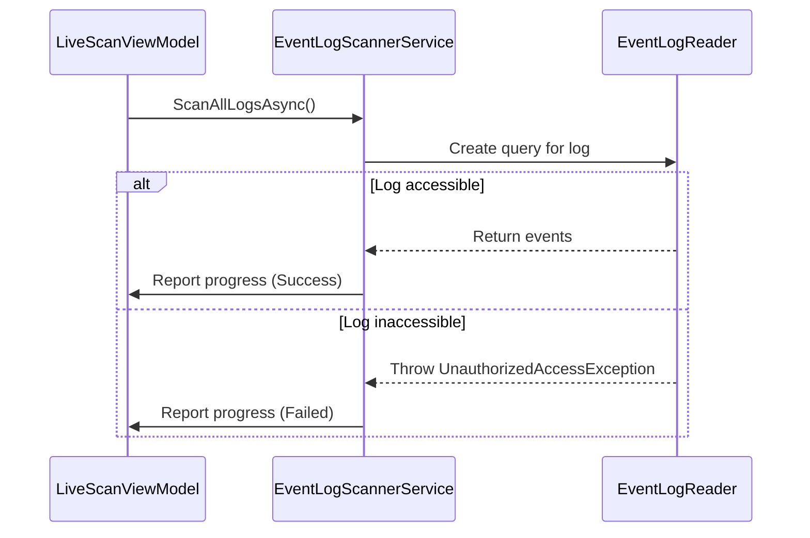
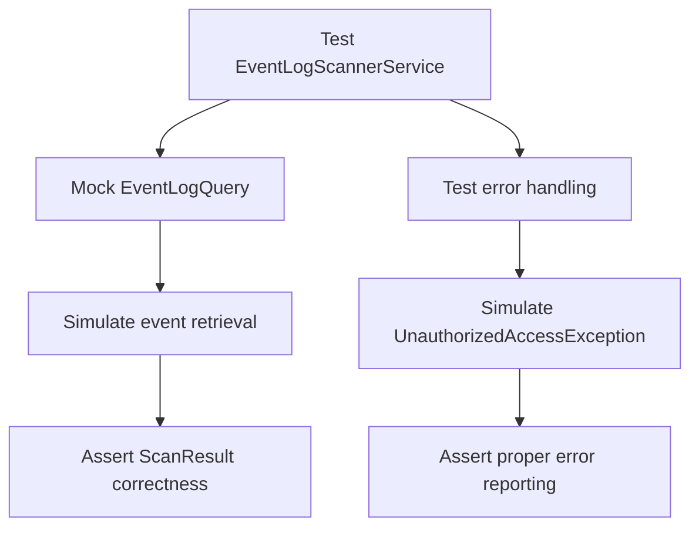
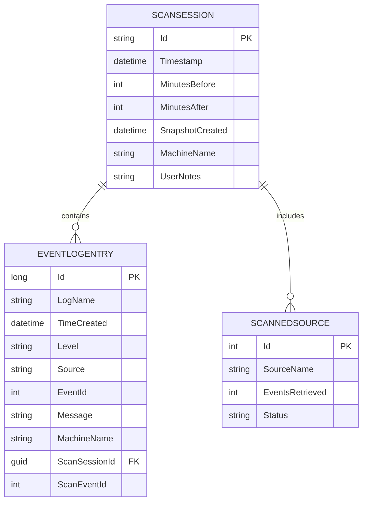

# Development Guide


## Table of Contents
1. [Building the Project](#building-the-project)
2. [Running and Debugging](#running-and-debugging)
3. [Testing Strategy](#testing-strategy)
4. [Versioning and Release Artifacts](#versioning-and-release-artifacts)
5. [Debugging Tips](#debugging-tips)
6. [Common Development Issues](#common-development-issues)
7. [Best Practices for Code Contributions](#best-practices-for-code-contributions)

## Building the Project

To build Project Janus, you must have the .NET 9 SDK installed. The solution supports both Visual Studio and CLI workflows.

### Using Visual Studio
1. Open `ProjectJanus.sln` in Visual Studio 2022 or later.
2. Ensure the startup project is set to `Janus.App`.
3. Restore NuGet packages by right-clicking the solution and selecting **Restore NuGet Packages**.
4. Build the solution using **Build > Build Solution** (Ctrl+Shift+B).

### Using CLI
Navigate to the repository root and execute:


```bash
dotnet restore
dotnet build Janus.App/Janus.App.csproj
```


The `Janus.App.csproj` file specifies `net9.0-windows` as the target framework and enables WPF support via `<UseWPF>true</UseWPF>`. The `Janus.Core.csproj` references `Microsoft.EntityFrameworkCore.Sqlite` version 9.0.8, which is compatible with .NET 9.

**Section sources**
- [ProjectJanus.sln](file://ProjectJanus.sln)
- [Janus.App.csproj](file://Janus.App/Janus.App.csproj)
- [Janus.Core.csproj](file://Janus.Core/Janus.Core.csproj)

## Running and Debugging

### Running the Application
You can run the application from Visual Studio by pressing F5 or Ctrl+F5, or via CLI:


```bash
dotnet run --project Janus.App
```


The application requires administrator privileges, enforced declaratively through the `app.manifest` file with `requestedExecutionLevel="requireAdministrator"`. No programmatic elevation is implemented.

### Debugging Edge Cases
#### Inaccessible Event Logs
The `EventLogScannerService` uses `System.Diagnostics.Eventing.Reader.EventLogQuery` and `EventLogReader` to access logs. If a log is inaccessible due to permissions, an `UnauthorizedAccessException` is caught and reported via the `SourceScanProgress` mechanism.





**Diagram sources**
- [EventLogScannerService.cs](file://Janus.App/Services/EventLogScannerService.cs#L31-L61)
- [LiveScanViewModel.cs](file://Janus.App/ViewModels/LiveScanViewModel.cs#L156-L187)

#### Malformed Snapshot Files
When loading a snapshot, `SnapshotService.LoadSnapshotAsync` wraps database operations in a try-catch block for `SqliteException`. This handles schema mismatches or corrupted files, allowing graceful error reporting.


```csharp
catch (SqliteException ex) {
  throw new InvalidOperationException("Failed to load snapshot.", ex);
}
```


**Section sources**
- [app.manifest](file://Janus.App/app.manifest)
- [EventLogScannerService.cs](file://Janus.App/Services/EventLogScannerService.cs)
- [SnapshotService.cs](file://Janus.App/Services/SnapshotService.cs)

## Testing Strategy

Currently, testing is implicit and manual. The codebase lacks unit or integration tests, as noted in the `DISCLAIMER.md`:

> "I have not yet found a way to make the AI write good unit tests. It is a constant struggle to get it to write any tests at all, let alone good ones."

### Recommended Testing Approach
Introduce unit tests for core services:
- **EventLogScannerService**: Test scan logic with mocked `EventLogReader`.
- **SnapshotService**: Verify save/load operations with in-memory SQLite.
- **ViewModels**: Validate command execution and property changes.

Use xUnit or NUnit with Moq for mocking. Example test structure:





**Section sources**
- [DISCLAIMER.md](file://DISCLAIMER.md#L13-L24)
- [EventLogScannerService.cs](file://Janus.App/Services/EventLogScannerService.cs)
- [SnapshotService.cs](file://Janus.App/Services/SnapshotService.cs)

## Versioning and Release Artifacts

Versioning is managed via `version.json`, which follows the Nerdbank.GitVersioning schema:


```json
{
  "$schema": "https://gitversioning.dev/schemas/version.schema.json",
  "version": "1.0"
}
```


The `Nerdbank.GitVersioning` package (version 3.7.115) is referenced in `Janus.App.csproj`, enabling deterministic, Git-based versioning without manual updates.

### Building Release Artifacts
To create a self-contained release:


```bash
dotnet publish Janus.App/Janus.App.csproj -c Release -r win-x64 --self-contained true
```


This generates a publish folder with all dependencies, ready for distribution.

**Section sources**
- [version.json](file://version.json)
- [Janus.App.csproj](file://Janus.App/Janus.App.csproj#L12-L14)

## Debugging Tips

### Monitoring Scan Progress
The `LiveScanViewModel` uses `IProgress<SourceScanProgress>` to receive real-time updates from `EventLogScannerService`. Each source's progress (events retrieved, status, errors) is displayed in the UI.

Key properties in `SourceScanProgress`:
- **SourceName**: Name of the event log
- **EventsRetrieved**: Number of events processed
- **Status**: `Success`, `Partial`, or `Failed`
- **IsActive**: Indicates ongoing scan
- **ExceptionMessage**: Error details if failed

### Inspecting Snapshot Database Content
Snapshot files use SQLite. Use any SQLite browser to inspect `.janus` files. The schema is defined by EF Core models in `Janus.Core`:





**Diagram sources**
- [EventSnapshotDbContext.cs](file://Janus.Core/EventSnapshotDbContext.cs)
- [ScanSession.cs](file://Janus.Core/ScanSession.cs)
- [EventLogEntry.cs](file://Janus.Core/EventLogEntry.cs)

**Section sources**
- [LiveScanViewModel.cs](file://Janus.App/ViewModels/LiveScanViewModel.cs#L185-L213)
- [EventSnapshotDbContext.cs](file://Janus.Core/EventSnapshotDbContext.cs)

## Common Development Issues

### XAML Binding Errors
Ensure all bound properties implement `INotifyPropertyChanged`. The `LiveScanViewModel` and other ViewModels correctly implement this interface. Use `RelayCommand` for command bindings to avoid null reference exceptions.

### Async Deadlock Risks
Avoid `.Result` or `.Wait()` on async calls. Use `async`/`await` throughout. The `AsyncRelayCommand` ensures proper synchronization context handling:


```csharp
public async void Execute(object? parameter) {
    await execute(); // Properly awaits without blocking
}
```


### EF Core Migration Challenges
Per the **"No Migrations" rule**, EF Core migrations are explicitly disabled. Schema creation uses `EnsureCreatedAsync()`:


```csharp
await db.Database.EnsureCreatedAsync();
```


This avoids migration history tables and versioning conflicts, treating snapshots as immutable documents.

**Section sources**
- [janus.ai.rules.yml](file://janus.ai.rules.yml#L74-L100)
- [EventSnapshotDbContext.cs](file://Janus.Core/EventSnapshotDbContext.cs)
- [RelayCommand.cs](file://Janus.App/Helpers/RelayCommand.cs)
- [Debouncer.cs](file://Janus.App/Services/Debouncer.cs)

## Best Practices for Code Contributions

### Adherence to MVVM Pattern
- **Views**: Contain only XAML and minimal code-behind (e.g., event handlers for non-UI logic).
- **ViewModels**: Handle all logic, expose properties and commands.
- **Services**: Encapsulate business logic (e.g., `EventLogScannerService`).

### Async Patterns
- Use `async`/`await` for all I/O operations.
- Accept `CancellationToken` for cancellable operations.
- Use `Progress<T>` for reporting progress from services to ViewModels.

### Modern C# Features
Leverage C# 13 features:
- **Primary constructors**: Used in `EventSnapshotDbContext(DbContextOptions<EventSnapshotDbContext> options)`.
- **Required properties**: Used in `ScanSession.Id`, `EventLogEntry.Id`, etc.
- **Collection expressions**: `[.. scanResult.Entries]` for efficient copying.

**Section sources**
- [GEMINI.md](file://GEMINI.md#L15-L47)
- [janus.ai.rules.yml](file://janus.ai.rules.yml#L51-L77)
- [LiveScanViewModel.cs](file://Janus.App/ViewModels/LiveScanViewModel.cs#L211-L242)
- [ScanSession.cs](file://Janus.Core/ScanSession.cs)

**Referenced Files in This Document**   
- [ProjectJanus.sln](file://ProjectJanus.sln)
- [Janus.App.csproj](file://Janus.App/Janus.App.csproj)
- [Janus.Core.csproj](file://Janus.Core/Janus.Core.csproj)
- [version.json](file://version.json)
- [README.md](file://README.md)
- [GEMINI.md](file://GEMINI.md)
- [janus.ai.rules.yml](file://janus.ai.rules.yml)
- [app.manifest](file://Janus.App/app.manifest)
- [EventLogScannerService.cs](file://Janus.App/Services/EventLogScannerService.cs)
- [SnapshotService.cs](file://Janus.App/Services/SnapshotService.cs)
- [EventSnapshotDbContext.cs](file://Janus.Core/EventSnapshotDbContext.cs)
- [LiveScanViewModel.cs](file://Janus.App/ViewModels/LiveScanViewModel.cs)
- [RelayCommand.cs](file://Janus.App/Helpers/RelayCommand.cs)
- [Debouncer.cs](file://Janus.App/Services/Debouncer.cs)