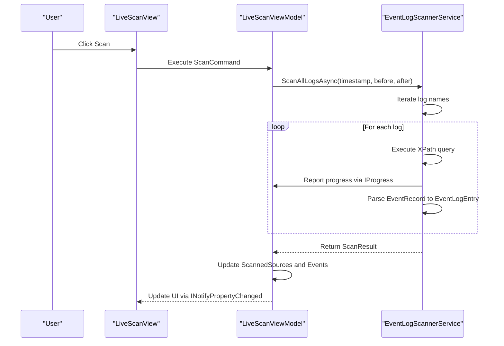
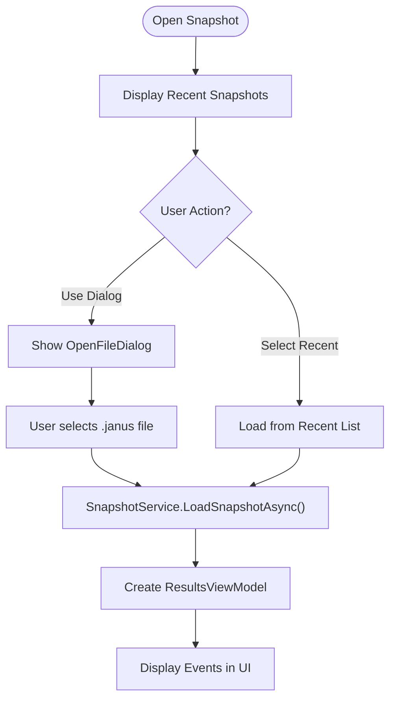
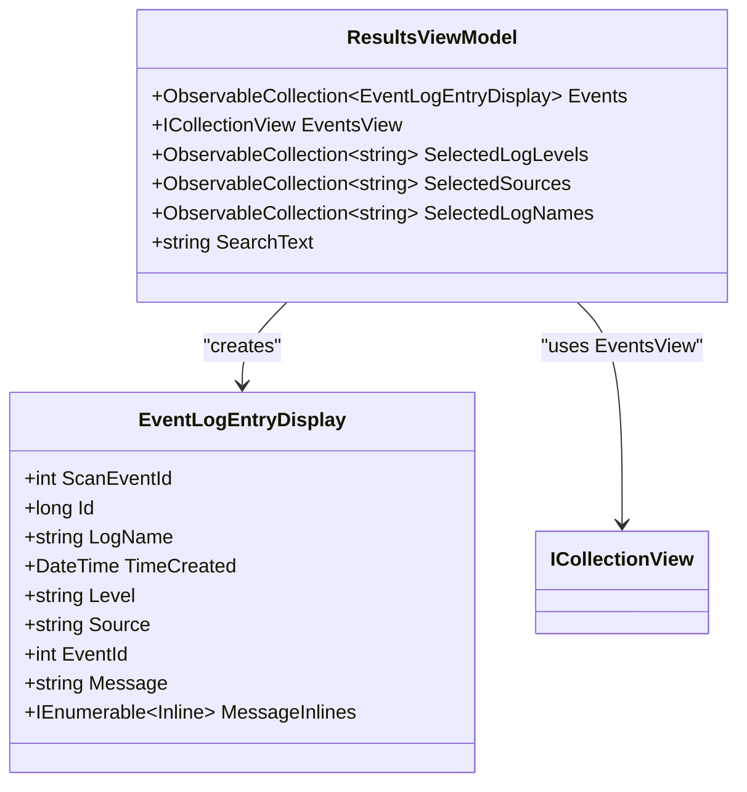
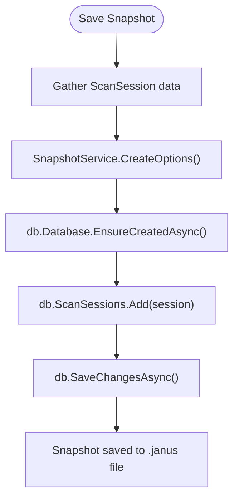

# User Guide

## Table of Contents
1. [Getting Started](#getting-started)
2. [Performing a Live Scan](#performing-a-live-scan)
3. [Opening Existing Snapshots](#opening-existing-snapshots)
4. [Filtering Results](#filtering-results)
5. [Saving and Managing Snapshots](#saving-and-managing-snapshots)
6. [Troubleshooting Common Issues](#troubleshooting-common-issues)
7. [Best Practices for Investigation Workflows](#best-practices-for-investigation-workflows)

## Getting Started

To begin using Project Janus, launch the application from the installed executable. The application requires administrative rights to access system event logs, so ensure you run it with elevated privileges.

Upon launch, the **Welcome Screen** appears, serving as the central hub for starting new scans or opening existing snapshots. The screen displays:
- A **New Scan** button to initiate a live event log scan
- An **Open Snapshot** button to load a previously saved `.janus` file
- A list of **Recent Snapshots** for quick access to previously analyzed data

The application automatically loads user interface settings such as window size and recent snapshot history from `UserUiSettingsService`. If settings fail to load, an error message will appear, but the application will continue with default values.

**Prerequisites**
- Administrative privileges
- .NET runtime environment
- Access to Windows Event Log system

**Section sources**
- [MainWindow.xaml.cs](file://Janus.App/Resources/MainWindow.xaml.cs#L9-L44)
- [WelcomeViewModel.cs](file://Janus.App/ViewModels/WelcomeViewModel.cs#L1-L142)

## Performing a Live Scan

To investigate system events around a specific point in time, use the **Live Scan** feature.

### Step 1: Navigate to Live Scan
Click the **New Scan** button on the Welcome Screen. This transitions the view to the Live Scan configuration panel.

### Step 2: Configure Timestamp
- The **Timestamp** field defaults to the current date and time.
- The **Time of Day** field allows precise time selection in `HH:mm:ss` format.
- Use the **Set Now** button to reset both fields to the current system time.

### Step 3: Configure Time Window
- **Minutes Before**: Number of minutes before the timestamp to include (default: 5)
- **Minutes After**: Number of minutes after the timestamp to include (default: 5)
This creates a time window centered on your timestamp. For example, a 5-minute window before and after creates a total 10-minute analysis period.

### Step 4: Start the Scan
Click the **Scan** button. The application will:
1. Retrieve all available Windows event logs via `EventLogScannerService.GetAllLogNames()`
2. Query each log for events within the specified time window using XPath filtering
3. Display real-time progress for each log source
4. Aggregate all matching events into a unified results view

The scan runs asynchronously and can be canceled at any time using the **Cancel** button.

### Practical Example: Investigating a System Crash
Suppose your system crashed at 14:30:00 on 2023-10-15:
1. Set **Timestamp** to 2023-10-15
2. Set **Time of Day** to 14:30:00
3. Configure **Minutes Before** = 10 and **Minutes After** = 2 to capture pre-crash warnings and post-crash recovery events
4. Click **Scan**

The results will include events from all system logs (Application, System, Security, etc.) within the 12-minute window.

**Diagram sources**
- [LiveScanViewModel.cs](file://Janus.App/ViewModels/LiveScanViewModel.cs#L1-L199)
- [EventLogScannerService.cs](file://Janus.App/Services/EventLogScannerService.cs#L1-L160)

**Section sources**
- [LiveScanViewModel.cs](file://Janus.App/ViewModels/LiveScanViewModel.cs#L1-L199)
- [EventLogScannerService.cs](file://Janus.App/Services/EventLogScannerService.cs#L1-L160)

## Opening Existing Snapshots

You can open previously saved snapshots either from the recent list or via file dialog.

### From Recent List
1. On the Welcome Screen, select a snapshot from the **Recent Snapshots** list
2. The application displays metadata including:
   - File name
   - Scan timestamp
   - Time window (minutes before/after)
   - Total event count
   - Any loading errors
3. Double-click the entry or click **Open** to load the snapshot

### From File Dialog
1. Click **Open Snapshot** on the Welcome Screen
2. Navigate to your `.janus` snapshot file
3. Select the file and click **Open**

The application uses `SnapshotService.LoadSnapshotAsync()` to deserialize the SQLite database into a `ScanSession` object containing all events and metadata.

**Diagram sources**
- [WelcomeViewModel.cs](file://Janus.App/ViewModels/WelcomeViewModel.cs#L1-L142)
- [SnapshotService.cs](file://Janus.App/Services/SnapshotService.cs#L1-L80)

**Section sources**
- [WelcomeViewModel.cs](file://Janus.App/ViewModels/WelcomeViewModel.cs#L1-L142)
- [SnapshotService.cs](file://Janus.App/Services/SnapshotService.cs#L1-L80)

## Filtering Results

Once events are loaded (from live scan or snapshot), use the filtering tools to focus on relevant data.

### Log Level Filter
- Click the **Log Levels** dropdown
- Select one or more levels: Critical, Error, Warning, Information, Verbose
- The event count updates to show only matching events
- The filter supports multi-select and real-time counting via `LogLevelCountProvider`

### Source Filter
- Use the **Sources** dropdown to filter by event provider (e.g., "Microsoft-Windows-Kernel-General")
- Only sources present in the current dataset are available
- Selection is multi-select

### Log Name Filter
- Filter by log channel (e.g., "Application", "System")
- Available names are populated from the loaded events
- Multi-select enabled

### Text Search
- Enter search terms in the **Search** box
- All event messages are scanned in real time
- Matching text is highlighted in yellow within message displays
- Search is case-insensitive

The filtering system uses WPF's `ICollectionView` with dynamic predicates that combine all active filters. Changes trigger immediate UI updates via `INotifyPropertyChanged`.

**Diagram sources**
- [ResultsViewModel.cs](file://Janus.App/ViewModels/ResultsViewModel.cs#L1-L199)
- [EventLogEntry.cs](file://Janus.Core/EventLogEntry.cs#L1-L19)

**Section sources**
- [ResultsViewModel.cs](file://Janus.App/ViewModels/ResultsViewModel.cs#L1-L199)

## Saving and Managing Snapshots

After a live scan, save the results for future analysis.

### Saving a Snapshot
1. After scan completion, click **Save Snapshot**
2. The **Save Snapshot Dialog** appears
3. Enter optional **User Notes** (e.g., "Crash investigation 2023-10-15")
4. Choose a filename and location
5. Click **Save**

The application creates a `.janus` file using SQLite via Entity Framework Core. The `ScanSession` object is serialized with:
- All `EventLogEntry` records
- Metadata (timestamp, time window, machine name)
- `ScannedSource` status information

### Managing Recent Snapshots
- The 10 most recently opened snapshots appear on the Welcome Screen
- History is persisted via `UserUiSettingsService`
- Files that no longer exist show an error indicator
- Opening any snapshot automatically adds it to the recent list

**Diagram sources**
- [SnapshotService.cs](file://Janus.App/Services/SnapshotService.cs#L1-L80)
- [SaveSnapshotDialog.xaml.cs](file://Janus.App/Resources/SaveSnapshotDialog.xaml.cs)

**Section sources**
- [SnapshotService.cs](file://Janus.App/Services/SnapshotService.cs#L1-L80)
- [ScanSession.cs](file://Janus.Core/ScanSession.cs#L1-L36)

## Troubleshooting Common Issues

### No Events Found
**Symptoms**: Scan completes but shows 0 events  
**Causes**:
- Overly restrictive time window
- Filters excluding all events (check log level/source selections)
- No events exist in the specified period

**Solution**: Reset all filters and verify the timestamp is correct.

### Slow Scan Performance
**Symptoms**: Scan progress is very slow, especially on first run  
**Causes**:
- Large number of event logs on the system
- Extended time windows retrieving many events
- System resource constraints

**Solutions**:
- Narrow the time window (e.g., 2 minutes before/after instead of 10)
- Run during periods of low system activity
- Exclude unnecessary logs (future version enhancement)

### Missing Logs or Access Denied
**Symptoms**: Some logs show "Access Denied" or fail to scan  
**Cause**: Insufficient privileges to read certain event logs  
**Solution**: Run Project Janus as Administrator

### Unable to Save Snapshot
**Symptoms**: Save operation fails with database error  
**Causes**:
- Invalid file path
- Insufficient disk space
- File permission issues

**Solution**: Choose a different location with write permissions.

**Section sources**
- [EventLogScannerService.cs](file://Janus.App/Services/EventLogScannerService.cs#L1-L160)
- [ResultsViewModel.cs](file://Janus.App/ViewModels/ResultsViewModel.cs#L1-L199)
- [SnapshotService.cs](file://Janus.App/Services/SnapshotService.cs#L1-L80)

## Best Practices for Efficient Investigation Workflows

1. **Start Broad, Then Narrow**: Begin with a moderate time window and minimal filters, then refine based on initial findings.
2. **Use Recent Snapshots**: Leverage the recent list to quickly compare multiple investigation sessions.
3. **Document with Notes**: Always add meaningful user notes when saving snapshots for future reference.
4. **Focus on Critical Levels**: Begin analysis with Critical and Error levels, then expand to Warning if needed.
5. **Verify Timestamps**: Double-check system time and timezone settings when investigating time-sensitive issues.
6. **Combine Filters Strategically**: Use log name + source + level combinations to isolate specific subsystems.
7. **Save Interim Results**: Save snapshots after discovering important events to preserve the state for later analysis.

By following these practices, you can efficiently diagnose system issues, track down error patterns, and maintain a clear audit trail of your investigation process.

**Referenced Files in This Document**   
- [MainWindow.xaml.cs](file://Janus.App/Resources/MainWindow.xaml.cs)
- [MainWindowViewModel.cs](file://Janus.App/ViewModels/MainWindowViewModel.cs)
- [WelcomeViewModel.cs](file://Janus.App/ViewModels/WelcomeViewModel.cs)
- [WelcomeView.xaml.cs](file://Janus.App/Views/WelcomeView.xaml.cs)
- [LiveScanViewModel.cs](file://Janus.App/ViewModels/LiveScanViewModel.cs)
- [EventLogScannerService.cs](file://Janus.App/Services/EventLogScannerService.cs)
- [ResultsViewModel.cs](file://Janus.App/ViewModels/ResultsViewModel.cs)
- [SnapshotService.cs](file://Janus.App/Services/SnapshotService.cs)
- [EventLogEntry.cs](file://Janus.Core/EventLogEntry.cs)
- [ScanSession.cs](file://Janus.Core/ScanSession.cs)
- [SaveSnapshotDialog.xaml.cs](file://Janus.App/Resources/SaveSnapshotDialog.xaml.cs)